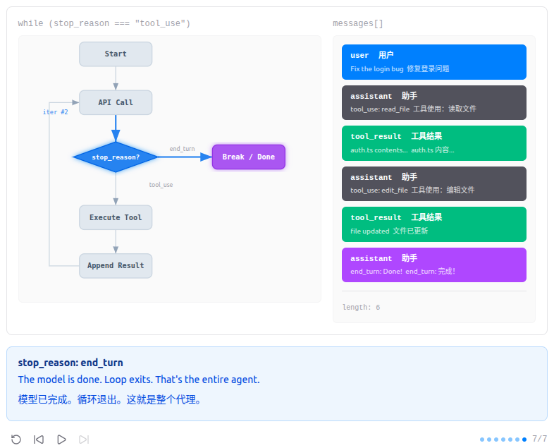

# Debug位置

[_base_client.py](.venv/lib/python3.13/site-packages/anthropic/_base_client.py)#1374

```python
def post(
        self,
        path: str,
        *,
        cast_to: Type[ResponseT],
        body: Body | None = None,
        content: BinaryTypes | None = None,
        options: RequestOptions = {},
        files: RequestFiles | None = None,
        stream: bool = False,
        stream_cls: type[_StreamT] | None = None,
) -> ResponseT | _StreamT:
    if body is not None and content is not None:
        raise TypeError("Passing both `body` and `content` is not supported")
    if files is not None and content is not None:
        raise TypeError("Passing both `files` and `content` is not supported")
    if isinstance(body, bytes):
        warnings.warn(
            "Passing raw bytes as `body` is deprecated and will be removed in a future version. "
            "Please pass raw bytes via the `content` parameter instead.",
            DeprecationWarning,
            stacklevel=2,
        )
    print("assistant request:", json.dumps(body, indent=2, ensure_ascii=False))
    opts = FinalRequestOptions.construct(
        method="post", url=path, json_data=body, content=content, files=to_httpx_files(files), **options
    )
    return cast(ResponseT, self.request(cast_to, opts, stream=stream, stream_cls=stream_cls))
```

[s01_agent_loop.py](agents/s01_agent_loop.py)#73 #89

```python
def agent_loop(messages: list):
    while True:
        response = client.messages.create(
            model=MODEL, system=SYSTEM, messages=messages,
            tools=TOOLS, max_tokens=8000,
        )
        print("assistant response:", response.to_json())
        # Append assistant turn
        messages.append({"role": "assistant", "content": response.content})
        # If the model didn't call a tool, we're done
        if response.stop_reason != "tool_use":
            return
        # Execute each tool call, collect results
        results = []
        for block in response.content:
            if block.type == "tool_use":
                print(f"\033[33m$ {block.input['command']}\033[0m")
                output = run_bash(block.input["command"])
                print(output[:200])
                results.append({"type": "tool_result", "tool_use_id": block.id,
                                "content": output})
        messages.append({"role": "user", "content": results})
        print("messages:", json.dumps(messages, indent=2, ensure_ascii=False))
```

# Agent循环
Single-tool agent loop  单工具代理循环

    The minimal agent kernel is a while loop + one tool
    最小代理内核是一个 while 循环+一个工具


    "One loop & Bash is all you need" -- 一个工具 + 一个循环 = 一个智能体。

## 问题
语言模型能推理代码, 但碰不到真实世界 -- 不能读文件、跑测试、看报错。没有循环, 每次工具调用你都得手动把结果粘回去。你自己就是那个循环。

## 解决方案
```
+--------+      +-------+      +---------+
|  User  | ---> |  LLM  | ---> |  Tool   |
| prompt |      |       |      | execute |
+--------+      +---+---+      +----+----+
                    ^                |
                    |   tool_result  |
                    +----------------+
                    (loop until stop_reason != "tool_use")
```
一个退出条件控制整个流程。循环持续运行, 直到模型不再调用工具。
## 工作原理
1. 用户 prompt 作为第一条消息。
```python
history.append({"role": "user", "content": query})
```

2. 将消息和工具定义一起发给 LLM。
```python
response = client.messages.create(
    model=MODEL, system=SYSTEM, messages=messages,
    tools=TOOLS, max_tokens=8000,
)
```

3. 追加助手响应。检查 stop_reason -- 如果模型没有调用工具, 结束。
```python
# If the model didn't call a tool, we're done
if response.stop_reason != "tool_use":
    return
```
4. 执行每个工具调用, 收集结果, 作为 user 消息追加。回到第 2 步。
```python
# Execute each tool call, collect results
results = []
for block in response.content:
    if block.type == "tool_use":
        print(f"\033[33m$ {block.input['command']}\033[0m")
        output = run_bash(block.input["command"])
        print(output[:200])
        results.append({"type": "tool_result", "tool_use_id": block.id,
                        "content": output})
messages.append({"role": "user", "content": results})
```
组装为一个完整函数:
```python
# -- The core pattern: a while loop that calls tools until the model stops --
def agent_loop(messages: list):
    while True:
        response = client.messages.create(
            model=MODEL, system=SYSTEM, messages=messages,
            tools=TOOLS, max_tokens=8000,
        )
        print("assistant response:", response.to_json())
        # Append assistant turn
        messages.append({"role": "assistant", "content": [b.to_dict() for b in response.content]})
        # If the model didn't call a tool, we're done
        if response.stop_reason != "tool_use":
            return
        # Execute each tool call, collect results
        results = []
        for block in response.content:
            if block.type == "tool_use":
                print(f"\033[33m$ {block.input['command']}\033[0m")
                output = run_bash(block.input["command"])
                print(output[:200])
                results.append({"type": "tool_result", "tool_use_id": block.id,
                                "content": output})
        messages.append({"role": "user", "content": results})
        print("messages:", json.dumps(messages, indent=2, ensure_ascii=False))
```
不到 30 行, 这就是整个智能体。后面 11 个章节都在这个循环上叠加机制 -- 循环本身始终不变。
## 变更内容

| 组件               | 之前  | 之后                        |
|------------------| --- | ------------------------- |
| Agent loop       | (无) | `while True`+ stop_reason |
| Tools 工具         | (无) | `bash`(单一工具)              |
| Messages 消息      | (无) | 累积式消息列表                   |
| Control flow 控制流 | (无) | `stop_reason != "tool_use"` |

## 试一试
```bash
cd learn-claude-code
python agents/s01_agent_loop.py
```
试试这些 prompt (英文 prompt 对 LLM 效果更好, 也可以用中文):
- List all Python files in this directory
- Create a file called hello.py that prints "Hello, World!"
- What is the current git branch?
- Create a directory called test_output and write 3 files in it

## 示例

### Create a file called hello.py that prints "Hello, World!"
创建一个名为 hello.py 的文件，打印'Hello, World!'

1. messages init
```json
[
  {
    "role": "user",
    "content": "Create a file called hello.py that prints \"Hello, World!\""
  }
]
```

2. assistant request
用户向代理发送了一个任务
```python
from agents.s01_agent_loop import TOOLS

request = {
    "max_tokens": 8000,
    "messages": [
        {
            "role": "user",
            "content": "Create a file called hello.py that prints \"Hello, World!\""
        }
    ],
    "model": "aws-claude-sonnet-4-6",
    "system": "You are a coding agent at /home/xiangli/SourceCode/learn-claude-code/agents. Use bash to solve tasks. Act, don't explain.",
    "tools": TOOLS
}
```

3. assistant response
模型决定使用它唯一的工具：bash
```json
{
  "id": "msg_bdrk_011LE494UAxBMVH2U4tFTCkC",
  "container": null,
  "content": [
    {
      "id": "toolu_bdrk_016sxE3nuDQagBag6z1wvhk5",
      "caller": null,
      "input": {
        "command": "echo 'print(\"Hello, World!\")' > /home/xiangli/SourceCode/learn-claude-code/agents/hello.py"
      },
      "name": "bash",
      "type": "tool_use"
    }
  ],
  "model": "claude-sonnet-4-6",
  "role": "assistant",
  "stop_reason": "tool_use",
  "stop_sequence": null,
  "type": "message",
  "usage": {
    "cache_creation": {
      "ephemeral_1h_input_tokens": 0,
      "ephemeral_5m_input_tokens": 0
    },
    "cache_creation_input_tokens": 0,
    "cache_read_input_tokens": 0,
    "inference_geo": null,
    "input_tokens": 606,
    "output_tokens": 84,
    "server_tool_use": null,
    "service_tier": null
  }
}
```

4. messages append
工具调用：模型生成一个 bash 命令,Bash 返回空输出（成功）
```json
[
  {
    "role": "user",
    "content": "Create a file called hello.py that prints \"Hello, World!\""
  },
  {
    "role": "assistant",
    "content": [
      {
        "id": "toolu_bdrk_01TMXwbNcmAawTuaY5TTTFX7",
        "input": {
          "command": "echo 'print(\"Hello, World!\")' > /home/xiangli/SourceCode/learn-claude-code/agents/hello.py"
        },
        "name": "bash",
        "type": "tool_use"
      }
    ]
  },
  {
    "role": "user",
    "content": [
      {
        "type": "tool_result",
        "tool_use_id": "toolu_bdrk_01TMXwbNcmAawTuaY5TTTFX7",
        "content": "(no output)"
      }
    ]
  }
]
```

5. assistant request
循环继续：模型看到结果并决定下一步行动
```python
from agents.s01_agent_loop import TOOLS

request = {
    "max_tokens": 8000,
    "messages": [
        {
            "role": "user",
            "content": "Create a file called hello.py that prints \"Hello, World!\""
        },
        {
            "role": "assistant",
            "content": [
                {
                    "id": "toolu_bdrk_01TMXwbNcmAawTuaY5TTTFX7",
                    "input": {
                        "command": "echo 'print(\"Hello, World!\")' > /home/xiangli/SourceCode/learn-claude-code/agents/hello.py"
                    },
                    "name": "bash",
                    "type": "tool_use"
                }
            ]
        },
        {
            "role": "user",
            "content": [
                {
                    "type": "tool_result",
                    "tool_use_id": "toolu_bdrk_01TMXwbNcmAawTuaY5TTTFX7",
                    "content": "(no output)"
                }
            ]
        }
    ],
    "model": "aws-claude-sonnet-4-6",
    "system": "You are a coding agent at /home/xiangli/SourceCode/learn-claude-code/agents. Use bash to solve tasks. Act, don't explain.",
    "tools": TOOLS
}
```

6. assistant response
另一个 bash 调用以验证
```json
{
  "id": "msg_bdrk_014TQ8ZqizfyjdrKPcZQSYCw",
  "content": [
    {
      "text": "The file `hello.py` has been created. Let me verify its contents and run it:",
      "type": "text"
    },
    {
      "id": "toolu_bdrk_01MdF2ouiJpVdHkqLyymKAi9",
      "input": {
        "command": "cat /home/xiangli/SourceCode/learn-claude-code/agents/hello.py && python /home/xiangli/SourceCode/learn-claude-code/agents/hello.py"
      },
      "name": "bash",
      "type": "tool_use"
    }
  ],
  "model": "claude-sonnet-4-6",
  "role": "assistant",
  "stop_reason": "tool_use",
  "type": "message",
  "usage": {
    "cache_creation": {
      "ephemeral_1h_input_tokens": 0,
      "ephemeral_5m_input_tokens": 0
    },
    "cache_creation_input_tokens": 0,
    "cache_read_input_tokens": 0,
    "input_tokens": 704,
    "output_tokens": 118
  }
}
```

7. messages append

```json
[
  {
    "role": "user",
    "content": "Create a file called hello.py that prints \"Hello, World!\""
  },
  {
    "role": "assistant",
    "content": [
      {
        "id": "toolu_bdrk_01TMXwbNcmAawTuaY5TTTFX7",
        "input": {
          "command": "echo 'print(\"Hello, World!\")' > /home/xiangli/SourceCode/learn-claude-code/agents/hello.py"
        },
        "name": "bash",
        "type": "tool_use"
      }
    ]
  },
  {
    "role": "user",
    "content": [
      {
        "type": "tool_result",
        "tool_use_id": "toolu_bdrk_01TMXwbNcmAawTuaY5TTTFX7",
        "content": "(no output)"
      }
    ]
  },
  {
    "role": "assistant",
    "content": [
      {
        "text": "The file `hello.py` has been created. Let me verify its contents and run it:",
        "type": "text"
      },
      {
        "id": "toolu_bdrk_01MdF2ouiJpVdHkqLyymKAi9",
        "input": {
          "command": "cat /home/xiangli/SourceCode/learn-claude-code/agents/hello.py && python /home/xiangli/SourceCode/learn-claude-code/agents/hello.py"
        },
        "name": "bash",
        "type": "tool_use"
      }
    ]
  },
  {
    "role": "user",
    "content": [
      {
        "type": "tool_result",
        "tool_use_id": "toolu_bdrk_01MdF2ouiJpVdHkqLyymKAi9",
        "content": "print(\"Hello, World!\")\nHello, World!"
      }
    ]
  }
]
```

8. assistant request
File contents confirmed  文件内容已确认
```python
from agents.s01_agent_loop import TOOLS

request = {
    "max_tokens": 8000,
    "messages": [
        {
            "role": "user",
            "content": "Create a file called hello.py that prints \"Hello, World!\""
        },
        {
            "role": "assistant",
            "content": [
                {
                    "id": "toolu_bdrk_01TMXwbNcmAawTuaY5TTTFX7",
                    "input": {
                        "command": "echo 'print(\"Hello, World!\")' > /home/xiangli/SourceCode/learn-claude-code/agents/hello.py"
                    },
                    "name": "bash",
                    "type": "tool_use"
                }
            ]
        },
        {
            "role": "user",
            "content": [
                {
                    "type": "tool_result",
                    "tool_use_id": "toolu_bdrk_01TMXwbNcmAawTuaY5TTTFX7",
                    "content": "(no output)"
                }
            ]
        },
        {
            "role": "assistant",
            "content": [
                {
                    "text": "The file `hello.py` has been created. Let me verify its contents and run it:",
                    "type": "text"
                },
                {
                    "id": "toolu_bdrk_01MdF2ouiJpVdHkqLyymKAi9",
                    "input": {
                        "command": "cat /home/xiangli/SourceCode/learn-claude-code/agents/hello.py && python /home/xiangli/SourceCode/learn-claude-code/agents/hello.py"
                    },
                    "name": "bash",
                    "type": "tool_use"
                }
            ]
        },
        {
            "role": "user",
            "content": [
                {
                    "type": "tool_result",
                    "tool_use_id": "toolu_bdrk_01MdF2ouiJpVdHkqLyymKAi9",
                    "content": "print(\"Hello, World!\")\nHello, World!"
                }
            ]
        }
    ],
    "model": "aws-claude-sonnet-4-6",
    "system": "You are a coding agent at /home/xiangli/SourceCode/learn-claude-code/agents. Use bash to solve tasks. Act, don't explain.",
    "tools": TOOLS
}
```

9. assistant response
stop_reason != 'tool_use' -> 循环中断，代理回复用户
```json
{
  "id": "msg_bdrk_01S3QhxehKw5m5TxRxuomDMh",
  "content": [
    {
      "text": "The file `hello.py` has been successfully created and works as expected! Here's a summary:\n\n- **File:** `hello.py`\n- **Contents:** `print(\"Hello, World!\")`\n- **Output when run:** `Hello, World!`",
      "type": "text"
    }
  ],
  "model": "claude-sonnet-4-6",
  "role": "assistant",
  "stop_reason": "end_turn",
  "type": "message",
  "usage": {
    "cache_creation": {
      "ephemeral_1h_input_tokens": 0,
      "ephemeral_5m_input_tokens": 0
    },
    "cache_creation_input_tokens": 0,
    "cache_read_input_tokens": 0,
    "input_tokens": 844,
    "output_tokens": 60
  }
}
```

### List all Python files in this directory

1. assistant request

```python
from agents.s01_agent_loop import TOOLS

request = {
    "max_tokens": 8000,
    "messages": [
        {
            "role": "user",
            "content": "List all Python files in this directory"
        }
    ],
    "model": "aws-claude-sonnet-4-6",
    "system": "You are a coding agent at /home/xiangli/SourceCode/learn-claude-code/agents. Use bash to solve tasks. Act, don't explain.",
    "tools": TOOLS
}
```

2. assistant response

```json
{
  "id": "msg_bdrk_01AgmrMWxew91ipYiGfZQRgP",
  "content": [
    {
      "id": "toolu_bdrk_01HezPHK5DHDMZvKkdWuYzEY",
      "input": {
        "command": "find /home/xiangli/SourceCode/learn-claude-code/agents -name \"*.py\" -type f"
      },
      "name": "bash",
      "type": "tool_use"
    }
  ],
  "model": "claude-sonnet-4-6",
  "role": "assistant",
  "stop_reason": "tool_use",
  "type": "message",
  "usage": {
    "cache_creation": {
      "ephemeral_1h_input_tokens": 0,
      "ephemeral_5m_input_tokens": 0
    },
    "cache_creation_input_tokens": 0,
    "cache_read_input_tokens": 0,
    "input_tokens": 599,
    "output_tokens": 79
  }
}
```

3. messages append

```json
[
  {
    "role": "user",
    "content": "List all Python files in this directory"
  },
  {
    "role": "assistant",
    "content": [
      {
        "id": "toolu_bdrk_01HezPHK5DHDMZvKkdWuYzEY",
        "input": {
          "command": "find /home/xiangli/SourceCode/learn-claude-code/agents -name \"*.py\" -type f"
        },
        "name": "bash",
        "type": "tool_use"
      }
    ]
  },
  {
    "role": "user",
    "content": [
      {
        "type": "tool_result",
        "tool_use_id": "toolu_bdrk_01HezPHK5DHDMZvKkdWuYzEY",
        "content": "/home/xiangli/SourceCode/learn-claude-code/agents/s05_skill_loading.py\n/home/xiangli/SourceCode/learn-claude-code/agents/s07_task_system.py\n/home/xiangli/SourceCode/learn-claude-code/agents/s01_agent_loop.py\n/home/xiangli/SourceCode/learn-claude-code/agents/s11_autonomous_agents.py\n/home/xiangli/SourceCode/learn-claude-code/agents/s12_worktree_task_isolation.py\n/home/xiangli/SourceCode/learn-claude-code/agents/s02_tool_use.py\n/home/xiangli/SourceCode/learn-claude-code/agents/hello.py\n/home/xiangli/SourceCode/learn-claude-code/agents/s08_background_tasks.py\n/home/xiangli/SourceCode/learn-claude-code/agents/s_full.py\n/home/xiangli/SourceCode/learn-claude-code/agents/s03_todo_write.py\n/home/xiangli/SourceCode/learn-claude-code/agents/s09_agent_teams.py\n/home/xiangli/SourceCode/learn-claude-code/agents/s10_team_protocols.py\n/home/xiangli/SourceCode/learn-claude-code/agents/__init__.py\n/home/xiangli/SourceCode/learn-claude-code/agents/s06_context_compact.py\n/home/xiangli/SourceCode/learn-claude-code/agents/s04_subagent.py"
      }
    ]
  }
]
```

4. assistant request

```python
from agents.s01_agent_loop import TOOLS

request = {
    "max_tokens": 8000,
    "messages": [
        {
            "role": "user",
            "content": "List all Python files in this directory"
        },
        {
            "role": "assistant",
            "content": [
                {
                    "id": "toolu_bdrk_01HezPHK5DHDMZvKkdWuYzEY",
                    "input": {
                        "command": "find /home/xiangli/SourceCode/learn-claude-code/agents -name \"*.py\" -type f"
                    },
                    "name": "bash",
                    "type": "tool_use"
                }
            ]
        },
        {
            "role": "user",
            "content": [
                {
                    "type": "tool_result",
                    "tool_use_id": "toolu_bdrk_01HezPHK5DHDMZvKkdWuYzEY",
                    "content": "/home/xiangli/SourceCode/learn-claude-code/agents/s05_skill_loading.py\n/home/xiangli/SourceCode/learn-claude-code/agents/s07_task_system.py\n/home/xiangli/SourceCode/learn-claude-code/agents/s01_agent_loop.py\n/home/xiangli/SourceCode/learn-claude-code/agents/s11_autonomous_agents.py\n/home/xiangli/SourceCode/learn-claude-code/agents/s12_worktree_task_isolation.py\n/home/xiangli/SourceCode/learn-claude-code/agents/s02_tool_use.py\n/home/xiangli/SourceCode/learn-claude-code/agents/hello.py\n/home/xiangli/SourceCode/learn-claude-code/agents/s08_background_tasks.py\n/home/xiangli/SourceCode/learn-claude-code/agents/s_full.py\n/home/xiangli/SourceCode/learn-claude-code/agents/s03_todo_write.py\n/home/xiangli/SourceCode/learn-claude-code/agents/s09_agent_teams.py\n/home/xiangli/SourceCode/learn-claude-code/agents/s10_team_protocols.py\n/home/xiangli/SourceCode/learn-claude-code/agents/__init__.py\n/home/xiangli/SourceCode/learn-claude-code/agents/s06_context_compact.py\n/home/xiangli/SourceCode/learn-claude-code/agents/s04_subagent.py"
                }
            ]
        }
    ],
    "model": "aws-claude-sonnet-4-6",
    "system": "You are a coding agent at /home/xiangli/SourceCode/learn-claude-code/agents. Use bash to solve tasks. Act, don't explain.",
    "tools": TOOLS
}
```

5. assistant response

```json
{
  "id": "msg_bdrk_01EWQoB4YkMr2bpkBZuHK9HF",
  "content": [
    {
      "text": "Here are all the Python files found in the `/home/xiangli/SourceCode/learn-claude-code/agents` directory:\n\n| # | File |\n|---|------|\n| 1 | `s01_agent_loop.py` |\n| 2 | `s02_tool_use.py` |\n| 3 | `s03_todo_write.py` |\n| 4 | `s04_subagent.py` |\n| 5 | `s05_skill_loading.py` |\n| 6 | `s06_context_compact.py` |\n| 7 | `s07_task_system.py` |\n| 8 | `s08_background_tasks.py` |\n| 9 | `s09_agent_teams.py` |\n| 10 | `s10_team_protocols.py` |\n| 11 | `s11_autonomous_agents.py` |\n| 12 | `s12_worktree_task_isolation.py` |\n| 13 | `s_full.py` |\n| 14 | `hello.py` |\n| 15 | `__init__.py` |\n\nA total of **15 Python files** were found. The files appear to be a structured learning series (`s01` through `s12`) covering various agent-related topics, along with `hello.py`, `s_full.py`, and `__init__.py`.",
      "type": "text"
    }
  ],
  "model": "claude-sonnet-4-6",
  "role": "assistant",
  "stop_reason": "end_turn",
  "type": "message",
  "usage": {
    "cache_creation": {
      "ephemeral_1h_input_tokens": 0,
      "ephemeral_5m_input_tokens": 0
    },
    "cache_creation_input_tokens": 0,
    "cache_read_input_tokens": 0,
    "input_tokens": 1099,
    "output_tokens": 350
  }
}

```

## 设计决策
1. 为什么仅靠 Bash 就够了?

Bash 能读写文件、运行任意程序、在进程间传递数据、管理文件系统。任何额外的工具（read_file、write_file 等）都只是 bash 已有能力的子集。增加工具并不会解锁新能力，只会增加模型需要理解的接口。模型只需学习一个工具的 schema，实现代码不超过 100 行。这就是最小可行 agent：一个工具，一个循环。

我们本可以开始时使用更丰富的工具集（文件 I/O、HTTP、数据库），但这会掩盖核心见解：一个带有外壳的 LLM 已经是一个通用代理。从最简开始也使得每个后续版本实际添加的内容一目了然。

2. 用递归进程创建实现子代理机制?

当 agent 执行 `python v0.py "subtask"` 时，它会创建一个全新的进程，拥有全新的 LLM 上下文。这个子进程实际上就是一个子代理：有自己的系统提示词、对话历史和任务焦点。子进程完成后，父进程通过 stdout 获取结果。这就是不依赖任何框架的子代理委派——纯粹的 Unix 进程语义。每个子进程天然隔离关注点，因为它根本看不到父进程的上下文。

一个框架级的子代理系统（如 v3 的任务工具）能提供更多控制，让子代理可以访问哪些工具以及如何返回结果。但在 v0 阶段，重点是展示进程生成是最原始的代理委托形式——没有共享内存，没有消息传递，只有 stdin/stdout。

3. 没有规划框架——由模型自行决策

没有规划器，没有任务队列，没有状态机。系统提示词告诉模型如何处理问题，模型根据对话历史决定下一步执行什么 bash 命令。这是有意为之的：在这个层级，添加规划层属于过早抽象。模型的思维链本身就是计划。agent 循环只是不断询问模型下一步做什么，直到模型不再请求工具为止。

后续版本（v2）通过 TodoWrite 增加了显式规划。但 v0 证明，通过模型的推理实现的隐式规划对许多任务已经足够。只有当你需要对外部可见代理的意图时，规划框架才变得必要。
