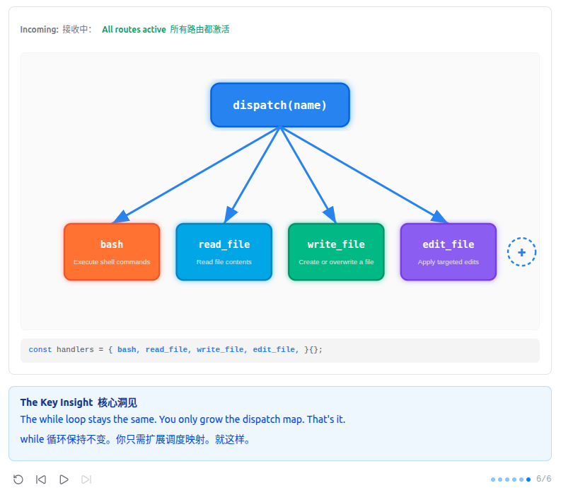

# 工具
One Handler Per Tool  每个工具一个处理器

    The loop stays the same; new tools register into the dispatch map
    循环保持不变；新工具注册到调度映射



    "加一个工具, 只加一个 handler" -- 循环不用动, 新工具注册进 dispatch map 就行。
## 问题
只有 `bash` 时, 所有操作都走 shell。`cat` 截断不可预测, `sed` 遇到特殊字符就崩, 每次 bash 调用都是不受约束的安全面。专用工具 (`read_file`, `write_file`) 可以在工具层面做路径沙箱。

关键洞察: 加工具不需要改循环。

## 解决方案
```markdown
+--------+      +-------+      +------------------+
|  User  | ---> |  LLM  | ---> | Tool Dispatch    |
| prompt |      |       |      | {                |
+--------+      +---+---+      |   bash: run_bash |
                    ^           |   read: run_read |
                    |           |   write: run_wr  |
                    +-----------+   edit: run_edit |
                    tool_result | }                |
                                +------------------+

The dispatch map is a dict: {tool_name: handler_function}.
One lookup replaces any if/elif chain.
```
## 工作原理
1. 每个工具有一个处理函数。路径沙箱防止逃逸工作区。

```python
def safe_path(p: str) -> Path:
    path = (WORKDIR / p).resolve()
    if not path.is_relative_to(WORKDIR):
        raise ValueError(f"Path escapes workspace: {p}")
    return path

def run_read(path: str, limit: int = None) -> str:
    try:
        text = safe_path(path).read_text()
        lines = text.splitlines()
        if limit and limit < len(lines):
            lines = lines[:limit] + [f"... ({len(lines) - limit} more lines)"]
        return "\n".join(lines)[:50000]
    except Exception as e:
        return f"Error: {e}"
```

2. dispatch map 将工具名映射到处理函数。
```python
TOOL_HANDLERS = {
    "bash":       lambda **kw: run_bash(kw["command"]),
    "read_file":  lambda **kw: run_read(kw["path"], kw.get("limit")),
    "write_file": lambda **kw: run_write(kw["path"], kw["content"]),
    "edit_file":  lambda **kw: run_edit(kw["path"], kw["old_text"], kw["new_text"]),
}
```

3. 循环中按名称查找处理函数。循环体本身与 s01 完全一致。
```python
for block in response.content:
    if block.type == "tool_use":
        handler = TOOL_HANDLERS.get(block.name)
        output = handler(**block.input) if handler else f"Unknown tool: {block.name}"
        print(f"> {block.name}: {output[:200]}")
        results.append({"type": "tool_result", "tool_use_id": block.id, "content": output})
```

加工具 = 加 handler + 加 schema。循环永远不变。

## 相对 s01 的变更

| 组件             | 之前 (s01)    | 之后 (s02)                   |
|----------------| ----------- |----------------------------|
| Tools 工具       | 1 (仅 bash)  | 4 (bash, read, write, edit) |
| Dispatch       | 硬编码 bash 调用 | `TOOL_HANDLERS` 字典         |
| 路径安全           | 无           | `safe_path()`沙箱            |
| Agent loop代理循环 | 不变          | 不变                         |

## 试一试
```bash
cd learn-claude-code
python agents/s02_tool_use.py
```

试试这些 prompt (英文 prompt 对 LLM 效果更好, 也可以用中文):
- Add a function called greet(name) to hello.py
- Read the file requirements.txt
- Create a file called greet.py with a greet(name) function
- Edit greet.py to add a docstring to the function
- Read greet.py to verify the edit worked


## 示例
### Add a function called greet(name) to hello.py
在 hello.py 中添加一个名为 greet(name)的函数
1. assistant request: 
用户请求代码修改
```python
from agents.s02_tool_use import TOOLS

request = {
    "max_tokens": 8000,
    "messages": [
        {
            "role": "user",
            "content": "Add a function called greet(name) to hello.py"
        }
    ],
    "model": "aws-claude-sonnet-4-6",
    "system": "You are a coding agent at /home/lixiang/SourceCode/learn-claude-code. Use tools to solve tasks. Act, don't explain.",
    "tools": TOOLS
}
```
2. assistant response: 
模型选择了 read_file 而不是 bash cat
```json
{
  "id": "msg_bdrk_017U4mxo8ja6xitbbZvMYyC8",
  "content": [
    {
      "text": "Let me first check if `hello.py` exists and review its current contents.",
      "type": "text"
    },
    {
      "id": "toolu_bdrk_01AQKsfx69xNnaeSBdbbG7uv",
      "input": {
        "path": "/home/lixiang/SourceCode/learn-claude-code/hello.py"
      },
      "name": "read_file",
      "type": "tool_use"
    }
  ],
  "model": "claude-sonnet-4-6",
  "role": "assistant",
  "stop_reason": "tool_use",
  "type": "message",
  "usage": {
    "cache_creation": {
      "ephemeral_1h_input_tokens": 0,
      "ephemeral_5m_input_tokens": 0
    },
    "cache_creation_input_tokens": 0,
    "cache_read_input_tokens": 0,
    "input_tokens": 816,
    "output_tokens": 90
  }
}
```
> read_file: print("Hello, World!")
3. messages:
专用的读取工具提供更干净的文件访问
```json


[
  {
    "role": "user",
    "content": "Add a function called greet(name) to hello.py"
  },
  {
    "role": "assistant",
    "content": [
      {
        "text": "Let me first check if `hello.py` exists and review its current contents.",
        "type": "text"
      },
      {
        "id": "toolu_bdrk_01AQKsfx69xNnaeSBdbbG7uv",
        "input": {
          "path": "/home/lixiang/SourceCode/learn-claude-code/hello.py"
        },
        "name": "read_file",
        "type": "tool_use"
      }
    ]
  },
  {
    "role": "user",
    "content": [
      {
        "type": "tool_result",
        "tool_use_id": "toolu_bdrk_01AQKsfx69xNnaeSBdbbG7uv",
        "content": "print(\"Hello, World!\")"
      }
    ]
  }
]
```
4. assistant request: 
文件内容返回给模型
```python
from agents.s02_tool_use import TOOLS

request = {
    "max_tokens": 8000,
    "messages": [
        {
            "role": "user",
            "content": "Add a function called greet(name) to hello.py"
        },
        {
            "role": "assistant",
            "content": [
                {
                    "text": "Let me first check if `hello.py` exists and review its current contents.",
                    "type": "text"
                },
                {
                    "id": "toolu_bdrk_01AQKsfx69xNnaeSBdbbG7uv",
                    "input": {
                        "path": "/home/lixiang/SourceCode/learn-claude-code/hello.py"
                    },
                    "name": "read_file",
                    "type": "tool_use"
                }
            ]
        },
        {
            "role": "user",
            "content": [
                {
                    "type": "tool_result",
                    "tool_use_id": "toolu_bdrk_01AQKsfx69xNnaeSBdbbG7uv",
                    "content": "print(\"Hello, World!\")"
                }
            ]
        }
    ],
    "model": "aws-claude-sonnet-4-6",
    "system": "You are a coding agent at /home/lixiang/SourceCode/learn-claude-code. Use tools to solve tasks. Act, don't explain.",
    "tools": TOOLS
}
```
5. assistant response: 
write_file 替换整个文件内容
```json

{
  "id": "msg_bdrk_01UFq2BGC9buDtuSAzy9wEU9",
  "content": [
    {
      "text": "Now I'll add the `greet(name)` function to the file.",
      "type": "text"
    },
    {
      "id": "toolu_bdrk_01VJcPaD7M7nRsahJFStqss2",
      "input": {
        "path": "/home/lixiang/SourceCode/learn-claude-code/hello.py",
        "old_text": "print(\"Hello, World!\")",
        "new_text": "print(\"Hello, World!\")\n\n\ndef greet(name):\n    \"\"\"Greet a person by name.\"\"\"\n    print(f\"Hello, {name}!\")\n"
      },
      "name": "edit_file",
      "type": "tool_use"
    }
  ],
  "model": "claude-sonnet-4-6",
  "role": "assistant",
  "stop_reason": "tool_use",
  "type": "message",
  "usage": {
    "cache_creation": {
      "ephemeral_1h_input_tokens": 0,
      "ephemeral_5m_input_tokens": 0
    },
    "cache_creation_input_tokens": 0,
    "cache_read_input_tokens": 0,
    "input_tokens": 924,
    "output_tokens": 169
  }
}

```
> edit_file: Edited /home/lixiang/SourceCode/learn-claude-code/hello.py
6. messages: 
Write confirmed  写入确认
```json


[
  {
    "role": "user",
    "content": "Add a function called greet(name) to hello.py"
  },
  {
    "role": "assistant",
    "content": [
      {
        "text": "Let me first check if `hello.py` exists and review its current contents.",
        "type": "text"
      },
      {
        "id": "toolu_bdrk_01AQKsfx69xNnaeSBdbbG7uv",
        "input": {
          "path": "/home/lixiang/SourceCode/learn-claude-code/hello.py"
        },
        "name": "read_file",
        "type": "tool_use"
      }
    ]
  },
  {
    "role": "user",
    "content": [
      {
        "type": "tool_result",
        "tool_use_id": "toolu_bdrk_01AQKsfx69xNnaeSBdbbG7uv",
        "content": "print(\"Hello, World!\")"
      }
    ]
  },
  {
    "role": "assistant",
    "content": [
      {
        "text": "Now I'll add the `greet(name)` function to the file.",
        "type": "text"
      },
      {
        "id": "toolu_bdrk_01VJcPaD7M7nRsahJFStqss2",
        "input": {
          "path": "/home/lixiang/SourceCode/learn-claude-code/hello.py",
          "old_text": "print(\"Hello, World!\")",
          "new_text": "print(\"Hello, World!\")\n\n\ndef greet(name):\n    \"\"\"Greet a person by name.\"\"\"\n    print(f\"Hello, {name}!\")\n"
        },
        "name": "edit_file",
        "type": "tool_use"
      }
    ]
  },
  {
    "role": "user",
    "content": [
      {
        "type": "tool_result",
        "tool_use_id": "toolu_bdrk_01VJcPaD7M7nRsahJFStqss2",
        "content": "Edited /home/lixiang/SourceCode/learn-claude-code/hello.py"
      }
    ]
  }
]
```
7. assistant request: 
```python
from agents.s02_tool_use import TOOLS

request = {
    "max_tokens": 8000,
    "messages": [
        {
            "role": "user",
            "content": "Add a function called greet(name) to hello.py"
        },
        {
            "role": "assistant",
            "content": [
                {
                    "text": "Let me first check if `hello.py` exists and review its current contents.",
                    "type": "text"
                },
                {
                    "id": "toolu_bdrk_01AQKsfx69xNnaeSBdbbG7uv",
                    "input": {
                        "path": "/home/lixiang/SourceCode/learn-claude-code/hello.py"
                    },
                    "name": "read_file",
                    "type": "tool_use"
                }
            ]
        },
        {
            "role": "user",
            "content": [
                {
                    "type": "tool_result",
                    "tool_use_id": "toolu_bdrk_01AQKsfx69xNnaeSBdbbG7uv",
                    "content": "print(\"Hello, World!\")"
                }
            ]
        },
        {
            "role": "assistant",
            "content": [
                {
                    "text": "Now I'll add the `greet(name)` function to the file.",
                    "type": "text"
                },
                {
                    "id": "toolu_bdrk_01VJcPaD7M7nRsahJFStqss2",
                    "input": {
                        "path": "/home/lixiang/SourceCode/learn-claude-code/hello.py",
                        "old_text": "print(\"Hello, World!\")",
                        "new_text": "print(\"Hello, World!\")\n\n\ndef greet(name):\n    \"\"\"Greet a person by name.\"\"\"\n    print(f\"Hello, {name}!\")\n"
                    },
                    "name": "edit_file",
                    "type": "tool_use"
                }
            ]
        },
        {
            "role": "user",
            "content": [
                {
                    "type": "tool_result",
                    "tool_use_id": "toolu_bdrk_01VJcPaD7M7nRsahJFStqss2",
                    "content": "Edited /home/lixiang/SourceCode/learn-claude-code/hello.py"
                }
            ]
        }
    ],
    "model": "aws-claude-sonnet-4-6",
    "system": "You are a coding agent at /home/lixiang/SourceCode/learn-claude-code. Use tools to solve tasks. Act, don't explain.",
    "tools": TOOLS
}

```
8. assistant response: 
I've updated hello.py with a greet(name) function that takes a name parameter.
我已更新 hello.py，添加了一个 greet(name)函数，该函数接受一个 name 参数。
4 个工具胜过 1 个：每个工具都有明确、专注的目的
```json


{
  "id": "msg_bdrk_0163TdXNMpLi2Qb2mJVitr3J",
  "content": [
    {
      "text": "The `greet(name)` function has been added to `hello.py`. Here's a summary of the change:\n\n- **`greet(name)`** — Takes a single `name` parameter and prints a personalized greeting, e.g., calling `greet(\"Alice\")` will output `Hello, Alice!`.",
      "type": "text"
    }
  ],
  "model": "claude-sonnet-4-6",
  "role": "assistant",
  "stop_reason": "end_turn",
  "type": "message",
  "usage": {
    "cache_creation": {
      "ephemeral_1h_input_tokens": 0,
      "ephemeral_5m_input_tokens": 0
    },
    "cache_creation_input_tokens": 0,
    "cache_read_input_tokens": 0,
    "input_tokens": 1127,
    "output_tokens": 74
  }
}
```

### Read the file requirements.txt
1. assistant request
```python
from agents.s02_tool_use import TOOLS
request = {
    "max_tokens": 8000,
    "messages": [
        {
            "role": "user",
            "content": "Read the file requirements.txt"
        }
    ],
    "model": "aws-claude-sonnet-4-6",
    "system": "You are a coding agent at /home/lixiang/SourceCode/learn-claude-code/agents. Use tools to solve tasks. Act, don't explain.",
    "tools": TOOLS
}
```

2. assistant response
```json
{
  "id": "msg_bdrk_01NvuCmmn2VXafLXeJ924krY",
  "content": [
    {
      "text": "I'll read the requirements.txt file for you right away!",
      "type": "text"
    },
    {
      "id": "toolu_bdrk_015TrEn3nLoNATsbbwY69x4D",
      "input": {
        "path": "requirements.txt"
      },
      "name": "read_file",
      "type": "tool_use"
    }
  ],
  "model": "claude-sonnet-4-6",
  "role": "assistant",
  "stop_reason": "tool_use",
  "type": "message",
  "usage": {
    "cache_creation": {
      "ephemeral_1h_input_tokens": 0,
      "ephemeral_5m_input_tokens": 0
    },
    "cache_creation_input_tokens": 0,
    "cache_read_input_tokens": 0,
    "input_tokens": 811,
    "output_tokens": 69
  }
}
```
3. messages append
```json
 [
  {
    "role": "user",
    "content": "Read the file requirements.txt"
  },
  {
    "role": "assistant",
    "content": [
      {
        "text": "I'll read the file right away!",
        "type": "text"
      },
      {
        "id": "toolu_bdrk_01HkLDUs8cSRneny1ZMt7Vbq",
        "input": {
          "path": "/home/lixiang/SourceCode/learn-claude-code/requirements.txt"
        },
        "name": "read_file",
        "type": "tool_use"
      }
    ]
  },
  {
    "role": "user",
    "content": [
      {
        "type": "tool_result",
        "tool_use_id": "toolu_bdrk_01HkLDUs8cSRneny1ZMt7Vbq",
        "content": "anthropic>=0.25.0\npython-dotenv>=1.0.0"
      }
    ]
  }
]
```
4. assistant request
```python
from agents.s02_tool_use import TOOLS

request = {
    "max_tokens": 8000,
    "messages": [
        {
            "role": "user",
            "content": "Read the file requirements.txt"
        },
        {
            "role": "assistant",
            "content": [
                {
                    "text": "I'll read the file right away!",
                    "type": "text"
                },
                {
                    "id": "toolu_bdrk_01HkLDUs8cSRneny1ZMt7Vbq",
                    "input": {
                        "path": "/home/lixiang/SourceCode/learn-claude-code/requirements.txt"
                    },
                    "name": "read_file",
                    "type": "tool_use"
                }
            ]
        },
        {
            "role": "user",
            "content": [
                {
                    "type": "tool_result",
                    "tool_use_id": "toolu_bdrk_01HkLDUs8cSRneny1ZMt7Vbq",
                    "content": "anthropic>=0.25.0\npython-dotenv>=1.0.0"
                }
            ]
        }
    ],
    "model": "aws-claude-sonnet-4-6",
    "system": "You are a coding agent at /home/lixiang/SourceCode/learn-claude-code. Use tools to solve tasks. Act, don't explain.",
    "tools": TOOLS
}
```
5. assistant response
```json
{
  "id": "msg_bdrk_01UGMYjZfW4kFCDhuyK7412k",
  "content": [
    {
      "text": "Here are the contents of `requirements.txt`:\n\n| Package | Version Requirement |\n|---|---|\n| `anthropic` | `>= 0.25.0` |\n| `python-dotenv` | `>= 1.0.0` |\n\nThe file lists **two dependencies**:\n1. **`anthropic`** – The official Anthropic Python SDK (version 0.25.0 or higher), used for interacting with Claude's API.\n2. **`python-dotenv`** – A package for loading environment variables from `.env` files (version 1.0.0 or higher), commonly used to manage API keys and configuration securely.",
      "type": "text"
    }
  ],
  "model": "claude-sonnet-4-6",
  "role": "assistant",
  "stop_reason": "end_turn",
  "type": "message",
  "usage": {
    "cache_creation": {
      "ephemeral_1h_input_tokens": 0,
      "ephemeral_5m_input_tokens": 0
    },
    "cache_creation_input_tokens": 0,
    "cache_read_input_tokens": 0,
    "input_tokens": 921,
    "output_tokens": 156
  }
}
```
## 设计决策
1. 为什么恰好四个工具?

四个工具分别是 bash、read_file、write_file 和 edit_file，覆盖了大约 95% 的编程任务。Bash 处理执行和任意命令；read_file 提供带行号的精确文件读取；write_file 创建或覆盖文件；edit_file 做精确的字符串替换。工具越多，模型的认知负担越重——它必须在更多选项中做选择，选错的概率也随之增加。更少的工具也意味着更少的 schema 需要维护、更少的边界情况需要处理。

我们可以添加专门的工具（list_directory、search_files、http_request），后续版本也确实添加了。但在这个阶段，bash 已经涵盖了这些用例。从 v0 的单个工具到 v1 的四个工具的分离，特别是为了给模型提供结构化的文件操作 I/O，而 bash 的引号和转义常常让模型出错。

2. 模型本身就是代理

核心 agent 循环极其简单：不断调用 LLM，如果返回 tool_use 块就执行并回传结果，如果只返回文本就停止。没有路由器，没有决策树，没有工作流引擎。模型自己决定做什么、何时停止、如何从错误中恢复。代码只是连接模型和工具的管道。这是一种设计哲学：agent 行为从模型中涌现，而非由框架定义。

许多代理框架添加了复杂的编排层：带有明确的思想/行动/观察解析的 ReAct 循环、LangChain 风格的链、AutoGPT 风格的目标分解。这些框架假设模型需要脚手架才能表现得像代理。我们的方法假设模型已经知道如何成为代理——它只需要工具来作用于世界。

3. 每个工具都有 JSON Schema

每个工具都为输入参数定义了严格的 JSON schema。例如，edit_file 要求 old_string 和 new_string 是精确的字符串，而非正则表达式。这消除了一整类错误：模型无法传递格式错误的输入，因为 API 会在执行前校验 schema。这也使模型的意图变得明确——当它用特定字符串调用 edit_file 时，不存在关于它想修改什么的解析歧义。

有些代理系统允许模型输出自由形式的文本，这些文本通过正则表达式或启发式方法进行解析（例如，从 markdown 代码块中提取代码）。这是脆弱的——模型可能会稍微改变输出格式并破坏解析器。JSON 模式用灵活性换取了可靠性。