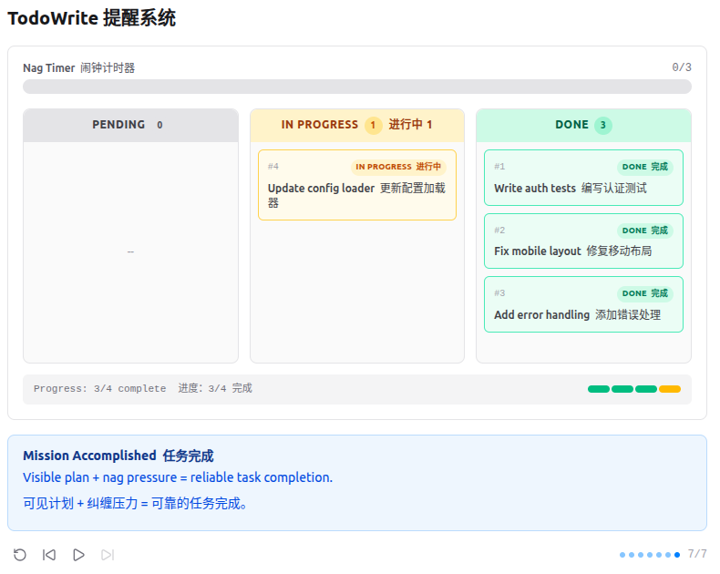

# Plan Before You Act  行动前先计划

    An agent without a plan drifts; list the steps first, then execute
    没有计划的代理会迷失方向；先列出步骤，再执行



    "没有计划的 agent 走哪算哪" -- 先列步骤再动手, 完成率翻倍。

## 问题
多步任务中, 模型会丢失进度 -- 重复做过的事、跳步、跑偏。对话越长越严重: 工具结果不断填满上下文, 系统提示的影响力逐渐被稀释。一个 10 步重构可能做完 1-3 步就开始即兴发挥, 因为 4-10 步已经被挤出注意力了。

## 解决方案
```markdown
+--------+      +-------+      +---------+
|  User  | ---> |  LLM  | ---> | Tools   |
| prompt |      |       |      | + todo  |
+--------+      +---+---+      +----+----+
                    ^                |
                    |   tool_result  |
                    +----------------+
                          |
              +-----------+-----------+
              | TodoManager state     |
              | [ ] task A            |
              | [>] task B  <- doing  |
              | [x] task C            |
              +-----------------------+
                          |
              if rounds_since_todo >= 3:
                inject <reminder> into tool_result
```
## 工作原理
1. TodoManager 存储带状态的项目。同一时间只允许一个 `in_progress`。
```python
class TodoManager:
    def __init__(self):
        self.items = []

    def update(self, items: list) -> str:
        if len(items) > 20:
            raise ValueError("Max 20 todos allowed")
        validated = []
        in_progress_count = 0
        for i, item in enumerate(items):
            text = str(item.get("text", "")).strip()
            status = str(item.get("status", "pending")).lower()
            item_id = str(item.get("id", str(i + 1)))
            if not text:
                raise ValueError(f"Item {item_id}: text required")
            if status not in ("pending", "in_progress", "completed"):
                raise ValueError(f"Item {item_id}: invalid status '{status}'")
            if status == "in_progress":
                in_progress_count += 1
            validated.append({"id": item_id, "text": text, "status": status})
        if in_progress_count > 1:
            raise ValueError("Only one task can be in_progress at a time")
        self.items = validated
        return self.render()
```

2. todo 工具和其他工具一样加入 dispatch map。
```python
TOOL_HANDLERS = {
    # ...base tools...
    "todo":       lambda **kw: TODO.update(kw["items"]),
}
```

3. nag reminder: 模型连续 3 轮以上不调用 todo 时注入提醒。
```python
rounds_since_todo = 0 if used_todo else rounds_since_todo + 1
if rounds_since_todo >= 3:
    results.insert(0, {"type": "text", "text": "<reminder>Update your todos.</reminder>"})
```
"同时只能有一个 in_progress" 强制顺序聚焦。nag reminder 制造问责压力 -- 你不更新计划, 系统就追着你问。

## 相对 s02 的变更
| 组件              | 之前 (s02) | 之后 (s03)                |
|-----------------| -------- |-------------------------|
| Tools 工具        | 4        | 5 (+todo)               |
| 规划              | 无        | 带状态的 TodoManager        |
| Nag 注入          | 无        | 3 轮后注入 `<reminder>`     |
| Agent loop 代理循环 | 简单分发     | + rounds_since_todo 计数器 |

试一试
```bash
cd learn-claude-code
python agents/s03_todo_write.py
```
试试这些 prompt (英文 prompt 对 LLM 效果更好, 也可以用中文):
- Build a CLI calculator that supports add, subtract, multiply, divide
- Refactor the file hello.py: add type hints, docstrings, and a main guard
- Create a Python package with __init__.py, utils.py, and tests/test_utils.py
- Review all Python files and fix any style issues


## 示例
### Build a CLI calculator that supports add, subtract, multiply, divide
构建一个支持加、减、乘、除功能的命令行计算器

1. assistant request: 
一个需要规划的多步骤任务
```python
from agents.s03_todo_write import TOOLS

request = {
  "max_tokens": 8000,
  "messages": [
    {
      "role": "user",
      "content": "Build a CLI calculator that supports add, subtract, multiply, divide"
    }
  ],
  "model": "aws-claude-sonnet-4-6",
  "system": "You are a coding agent at /home/xiangli/SourceCode/learn-claude-code.\nUse the todo tool to plan multi-step tasks. Mark in_progress before starting, completed when done.\nPrefer tools over prose.",
  "tools": TOOLS
}
```
2. assistant response: 
TodoManager 在编写任何代码之前创建一个可见的计划
```json
{
  "id": "msg_bdrk_01QBPfmgrwvhe7PbYpryvazQ",
  "content": [
    {
      "id": "toolu_bdrk_01F5aKghGkszNFjwfw5JXv3S",
      "input": {
        "items": [
          {
            "id": "1",
            "text": "Plan project structure",
            "status": "completed"
          },
          {
            "id": "2",
            "text": "Create calculator logic (calculator.js)",
            "status": "pending"
          },
          {
            "id": "3",
            "text": "Create CLI entry point (index.js)",
            "status": "pending"
          },
          {
            "id": "4",
            "text": "Create package.json",
            "status": "pending"
          },
          {
            "id": "5",
            "text": "Test the CLI calculator",
            "status": "pending"
          }
        ]
      },
      "name": "todo",
      "type": "tool_use"
    }
  ],
  "model": "claude-sonnet-4-6",
  "role": "assistant",
  "stop_reason": "tool_use",
  "type": "message",
  "usage": {
    "cache_creation": {
      "ephemeral_1h_input_tokens": 0,
      "ephemeral_5m_input_tokens": 0
    },
    "cache_creation_input_tokens": 0,
    "cache_read_input_tokens": 0,
    "input_tokens": 960,
    "output_tokens": 175
  }
}
```
> todo: [x] #1: Plan project structure
[ ] #2: Create calculator logic (calculator.js)
[ ] #3: Create CLI entry point (index.js)
[ ] #4: Create package.json
[ ] #5: Test the CLI calculator

(1/5 completed)
messages: 
```json
[
  {
    "role": "user",
    "content": "Build a CLI calculator that supports add, subtract, multiply, divide"
  },
  {
    "role": "assistant",
    "content": [
      {
        "id": "toolu_bdrk_01F5aKghGkszNFjwfw5JXv3S",
        "input": {
          "items": [
            {
              "id": "1",
              "text": "Plan project structure",
              "status": "completed"
            },
            {
              "id": "2",
              "text": "Create calculator logic (calculator.js)",
              "status": "pending"
            },
            {
              "id": "3",
              "text": "Create CLI entry point (index.js)",
              "status": "pending"
            },
            {
              "id": "4",
              "text": "Create package.json",
              "status": "pending"
            },
            {
              "id": "5",
              "text": "Test the CLI calculator",
              "status": "pending"
            }
          ]
        },
        "name": "todo",
        "type": "tool_use"
      }
    ]
  },
  {
    "role": "user",
    "content": [
      {
        "type": "tool_result",
        "tool_use_id": "toolu_bdrk_01F5aKghGkszNFjwfw5JXv3S",
        "content": "[x] #1: Plan project structure\n[ ] #2: Create calculator logic (calculator.js)\n[ ] #3: Create CLI entry point (index.js)\n[ ] #4: Create package.json\n[ ] #5: Test the CLI calculator\n\n(1/5 completed)"
      }
    ]
  }
]
```
assistant request: 
```python
from agents.s03_todo_write import TOOLS

request = {
  "max_tokens": 8000,
  "messages": [
    {
      "role": "user",
      "content": "Build a CLI calculator that supports add, subtract, multiply, divide"
    },
    {
      "role": "assistant",
      "content": [
        {
          "id": "toolu_bdrk_01F5aKghGkszNFjwfw5JXv3S",
          "input": {
            "items": [
              {
                "id": "1",
                "text": "Plan project structure",
                "status": "completed"
              },
              {
                "id": "2",
                "text": "Create calculator logic (calculator.js)",
                "status": "pending"
              },
              {
                "id": "3",
                "text": "Create CLI entry point (index.js)",
                "status": "pending"
              },
              {
                "id": "4",
                "text": "Create package.json",
                "status": "pending"
              },
              {
                "id": "5",
                "text": "Test the CLI calculator",
                "status": "pending"
              }
            ]
          },
          "name": "todo",
          "type": "tool_use"
        }
      ]
    },
    {
      "role": "user",
      "content": [
        {
          "type": "tool_result",
          "tool_use_id": "toolu_bdrk_01F5aKghGkszNFjwfw5JXv3S",
          "content": "[x] #1: Plan project structure\n[ ] #2: Create calculator logic (calculator.js)\n[ ] #3: Create CLI entry point (index.js)\n[ ] #4: Create package.json\n[ ] #5: Test the CLI calculator\n\n(1/5 completed)"
        }
      ]
    }
  ],
  "model": "aws-claude-sonnet-4-6",
  "system": "You are a coding agent at /home/xiangli/SourceCode/learn-claude-code.\nUse the todo tool to plan multi-step tasks. Mark in_progress before starting, completed when done.\nPrefer tools over prose.",
  "tools": TOOLS
}
```
assistant response: 
```json
{
  "id": "msg_bdrk_01Jk1mSAvga1dsF1ySiUV6dJ",
  "content": [
    {
      "id": "toolu_bdrk_013DtPYFiuoBnJwNtUay2Wfv",
      "input": {
        "items": [
          {
            "id": "1",
            "text": "Plan project structure",
            "status": "completed"
          },
          {
            "id": "2",
            "text": "Create calculator logic (calculator.js)",
            "status": "in_progress"
          },
          {
            "id": "3",
            "text": "Create CLI entry point (index.js)",
            "status": "pending"
          },
          {
            "id": "4",
            "text": "Create package.json",
            "status": "pending"
          },
          {
            "id": "5",
            "text": "Test the CLI calculator",
            "status": "pending"
          }
        ]
      },
      "name": "todo",
      "type": "tool_use"
    }
  ],
  "model": "claude-sonnet-4-6",
  "role": "assistant",
  "stop_reason": "tool_use",
  "type": "message",
  "usage": {
    "cache_creation": {
      "ephemeral_1h_input_tokens": 0,
      "ephemeral_5m_input_tokens": 0
    },
    "cache_creation_input_tokens": 0,
    "cache_read_input_tokens": 0,
    "input_tokens": 1204,
    "output_tokens": 169
  }
}
```
> todo: [x] #1: Plan project structure
[>] #2: Create calculator logic (calculator.js)
[ ] #3: Create CLI entry point (index.js)
[ ] #4: Create package.json
[ ] #5: Test the CLI calculator

(1/5 completed)
messages: 
```json
[
  {
    "role": "user",
    "content": "Build a CLI calculator that supports add, subtract, multiply, divide"
  },
  {
    "role": "assistant",
    "content": [
      {
        "id": "toolu_bdrk_01F5aKghGkszNFjwfw5JXv3S",
        "input": {
          "items": [
            {
              "id": "1",
              "text": "Plan project structure",
              "status": "completed"
            },
            {
              "id": "2",
              "text": "Create calculator logic (calculator.js)",
              "status": "pending"
            },
            {
              "id": "3",
              "text": "Create CLI entry point (index.js)",
              "status": "pending"
            },
            {
              "id": "4",
              "text": "Create package.json",
              "status": "pending"
            },
            {
              "id": "5",
              "text": "Test the CLI calculator",
              "status": "pending"
            }
          ]
        },
        "name": "todo",
        "type": "tool_use"
      }
    ]
  },
  {
    "role": "user",
    "content": [
      {
        "type": "tool_result",
        "tool_use_id": "toolu_bdrk_01F5aKghGkszNFjwfw5JXv3S",
        "content": "[x] #1: Plan project structure\n[ ] #2: Create calculator logic (calculator.js)\n[ ] #3: Create CLI entry point (index.js)\n[ ] #4: Create package.json\n[ ] #5: Test the CLI calculator\n\n(1/5 completed)"
      }
    ]
  },
  {
    "role": "assistant",
    "content": [
      {
        "id": "toolu_bdrk_013DtPYFiuoBnJwNtUay2Wfv",
        "input": {
          "items": [
            {
              "id": "1",
              "text": "Plan project structure",
              "status": "completed"
            },
            {
              "id": "2",
              "text": "Create calculator logic (calculator.js)",
              "status": "in_progress"
            },
            {
              "id": "3",
              "text": "Create CLI entry point (index.js)",
              "status": "pending"
            },
            {
              "id": "4",
              "text": "Create package.json",
              "status": "pending"
            },
            {
              "id": "5",
              "text": "Test the CLI calculator",
              "status": "pending"
            }
          ]
        },
        "name": "todo",
        "type": "tool_use"
      }
    ]
  },
  {
    "role": "user",
    "content": [
      {
        "type": "tool_result",
        "tool_use_id": "toolu_bdrk_013DtPYFiuoBnJwNtUay2Wfv",
        "content": "[x] #1: Plan project structure\n[>] #2: Create calculator logic (calculator.js)\n[ ] #3: Create CLI entry point (index.js)\n[ ] #4: Create package.json\n[ ] #5: Test the CLI calculator\n\n(1/5 completed)"
      }
    ]
  }
]
```
assistant request: 
```python
from agents.s03_todo_write import TOOLS
request = {
  "max_tokens": 8000,
  "messages": [
    {
      "role": "user",
      "content": "Build a CLI calculator that supports add, subtract, multiply, divide"
    },
    {
      "role": "assistant",
      "content": [
        {
          "id": "toolu_bdrk_01F5aKghGkszNFjwfw5JXv3S",
          "input": {
            "items": [
              {
                "id": "1",
                "text": "Plan project structure",
                "status": "completed"
              },
              {
                "id": "2",
                "text": "Create calculator logic (calculator.js)",
                "status": "pending"
              },
              {
                "id": "3",
                "text": "Create CLI entry point (index.js)",
                "status": "pending"
              },
              {
                "id": "4",
                "text": "Create package.json",
                "status": "pending"
              },
              {
                "id": "5",
                "text": "Test the CLI calculator",
                "status": "pending"
              }
            ]
          },
          "name": "todo",
          "type": "tool_use"
        }
      ]
    },
    {
      "role": "user",
      "content": [
        {
          "type": "tool_result",
          "tool_use_id": "toolu_bdrk_01F5aKghGkszNFjwfw5JXv3S",
          "content": "[x] #1: Plan project structure\n[ ] #2: Create calculator logic (calculator.js)\n[ ] #3: Create CLI entry point (index.js)\n[ ] #4: Create package.json\n[ ] #5: Test the CLI calculator\n\n(1/5 completed)"
        }
      ]
    },
    {
      "role": "assistant",
      "content": [
        {
          "id": "toolu_bdrk_013DtPYFiuoBnJwNtUay2Wfv",
          "input": {
            "items": [
              {
                "id": "1",
                "text": "Plan project structure",
                "status": "completed"
              },
              {
                "id": "2",
                "text": "Create calculator logic (calculator.js)",
                "status": "in_progress"
              },
              {
                "id": "3",
                "text": "Create CLI entry point (index.js)",
                "status": "pending"
              },
              {
                "id": "4",
                "text": "Create package.json",
                "status": "pending"
              },
              {
                "id": "5",
                "text": "Test the CLI calculator",
                "status": "pending"
              }
            ]
          },
          "name": "todo",
          "type": "tool_use"
        }
      ]
    },
    {
      "role": "user",
      "content": [
        {
          "type": "tool_result",
          "tool_use_id": "toolu_bdrk_013DtPYFiuoBnJwNtUay2Wfv",
          "content": "[x] #1: Plan project structure\n[>] #2: Create calculator logic (calculator.js)\n[ ] #3: Create CLI entry point (index.js)\n[ ] #4: Create package.json\n[ ] #5: Test the CLI calculator\n\n(1/5 completed)"
        }
      ]
    }
  ],
  "model": "aws-claude-sonnet-4-6",
  "system": "You are a coding agent at /home/xiangli/SourceCode/learn-claude-code.\nUse the todo tool to plan multi-step tasks. Mark in_progress before starting, completed when done.\nPrefer tools over prose.",
  "tools": TOOLS
}
```
assistant response: 
```json
{
  "id": "msg_bdrk_01AgkpmUyPQ7Cdz3tb6NMFyV",
  "content": [
    {
      "id": "toolu_bdrk_01WEYD5N5QxSyWUD2amkpHmu",
      "input": {
        "command": "mkdir -p /home/xiangli/SourceCode/learn-claude-code/cli-calculator"
      },
      "name": "bash",
      "type": "tool_use"
    }
  ],
  "model": "claude-sonnet-4-6",
  "role": "assistant",
  "stop_reason": "tool_use",
  "type": "message",
  "usage": {
    "cache_creation": {
      "ephemeral_1h_input_tokens": 0,
      "ephemeral_5m_input_tokens": 0
    },
    "cache_creation_input_tokens": 0,
    "cache_read_input_tokens": 0,
    "input_tokens": 1450,
    "output_tokens": 73
  }
}
```
> bash: (no output)
messages: 
```json
[
  {
    "role": "user",
    "content": "Build a CLI calculator that supports add, subtract, multiply, divide"
  },
  {
    "role": "assistant",
    "content": [
      {
        "id": "toolu_bdrk_01F5aKghGkszNFjwfw5JXv3S",
        "input": {
          "items": [
            {
              "id": "1",
              "text": "Plan project structure",
              "status": "completed"
            },
            {
              "id": "2",
              "text": "Create calculator logic (calculator.js)",
              "status": "pending"
            },
            {
              "id": "3",
              "text": "Create CLI entry point (index.js)",
              "status": "pending"
            },
            {
              "id": "4",
              "text": "Create package.json",
              "status": "pending"
            },
            {
              "id": "5",
              "text": "Test the CLI calculator",
              "status": "pending"
            }
          ]
        },
        "name": "todo",
        "type": "tool_use"
      }
    ]
  },
  {
    "role": "user",
    "content": [
      {
        "type": "tool_result",
        "tool_use_id": "toolu_bdrk_01F5aKghGkszNFjwfw5JXv3S",
        "content": "[x] #1: Plan project structure\n[ ] #2: Create calculator logic (calculator.js)\n[ ] #3: Create CLI entry point (index.js)\n[ ] #4: Create package.json\n[ ] #5: Test the CLI calculator\n\n(1/5 completed)"
      }
    ]
  },
  {
    "role": "assistant",
    "content": [
      {
        "id": "toolu_bdrk_013DtPYFiuoBnJwNtUay2Wfv",
        "input": {
          "items": [
            {
              "id": "1",
              "text": "Plan project structure",
              "status": "completed"
            },
            {
              "id": "2",
              "text": "Create calculator logic (calculator.js)",
              "status": "in_progress"
            },
            {
              "id": "3",
              "text": "Create CLI entry point (index.js)",
              "status": "pending"
            },
            {
              "id": "4",
              "text": "Create package.json",
              "status": "pending"
            },
            {
              "id": "5",
              "text": "Test the CLI calculator",
              "status": "pending"
            }
          ]
        },
        "name": "todo",
        "type": "tool_use"
      }
    ]
  },
  {
    "role": "user",
    "content": [
      {
        "type": "tool_result",
        "tool_use_id": "toolu_bdrk_013DtPYFiuoBnJwNtUay2Wfv",
        "content": "[x] #1: Plan project structure\n[>] #2: Create calculator logic (calculator.js)\n[ ] #3: Create CLI entry point (index.js)\n[ ] #4: Create package.json\n[ ] #5: Test the CLI calculator\n\n(1/5 completed)"
      }
    ]
  },
  {
    "role": "assistant",
    "content": [
      {
        "id": "toolu_bdrk_01WEYD5N5QxSyWUD2amkpHmu",
        "input": {
          "command": "mkdir -p /home/xiangli/SourceCode/learn-claude-code/cli-calculator"
        },
        "name": "bash",
        "type": "tool_use"
      }
    ]
  },
  {
    "role": "user",
    "content": [
      {
        "type": "tool_result",
        "tool_use_id": "toolu_bdrk_01WEYD5N5QxSyWUD2amkpHmu",
        "content": "(no output)"
      }
    ]
  }
]
```
assistant request: 
```python
from agents.s03_todo_write import TOOLS
request = {
  "max_tokens": 8000,
  "messages": [
    {
      "role": "user",
      "content": "Build a CLI calculator that supports add, subtract, multiply, divide"
    },
    {
      "role": "assistant",
      "content": [
        {
          "id": "toolu_bdrk_01F5aKghGkszNFjwfw5JXv3S",
          "input": {
            "items": [
              {
                "id": "1",
                "text": "Plan project structure",
                "status": "completed"
              },
              {
                "id": "2",
                "text": "Create calculator logic (calculator.js)",
                "status": "pending"
              },
              {
                "id": "3",
                "text": "Create CLI entry point (index.js)",
                "status": "pending"
              },
              {
                "id": "4",
                "text": "Create package.json",
                "status": "pending"
              },
              {
                "id": "5",
                "text": "Test the CLI calculator",
                "status": "pending"
              }
            ]
          },
          "name": "todo",
          "type": "tool_use"
        }
      ]
    },
    {
      "role": "user",
      "content": [
        {
          "type": "tool_result",
          "tool_use_id": "toolu_bdrk_01F5aKghGkszNFjwfw5JXv3S",
          "content": "[x] #1: Plan project structure\n[ ] #2: Create calculator logic (calculator.js)\n[ ] #3: Create CLI entry point (index.js)\n[ ] #4: Create package.json\n[ ] #5: Test the CLI calculator\n\n(1/5 completed)"
        }
      ]
    },
    {
      "role": "assistant",
      "content": [
        {
          "id": "toolu_bdrk_013DtPYFiuoBnJwNtUay2Wfv",
          "input": {
            "items": [
              {
                "id": "1",
                "text": "Plan project structure",
                "status": "completed"
              },
              {
                "id": "2",
                "text": "Create calculator logic (calculator.js)",
                "status": "in_progress"
              },
              {
                "id": "3",
                "text": "Create CLI entry point (index.js)",
                "status": "pending"
              },
              {
                "id": "4",
                "text": "Create package.json",
                "status": "pending"
              },
              {
                "id": "5",
                "text": "Test the CLI calculator",
                "status": "pending"
              }
            ]
          },
          "name": "todo",
          "type": "tool_use"
        }
      ]
    },
    {
      "role": "user",
      "content": [
        {
          "type": "tool_result",
          "tool_use_id": "toolu_bdrk_013DtPYFiuoBnJwNtUay2Wfv",
          "content": "[x] #1: Plan project structure\n[>] #2: Create calculator logic (calculator.js)\n[ ] #3: Create CLI entry point (index.js)\n[ ] #4: Create package.json\n[ ] #5: Test the CLI calculator\n\n(1/5 completed)"
        }
      ]
    },
    {
      "role": "assistant",
      "content": [
        {
          "id": "toolu_bdrk_01WEYD5N5QxSyWUD2amkpHmu",
          "input": {
            "command": "mkdir -p /home/xiangli/SourceCode/learn-claude-code/cli-calculator"
          },
          "name": "bash",
          "type": "tool_use"
        }
      ]
    },
    {
      "role": "user",
      "content": [
        {
          "type": "tool_result",
          "tool_use_id": "toolu_bdrk_01WEYD5N5QxSyWUD2amkpHmu",
          "content": "(no output)"
        }
      ]
    }
  ],
  "model": "aws-claude-sonnet-4-6",
  "system": "You are a coding agent at /home/xiangli/SourceCode/learn-claude-code.\nUse the todo tool to plan multi-step tasks. Mark in_progress before starting, completed when done.\nPrefer tools over prose.",
  "tools": TOOLS
}
```
assistant response: 
```json
{
  "id": "msg_bdrk_01BhLXwAN131wQfhVtP4Wpta",
  "content": [
    {
      "id": "toolu_bdrk_01THhsQ3u38UuPoQKKGGQFGk",
      "input": {
        "path": "/home/xiangli/SourceCode/learn-claude-code/cli-calculator/calculator.js",
        "content": "/**\n * Core calculator operations.\n * Each function validates its inputs and returns a numeric result.\n */\n\nfunction add(a, b) {\n  return a + b;\n}\n\nfunction subtract(a, b) {\n  return a - b;\n}\n\nfunction multiply(a, b) {\n  return a * b;\n}\n\nfunction divide(a, b) {\n  if (b === 0) throw new Error(\"Division by zero is not allowed.\");\n  return a / b;\n}\n\n/**\n * Dispatch an operation by name.\n * @param {string} op  - \"add\" | \"subtract\" | \"multiply\" | \"divide\"\n * @param {number} a\n * @param {number} b\n * @returns {number}\n */\nfunction calculate(op, a, b) {\n  const ops = { add, subtract, multiply, divide };\n  if (!ops[op]) throw new Error(`Unknown operation \"${op}\". Valid: add, subtract, multiply, divide.`);\n  return ops[op](a, b);\n}\n\nmodule.exports = { add, subtract, multiply, divide, calculate };\n"
      },
      "name": "write_file",
      "type": "tool_use"
    }
  ],
  "model": "claude-sonnet-4-6",
  "role": "assistant",
  "stop_reason": "tool_use",
  "type": "message",
  "usage": {
    "cache_creation": {
      "ephemeral_1h_input_tokens": 0,
      "ephemeral_5m_input_tokens": 0
    },
    "cache_creation_input_tokens": 0,
    "cache_read_input_tokens": 0,
    "input_tokens": 1537,
    "output_tokens": 361
  }
}
```
> write_file: Wrote 799 bytes
messages: 
```json
[
  {
    "role": "user",
    "content": "Build a CLI calculator that supports add, subtract, multiply, divide"
  },
  {
    "role": "assistant",
    "content": [
      {
        "id": "toolu_bdrk_01F5aKghGkszNFjwfw5JXv3S",
        "input": {
          "items": [
            {
              "id": "1",
              "text": "Plan project structure",
              "status": "completed"
            },
            {
              "id": "2",
              "text": "Create calculator logic (calculator.js)",
              "status": "pending"
            },
            {
              "id": "3",
              "text": "Create CLI entry point (index.js)",
              "status": "pending"
            },
            {
              "id": "4",
              "text": "Create package.json",
              "status": "pending"
            },
            {
              "id": "5",
              "text": "Test the CLI calculator",
              "status": "pending"
            }
          ]
        },
        "name": "todo",
        "type": "tool_use"
      }
    ]
  },
  {
    "role": "user",
    "content": [
      {
        "type": "tool_result",
        "tool_use_id": "toolu_bdrk_01F5aKghGkszNFjwfw5JXv3S",
        "content": "[x] #1: Plan project structure\n[ ] #2: Create calculator logic (calculator.js)\n[ ] #3: Create CLI entry point (index.js)\n[ ] #4: Create package.json\n[ ] #5: Test the CLI calculator\n\n(1/5 completed)"
      }
    ]
  },
  {
    "role": "assistant",
    "content": [
      {
        "id": "toolu_bdrk_013DtPYFiuoBnJwNtUay2Wfv",
        "input": {
          "items": [
            {
              "id": "1",
              "text": "Plan project structure",
              "status": "completed"
            },
            {
              "id": "2",
              "text": "Create calculator logic (calculator.js)",
              "status": "in_progress"
            },
            {
              "id": "3",
              "text": "Create CLI entry point (index.js)",
              "status": "pending"
            },
            {
              "id": "4",
              "text": "Create package.json",
              "status": "pending"
            },
            {
              "id": "5",
              "text": "Test the CLI calculator",
              "status": "pending"
            }
          ]
        },
        "name": "todo",
        "type": "tool_use"
      }
    ]
  },
  {
    "role": "user",
    "content": [
      {
        "type": "tool_result",
        "tool_use_id": "toolu_bdrk_013DtPYFiuoBnJwNtUay2Wfv",
        "content": "[x] #1: Plan project structure\n[>] #2: Create calculator logic (calculator.js)\n[ ] #3: Create CLI entry point (index.js)\n[ ] #4: Create package.json\n[ ] #5: Test the CLI calculator\n\n(1/5 completed)"
      }
    ]
  },
  {
    "role": "assistant",
    "content": [
      {
        "id": "toolu_bdrk_01WEYD5N5QxSyWUD2amkpHmu",
        "input": {
          "command": "mkdir -p /home/xiangli/SourceCode/learn-claude-code/cli-calculator"
        },
        "name": "bash",
        "type": "tool_use"
      }
    ]
  },
  {
    "role": "user",
    "content": [
      {
        "type": "tool_result",
        "tool_use_id": "toolu_bdrk_01WEYD5N5QxSyWUD2amkpHmu",
        "content": "(no output)"
      }
    ]
  },
  {
    "role": "assistant",
    "content": [
      {
        "id": "toolu_bdrk_01THhsQ3u38UuPoQKKGGQFGk",
        "input": {
          "path": "/home/xiangli/SourceCode/learn-claude-code/cli-calculator/calculator.js",
          "content": "/**\n * Core calculator operations.\n * Each function validates its inputs and returns a numeric result.\n */\n\nfunction add(a, b) {\n  return a + b;\n}\n\nfunction subtract(a, b) {\n  return a - b;\n}\n\nfunction multiply(a, b) {\n  return a * b;\n}\n\nfunction divide(a, b) {\n  if (b === 0) throw new Error(\"Division by zero is not allowed.\");\n  return a / b;\n}\n\n/**\n * Dispatch an operation by name.\n * @param {string} op  - \"add\" | \"subtract\" | \"multiply\" | \"divide\"\n * @param {number} a\n * @param {number} b\n * @returns {number}\n */\nfunction calculate(op, a, b) {\n  const ops = { add, subtract, multiply, divide };\n  if (!ops[op]) throw new Error(`Unknown operation \"${op}\". Valid: add, subtract, multiply, divide.`);\n  return ops[op](a, b);\n}\n\nmodule.exports = { add, subtract, multiply, divide, calculate };\n"
        },
        "name": "write_file",
        "type": "tool_use"
      }
    ]
  },
  {
    "role": "user",
    "content": [
      {
        "type": "tool_result",
        "tool_use_id": "toolu_bdrk_01THhsQ3u38UuPoQKKGGQFGk",
        "content": "Wrote 799 bytes"
      }
    ]
  }
]
```
assistant request: 
```python
from agents.s03_todo_write import TOOLS
request = {
  "max_tokens": 8000,
  "messages": [
    {
      "role": "user",
      "content": "Build a CLI calculator that supports add, subtract, multiply, divide"
    },
    {
      "role": "assistant",
      "content": [
        {
          "id": "toolu_bdrk_01F5aKghGkszNFjwfw5JXv3S",
          "input": {
            "items": [
              {
                "id": "1",
                "text": "Plan project structure",
                "status": "completed"
              },
              {
                "id": "2",
                "text": "Create calculator logic (calculator.js)",
                "status": "pending"
              },
              {
                "id": "3",
                "text": "Create CLI entry point (index.js)",
                "status": "pending"
              },
              {
                "id": "4",
                "text": "Create package.json",
                "status": "pending"
              },
              {
                "id": "5",
                "text": "Test the CLI calculator",
                "status": "pending"
              }
            ]
          },
          "name": "todo",
          "type": "tool_use"
        }
      ]
    },
    {
      "role": "user",
      "content": [
        {
          "type": "tool_result",
          "tool_use_id": "toolu_bdrk_01F5aKghGkszNFjwfw5JXv3S",
          "content": "[x] #1: Plan project structure\n[ ] #2: Create calculator logic (calculator.js)\n[ ] #3: Create CLI entry point (index.js)\n[ ] #4: Create package.json\n[ ] #5: Test the CLI calculator\n\n(1/5 completed)"
        }
      ]
    },
    {
      "role": "assistant",
      "content": [
        {
          "id": "toolu_bdrk_013DtPYFiuoBnJwNtUay2Wfv",
          "input": {
            "items": [
              {
                "id": "1",
                "text": "Plan project structure",
                "status": "completed"
              },
              {
                "id": "2",
                "text": "Create calculator logic (calculator.js)",
                "status": "in_progress"
              },
              {
                "id": "3",
                "text": "Create CLI entry point (index.js)",
                "status": "pending"
              },
              {
                "id": "4",
                "text": "Create package.json",
                "status": "pending"
              },
              {
                "id": "5",
                "text": "Test the CLI calculator",
                "status": "pending"
              }
            ]
          },
          "name": "todo",
          "type": "tool_use"
        }
      ]
    },
    {
      "role": "user",
      "content": [
        {
          "type": "tool_result",
          "tool_use_id": "toolu_bdrk_013DtPYFiuoBnJwNtUay2Wfv",
          "content": "[x] #1: Plan project structure\n[>] #2: Create calculator logic (calculator.js)\n[ ] #3: Create CLI entry point (index.js)\n[ ] #4: Create package.json\n[ ] #5: Test the CLI calculator\n\n(1/5 completed)"
        }
      ]
    },
    {
      "role": "assistant",
      "content": [
        {
          "id": "toolu_bdrk_01WEYD5N5QxSyWUD2amkpHmu",
          "input": {
            "command": "mkdir -p /home/xiangli/SourceCode/learn-claude-code/cli-calculator"
          },
          "name": "bash",
          "type": "tool_use"
        }
      ]
    },
    {
      "role": "user",
      "content": [
        {
          "type": "tool_result",
          "tool_use_id": "toolu_bdrk_01WEYD5N5QxSyWUD2amkpHmu",
          "content": "(no output)"
        }
      ]
    },
    {
      "role": "assistant",
      "content": [
        {
          "id": "toolu_bdrk_01THhsQ3u38UuPoQKKGGQFGk",
          "input": {
            "path": "/home/xiangli/SourceCode/learn-claude-code/cli-calculator/calculator.js",
            "content": "/**\n * Core calculator operations.\n * Each function validates its inputs and returns a numeric result.\n */\n\nfunction add(a, b) {\n  return a + b;\n}\n\nfunction subtract(a, b) {\n  return a - b;\n}\n\nfunction multiply(a, b) {\n  return a * b;\n}\n\nfunction divide(a, b) {\n  if (b === 0) throw new Error(\"Division by zero is not allowed.\");\n  return a / b;\n}\n\n/**\n * Dispatch an operation by name.\n * @param {string} op  - \"add\" | \"subtract\" | \"multiply\" | \"divide\"\n * @param {number} a\n * @param {number} b\n * @returns {number}\n */\nfunction calculate(op, a, b) {\n  const ops = { add, subtract, multiply, divide };\n  if (!ops[op]) throw new Error(`Unknown operation \"${op}\". Valid: add, subtract, multiply, divide.`);\n  return ops[op](a, b);\n}\n\nmodule.exports = { add, subtract, multiply, divide, calculate };\n"
          },
          "name": "write_file",
          "type": "tool_use"
        }
      ]
    },
    {
      "role": "user",
      "content": [
        {
          "type": "tool_result",
          "tool_use_id": "toolu_bdrk_01THhsQ3u38UuPoQKKGGQFGk",
          "content": "Wrote 799 bytes"
        }
      ]
    }
  ],
  "model": "aws-claude-sonnet-4-6",
  "system": "You are a coding agent at /home/xiangli/SourceCode/learn-claude-code.\nUse the todo tool to plan multi-step tasks. Mark in_progress before starting, completed when done.\nPrefer tools over prose.",
  "tools": TOOLS
}
```
assistant response:
```json
 {
  "id": "msg_bdrk_01JkhCFiTGi2xG4yvaWSmtH1",
  "content": [
    {
      "id": "toolu_bdrk_01FmckEpYCLyZZp5LJnL7QqX",
      "input": {
        "items": [
          {
            "id": "1",
            "text": "Plan project structure",
            "status": "completed"
          },
          {
            "id": "2",
            "text": "Create calculator logic (calculator.js)",
            "status": "completed"
          },
          {
            "id": "3",
            "text": "Create CLI entry point (index.js)",
            "status": "in_progress"
          },
          {
            "id": "4",
            "text": "Create package.json",
            "status": "pending"
          },
          {
            "id": "5",
            "text": "Test the CLI calculator",
            "status": "pending"
          }
        ]
      },
      "name": "todo",
      "type": "tool_use"
    }
  ],
  "model": "claude-sonnet-4-6",
  "role": "assistant",
  "stop_reason": "tool_use",
  "type": "message",
  "usage": {
    "cache_creation": {
      "ephemeral_1h_input_tokens": 0,
      "ephemeral_5m_input_tokens": 0
    },
    "cache_creation_input_tokens": 0,
    "cache_read_input_tokens": 0,
    "input_tokens": 1916,
    "output_tokens": 169
  }
}
```
> todo: [x] #1: Plan project structure
[x] #2: Create calculator logic (calculator.js)
[>] #3: Create CLI entry point (index.js)
[ ] #4: Create package.json
[ ] #5: Test the CLI calculator

(2/5 completed)
messages: 
```json
[
  {
    "role": "user",
    "content": "Build a CLI calculator that supports add, subtract, multiply, divide"
  },
  {
    "role": "assistant",
    "content": [
      {
        "id": "toolu_bdrk_01F5aKghGkszNFjwfw5JXv3S",
        "input": {
          "items": [
            {
              "id": "1",
              "text": "Plan project structure",
              "status": "completed"
            },
            {
              "id": "2",
              "text": "Create calculator logic (calculator.js)",
              "status": "pending"
            },
            {
              "id": "3",
              "text": "Create CLI entry point (index.js)",
              "status": "pending"
            },
            {
              "id": "4",
              "text": "Create package.json",
              "status": "pending"
            },
            {
              "id": "5",
              "text": "Test the CLI calculator",
              "status": "pending"
            }
          ]
        },
        "name": "todo",
        "type": "tool_use"
      }
    ]
  },
  {
    "role": "user",
    "content": [
      {
        "type": "tool_result",
        "tool_use_id": "toolu_bdrk_01F5aKghGkszNFjwfw5JXv3S",
        "content": "[x] #1: Plan project structure\n[ ] #2: Create calculator logic (calculator.js)\n[ ] #3: Create CLI entry point (index.js)\n[ ] #4: Create package.json\n[ ] #5: Test the CLI calculator\n\n(1/5 completed)"
      }
    ]
  },
  {
    "role": "assistant",
    "content": [
      {
        "id": "toolu_bdrk_013DtPYFiuoBnJwNtUay2Wfv",
        "input": {
          "items": [
            {
              "id": "1",
              "text": "Plan project structure",
              "status": "completed"
            },
            {
              "id": "2",
              "text": "Create calculator logic (calculator.js)",
              "status": "in_progress"
            },
            {
              "id": "3",
              "text": "Create CLI entry point (index.js)",
              "status": "pending"
            },
            {
              "id": "4",
              "text": "Create package.json",
              "status": "pending"
            },
            {
              "id": "5",
              "text": "Test the CLI calculator",
              "status": "pending"
            }
          ]
        },
        "name": "todo",
        "type": "tool_use"
      }
    ]
  },
  {
    "role": "user",
    "content": [
      {
        "type": "tool_result",
        "tool_use_id": "toolu_bdrk_013DtPYFiuoBnJwNtUay2Wfv",
        "content": "[x] #1: Plan project structure\n[>] #2: Create calculator logic (calculator.js)\n[ ] #3: Create CLI entry point (index.js)\n[ ] #4: Create package.json\n[ ] #5: Test the CLI calculator\n\n(1/5 completed)"
      }
    ]
  },
  {
    "role": "assistant",
    "content": [
      {
        "id": "toolu_bdrk_01WEYD5N5QxSyWUD2amkpHmu",
        "input": {
          "command": "mkdir -p /home/xiangli/SourceCode/learn-claude-code/cli-calculator"
        },
        "name": "bash",
        "type": "tool_use"
      }
    ]
  },
  {
    "role": "user",
    "content": [
      {
        "type": "tool_result",
        "tool_use_id": "toolu_bdrk_01WEYD5N5QxSyWUD2amkpHmu",
        "content": "(no output)"
      }
    ]
  },
  {
    "role": "assistant",
    "content": [
      {
        "id": "toolu_bdrk_01THhsQ3u38UuPoQKKGGQFGk",
        "input": {
          "path": "/home/xiangli/SourceCode/learn-claude-code/cli-calculator/calculator.js",
          "content": "/**\n * Core calculator operations.\n * Each function validates its inputs and returns a numeric result.\n */\n\nfunction add(a, b) {\n  return a + b;\n}\n\nfunction subtract(a, b) {\n  return a - b;\n}\n\nfunction multiply(a, b) {\n  return a * b;\n}\n\nfunction divide(a, b) {\n  if (b === 0) throw new Error(\"Division by zero is not allowed.\");\n  return a / b;\n}\n\n/**\n * Dispatch an operation by name.\n * @param {string} op  - \"add\" | \"subtract\" | \"multiply\" | \"divide\"\n * @param {number} a\n * @param {number} b\n * @returns {number}\n */\nfunction calculate(op, a, b) {\n  const ops = { add, subtract, multiply, divide };\n  if (!ops[op]) throw new Error(`Unknown operation \"${op}\". Valid: add, subtract, multiply, divide.`);\n  return ops[op](a, b);\n}\n\nmodule.exports = { add, subtract, multiply, divide, calculate };\n"
        },
        "name": "write_file",
        "type": "tool_use"
      }
    ]
  },
  {
    "role": "user",
    "content": [
      {
        "type": "tool_result",
        "tool_use_id": "toolu_bdrk_01THhsQ3u38UuPoQKKGGQFGk",
        "content": "Wrote 799 bytes"
      }
    ]
  },
  {
    "role": "assistant",
    "content": [
      {
        "id": "toolu_bdrk_01FmckEpYCLyZZp5LJnL7QqX",
        "input": {
          "items": [
            {
              "id": "1",
              "text": "Plan project structure",
              "status": "completed"
            },
            {
              "id": "2",
              "text": "Create calculator logic (calculator.js)",
              "status": "completed"
            },
            {
              "id": "3",
              "text": "Create CLI entry point (index.js)",
              "status": "in_progress"
            },
            {
              "id": "4",
              "text": "Create package.json",
              "status": "pending"
            },
            {
              "id": "5",
              "text": "Test the CLI calculator",
              "status": "pending"
            }
          ]
        },
        "name": "todo",
        "type": "tool_use"
      }
    ]
  },
  {
    "role": "user",
    "content": [
      {
        "type": "tool_result",
        "tool_use_id": "toolu_bdrk_01FmckEpYCLyZZp5LJnL7QqX",
        "content": "[x] #1: Plan project structure\n[x] #2: Create calculator logic (calculator.js)\n[>] #3: Create CLI entry point (index.js)\n[ ] #4: Create package.json\n[ ] #5: Test the CLI calculator\n\n(2/5 completed)"
      }
    ]
  }
]
```
assistant request: 
```python
from agents.s03_todo_write import TOOLS
request = {
  "max_tokens": 8000,
  "messages": [
    {
      "role": "user",
      "content": "Build a CLI calculator that supports add, subtract, multiply, divide"
    },
    {
      "role": "assistant",
      "content": [
        {
          "id": "toolu_bdrk_01F5aKghGkszNFjwfw5JXv3S",
          "input": {
            "items": [
              {
                "id": "1",
                "text": "Plan project structure",
                "status": "completed"
              },
              {
                "id": "2",
                "text": "Create calculator logic (calculator.js)",
                "status": "pending"
              },
              {
                "id": "3",
                "text": "Create CLI entry point (index.js)",
                "status": "pending"
              },
              {
                "id": "4",
                "text": "Create package.json",
                "status": "pending"
              },
              {
                "id": "5",
                "text": "Test the CLI calculator",
                "status": "pending"
              }
            ]
          },
          "name": "todo",
          "type": "tool_use"
        }
      ]
    },
    {
      "role": "user",
      "content": [
        {
          "type": "tool_result",
          "tool_use_id": "toolu_bdrk_01F5aKghGkszNFjwfw5JXv3S",
          "content": "[x] #1: Plan project structure\n[ ] #2: Create calculator logic (calculator.js)\n[ ] #3: Create CLI entry point (index.js)\n[ ] #4: Create package.json\n[ ] #5: Test the CLI calculator\n\n(1/5 completed)"
        }
      ]
    },
    {
      "role": "assistant",
      "content": [
        {
          "id": "toolu_bdrk_013DtPYFiuoBnJwNtUay2Wfv",
          "input": {
            "items": [
              {
                "id": "1",
                "text": "Plan project structure",
                "status": "completed"
              },
              {
                "id": "2",
                "text": "Create calculator logic (calculator.js)",
                "status": "in_progress"
              },
              {
                "id": "3",
                "text": "Create CLI entry point (index.js)",
                "status": "pending"
              },
              {
                "id": "4",
                "text": "Create package.json",
                "status": "pending"
              },
              {
                "id": "5",
                "text": "Test the CLI calculator",
                "status": "pending"
              }
            ]
          },
          "name": "todo",
          "type": "tool_use"
        }
      ]
    },
    {
      "role": "user",
      "content": [
        {
          "type": "tool_result",
          "tool_use_id": "toolu_bdrk_013DtPYFiuoBnJwNtUay2Wfv",
          "content": "[x] #1: Plan project structure\n[>] #2: Create calculator logic (calculator.js)\n[ ] #3: Create CLI entry point (index.js)\n[ ] #4: Create package.json\n[ ] #5: Test the CLI calculator\n\n(1/5 completed)"
        }
      ]
    },
    {
      "role": "assistant",
      "content": [
        {
          "id": "toolu_bdrk_01WEYD5N5QxSyWUD2amkpHmu",
          "input": {
            "command": "mkdir -p /home/xiangli/SourceCode/learn-claude-code/cli-calculator"
          },
          "name": "bash",
          "type": "tool_use"
        }
      ]
    },
    {
      "role": "user",
      "content": [
        {
          "type": "tool_result",
          "tool_use_id": "toolu_bdrk_01WEYD5N5QxSyWUD2amkpHmu",
          "content": "(no output)"
        }
      ]
    },
    {
      "role": "assistant",
      "content": [
        {
          "id": "toolu_bdrk_01THhsQ3u38UuPoQKKGGQFGk",
          "input": {
            "path": "/home/xiangli/SourceCode/learn-claude-code/cli-calculator/calculator.js",
            "content": "/**\n * Core calculator operations.\n * Each function validates its inputs and returns a numeric result.\n */\n\nfunction add(a, b) {\n  return a + b;\n}\n\nfunction subtract(a, b) {\n  return a - b;\n}\n\nfunction multiply(a, b) {\n  return a * b;\n}\n\nfunction divide(a, b) {\n  if (b === 0) throw new Error(\"Division by zero is not allowed.\");\n  return a / b;\n}\n\n/**\n * Dispatch an operation by name.\n * @param {string} op  - \"add\" | \"subtract\" | \"multiply\" | \"divide\"\n * @param {number} a\n * @param {number} b\n * @returns {number}\n */\nfunction calculate(op, a, b) {\n  const ops = { add, subtract, multiply, divide };\n  if (!ops[op]) throw new Error(`Unknown operation \"${op}\". Valid: add, subtract, multiply, divide.`);\n  return ops[op](a, b);\n}\n\nmodule.exports = { add, subtract, multiply, divide, calculate };\n"
          },
          "name": "write_file",
          "type": "tool_use"
        }
      ]
    },
    {
      "role": "user",
      "content": [
        {
          "type": "tool_result",
          "tool_use_id": "toolu_bdrk_01THhsQ3u38UuPoQKKGGQFGk",
          "content": "Wrote 799 bytes"
        }
      ]
    },
    {
      "role": "assistant",
      "content": [
        {
          "id": "toolu_bdrk_01FmckEpYCLyZZp5LJnL7QqX",
          "input": {
            "items": [
              {
                "id": "1",
                "text": "Plan project structure",
                "status": "completed"
              },
              {
                "id": "2",
                "text": "Create calculator logic (calculator.js)",
                "status": "completed"
              },
              {
                "id": "3",
                "text": "Create CLI entry point (index.js)",
                "status": "in_progress"
              },
              {
                "id": "4",
                "text": "Create package.json",
                "status": "pending"
              },
              {
                "id": "5",
                "text": "Test the CLI calculator",
                "status": "pending"
              }
            ]
          },
          "name": "todo",
          "type": "tool_use"
        }
      ]
    },
    {
      "role": "user",
      "content": [
        {
          "type": "tool_result",
          "tool_use_id": "toolu_bdrk_01FmckEpYCLyZZp5LJnL7QqX",
          "content": "[x] #1: Plan project structure\n[x] #2: Create calculator logic (calculator.js)\n[>] #3: Create CLI entry point (index.js)\n[ ] #4: Create package.json\n[ ] #5: Test the CLI calculator\n\n(2/5 completed)"
        }
      ]
    }
  ],
  "model": "aws-claude-sonnet-4-6",
  "system": "You are a coding agent at /home/xiangli/SourceCode/learn-claude-code.\nUse the todo tool to plan multi-step tasks. Mark in_progress before starting, completed when done.\nPrefer tools over prose.",
  "tools": TOOLS
}
```
assistant response: 
```json
{
  "id": "msg_bdrk_01JKwNqEGbatcvadnRvpRpU7",
  "content": [
    {
      "id": "toolu_bdrk_01McPGvExppPPEE4KPBBpNMW",
      "input": {
        "path": "/home/xiangli/SourceCode/learn-claude-code/cli-calculator/index.js",
        "content": "#!/usr/bin/env node\n\"use strict\";\n\nconst readline = require(\"readline\");\nconst { calculate } = require(\"./calculator\");\n\n// ── Helpers ────────────────────────────────────────────────────────────────\n\nconst OPERATIONS = [\"add\", \"subtract\", \"multiply\", \"divide\"];\nconst ALIASES = { \"+\": \"add\", \"-\": \"subtract\", \"*\": \"multiply\", \"/\": \"divide\" };\n\nfunction parseArgs(argv) {\n  // Support:  calc <op> <a> <b>  (non-interactive mode)\n  const [, , op, a, b] = argv;\n  return { op, a, b };\n}\n\nfunction formatResult(op, a, b, result) {\n  const symbols = { add: \"+\", subtract: \"−\", multiply: \"×\", divide: \"÷\" };\n  return `  ${a} ${symbols[op]} ${b} = ${result}`;\n}\n\nfunction runOnce(opRaw, aRaw, bRaw) {\n  const op = ALIASES[opRaw] || opRaw;\n  const a = parseFloat(aRaw);\n  const b = parseFloat(bRaw);\n\n  if (!OPERATIONS.includes(op)) {\n    console.error(`✖  Unknown operation \"${opRaw}\". Use: add, subtract, multiply, divide (or +, -, *, /)`);\n    process.exit(1);\n  }\n  if (isNaN(a) || isNaN(b)) {\n    console.error(`✖  Both operands must be valid numbers. Got: \"${aRaw}\", \"${bRaw}\"`);\n    process.exit(1);\n  }\n\n  try {\n    const result = calculate(op, a, b);\n    console.log(formatResult(op, a, b, result));\n  } catch (err) {\n    console.error(`✖  ${err.message}`);\n    process.exit(1);\n  }\n}\n\n// ── Interactive REPL ───────────────────────────────────────────────────────\n\nfunction startRepl() {\n  const rl = readline.createInterface({\n    input: process.stdin,\n    output: process.stdout,\n    prompt: \"calc> \",\n  });\n\n  console.log(\"╔══════════════════════════════════════╗\");\n  console.log(\"║       CLI Calculator  🧮              ║\");\n  console.log(\"╠══════════════════════════════════════╣\");\n  console.log(\"║  Usage:  <op> <a> <b>                ║\");\n  console.log(\"║  Ops:    add  subtract  multiply      ║\");\n  console.log(\"║          divide  (or  +  -  *  /)    ║\");\n  console.log(\"║  Type  help  or  exit  to quit        ║\");\n  console.log(\"╚══════════════════════════════════════╝\");\n  console.log();\n\n  rl.prompt();\n\n  rl.on(\"line\", (line) => {\n    const trimmed = line.trim();\n    if (!trimmed) { rl.prompt(); return; }\n\n    if (trimmed === \"exit\" || trimmed === \"quit\") {\n      console.log(\"Goodbye! 👋\");\n      rl.close();\n      return;\n    }\n\n    if (trimmed === \"help\") {\n      console.log(\"  Operations : add (+)  subtract (-)  multiply (*)  divide (/)\");\n      console.log(\"  Example    : add 10 5   →   10 + 5 = 15\");\n      console.log(\"  Example    : / 9 3      →   9 ÷ 3 = 3\");\n      rl.prompt();\n      return;\n    }\n\n    const parts = trimmed.split(/\\s+/);\n    if (parts.length !== 3) {\n      console.error(\"  ✖  Expected exactly 3 tokens: <op> <a> <b>\");\n      rl.prompt();\n      return;\n    }\n\n    const [opRaw, aRaw, bRaw] = parts;\n    const op = ALIASES[opRaw] || opRaw;\n    const a = parseFloat(aRaw);\n    const b = parseFloat(bRaw);\n\n    if (!OPERATIONS.includes(op)) {\n      console.error(`  ✖  Unknown operation \"${opRaw}\".`);\n      rl.prompt();\n      return;\n    }\n    if (isNaN(a) || isNaN(b)) {\n      console.error(`  ✖  Both operands must be valid numbers. Got: \"${aRaw}\", \"${bRaw}\"`);\n      rl.prompt();\n      return;\n    }\n\n    try {\n      const result = calculate(op, a, b);\n      console.log(formatResult(op, a, b, result));\n    } catch (err) {\n      console.error(`  ✖  ${err.message}`);\n    }\n\n    rl.prompt();\n  });\n\n  rl.on(\"close\", () => process.exit(0));\n}\n\n// ── Entry point ────────────────────────────────────────────────────────────\n\nconst { op, a, b } = parseArgs(process.argv);\n\nif (op && a && b) {\n  // Non-interactive: calc add 10 5\n  runOnce(op, a, b);\n} else if (op || a || b) {\n  console.error(\"✖  Non-interactive mode requires exactly 3 arguments: <op> <a> <b>\");\n  console.error(\"   Example: node index.js add 10 5\");\n  process.exit(1);\n} else {\n  // Launch interactive REPL\n  startRepl();\n}\n"
      },
      "name": "write_file",
      "type": "tool_use"
    }
  ],
  "model": "claude-sonnet-4-6",
  "role": "assistant",
  "stop_reason": "tool_use",
  "type": "message",
  "usage": {
    "cache_creation": {
      "ephemeral_1h_input_tokens": 0,
      "ephemeral_5m_input_tokens": 0
    },
    "cache_creation_input_tokens": 0,
    "cache_read_input_tokens": 0,
    "input_tokens": 2163,
    "output_tokens": 1504
  }
}
```
> write_file: Wrote 3842 bytes
messages: 
```json
[
  {
    "role": "user",
    "content": "Build a CLI calculator that supports add, subtract, multiply, divide"
  },
  {
    "role": "assistant",
    "content": [
      {
        "id": "toolu_bdrk_01F5aKghGkszNFjwfw5JXv3S",
        "input": {
          "items": [
            {
              "id": "1",
              "text": "Plan project structure",
              "status": "completed"
            },
            {
              "id": "2",
              "text": "Create calculator logic (calculator.js)",
              "status": "pending"
            },
            {
              "id": "3",
              "text": "Create CLI entry point (index.js)",
              "status": "pending"
            },
            {
              "id": "4",
              "text": "Create package.json",
              "status": "pending"
            },
            {
              "id": "5",
              "text": "Test the CLI calculator",
              "status": "pending"
            }
          ]
        },
        "name": "todo",
        "type": "tool_use"
      }
    ]
  },
  {
    "role": "user",
    "content": [
      {
        "type": "tool_result",
        "tool_use_id": "toolu_bdrk_01F5aKghGkszNFjwfw5JXv3S",
        "content": "[x] #1: Plan project structure\n[ ] #2: Create calculator logic (calculator.js)\n[ ] #3: Create CLI entry point (index.js)\n[ ] #4: Create package.json\n[ ] #5: Test the CLI calculator\n\n(1/5 completed)"
      }
    ]
  },
  {
    "role": "assistant",
    "content": [
      {
        "id": "toolu_bdrk_013DtPYFiuoBnJwNtUay2Wfv",
        "input": {
          "items": [
            {
              "id": "1",
              "text": "Plan project structure",
              "status": "completed"
            },
            {
              "id": "2",
              "text": "Create calculator logic (calculator.js)",
              "status": "in_progress"
            },
            {
              "id": "3",
              "text": "Create CLI entry point (index.js)",
              "status": "pending"
            },
            {
              "id": "4",
              "text": "Create package.json",
              "status": "pending"
            },
            {
              "id": "5",
              "text": "Test the CLI calculator",
              "status": "pending"
            }
          ]
        },
        "name": "todo",
        "type": "tool_use"
      }
    ]
  },
  {
    "role": "user",
    "content": [
      {
        "type": "tool_result",
        "tool_use_id": "toolu_bdrk_013DtPYFiuoBnJwNtUay2Wfv",
        "content": "[x] #1: Plan project structure\n[>] #2: Create calculator logic (calculator.js)\n[ ] #3: Create CLI entry point (index.js)\n[ ] #4: Create package.json\n[ ] #5: Test the CLI calculator\n\n(1/5 completed)"
      }
    ]
  },
  {
    "role": "assistant",
    "content": [
      {
        "id": "toolu_bdrk_01WEYD5N5QxSyWUD2amkpHmu",
        "input": {
          "command": "mkdir -p /home/xiangli/SourceCode/learn-claude-code/cli-calculator"
        },
        "name": "bash",
        "type": "tool_use"
      }
    ]
  },
  {
    "role": "user",
    "content": [
      {
        "type": "tool_result",
        "tool_use_id": "toolu_bdrk_01WEYD5N5QxSyWUD2amkpHmu",
        "content": "(no output)"
      }
    ]
  },
  {
    "role": "assistant",
    "content": [
      {
        "id": "toolu_bdrk_01THhsQ3u38UuPoQKKGGQFGk",
        "input": {
          "path": "/home/xiangli/SourceCode/learn-claude-code/cli-calculator/calculator.js",
          "content": "/**\n * Core calculator operations.\n * Each function validates its inputs and returns a numeric result.\n */\n\nfunction add(a, b) {\n  return a + b;\n}\n\nfunction subtract(a, b) {\n  return a - b;\n}\n\nfunction multiply(a, b) {\n  return a * b;\n}\n\nfunction divide(a, b) {\n  if (b === 0) throw new Error(\"Division by zero is not allowed.\");\n  return a / b;\n}\n\n/**\n * Dispatch an operation by name.\n * @param {string} op  - \"add\" | \"subtract\" | \"multiply\" | \"divide\"\n * @param {number} a\n * @param {number} b\n * @returns {number}\n */\nfunction calculate(op, a, b) {\n  const ops = { add, subtract, multiply, divide };\n  if (!ops[op]) throw new Error(`Unknown operation \"${op}\". Valid: add, subtract, multiply, divide.`);\n  return ops[op](a, b);\n}\n\nmodule.exports = { add, subtract, multiply, divide, calculate };\n"
        },
        "name": "write_file",
        "type": "tool_use"
      }
    ]
  },
  {
    "role": "user",
    "content": [
      {
        "type": "tool_result",
        "tool_use_id": "toolu_bdrk_01THhsQ3u38UuPoQKKGGQFGk",
        "content": "Wrote 799 bytes"
      }
    ]
  },
  {
    "role": "assistant",
    "content": [
      {
        "id": "toolu_bdrk_01FmckEpYCLyZZp5LJnL7QqX",
        "input": {
          "items": [
            {
              "id": "1",
              "text": "Plan project structure",
              "status": "completed"
            },
            {
              "id": "2",
              "text": "Create calculator logic (calculator.js)",
              "status": "completed"
            },
            {
              "id": "3",
              "text": "Create CLI entry point (index.js)",
              "status": "in_progress"
            },
            {
              "id": "4",
              "text": "Create package.json",
              "status": "pending"
            },
            {
              "id": "5",
              "text": "Test the CLI calculator",
              "status": "pending"
            }
          ]
        },
        "name": "todo",
        "type": "tool_use"
      }
    ]
  },
  {
    "role": "user",
    "content": [
      {
        "type": "tool_result",
        "tool_use_id": "toolu_bdrk_01FmckEpYCLyZZp5LJnL7QqX",
        "content": "[x] #1: Plan project structure\n[x] #2: Create calculator logic (calculator.js)\n[>] #3: Create CLI entry point (index.js)\n[ ] #4: Create package.json\n[ ] #5: Test the CLI calculator\n\n(2/5 completed)"
      }
    ]
  },
  {
    "role": "assistant",
    "content": [
      {
        "id": "toolu_bdrk_01McPGvExppPPEE4KPBBpNMW",
        "input": {
          "path": "/home/xiangli/SourceCode/learn-claude-code/cli-calculator/index.js",
          "content": "#!/usr/bin/env node\n\"use strict\";\n\nconst readline = require(\"readline\");\nconst { calculate } = require(\"./calculator\");\n\n// ── Helpers ────────────────────────────────────────────────────────────────\n\nconst OPERATIONS = [\"add\", \"subtract\", \"multiply\", \"divide\"];\nconst ALIASES = { \"+\": \"add\", \"-\": \"subtract\", \"*\": \"multiply\", \"/\": \"divide\" };\n\nfunction parseArgs(argv) {\n  // Support:  calc <op> <a> <b>  (non-interactive mode)\n  const [, , op, a, b] = argv;\n  return { op, a, b };\n}\n\nfunction formatResult(op, a, b, result) {\n  const symbols = { add: \"+\", subtract: \"−\", multiply: \"×\", divide: \"÷\" };\n  return `  ${a} ${symbols[op]} ${b} = ${result}`;\n}\n\nfunction runOnce(opRaw, aRaw, bRaw) {\n  const op = ALIASES[opRaw] || opRaw;\n  const a = parseFloat(aRaw);\n  const b = parseFloat(bRaw);\n\n  if (!OPERATIONS.includes(op)) {\n    console.error(`✖  Unknown operation \"${opRaw}\". Use: add, subtract, multiply, divide (or +, -, *, /)`);\n    process.exit(1);\n  }\n  if (isNaN(a) || isNaN(b)) {\n    console.error(`✖  Both operands must be valid numbers. Got: \"${aRaw}\", \"${bRaw}\"`);\n    process.exit(1);\n  }\n\n  try {\n    const result = calculate(op, a, b);\n    console.log(formatResult(op, a, b, result));\n  } catch (err) {\n    console.error(`✖  ${err.message}`);\n    process.exit(1);\n  }\n}\n\n// ── Interactive REPL ───────────────────────────────────────────────────────\n\nfunction startRepl() {\n  const rl = readline.createInterface({\n    input: process.stdin,\n    output: process.stdout,\n    prompt: \"calc> \",\n  });\n\n  console.log(\"╔══════════════════════════════════════╗\");\n  console.log(\"║       CLI Calculator  🧮              ║\");\n  console.log(\"╠══════════════════════════════════════╣\");\n  console.log(\"║  Usage:  <op> <a> <b>                ║\");\n  console.log(\"║  Ops:    add  subtract  multiply      ║\");\n  console.log(\"║          divide  (or  +  -  *  /)    ║\");\n  console.log(\"║  Type  help  or  exit  to quit        ║\");\n  console.log(\"╚══════════════════════════════════════╝\");\n  console.log();\n\n  rl.prompt();\n\n  rl.on(\"line\", (line) => {\n    const trimmed = line.trim();\n    if (!trimmed) { rl.prompt(); return; }\n\n    if (trimmed === \"exit\" || trimmed === \"quit\") {\n      console.log(\"Goodbye! 👋\");\n      rl.close();\n      return;\n    }\n\n    if (trimmed === \"help\") {\n      console.log(\"  Operations : add (+)  subtract (-)  multiply (*)  divide (/)\");\n      console.log(\"  Example    : add 10 5   →   10 + 5 = 15\");\n      console.log(\"  Example    : / 9 3      →   9 ÷ 3 = 3\");\n      rl.prompt();\n      return;\n    }\n\n    const parts = trimmed.split(/\\s+/);\n    if (parts.length !== 3) {\n      console.error(\"  ✖  Expected exactly 3 tokens: <op> <a> <b>\");\n      rl.prompt();\n      return;\n    }\n\n    const [opRaw, aRaw, bRaw] = parts;\n    const op = ALIASES[opRaw] || opRaw;\n    const a = parseFloat(aRaw);\n    const b = parseFloat(bRaw);\n\n    if (!OPERATIONS.includes(op)) {\n      console.error(`  ✖  Unknown operation \"${opRaw}\".`);\n      rl.prompt();\n      return;\n    }\n    if (isNaN(a) || isNaN(b)) {\n      console.error(`  ✖  Both operands must be valid numbers. Got: \"${aRaw}\", \"${bRaw}\"`);\n      rl.prompt();\n      return;\n    }\n\n    try {\n      const result = calculate(op, a, b);\n      console.log(formatResult(op, a, b, result));\n    } catch (err) {\n      console.error(`  ✖  ${err.message}`);\n    }\n\n    rl.prompt();\n  });\n\n  rl.on(\"close\", () => process.exit(0));\n}\n\n// ── Entry point ────────────────────────────────────────────────────────────\n\nconst { op, a, b } = parseArgs(process.argv);\n\nif (op && a && b) {\n  // Non-interactive: calc add 10 5\n  runOnce(op, a, b);\n} else if (op || a || b) {\n  console.error(\"✖  Non-interactive mode requires exactly 3 arguments: <op> <a> <b>\");\n  console.error(\"   Example: node index.js add 10 5\");\n  process.exit(1);\n} else {\n  // Launch interactive REPL\n  startRepl();\n}\n"
        },
        "name": "write_file",
        "type": "tool_use"
      }
    ]
  },
  {
    "role": "user",
    "content": [
      {
        "type": "tool_result",
        "tool_use_id": "toolu_bdrk_01McPGvExppPPEE4KPBBpNMW",
        "content": "Wrote 3842 bytes"
      }
    ]
  }
]
```
assistant request: 
```python
from agents.s03_todo_write import TOOLS
request = {
  "max_tokens": 8000,
  "messages": [
    {
      "role": "user",
      "content": "Build a CLI calculator that supports add, subtract, multiply, divide"
    },
    {
      "role": "assistant",
      "content": [
        {
          "id": "toolu_bdrk_01F5aKghGkszNFjwfw5JXv3S",
          "input": {
            "items": [
              {
                "id": "1",
                "text": "Plan project structure",
                "status": "completed"
              },
              {
                "id": "2",
                "text": "Create calculator logic (calculator.js)",
                "status": "pending"
              },
              {
                "id": "3",
                "text": "Create CLI entry point (index.js)",
                "status": "pending"
              },
              {
                "id": "4",
                "text": "Create package.json",
                "status": "pending"
              },
              {
                "id": "5",
                "text": "Test the CLI calculator",
                "status": "pending"
              }
            ]
          },
          "name": "todo",
          "type": "tool_use"
        }
      ]
    },
    {
      "role": "user",
      "content": [
        {
          "type": "tool_result",
          "tool_use_id": "toolu_bdrk_01F5aKghGkszNFjwfw5JXv3S",
          "content": "[x] #1: Plan project structure\n[ ] #2: Create calculator logic (calculator.js)\n[ ] #3: Create CLI entry point (index.js)\n[ ] #4: Create package.json\n[ ] #5: Test the CLI calculator\n\n(1/5 completed)"
        }
      ]
    },
    {
      "role": "assistant",
      "content": [
        {
          "id": "toolu_bdrk_013DtPYFiuoBnJwNtUay2Wfv",
          "input": {
            "items": [
              {
                "id": "1",
                "text": "Plan project structure",
                "status": "completed"
              },
              {
                "id": "2",
                "text": "Create calculator logic (calculator.js)",
                "status": "in_progress"
              },
              {
                "id": "3",
                "text": "Create CLI entry point (index.js)",
                "status": "pending"
              },
              {
                "id": "4",
                "text": "Create package.json",
                "status": "pending"
              },
              {
                "id": "5",
                "text": "Test the CLI calculator",
                "status": "pending"
              }
            ]
          },
          "name": "todo",
          "type": "tool_use"
        }
      ]
    },
    {
      "role": "user",
      "content": [
        {
          "type": "tool_result",
          "tool_use_id": "toolu_bdrk_013DtPYFiuoBnJwNtUay2Wfv",
          "content": "[x] #1: Plan project structure\n[>] #2: Create calculator logic (calculator.js)\n[ ] #3: Create CLI entry point (index.js)\n[ ] #4: Create package.json\n[ ] #5: Test the CLI calculator\n\n(1/5 completed)"
        }
      ]
    },
    {
      "role": "assistant",
      "content": [
        {
          "id": "toolu_bdrk_01WEYD5N5QxSyWUD2amkpHmu",
          "input": {
            "command": "mkdir -p /home/xiangli/SourceCode/learn-claude-code/cli-calculator"
          },
          "name": "bash",
          "type": "tool_use"
        }
      ]
    },
    {
      "role": "user",
      "content": [
        {
          "type": "tool_result",
          "tool_use_id": "toolu_bdrk_01WEYD5N5QxSyWUD2amkpHmu",
          "content": "(no output)"
        }
      ]
    },
    {
      "role": "assistant",
      "content": [
        {
          "id": "toolu_bdrk_01THhsQ3u38UuPoQKKGGQFGk",
          "input": {
            "path": "/home/xiangli/SourceCode/learn-claude-code/cli-calculator/calculator.js",
            "content": "/**\n * Core calculator operations.\n * Each function validates its inputs and returns a numeric result.\n */\n\nfunction add(a, b) {\n  return a + b;\n}\n\nfunction subtract(a, b) {\n  return a - b;\n}\n\nfunction multiply(a, b) {\n  return a * b;\n}\n\nfunction divide(a, b) {\n  if (b === 0) throw new Error(\"Division by zero is not allowed.\");\n  return a / b;\n}\n\n/**\n * Dispatch an operation by name.\n * @param {string} op  - \"add\" | \"subtract\" | \"multiply\" | \"divide\"\n * @param {number} a\n * @param {number} b\n * @returns {number}\n */\nfunction calculate(op, a, b) {\n  const ops = { add, subtract, multiply, divide };\n  if (!ops[op]) throw new Error(`Unknown operation \"${op}\". Valid: add, subtract, multiply, divide.`);\n  return ops[op](a, b);\n}\n\nmodule.exports = { add, subtract, multiply, divide, calculate };\n"
          },
          "name": "write_file",
          "type": "tool_use"
        }
      ]
    },
    {
      "role": "user",
      "content": [
        {
          "type": "tool_result",
          "tool_use_id": "toolu_bdrk_01THhsQ3u38UuPoQKKGGQFGk",
          "content": "Wrote 799 bytes"
        }
      ]
    },
    {
      "role": "assistant",
      "content": [
        {
          "id": "toolu_bdrk_01FmckEpYCLyZZp5LJnL7QqX",
          "input": {
            "items": [
              {
                "id": "1",
                "text": "Plan project structure",
                "status": "completed"
              },
              {
                "id": "2",
                "text": "Create calculator logic (calculator.js)",
                "status": "completed"
              },
              {
                "id": "3",
                "text": "Create CLI entry point (index.js)",
                "status": "in_progress"
              },
              {
                "id": "4",
                "text": "Create package.json",
                "status": "pending"
              },
              {
                "id": "5",
                "text": "Test the CLI calculator",
                "status": "pending"
              }
            ]
          },
          "name": "todo",
          "type": "tool_use"
        }
      ]
    },
    {
      "role": "user",
      "content": [
        {
          "type": "tool_result",
          "tool_use_id": "toolu_bdrk_01FmckEpYCLyZZp5LJnL7QqX",
          "content": "[x] #1: Plan project structure\n[x] #2: Create calculator logic (calculator.js)\n[>] #3: Create CLI entry point (index.js)\n[ ] #4: Create package.json\n[ ] #5: Test the CLI calculator\n\n(2/5 completed)"
        }
      ]
    },
    {
      "role": "assistant",
      "content": [
        {
          "id": "toolu_bdrk_01McPGvExppPPEE4KPBBpNMW",
          "input": {
            "path": "/home/xiangli/SourceCode/learn-claude-code/cli-calculator/index.js",
            "content": "#!/usr/bin/env node\n\"use strict\";\n\nconst readline = require(\"readline\");\nconst { calculate } = require(\"./calculator\");\n\n// ── Helpers ────────────────────────────────────────────────────────────────\n\nconst OPERATIONS = [\"add\", \"subtract\", \"multiply\", \"divide\"];\nconst ALIASES = { \"+\": \"add\", \"-\": \"subtract\", \"*\": \"multiply\", \"/\": \"divide\" };\n\nfunction parseArgs(argv) {\n  // Support:  calc <op> <a> <b>  (non-interactive mode)\n  const [, , op, a, b] = argv;\n  return { op, a, b };\n}\n\nfunction formatResult(op, a, b, result) {\n  const symbols = { add: \"+\", subtract: \"−\", multiply: \"×\", divide: \"÷\" };\n  return `  ${a} ${symbols[op]} ${b} = ${result}`;\n}\n\nfunction runOnce(opRaw, aRaw, bRaw) {\n  const op = ALIASES[opRaw] || opRaw;\n  const a = parseFloat(aRaw);\n  const b = parseFloat(bRaw);\n\n  if (!OPERATIONS.includes(op)) {\n    console.error(`✖  Unknown operation \"${opRaw}\". Use: add, subtract, multiply, divide (or +, -, *, /)`);\n    process.exit(1);\n  }\n  if (isNaN(a) || isNaN(b)) {\n    console.error(`✖  Both operands must be valid numbers. Got: \"${aRaw}\", \"${bRaw}\"`);\n    process.exit(1);\n  }\n\n  try {\n    const result = calculate(op, a, b);\n    console.log(formatResult(op, a, b, result));\n  } catch (err) {\n    console.error(`✖  ${err.message}`);\n    process.exit(1);\n  }\n}\n\n// ── Interactive REPL ───────────────────────────────────────────────────────\n\nfunction startRepl() {\n  const rl = readline.createInterface({\n    input: process.stdin,\n    output: process.stdout,\n    prompt: \"calc> \",\n  });\n\n  console.log(\"╔══════════════════════════════════════╗\");\n  console.log(\"║       CLI Calculator  🧮              ║\");\n  console.log(\"╠══════════════════════════════════════╣\");\n  console.log(\"║  Usage:  <op> <a> <b>                ║\");\n  console.log(\"║  Ops:    add  subtract  multiply      ║\");\n  console.log(\"║          divide  (or  +  -  *  /)    ║\");\n  console.log(\"║  Type  help  or  exit  to quit        ║\");\n  console.log(\"╚══════════════════════════════════════╝\");\n  console.log();\n\n  rl.prompt();\n\n  rl.on(\"line\", (line) => {\n    const trimmed = line.trim();\n    if (!trimmed) { rl.prompt(); return; }\n\n    if (trimmed === \"exit\" || trimmed === \"quit\") {\n      console.log(\"Goodbye! 👋\");\n      rl.close();\n      return;\n    }\n\n    if (trimmed === \"help\") {\n      console.log(\"  Operations : add (+)  subtract (-)  multiply (*)  divide (/)\");\n      console.log(\"  Example    : add 10 5   →   10 + 5 = 15\");\n      console.log(\"  Example    : / 9 3      →   9 ÷ 3 = 3\");\n      rl.prompt();\n      return;\n    }\n\n    const parts = trimmed.split(/\\s+/);\n    if (parts.length !== 3) {\n      console.error(\"  ✖  Expected exactly 3 tokens: <op> <a> <b>\");\n      rl.prompt();\n      return;\n    }\n\n    const [opRaw, aRaw, bRaw] = parts;\n    const op = ALIASES[opRaw] || opRaw;\n    const a = parseFloat(aRaw);\n    const b = parseFloat(bRaw);\n\n    if (!OPERATIONS.includes(op)) {\n      console.error(`  ✖  Unknown operation \"${opRaw}\".`);\n      rl.prompt();\n      return;\n    }\n    if (isNaN(a) || isNaN(b)) {\n      console.error(`  ✖  Both operands must be valid numbers. Got: \"${aRaw}\", \"${bRaw}\"`);\n      rl.prompt();\n      return;\n    }\n\n    try {\n      const result = calculate(op, a, b);\n      console.log(formatResult(op, a, b, result));\n    } catch (err) {\n      console.error(`  ✖  ${err.message}`);\n    }\n\n    rl.prompt();\n  });\n\n  rl.on(\"close\", () => process.exit(0));\n}\n\n// ── Entry point ────────────────────────────────────────────────────────────\n\nconst { op, a, b } = parseArgs(process.argv);\n\nif (op && a && b) {\n  // Non-interactive: calc add 10 5\n  runOnce(op, a, b);\n} else if (op || a || b) {\n  console.error(\"✖  Non-interactive mode requires exactly 3 arguments: <op> <a> <b>\");\n  console.error(\"   Example: node index.js add 10 5\");\n  process.exit(1);\n} else {\n  // Launch interactive REPL\n  startRepl();\n}\n"
          },
          "name": "write_file",
          "type": "tool_use"
        }
      ]
    },
    {
      "role": "user",
      "content": [
        {
          "type": "tool_result",
          "tool_use_id": "toolu_bdrk_01McPGvExppPPEE4KPBBpNMW",
          "content": "Wrote 3842 bytes"
        }
      ]
    }
  ],
  "model": "aws-claude-sonnet-4-6",
  "system": "You are a coding agent at /home/xiangli/SourceCode/learn-claude-code.\nUse the todo tool to plan multi-step tasks. Mark in_progress before starting, completed when done.\nPrefer tools over prose.",
  "tools": TOOLS
}
```
assistant response: 
```json
{
  "id": "msg_bdrk_01QNaLc49JKwYWDxTxMEUP5V",
  "content": [
    {
      "id": "toolu_bdrk_01DKMWwEDNyZdiReya1grwSh",
      "input": {
        "items": [
          {
            "id": "1",
            "text": "Plan project structure",
            "status": "completed"
          },
          {
            "id": "2",
            "text": "Create calculator logic (calculator.js)",
            "status": "completed"
          },
          {
            "id": "3",
            "text": "Create CLI entry point (index.js)",
            "status": "completed"
          },
          {
            "id": "4",
            "text": "Create package.json",
            "status": "in_progress"
          },
          {
            "id": "5",
            "text": "Test the CLI calculator",
            "status": "pending"
          }
        ]
      },
      "name": "todo",
      "type": "tool_use"
    }
  ],
  "model": "claude-sonnet-4-6",
  "role": "assistant",
  "stop_reason": "tool_use",
  "type": "message",
  "usage": {
    "cache_creation": {
      "ephemeral_1h_input_tokens": 0,
      "ephemeral_5m_input_tokens": 0
    },
    "cache_creation_input_tokens": 0,
    "cache_read_input_tokens": 0,
    "input_tokens": 3686,
    "output_tokens": 169
  }
}
```
> todo: [x] #1: Plan project structure
[x] #2: Create calculator logic (calculator.js)
[x] #3: Create CLI entry point (index.js)
[>] #4: Create package.json
[ ] #5: Test the CLI calculator

(3/5 completed)
messages: 
```json
[
  {
    "role": "user",
    "content": "Build a CLI calculator that supports add, subtract, multiply, divide"
  },
  {
    "role": "assistant",
    "content": [
      {
        "id": "toolu_bdrk_01F5aKghGkszNFjwfw5JXv3S",
        "input": {
          "items": [
            {
              "id": "1",
              "text": "Plan project structure",
              "status": "completed"
            },
            {
              "id": "2",
              "text": "Create calculator logic (calculator.js)",
              "status": "pending"
            },
            {
              "id": "3",
              "text": "Create CLI entry point (index.js)",
              "status": "pending"
            },
            {
              "id": "4",
              "text": "Create package.json",
              "status": "pending"
            },
            {
              "id": "5",
              "text": "Test the CLI calculator",
              "status": "pending"
            }
          ]
        },
        "name": "todo",
        "type": "tool_use"
      }
    ]
  },
  {
    "role": "user",
    "content": [
      {
        "type": "tool_result",
        "tool_use_id": "toolu_bdrk_01F5aKghGkszNFjwfw5JXv3S",
        "content": "[x] #1: Plan project structure\n[ ] #2: Create calculator logic (calculator.js)\n[ ] #3: Create CLI entry point (index.js)\n[ ] #4: Create package.json\n[ ] #5: Test the CLI calculator\n\n(1/5 completed)"
      }
    ]
  },
  {
    "role": "assistant",
    "content": [
      {
        "id": "toolu_bdrk_013DtPYFiuoBnJwNtUay2Wfv",
        "input": {
          "items": [
            {
              "id": "1",
              "text": "Plan project structure",
              "status": "completed"
            },
            {
              "id": "2",
              "text": "Create calculator logic (calculator.js)",
              "status": "in_progress"
            },
            {
              "id": "3",
              "text": "Create CLI entry point (index.js)",
              "status": "pending"
            },
            {
              "id": "4",
              "text": "Create package.json",
              "status": "pending"
            },
            {
              "id": "5",
              "text": "Test the CLI calculator",
              "status": "pending"
            }
          ]
        },
        "name": "todo",
        "type": "tool_use"
      }
    ]
  },
  {
    "role": "user",
    "content": [
      {
        "type": "tool_result",
        "tool_use_id": "toolu_bdrk_013DtPYFiuoBnJwNtUay2Wfv",
        "content": "[x] #1: Plan project structure\n[>] #2: Create calculator logic (calculator.js)\n[ ] #3: Create CLI entry point (index.js)\n[ ] #4: Create package.json\n[ ] #5: Test the CLI calculator\n\n(1/5 completed)"
      }
    ]
  },
  {
    "role": "assistant",
    "content": [
      {
        "id": "toolu_bdrk_01WEYD5N5QxSyWUD2amkpHmu",
        "input": {
          "command": "mkdir -p /home/xiangli/SourceCode/learn-claude-code/cli-calculator"
        },
        "name": "bash",
        "type": "tool_use"
      }
    ]
  },
  {
    "role": "user",
    "content": [
      {
        "type": "tool_result",
        "tool_use_id": "toolu_bdrk_01WEYD5N5QxSyWUD2amkpHmu",
        "content": "(no output)"
      }
    ]
  },
  {
    "role": "assistant",
    "content": [
      {
        "id": "toolu_bdrk_01THhsQ3u38UuPoQKKGGQFGk",
        "input": {
          "path": "/home/xiangli/SourceCode/learn-claude-code/cli-calculator/calculator.js",
          "content": "/**\n * Core calculator operations.\n * Each function validates its inputs and returns a numeric result.\n */\n\nfunction add(a, b) {\n  return a + b;\n}\n\nfunction subtract(a, b) {\n  return a - b;\n}\n\nfunction multiply(a, b) {\n  return a * b;\n}\n\nfunction divide(a, b) {\n  if (b === 0) throw new Error(\"Division by zero is not allowed.\");\n  return a / b;\n}\n\n/**\n * Dispatch an operation by name.\n * @param {string} op  - \"add\" | \"subtract\" | \"multiply\" | \"divide\"\n * @param {number} a\n * @param {number} b\n * @returns {number}\n */\nfunction calculate(op, a, b) {\n  const ops = { add, subtract, multiply, divide };\n  if (!ops[op]) throw new Error(`Unknown operation \"${op}\". Valid: add, subtract, multiply, divide.`);\n  return ops[op](a, b);\n}\n\nmodule.exports = { add, subtract, multiply, divide, calculate };\n"
        },
        "name": "write_file",
        "type": "tool_use"
      }
    ]
  },
  {
    "role": "user",
    "content": [
      {
        "type": "tool_result",
        "tool_use_id": "toolu_bdrk_01THhsQ3u38UuPoQKKGGQFGk",
        "content": "Wrote 799 bytes"
      }
    ]
  },
  {
    "role": "assistant",
    "content": [
      {
        "id": "toolu_bdrk_01FmckEpYCLyZZp5LJnL7QqX",
        "input": {
          "items": [
            {
              "id": "1",
              "text": "Plan project structure",
              "status": "completed"
            },
            {
              "id": "2",
              "text": "Create calculator logic (calculator.js)",
              "status": "completed"
            },
            {
              "id": "3",
              "text": "Create CLI entry point (index.js)",
              "status": "in_progress"
            },
            {
              "id": "4",
              "text": "Create package.json",
              "status": "pending"
            },
            {
              "id": "5",
              "text": "Test the CLI calculator",
              "status": "pending"
            }
          ]
        },
        "name": "todo",
        "type": "tool_use"
      }
    ]
  },
  {
    "role": "user",
    "content": [
      {
        "type": "tool_result",
        "tool_use_id": "toolu_bdrk_01FmckEpYCLyZZp5LJnL7QqX",
        "content": "[x] #1: Plan project structure\n[x] #2: Create calculator logic (calculator.js)\n[>] #3: Create CLI entry point (index.js)\n[ ] #4: Create package.json\n[ ] #5: Test the CLI calculator\n\n(2/5 completed)"
      }
    ]
  },
  {
    "role": "assistant",
    "content": [
      {
        "id": "toolu_bdrk_01McPGvExppPPEE4KPBBpNMW",
        "input": {
          "path": "/home/xiangli/SourceCode/learn-claude-code/cli-calculator/index.js",
          "content": "#!/usr/bin/env node\n\"use strict\";\n\nconst readline = require(\"readline\");\nconst { calculate } = require(\"./calculator\");\n\n// ── Helpers ────────────────────────────────────────────────────────────────\n\nconst OPERATIONS = [\"add\", \"subtract\", \"multiply\", \"divide\"];\nconst ALIASES = { \"+\": \"add\", \"-\": \"subtract\", \"*\": \"multiply\", \"/\": \"divide\" };\n\nfunction parseArgs(argv) {\n  // Support:  calc <op> <a> <b>  (non-interactive mode)\n  const [, , op, a, b] = argv;\n  return { op, a, b };\n}\n\nfunction formatResult(op, a, b, result) {\n  const symbols = { add: \"+\", subtract: \"−\", multiply: \"×\", divide: \"÷\" };\n  return `  ${a} ${symbols[op]} ${b} = ${result}`;\n}\n\nfunction runOnce(opRaw, aRaw, bRaw) {\n  const op = ALIASES[opRaw] || opRaw;\n  const a = parseFloat(aRaw);\n  const b = parseFloat(bRaw);\n\n  if (!OPERATIONS.includes(op)) {\n    console.error(`✖  Unknown operation \"${opRaw}\". Use: add, subtract, multiply, divide (or +, -, *, /)`);\n    process.exit(1);\n  }\n  if (isNaN(a) || isNaN(b)) {\n    console.error(`✖  Both operands must be valid numbers. Got: \"${aRaw}\", \"${bRaw}\"`);\n    process.exit(1);\n  }\n\n  try {\n    const result = calculate(op, a, b);\n    console.log(formatResult(op, a, b, result));\n  } catch (err) {\n    console.error(`✖  ${err.message}`);\n    process.exit(1);\n  }\n}\n\n// ── Interactive REPL ───────────────────────────────────────────────────────\n\nfunction startRepl() {\n  const rl = readline.createInterface({\n    input: process.stdin,\n    output: process.stdout,\n    prompt: \"calc> \",\n  });\n\n  console.log(\"╔══════════════════════════════════════╗\");\n  console.log(\"║       CLI Calculator  🧮              ║\");\n  console.log(\"╠══════════════════════════════════════╣\");\n  console.log(\"║  Usage:  <op> <a> <b>                ║\");\n  console.log(\"║  Ops:    add  subtract  multiply      ║\");\n  console.log(\"║          divide  (or  +  -  *  /)    ║\");\n  console.log(\"║  Type  help  or  exit  to quit        ║\");\n  console.log(\"╚══════════════════════════════════════╝\");\n  console.log();\n\n  rl.prompt();\n\n  rl.on(\"line\", (line) => {\n    const trimmed = line.trim();\n    if (!trimmed) { rl.prompt(); return; }\n\n    if (trimmed === \"exit\" || trimmed === \"quit\") {\n      console.log(\"Goodbye! 👋\");\n      rl.close();\n      return;\n    }\n\n    if (trimmed === \"help\") {\n      console.log(\"  Operations : add (+)  subtract (-)  multiply (*)  divide (/)\");\n      console.log(\"  Example    : add 10 5   →   10 + 5 = 15\");\n      console.log(\"  Example    : / 9 3      →   9 ÷ 3 = 3\");\n      rl.prompt();\n      return;\n    }\n\n    const parts = trimmed.split(/\\s+/);\n    if (parts.length !== 3) {\n      console.error(\"  ✖  Expected exactly 3 tokens: <op> <a> <b>\");\n      rl.prompt();\n      return;\n    }\n\n    const [opRaw, aRaw, bRaw] = parts;\n    const op = ALIASES[opRaw] || opRaw;\n    const a = parseFloat(aRaw);\n    const b = parseFloat(bRaw);\n\n    if (!OPERATIONS.includes(op)) {\n      console.error(`  ✖  Unknown operation \"${opRaw}\".`);\n      rl.prompt();\n      return;\n    }\n    if (isNaN(a) || isNaN(b)) {\n      console.error(`  ✖  Both operands must be valid numbers. Got: \"${aRaw}\", \"${bRaw}\"`);\n      rl.prompt();\n      return;\n    }\n\n    try {\n      const result = calculate(op, a, b);\n      console.log(formatResult(op, a, b, result));\n    } catch (err) {\n      console.error(`  ✖  ${err.message}`);\n    }\n\n    rl.prompt();\n  });\n\n  rl.on(\"close\", () => process.exit(0));\n}\n\n// ── Entry point ────────────────────────────────────────────────────────────\n\nconst { op, a, b } = parseArgs(process.argv);\n\nif (op && a && b) {\n  // Non-interactive: calc add 10 5\n  runOnce(op, a, b);\n} else if (op || a || b) {\n  console.error(\"✖  Non-interactive mode requires exactly 3 arguments: <op> <a> <b>\");\n  console.error(\"   Example: node index.js add 10 5\");\n  process.exit(1);\n} else {\n  // Launch interactive REPL\n  startRepl();\n}\n"
        },
        "name": "write_file",
        "type": "tool_use"
      }
    ]
  },
  {
    "role": "user",
    "content": [
      {
        "type": "tool_result",
        "tool_use_id": "toolu_bdrk_01McPGvExppPPEE4KPBBpNMW",
        "content": "Wrote 3842 bytes"
      }
    ]
  },
  {
    "role": "assistant",
    "content": [
      {
        "id": "toolu_bdrk_01DKMWwEDNyZdiReya1grwSh",
        "input": {
          "items": [
            {
              "id": "1",
              "text": "Plan project structure",
              "status": "completed"
            },
            {
              "id": "2",
              "text": "Create calculator logic (calculator.js)",
              "status": "completed"
            },
            {
              "id": "3",
              "text": "Create CLI entry point (index.js)",
              "status": "completed"
            },
            {
              "id": "4",
              "text": "Create package.json",
              "status": "in_progress"
            },
            {
              "id": "5",
              "text": "Test the CLI calculator",
              "status": "pending"
            }
          ]
        },
        "name": "todo",
        "type": "tool_use"
      }
    ]
  },
  {
    "role": "user",
    "content": [
      {
        "type": "tool_result",
        "tool_use_id": "toolu_bdrk_01DKMWwEDNyZdiReya1grwSh",
        "content": "[x] #1: Plan project structure\n[x] #2: Create calculator logic (calculator.js)\n[x] #3: Create CLI entry point (index.js)\n[>] #4: Create package.json\n[ ] #5: Test the CLI calculator\n\n(3/5 completed)"
      }
    ]
  }
]
```
assistant request: 
```python
from agents.s03_todo_write import TOOLS
request = {
  "max_tokens": 8000,
  "messages": [
    {
      "role": "user",
      "content": "Build a CLI calculator that supports add, subtract, multiply, divide"
    },
    {
      "role": "assistant",
      "content": [
        {
          "id": "toolu_bdrk_01F5aKghGkszNFjwfw5JXv3S",
          "input": {
            "items": [
              {
                "id": "1",
                "text": "Plan project structure",
                "status": "completed"
              },
              {
                "id": "2",
                "text": "Create calculator logic (calculator.js)",
                "status": "pending"
              },
              {
                "id": "3",
                "text": "Create CLI entry point (index.js)",
                "status": "pending"
              },
              {
                "id": "4",
                "text": "Create package.json",
                "status": "pending"
              },
              {
                "id": "5",
                "text": "Test the CLI calculator",
                "status": "pending"
              }
            ]
          },
          "name": "todo",
          "type": "tool_use"
        }
      ]
    },
    {
      "role": "user",
      "content": [
        {
          "type": "tool_result",
          "tool_use_id": "toolu_bdrk_01F5aKghGkszNFjwfw5JXv3S",
          "content": "[x] #1: Plan project structure\n[ ] #2: Create calculator logic (calculator.js)\n[ ] #3: Create CLI entry point (index.js)\n[ ] #4: Create package.json\n[ ] #5: Test the CLI calculator\n\n(1/5 completed)"
        }
      ]
    },
    {
      "role": "assistant",
      "content": [
        {
          "id": "toolu_bdrk_013DtPYFiuoBnJwNtUay2Wfv",
          "input": {
            "items": [
              {
                "id": "1",
                "text": "Plan project structure",
                "status": "completed"
              },
              {
                "id": "2",
                "text": "Create calculator logic (calculator.js)",
                "status": "in_progress"
              },
              {
                "id": "3",
                "text": "Create CLI entry point (index.js)",
                "status": "pending"
              },
              {
                "id": "4",
                "text": "Create package.json",
                "status": "pending"
              },
              {
                "id": "5",
                "text": "Test the CLI calculator",
                "status": "pending"
              }
            ]
          },
          "name": "todo",
          "type": "tool_use"
        }
      ]
    },
    {
      "role": "user",
      "content": [
        {
          "type": "tool_result",
          "tool_use_id": "toolu_bdrk_013DtPYFiuoBnJwNtUay2Wfv",
          "content": "[x] #1: Plan project structure\n[>] #2: Create calculator logic (calculator.js)\n[ ] #3: Create CLI entry point (index.js)\n[ ] #4: Create package.json\n[ ] #5: Test the CLI calculator\n\n(1/5 completed)"
        }
      ]
    },
    {
      "role": "assistant",
      "content": [
        {
          "id": "toolu_bdrk_01WEYD5N5QxSyWUD2amkpHmu",
          "input": {
            "command": "mkdir -p /home/xiangli/SourceCode/learn-claude-code/cli-calculator"
          },
          "name": "bash",
          "type": "tool_use"
        }
      ]
    },
    {
      "role": "user",
      "content": [
        {
          "type": "tool_result",
          "tool_use_id": "toolu_bdrk_01WEYD5N5QxSyWUD2amkpHmu",
          "content": "(no output)"
        }
      ]
    },
    {
      "role": "assistant",
      "content": [
        {
          "id": "toolu_bdrk_01THhsQ3u38UuPoQKKGGQFGk",
          "input": {
            "path": "/home/xiangli/SourceCode/learn-claude-code/cli-calculator/calculator.js",
            "content": "/**\n * Core calculator operations.\n * Each function validates its inputs and returns a numeric result.\n */\n\nfunction add(a, b) {\n  return a + b;\n}\n\nfunction subtract(a, b) {\n  return a - b;\n}\n\nfunction multiply(a, b) {\n  return a * b;\n}\n\nfunction divide(a, b) {\n  if (b === 0) throw new Error(\"Division by zero is not allowed.\");\n  return a / b;\n}\n\n/**\n * Dispatch an operation by name.\n * @param {string} op  - \"add\" | \"subtract\" | \"multiply\" | \"divide\"\n * @param {number} a\n * @param {number} b\n * @returns {number}\n */\nfunction calculate(op, a, b) {\n  const ops = { add, subtract, multiply, divide };\n  if (!ops[op]) throw new Error(`Unknown operation \"${op}\". Valid: add, subtract, multiply, divide.`);\n  return ops[op](a, b);\n}\n\nmodule.exports = { add, subtract, multiply, divide, calculate };\n"
          },
          "name": "write_file",
          "type": "tool_use"
        }
      ]
    },
    {
      "role": "user",
      "content": [
        {
          "type": "tool_result",
          "tool_use_id": "toolu_bdrk_01THhsQ3u38UuPoQKKGGQFGk",
          "content": "Wrote 799 bytes"
        }
      ]
    },
    {
      "role": "assistant",
      "content": [
        {
          "id": "toolu_bdrk_01FmckEpYCLyZZp5LJnL7QqX",
          "input": {
            "items": [
              {
                "id": "1",
                "text": "Plan project structure",
                "status": "completed"
              },
              {
                "id": "2",
                "text": "Create calculator logic (calculator.js)",
                "status": "completed"
              },
              {
                "id": "3",
                "text": "Create CLI entry point (index.js)",
                "status": "in_progress"
              },
              {
                "id": "4",
                "text": "Create package.json",
                "status": "pending"
              },
              {
                "id": "5",
                "text": "Test the CLI calculator",
                "status": "pending"
              }
            ]
          },
          "name": "todo",
          "type": "tool_use"
        }
      ]
    },
    {
      "role": "user",
      "content": [
        {
          "type": "tool_result",
          "tool_use_id": "toolu_bdrk_01FmckEpYCLyZZp5LJnL7QqX",
          "content": "[x] #1: Plan project structure\n[x] #2: Create calculator logic (calculator.js)\n[>] #3: Create CLI entry point (index.js)\n[ ] #4: Create package.json\n[ ] #5: Test the CLI calculator\n\n(2/5 completed)"
        }
      ]
    },
    {
      "role": "assistant",
      "content": [
        {
          "id": "toolu_bdrk_01McPGvExppPPEE4KPBBpNMW",
          "input": {
            "path": "/home/xiangli/SourceCode/learn-claude-code/cli-calculator/index.js",
            "content": "#!/usr/bin/env node\n\"use strict\";\n\nconst readline = require(\"readline\");\nconst { calculate } = require(\"./calculator\");\n\n// ── Helpers ────────────────────────────────────────────────────────────────\n\nconst OPERATIONS = [\"add\", \"subtract\", \"multiply\", \"divide\"];\nconst ALIASES = { \"+\": \"add\", \"-\": \"subtract\", \"*\": \"multiply\", \"/\": \"divide\" };\n\nfunction parseArgs(argv) {\n  // Support:  calc <op> <a> <b>  (non-interactive mode)\n  const [, , op, a, b] = argv;\n  return { op, a, b };\n}\n\nfunction formatResult(op, a, b, result) {\n  const symbols = { add: \"+\", subtract: \"−\", multiply: \"×\", divide: \"÷\" };\n  return `  ${a} ${symbols[op]} ${b} = ${result}`;\n}\n\nfunction runOnce(opRaw, aRaw, bRaw) {\n  const op = ALIASES[opRaw] || opRaw;\n  const a = parseFloat(aRaw);\n  const b = parseFloat(bRaw);\n\n  if (!OPERATIONS.includes(op)) {\n    console.error(`✖  Unknown operation \"${opRaw}\". Use: add, subtract, multiply, divide (or +, -, *, /)`);\n    process.exit(1);\n  }\n  if (isNaN(a) || isNaN(b)) {\n    console.error(`✖  Both operands must be valid numbers. Got: \"${aRaw}\", \"${bRaw}\"`);\n    process.exit(1);\n  }\n\n  try {\n    const result = calculate(op, a, b);\n    console.log(formatResult(op, a, b, result));\n  } catch (err) {\n    console.error(`✖  ${err.message}`);\n    process.exit(1);\n  }\n}\n\n// ── Interactive REPL ───────────────────────────────────────────────────────\n\nfunction startRepl() {\n  const rl = readline.createInterface({\n    input: process.stdin,\n    output: process.stdout,\n    prompt: \"calc> \",\n  });\n\n  console.log(\"╔══════════════════════════════════════╗\");\n  console.log(\"║       CLI Calculator  🧮              ║\");\n  console.log(\"╠══════════════════════════════════════╣\");\n  console.log(\"║  Usage:  <op> <a> <b>                ║\");\n  console.log(\"║  Ops:    add  subtract  multiply      ║\");\n  console.log(\"║          divide  (or  +  -  *  /)    ║\");\n  console.log(\"║  Type  help  or  exit  to quit        ║\");\n  console.log(\"╚══════════════════════════════════════╝\");\n  console.log();\n\n  rl.prompt();\n\n  rl.on(\"line\", (line) => {\n    const trimmed = line.trim();\n    if (!trimmed) { rl.prompt(); return; }\n\n    if (trimmed === \"exit\" || trimmed === \"quit\") {\n      console.log(\"Goodbye! 👋\");\n      rl.close();\n      return;\n    }\n\n    if (trimmed === \"help\") {\n      console.log(\"  Operations : add (+)  subtract (-)  multiply (*)  divide (/)\");\n      console.log(\"  Example    : add 10 5   →   10 + 5 = 15\");\n      console.log(\"  Example    : / 9 3      →   9 ÷ 3 = 3\");\n      rl.prompt();\n      return;\n    }\n\n    const parts = trimmed.split(/\\s+/);\n    if (parts.length !== 3) {\n      console.error(\"  ✖  Expected exactly 3 tokens: <op> <a> <b>\");\n      rl.prompt();\n      return;\n    }\n\n    const [opRaw, aRaw, bRaw] = parts;\n    const op = ALIASES[opRaw] || opRaw;\n    const a = parseFloat(aRaw);\n    const b = parseFloat(bRaw);\n\n    if (!OPERATIONS.includes(op)) {\n      console.error(`  ✖  Unknown operation \"${opRaw}\".`);\n      rl.prompt();\n      return;\n    }\n    if (isNaN(a) || isNaN(b)) {\n      console.error(`  ✖  Both operands must be valid numbers. Got: \"${aRaw}\", \"${bRaw}\"`);\n      rl.prompt();\n      return;\n    }\n\n    try {\n      const result = calculate(op, a, b);\n      console.log(formatResult(op, a, b, result));\n    } catch (err) {\n      console.error(`  ✖  ${err.message}`);\n    }\n\n    rl.prompt();\n  });\n\n  rl.on(\"close\", () => process.exit(0));\n}\n\n// ── Entry point ────────────────────────────────────────────────────────────\n\nconst { op, a, b } = parseArgs(process.argv);\n\nif (op && a && b) {\n  // Non-interactive: calc add 10 5\n  runOnce(op, a, b);\n} else if (op || a || b) {\n  console.error(\"✖  Non-interactive mode requires exactly 3 arguments: <op> <a> <b>\");\n  console.error(\"   Example: node index.js add 10 5\");\n  process.exit(1);\n} else {\n  // Launch interactive REPL\n  startRepl();\n}\n"
          },
          "name": "write_file",
          "type": "tool_use"
        }
      ]
    },
    {
      "role": "user",
      "content": [
        {
          "type": "tool_result",
          "tool_use_id": "toolu_bdrk_01McPGvExppPPEE4KPBBpNMW",
          "content": "Wrote 3842 bytes"
        }
      ]
    },
    {
      "role": "assistant",
      "content": [
        {
          "id": "toolu_bdrk_01DKMWwEDNyZdiReya1grwSh",
          "input": {
            "items": [
              {
                "id": "1",
                "text": "Plan project structure",
                "status": "completed"
              },
              {
                "id": "2",
                "text": "Create calculator logic (calculator.js)",
                "status": "completed"
              },
              {
                "id": "3",
                "text": "Create CLI entry point (index.js)",
                "status": "completed"
              },
              {
                "id": "4",
                "text": "Create package.json",
                "status": "in_progress"
              },
              {
                "id": "5",
                "text": "Test the CLI calculator",
                "status": "pending"
              }
            ]
          },
          "name": "todo",
          "type": "tool_use"
        }
      ]
    },
    {
      "role": "user",
      "content": [
        {
          "type": "tool_result",
          "tool_use_id": "toolu_bdrk_01DKMWwEDNyZdiReya1grwSh",
          "content": "[x] #1: Plan project structure\n[x] #2: Create calculator logic (calculator.js)\n[x] #3: Create CLI entry point (index.js)\n[>] #4: Create package.json\n[ ] #5: Test the CLI calculator\n\n(3/5 completed)"
        }
      ]
    }
  ],
  "model": "aws-claude-sonnet-4-6",
  "system": "You are a coding agent at /home/xiangli/SourceCode/learn-claude-code.\nUse the todo tool to plan multi-step tasks. Mark in_progress before starting, completed when done.\nPrefer tools over prose.",
  "tools":TOOLS
}
```
assistant response: 
```json
{
  "id": "msg_bdrk_01CZk8eZGxpKqbSsg5HFP1dh",
  "content": [
    {
      "id": "toolu_bdrk_01KntDRpGyoBQsqV48DfRif4",
      "input": {
        "path": "/home/xiangli/SourceCode/learn-claude-code/cli-calculator/package.json",
        "content": "{\n  \"name\": \"cli-calculator\",\n  \"version\": \"1.0.0\",\n  \"description\": \"A CLI calculator supporting add, subtract, multiply, and divide\",\n  \"main\": \"index.js\",\n  \"bin\": {\n    \"calc\": \"./index.js\"\n  },\n  \"scripts\": {\n    \"start\": \"node index.js\",\n    \"test\": \"node test.js\"\n  },\n  \"keywords\": [\"cli\", \"calculator\", \"math\"],\n  \"license\": \"MIT\"\n}\n"
      },
      "name": "write_file",
      "type": "tool_use"
    }
  ],
  "model": "claude-sonnet-4-6",
  "role": "assistant",
  "stop_reason": "tool_use",
  "type": "message",
  "usage": {
    "cache_creation": {
      "ephemeral_1h_input_tokens": 0,
      "ephemeral_5m_input_tokens": 0
    },
    "cache_creation_input_tokens": 0,
    "cache_read_input_tokens": 0,
    "input_tokens": 3934,
    "output_tokens": 219
  }
}
```
> write_file: Wrote 342 bytes
messages: 
```json
[
  {
    "role": "user",
    "content": "Build a CLI calculator that supports add, subtract, multiply, divide"
  },
  {
    "role": "assistant",
    "content": [
      {
        "id": "toolu_bdrk_01F5aKghGkszNFjwfw5JXv3S",
        "input": {
          "items": [
            {
              "id": "1",
              "text": "Plan project structure",
              "status": "completed"
            },
            {
              "id": "2",
              "text": "Create calculator logic (calculator.js)",
              "status": "pending"
            },
            {
              "id": "3",
              "text": "Create CLI entry point (index.js)",
              "status": "pending"
            },
            {
              "id": "4",
              "text": "Create package.json",
              "status": "pending"
            },
            {
              "id": "5",
              "text": "Test the CLI calculator",
              "status": "pending"
            }
          ]
        },
        "name": "todo",
        "type": "tool_use"
      }
    ]
  },
  {
    "role": "user",
    "content": [
      {
        "type": "tool_result",
        "tool_use_id": "toolu_bdrk_01F5aKghGkszNFjwfw5JXv3S",
        "content": "[x] #1: Plan project structure\n[ ] #2: Create calculator logic (calculator.js)\n[ ] #3: Create CLI entry point (index.js)\n[ ] #4: Create package.json\n[ ] #5: Test the CLI calculator\n\n(1/5 completed)"
      }
    ]
  },
  {
    "role": "assistant",
    "content": [
      {
        "id": "toolu_bdrk_013DtPYFiuoBnJwNtUay2Wfv",
        "input": {
          "items": [
            {
              "id": "1",
              "text": "Plan project structure",
              "status": "completed"
            },
            {
              "id": "2",
              "text": "Create calculator logic (calculator.js)",
              "status": "in_progress"
            },
            {
              "id": "3",
              "text": "Create CLI entry point (index.js)",
              "status": "pending"
            },
            {
              "id": "4",
              "text": "Create package.json",
              "status": "pending"
            },
            {
              "id": "5",
              "text": "Test the CLI calculator",
              "status": "pending"
            }
          ]
        },
        "name": "todo",
        "type": "tool_use"
      }
    ]
  },
  {
    "role": "user",
    "content": [
      {
        "type": "tool_result",
        "tool_use_id": "toolu_bdrk_013DtPYFiuoBnJwNtUay2Wfv",
        "content": "[x] #1: Plan project structure\n[>] #2: Create calculator logic (calculator.js)\n[ ] #3: Create CLI entry point (index.js)\n[ ] #4: Create package.json\n[ ] #5: Test the CLI calculator\n\n(1/5 completed)"
      }
    ]
  },
  {
    "role": "assistant",
    "content": [
      {
        "id": "toolu_bdrk_01WEYD5N5QxSyWUD2amkpHmu",
        "input": {
          "command": "mkdir -p /home/xiangli/SourceCode/learn-claude-code/cli-calculator"
        },
        "name": "bash",
        "type": "tool_use"
      }
    ]
  },
  {
    "role": "user",
    "content": [
      {
        "type": "tool_result",
        "tool_use_id": "toolu_bdrk_01WEYD5N5QxSyWUD2amkpHmu",
        "content": "(no output)"
      }
    ]
  },
  {
    "role": "assistant",
    "content": [
      {
        "id": "toolu_bdrk_01THhsQ3u38UuPoQKKGGQFGk",
        "input": {
          "path": "/home/xiangli/SourceCode/learn-claude-code/cli-calculator/calculator.js",
          "content": "/**\n * Core calculator operations.\n * Each function validates its inputs and returns a numeric result.\n */\n\nfunction add(a, b) {\n  return a + b;\n}\n\nfunction subtract(a, b) {\n  return a - b;\n}\n\nfunction multiply(a, b) {\n  return a * b;\n}\n\nfunction divide(a, b) {\n  if (b === 0) throw new Error(\"Division by zero is not allowed.\");\n  return a / b;\n}\n\n/**\n * Dispatch an operation by name.\n * @param {string} op  - \"add\" | \"subtract\" | \"multiply\" | \"divide\"\n * @param {number} a\n * @param {number} b\n * @returns {number}\n */\nfunction calculate(op, a, b) {\n  const ops = { add, subtract, multiply, divide };\n  if (!ops[op]) throw new Error(`Unknown operation \"${op}\". Valid: add, subtract, multiply, divide.`);\n  return ops[op](a, b);\n}\n\nmodule.exports = { add, subtract, multiply, divide, calculate };\n"
        },
        "name": "write_file",
        "type": "tool_use"
      }
    ]
  },
  {
    "role": "user",
    "content": [
      {
        "type": "tool_result",
        "tool_use_id": "toolu_bdrk_01THhsQ3u38UuPoQKKGGQFGk",
        "content": "Wrote 799 bytes"
      }
    ]
  },
  {
    "role": "assistant",
    "content": [
      {
        "id": "toolu_bdrk_01FmckEpYCLyZZp5LJnL7QqX",
        "input": {
          "items": [
            {
              "id": "1",
              "text": "Plan project structure",
              "status": "completed"
            },
            {
              "id": "2",
              "text": "Create calculator logic (calculator.js)",
              "status": "completed"
            },
            {
              "id": "3",
              "text": "Create CLI entry point (index.js)",
              "status": "in_progress"
            },
            {
              "id": "4",
              "text": "Create package.json",
              "status": "pending"
            },
            {
              "id": "5",
              "text": "Test the CLI calculator",
              "status": "pending"
            }
          ]
        },
        "name": "todo",
        "type": "tool_use"
      }
    ]
  },
  {
    "role": "user",
    "content": [
      {
        "type": "tool_result",
        "tool_use_id": "toolu_bdrk_01FmckEpYCLyZZp5LJnL7QqX",
        "content": "[x] #1: Plan project structure\n[x] #2: Create calculator logic (calculator.js)\n[>] #3: Create CLI entry point (index.js)\n[ ] #4: Create package.json\n[ ] #5: Test the CLI calculator\n\n(2/5 completed)"
      }
    ]
  },
  {
    "role": "assistant",
    "content": [
      {
        "id": "toolu_bdrk_01McPGvExppPPEE4KPBBpNMW",
        "input": {
          "path": "/home/xiangli/SourceCode/learn-claude-code/cli-calculator/index.js",
          "content": "#!/usr/bin/env node\n\"use strict\";\n\nconst readline = require(\"readline\");\nconst { calculate } = require(\"./calculator\");\n\n// ── Helpers ────────────────────────────────────────────────────────────────\n\nconst OPERATIONS = [\"add\", \"subtract\", \"multiply\", \"divide\"];\nconst ALIASES = { \"+\": \"add\", \"-\": \"subtract\", \"*\": \"multiply\", \"/\": \"divide\" };\n\nfunction parseArgs(argv) {\n  // Support:  calc <op> <a> <b>  (non-interactive mode)\n  const [, , op, a, b] = argv;\n  return { op, a, b };\n}\n\nfunction formatResult(op, a, b, result) {\n  const symbols = { add: \"+\", subtract: \"−\", multiply: \"×\", divide: \"÷\" };\n  return `  ${a} ${symbols[op]} ${b} = ${result}`;\n}\n\nfunction runOnce(opRaw, aRaw, bRaw) {\n  const op = ALIASES[opRaw] || opRaw;\n  const a = parseFloat(aRaw);\n  const b = parseFloat(bRaw);\n\n  if (!OPERATIONS.includes(op)) {\n    console.error(`✖  Unknown operation \"${opRaw}\". Use: add, subtract, multiply, divide (or +, -, *, /)`);\n    process.exit(1);\n  }\n  if (isNaN(a) || isNaN(b)) {\n    console.error(`✖  Both operands must be valid numbers. Got: \"${aRaw}\", \"${bRaw}\"`);\n    process.exit(1);\n  }\n\n  try {\n    const result = calculate(op, a, b);\n    console.log(formatResult(op, a, b, result));\n  } catch (err) {\n    console.error(`✖  ${err.message}`);\n    process.exit(1);\n  }\n}\n\n// ── Interactive REPL ───────────────────────────────────────────────────────\n\nfunction startRepl() {\n  const rl = readline.createInterface({\n    input: process.stdin,\n    output: process.stdout,\n    prompt: \"calc> \",\n  });\n\n  console.log(\"╔══════════════════════════════════════╗\");\n  console.log(\"║       CLI Calculator  🧮              ║\");\n  console.log(\"╠══════════════════════════════════════╣\");\n  console.log(\"║  Usage:  <op> <a> <b>                ║\");\n  console.log(\"║  Ops:    add  subtract  multiply      ║\");\n  console.log(\"║          divide  (or  +  -  *  /)    ║\");\n  console.log(\"║  Type  help  or  exit  to quit        ║\");\n  console.log(\"╚══════════════════════════════════════╝\");\n  console.log();\n\n  rl.prompt();\n\n  rl.on(\"line\", (line) => {\n    const trimmed = line.trim();\n    if (!trimmed) { rl.prompt(); return; }\n\n    if (trimmed === \"exit\" || trimmed === \"quit\") {\n      console.log(\"Goodbye! 👋\");\n      rl.close();\n      return;\n    }\n\n    if (trimmed === \"help\") {\n      console.log(\"  Operations : add (+)  subtract (-)  multiply (*)  divide (/)\");\n      console.log(\"  Example    : add 10 5   →   10 + 5 = 15\");\n      console.log(\"  Example    : / 9 3      →   9 ÷ 3 = 3\");\n      rl.prompt();\n      return;\n    }\n\n    const parts = trimmed.split(/\\s+/);\n    if (parts.length !== 3) {\n      console.error(\"  ✖  Expected exactly 3 tokens: <op> <a> <b>\");\n      rl.prompt();\n      return;\n    }\n\n    const [opRaw, aRaw, bRaw] = parts;\n    const op = ALIASES[opRaw] || opRaw;\n    const a = parseFloat(aRaw);\n    const b = parseFloat(bRaw);\n\n    if (!OPERATIONS.includes(op)) {\n      console.error(`  ✖  Unknown operation \"${opRaw}\".`);\n      rl.prompt();\n      return;\n    }\n    if (isNaN(a) || isNaN(b)) {\n      console.error(`  ✖  Both operands must be valid numbers. Got: \"${aRaw}\", \"${bRaw}\"`);\n      rl.prompt();\n      return;\n    }\n\n    try {\n      const result = calculate(op, a, b);\n      console.log(formatResult(op, a, b, result));\n    } catch (err) {\n      console.error(`  ✖  ${err.message}`);\n    }\n\n    rl.prompt();\n  });\n\n  rl.on(\"close\", () => process.exit(0));\n}\n\n// ── Entry point ────────────────────────────────────────────────────────────\n\nconst { op, a, b } = parseArgs(process.argv);\n\nif (op && a && b) {\n  // Non-interactive: calc add 10 5\n  runOnce(op, a, b);\n} else if (op || a || b) {\n  console.error(\"✖  Non-interactive mode requires exactly 3 arguments: <op> <a> <b>\");\n  console.error(\"   Example: node index.js add 10 5\");\n  process.exit(1);\n} else {\n  // Launch interactive REPL\n  startRepl();\n}\n"
        },
        "name": "write_file",
        "type": "tool_use"
      }
    ]
  },
  {
    "role": "user",
    "content": [
      {
        "type": "tool_result",
        "tool_use_id": "toolu_bdrk_01McPGvExppPPEE4KPBBpNMW",
        "content": "Wrote 3842 bytes"
      }
    ]
  },
  {
    "role": "assistant",
    "content": [
      {
        "id": "toolu_bdrk_01DKMWwEDNyZdiReya1grwSh",
        "input": {
          "items": [
            {
              "id": "1",
              "text": "Plan project structure",
              "status": "completed"
            },
            {
              "id": "2",
              "text": "Create calculator logic (calculator.js)",
              "status": "completed"
            },
            {
              "id": "3",
              "text": "Create CLI entry point (index.js)",
              "status": "completed"
            },
            {
              "id": "4",
              "text": "Create package.json",
              "status": "in_progress"
            },
            {
              "id": "5",
              "text": "Test the CLI calculator",
              "status": "pending"
            }
          ]
        },
        "name": "todo",
        "type": "tool_use"
      }
    ]
  },
  {
    "role": "user",
    "content": [
      {
        "type": "tool_result",
        "tool_use_id": "toolu_bdrk_01DKMWwEDNyZdiReya1grwSh",
        "content": "[x] #1: Plan project structure\n[x] #2: Create calculator logic (calculator.js)\n[x] #3: Create CLI entry point (index.js)\n[>] #4: Create package.json\n[ ] #5: Test the CLI calculator\n\n(3/5 completed)"
      }
    ]
  },
  {
    "role": "assistant",
    "content": [
      {
        "id": "toolu_bdrk_01KntDRpGyoBQsqV48DfRif4",
        "input": {
          "path": "/home/xiangli/SourceCode/learn-claude-code/cli-calculator/package.json",
          "content": "{\n  \"name\": \"cli-calculator\",\n  \"version\": \"1.0.0\",\n  \"description\": \"A CLI calculator supporting add, subtract, multiply, and divide\",\n  \"main\": \"index.js\",\n  \"bin\": {\n    \"calc\": \"./index.js\"\n  },\n  \"scripts\": {\n    \"start\": \"node index.js\",\n    \"test\": \"node test.js\"\n  },\n  \"keywords\": [\"cli\", \"calculator\", \"math\"],\n  \"license\": \"MIT\"\n}\n"
        },
        "name": "write_file",
        "type": "tool_use"
      }
    ]
  },
  {
    "role": "user",
    "content": [
      {
        "type": "tool_result",
        "tool_use_id": "toolu_bdrk_01KntDRpGyoBQsqV48DfRif4",
        "content": "Wrote 342 bytes"
      }
    ]
  }
]
```
assistant request: 
```python
from agents.s03_todo_write import TOOLS
request = {
  "max_tokens": 8000,
  "messages": [
    {
      "role": "user",
      "content": "Build a CLI calculator that supports add, subtract, multiply, divide"
    },
    {
      "role": "assistant",
      "content": [
        {
          "id": "toolu_bdrk_01F5aKghGkszNFjwfw5JXv3S",
          "input": {
            "items": [
              {
                "id": "1",
                "text": "Plan project structure",
                "status": "completed"
              },
              {
                "id": "2",
                "text": "Create calculator logic (calculator.js)",
                "status": "pending"
              },
              {
                "id": "3",
                "text": "Create CLI entry point (index.js)",
                "status": "pending"
              },
              {
                "id": "4",
                "text": "Create package.json",
                "status": "pending"
              },
              {
                "id": "5",
                "text": "Test the CLI calculator",
                "status": "pending"
              }
            ]
          },
          "name": "todo",
          "type": "tool_use"
        }
      ]
    },
    {
      "role": "user",
      "content": [
        {
          "type": "tool_result",
          "tool_use_id": "toolu_bdrk_01F5aKghGkszNFjwfw5JXv3S",
          "content": "[x] #1: Plan project structure\n[ ] #2: Create calculator logic (calculator.js)\n[ ] #3: Create CLI entry point (index.js)\n[ ] #4: Create package.json\n[ ] #5: Test the CLI calculator\n\n(1/5 completed)"
        }
      ]
    },
    {
      "role": "assistant",
      "content": [
        {
          "id": "toolu_bdrk_013DtPYFiuoBnJwNtUay2Wfv",
          "input": {
            "items": [
              {
                "id": "1",
                "text": "Plan project structure",
                "status": "completed"
              },
              {
                "id": "2",
                "text": "Create calculator logic (calculator.js)",
                "status": "in_progress"
              },
              {
                "id": "3",
                "text": "Create CLI entry point (index.js)",
                "status": "pending"
              },
              {
                "id": "4",
                "text": "Create package.json",
                "status": "pending"
              },
              {
                "id": "5",
                "text": "Test the CLI calculator",
                "status": "pending"
              }
            ]
          },
          "name": "todo",
          "type": "tool_use"
        }
      ]
    },
    {
      "role": "user",
      "content": [
        {
          "type": "tool_result",
          "tool_use_id": "toolu_bdrk_013DtPYFiuoBnJwNtUay2Wfv",
          "content": "[x] #1: Plan project structure\n[>] #2: Create calculator logic (calculator.js)\n[ ] #3: Create CLI entry point (index.js)\n[ ] #4: Create package.json\n[ ] #5: Test the CLI calculator\n\n(1/5 completed)"
        }
      ]
    },
    {
      "role": "assistant",
      "content": [
        {
          "id": "toolu_bdrk_01WEYD5N5QxSyWUD2amkpHmu",
          "input": {
            "command": "mkdir -p /home/xiangli/SourceCode/learn-claude-code/cli-calculator"
          },
          "name": "bash",
          "type": "tool_use"
        }
      ]
    },
    {
      "role": "user",
      "content": [
        {
          "type": "tool_result",
          "tool_use_id": "toolu_bdrk_01WEYD5N5QxSyWUD2amkpHmu",
          "content": "(no output)"
        }
      ]
    },
    {
      "role": "assistant",
      "content": [
        {
          "id": "toolu_bdrk_01THhsQ3u38UuPoQKKGGQFGk",
          "input": {
            "path": "/home/xiangli/SourceCode/learn-claude-code/cli-calculator/calculator.js",
            "content": "/**\n * Core calculator operations.\n * Each function validates its inputs and returns a numeric result.\n */\n\nfunction add(a, b) {\n  return a + b;\n}\n\nfunction subtract(a, b) {\n  return a - b;\n}\n\nfunction multiply(a, b) {\n  return a * b;\n}\n\nfunction divide(a, b) {\n  if (b === 0) throw new Error(\"Division by zero is not allowed.\");\n  return a / b;\n}\n\n/**\n * Dispatch an operation by name.\n * @param {string} op  - \"add\" | \"subtract\" | \"multiply\" | \"divide\"\n * @param {number} a\n * @param {number} b\n * @returns {number}\n */\nfunction calculate(op, a, b) {\n  const ops = { add, subtract, multiply, divide };\n  if (!ops[op]) throw new Error(`Unknown operation \"${op}\". Valid: add, subtract, multiply, divide.`);\n  return ops[op](a, b);\n}\n\nmodule.exports = { add, subtract, multiply, divide, calculate };\n"
          },
          "name": "write_file",
          "type": "tool_use"
        }
      ]
    },
    {
      "role": "user",
      "content": [
        {
          "type": "tool_result",
          "tool_use_id": "toolu_bdrk_01THhsQ3u38UuPoQKKGGQFGk",
          "content": "Wrote 799 bytes"
        }
      ]
    },
    {
      "role": "assistant",
      "content": [
        {
          "id": "toolu_bdrk_01FmckEpYCLyZZp5LJnL7QqX",
          "input": {
            "items": [
              {
                "id": "1",
                "text": "Plan project structure",
                "status": "completed"
              },
              {
                "id": "2",
                "text": "Create calculator logic (calculator.js)",
                "status": "completed"
              },
              {
                "id": "3",
                "text": "Create CLI entry point (index.js)",
                "status": "in_progress"
              },
              {
                "id": "4",
                "text": "Create package.json",
                "status": "pending"
              },
              {
                "id": "5",
                "text": "Test the CLI calculator",
                "status": "pending"
              }
            ]
          },
          "name": "todo",
          "type": "tool_use"
        }
      ]
    },
    {
      "role": "user",
      "content": [
        {
          "type": "tool_result",
          "tool_use_id": "toolu_bdrk_01FmckEpYCLyZZp5LJnL7QqX",
          "content": "[x] #1: Plan project structure\n[x] #2: Create calculator logic (calculator.js)\n[>] #3: Create CLI entry point (index.js)\n[ ] #4: Create package.json\n[ ] #5: Test the CLI calculator\n\n(2/5 completed)"
        }
      ]
    },
    {
      "role": "assistant",
      "content": [
        {
          "id": "toolu_bdrk_01McPGvExppPPEE4KPBBpNMW",
          "input": {
            "path": "/home/xiangli/SourceCode/learn-claude-code/cli-calculator/index.js",
            "content": "#!/usr/bin/env node\n\"use strict\";\n\nconst readline = require(\"readline\");\nconst { calculate } = require(\"./calculator\");\n\n// ── Helpers ────────────────────────────────────────────────────────────────\n\nconst OPERATIONS = [\"add\", \"subtract\", \"multiply\", \"divide\"];\nconst ALIASES = { \"+\": \"add\", \"-\": \"subtract\", \"*\": \"multiply\", \"/\": \"divide\" };\n\nfunction parseArgs(argv) {\n  // Support:  calc <op> <a> <b>  (non-interactive mode)\n  const [, , op, a, b] = argv;\n  return { op, a, b };\n}\n\nfunction formatResult(op, a, b, result) {\n  const symbols = { add: \"+\", subtract: \"−\", multiply: \"×\", divide: \"÷\" };\n  return `  ${a} ${symbols[op]} ${b} = ${result}`;\n}\n\nfunction runOnce(opRaw, aRaw, bRaw) {\n  const op = ALIASES[opRaw] || opRaw;\n  const a = parseFloat(aRaw);\n  const b = parseFloat(bRaw);\n\n  if (!OPERATIONS.includes(op)) {\n    console.error(`✖  Unknown operation \"${opRaw}\". Use: add, subtract, multiply, divide (or +, -, *, /)`);\n    process.exit(1);\n  }\n  if (isNaN(a) || isNaN(b)) {\n    console.error(`✖  Both operands must be valid numbers. Got: \"${aRaw}\", \"${bRaw}\"`);\n    process.exit(1);\n  }\n\n  try {\n    const result = calculate(op, a, b);\n    console.log(formatResult(op, a, b, result));\n  } catch (err) {\n    console.error(`✖  ${err.message}`);\n    process.exit(1);\n  }\n}\n\n// ── Interactive REPL ───────────────────────────────────────────────────────\n\nfunction startRepl() {\n  const rl = readline.createInterface({\n    input: process.stdin,\n    output: process.stdout,\n    prompt: \"calc> \",\n  });\n\n  console.log(\"╔══════════════════════════════════════╗\");\n  console.log(\"║       CLI Calculator  🧮              ║\");\n  console.log(\"╠══════════════════════════════════════╣\");\n  console.log(\"║  Usage:  <op> <a> <b>                ║\");\n  console.log(\"║  Ops:    add  subtract  multiply      ║\");\n  console.log(\"║          divide  (or  +  -  *  /)    ║\");\n  console.log(\"║  Type  help  or  exit  to quit        ║\");\n  console.log(\"╚══════════════════════════════════════╝\");\n  console.log();\n\n  rl.prompt();\n\n  rl.on(\"line\", (line) => {\n    const trimmed = line.trim();\n    if (!trimmed) { rl.prompt(); return; }\n\n    if (trimmed === \"exit\" || trimmed === \"quit\") {\n      console.log(\"Goodbye! 👋\");\n      rl.close();\n      return;\n    }\n\n    if (trimmed === \"help\") {\n      console.log(\"  Operations : add (+)  subtract (-)  multiply (*)  divide (/)\");\n      console.log(\"  Example    : add 10 5   →   10 + 5 = 15\");\n      console.log(\"  Example    : / 9 3      →   9 ÷ 3 = 3\");\n      rl.prompt();\n      return;\n    }\n\n    const parts = trimmed.split(/\\s+/);\n    if (parts.length !== 3) {\n      console.error(\"  ✖  Expected exactly 3 tokens: <op> <a> <b>\");\n      rl.prompt();\n      return;\n    }\n\n    const [opRaw, aRaw, bRaw] = parts;\n    const op = ALIASES[opRaw] || opRaw;\n    const a = parseFloat(aRaw);\n    const b = parseFloat(bRaw);\n\n    if (!OPERATIONS.includes(op)) {\n      console.error(`  ✖  Unknown operation \"${opRaw}\".`);\n      rl.prompt();\n      return;\n    }\n    if (isNaN(a) || isNaN(b)) {\n      console.error(`  ✖  Both operands must be valid numbers. Got: \"${aRaw}\", \"${bRaw}\"`);\n      rl.prompt();\n      return;\n    }\n\n    try {\n      const result = calculate(op, a, b);\n      console.log(formatResult(op, a, b, result));\n    } catch (err) {\n      console.error(`  ✖  ${err.message}`);\n    }\n\n    rl.prompt();\n  });\n\n  rl.on(\"close\", () => process.exit(0));\n}\n\n// ── Entry point ────────────────────────────────────────────────────────────\n\nconst { op, a, b } = parseArgs(process.argv);\n\nif (op && a && b) {\n  // Non-interactive: calc add 10 5\n  runOnce(op, a, b);\n} else if (op || a || b) {\n  console.error(\"✖  Non-interactive mode requires exactly 3 arguments: <op> <a> <b>\");\n  console.error(\"   Example: node index.js add 10 5\");\n  process.exit(1);\n} else {\n  // Launch interactive REPL\n  startRepl();\n}\n"
          },
          "name": "write_file",
          "type": "tool_use"
        }
      ]
    },
    {
      "role": "user",
      "content": [
        {
          "type": "tool_result",
          "tool_use_id": "toolu_bdrk_01McPGvExppPPEE4KPBBpNMW",
          "content": "Wrote 3842 bytes"
        }
      ]
    },
    {
      "role": "assistant",
      "content": [
        {
          "id": "toolu_bdrk_01DKMWwEDNyZdiReya1grwSh",
          "input": {
            "items": [
              {
                "id": "1",
                "text": "Plan project structure",
                "status": "completed"
              },
              {
                "id": "2",
                "text": "Create calculator logic (calculator.js)",
                "status": "completed"
              },
              {
                "id": "3",
                "text": "Create CLI entry point (index.js)",
                "status": "completed"
              },
              {
                "id": "4",
                "text": "Create package.json",
                "status": "in_progress"
              },
              {
                "id": "5",
                "text": "Test the CLI calculator",
                "status": "pending"
              }
            ]
          },
          "name": "todo",
          "type": "tool_use"
        }
      ]
    },
    {
      "role": "user",
      "content": [
        {
          "type": "tool_result",
          "tool_use_id": "toolu_bdrk_01DKMWwEDNyZdiReya1grwSh",
          "content": "[x] #1: Plan project structure\n[x] #2: Create calculator logic (calculator.js)\n[x] #3: Create CLI entry point (index.js)\n[>] #4: Create package.json\n[ ] #5: Test the CLI calculator\n\n(3/5 completed)"
        }
      ]
    },
    {
      "role": "assistant",
      "content": [
        {
          "id": "toolu_bdrk_01KntDRpGyoBQsqV48DfRif4",
          "input": {
            "path": "/home/xiangli/SourceCode/learn-claude-code/cli-calculator/package.json",
            "content": "{\n  \"name\": \"cli-calculator\",\n  \"version\": \"1.0.0\",\n  \"description\": \"A CLI calculator supporting add, subtract, multiply, and divide\",\n  \"main\": \"index.js\",\n  \"bin\": {\n    \"calc\": \"./index.js\"\n  },\n  \"scripts\": {\n    \"start\": \"node index.js\",\n    \"test\": \"node test.js\"\n  },\n  \"keywords\": [\"cli\", \"calculator\", \"math\"],\n  \"license\": \"MIT\"\n}\n"
          },
          "name": "write_file",
          "type": "tool_use"
        }
      ]
    },
    {
      "role": "user",
      "content": [
        {
          "type": "tool_result",
          "tool_use_id": "toolu_bdrk_01KntDRpGyoBQsqV48DfRif4",
          "content": "Wrote 342 bytes"
        }
      ]
    }
  ],
  "model": "aws-claude-sonnet-4-6",
  "system": "You are a coding agent at /home/xiangli/SourceCode/learn-claude-code.\nUse the todo tool to plan multi-step tasks. Mark in_progress before starting, completed when done.\nPrefer tools over prose.",
  "tools": TOOLS
}
```
assistant response: 
```json
{
  "id": "msg_bdrk_016KxmGXZyKKdr3y6rirM21i",
  "content": [
    {
      "id": "toolu_bdrk_01ARyEkzC3PvgWroWiY21bny",
      "input": {
        "path": "/home/xiangli/SourceCode/learn-claude-code/cli-calculator/test.js",
        "content": "/**\n * Lightweight test runner — no external dependencies.\n */\n\"use strict\";\n\nconst { add, subtract, multiply, divide, calculate } = require(\"./calculator\");\n\nlet passed = 0;\nlet failed = 0;\n\nfunction assert(description, actual, expected) {\n  if (actual === expected) {\n    console.log(`  ✔  ${description}`);\n    passed++;\n  } else {\n    console.error(`  ✖  ${description}`);\n    console.error(`       expected: ${expected}`);\n    console.error(`       actual  : ${actual}`);\n    failed++;\n  }\n}\n\nfunction assertThrows(description, fn, expectedMsg) {\n  try {\n    fn();\n    console.error(`  ✖  ${description}  (no error thrown)`);\n    failed++;\n  } catch (err) {\n    if (err.message.includes(expectedMsg)) {\n      console.log(`  ✔  ${description}`);\n      passed++;\n    } else {\n      console.error(`  ✖  ${description}  (wrong error: \"${err.message}\")`);\n      failed++;\n    }\n  }\n}\n\n// ── Tests ──────────────────────────────────────────────────────────────────\n\nconsole.log(\"\\nAddition\");\nassert(\"2 + 3 = 5\",          add(2, 3),       5);\nassert(\"0 + 0 = 0\",          add(0, 0),       0);\nassert(\"-1 + 1 = 0\",         add(-1, 1),      0);\nassert(\"1.5 + 2.5 = 4\",      add(1.5, 2.5),   4);\n\nconsole.log(\"\\nSubtraction\");\nassert(\"10 - 4 = 6\",         subtract(10, 4),  6);\nassert(\"0 - 5 = -5\",         subtract(0, 5),  -5);\nassert(\"-3 - (-3) = 0\",      subtract(-3, -3), 0);\n\nconsole.log(\"\\nMultiplication\");\nassert(\"3 × 4 = 12\",         multiply(3, 4),   12);\nassert(\"0 × 999 = 0\",        multiply(0, 999),  0);\nassert(\"-2 × 6 = -12\",       multiply(-2, 6), -12);\n\nconsole.log(\"\\nDivision\");\nassert(\"10 ÷ 2 = 5\",         divide(10, 2),    5);\nassert(\"7 ÷ 2 = 3.5\",        divide(7, 2),     3.5);\nassert(\"-9 ÷ 3 = -3\",        divide(-9, 3),   -3);\nassertThrows(\"÷ 0 throws\",   () => divide(5, 0), \"Division by zero\");\n\nconsole.log(\"\\ncalculate() dispatcher\");\nassert('calculate(\"add\", 1, 2) = 3',      calculate(\"add\",      1, 2),  3);\nassert('calculate(\"subtract\", 9, 4) = 5', calculate(\"subtract\", 9, 4),  5);\nassert('calculate(\"multiply\", 3, 7) = 21',calculate(\"multiply\", 3, 7), 21);\nassert('calculate(\"divide\", 8, 4) = 2',   calculate(\"divide\",   8, 4),  2);\nassertThrows(\"unknown op throws\", () => calculate(\"mod\", 5, 2), \"Unknown operation\");\n\n// ── Summary ────────────────────────────────────────────────────────────────\n\nconsole.log(`\\n${\"─\".repeat(40)}`);\nconsole.log(`  ${passed} passed  |  ${failed} failed`);\nconsole.log(`${\"─\".repeat(40)}\\n`);\n\nif (failed > 0) process.exit(1);\n"
      },
      "name": "write_file",
      "type": "tool_use"
    }
  ],
  "model": "claude-sonnet-4-6",
  "role": "assistant",
  "stop_reason": "tool_use",
  "type": "message",
  "usage": {
    "cache_creation": {
      "ephemeral_1h_input_tokens": 0,
      "ephemeral_5m_input_tokens": 0
    },
    "cache_creation_input_tokens": 0,
    "cache_read_input_tokens": 0,
    "input_tokens": 4171,
    "output_tokens": 1046
  }
}
```
> write_file: Wrote 2494 bytes
messages: 
```json
[
  {
    "role": "user",
    "content": "Build a CLI calculator that supports add, subtract, multiply, divide"
  },
  {
    "role": "assistant",
    "content": [
      {
        "id": "toolu_bdrk_01F5aKghGkszNFjwfw5JXv3S",
        "input": {
          "items": [
            {
              "id": "1",
              "text": "Plan project structure",
              "status": "completed"
            },
            {
              "id": "2",
              "text": "Create calculator logic (calculator.js)",
              "status": "pending"
            },
            {
              "id": "3",
              "text": "Create CLI entry point (index.js)",
              "status": "pending"
            },
            {
              "id": "4",
              "text": "Create package.json",
              "status": "pending"
            },
            {
              "id": "5",
              "text": "Test the CLI calculator",
              "status": "pending"
            }
          ]
        },
        "name": "todo",
        "type": "tool_use"
      }
    ]
  },
  {
    "role": "user",
    "content": [
      {
        "type": "tool_result",
        "tool_use_id": "toolu_bdrk_01F5aKghGkszNFjwfw5JXv3S",
        "content": "[x] #1: Plan project structure\n[ ] #2: Create calculator logic (calculator.js)\n[ ] #3: Create CLI entry point (index.js)\n[ ] #4: Create package.json\n[ ] #5: Test the CLI calculator\n\n(1/5 completed)"
      }
    ]
  },
  {
    "role": "assistant",
    "content": [
      {
        "id": "toolu_bdrk_013DtPYFiuoBnJwNtUay2Wfv",
        "input": {
          "items": [
            {
              "id": "1",
              "text": "Plan project structure",
              "status": "completed"
            },
            {
              "id": "2",
              "text": "Create calculator logic (calculator.js)",
              "status": "in_progress"
            },
            {
              "id": "3",
              "text": "Create CLI entry point (index.js)",
              "status": "pending"
            },
            {
              "id": "4",
              "text": "Create package.json",
              "status": "pending"
            },
            {
              "id": "5",
              "text": "Test the CLI calculator",
              "status": "pending"
            }
          ]
        },
        "name": "todo",
        "type": "tool_use"
      }
    ]
  },
  {
    "role": "user",
    "content": [
      {
        "type": "tool_result",
        "tool_use_id": "toolu_bdrk_013DtPYFiuoBnJwNtUay2Wfv",
        "content": "[x] #1: Plan project structure\n[>] #2: Create calculator logic (calculator.js)\n[ ] #3: Create CLI entry point (index.js)\n[ ] #4: Create package.json\n[ ] #5: Test the CLI calculator\n\n(1/5 completed)"
      }
    ]
  },
  {
    "role": "assistant",
    "content": [
      {
        "id": "toolu_bdrk_01WEYD5N5QxSyWUD2amkpHmu",
        "input": {
          "command": "mkdir -p /home/xiangli/SourceCode/learn-claude-code/cli-calculator"
        },
        "name": "bash",
        "type": "tool_use"
      }
    ]
  },
  {
    "role": "user",
    "content": [
      {
        "type": "tool_result",
        "tool_use_id": "toolu_bdrk_01WEYD5N5QxSyWUD2amkpHmu",
        "content": "(no output)"
      }
    ]
  },
  {
    "role": "assistant",
    "content": [
      {
        "id": "toolu_bdrk_01THhsQ3u38UuPoQKKGGQFGk",
        "input": {
          "path": "/home/xiangli/SourceCode/learn-claude-code/cli-calculator/calculator.js",
          "content": "/**\n * Core calculator operations.\n * Each function validates its inputs and returns a numeric result.\n */\n\nfunction add(a, b) {\n  return a + b;\n}\n\nfunction subtract(a, b) {\n  return a - b;\n}\n\nfunction multiply(a, b) {\n  return a * b;\n}\n\nfunction divide(a, b) {\n  if (b === 0) throw new Error(\"Division by zero is not allowed.\");\n  return a / b;\n}\n\n/**\n * Dispatch an operation by name.\n * @param {string} op  - \"add\" | \"subtract\" | \"multiply\" | \"divide\"\n * @param {number} a\n * @param {number} b\n * @returns {number}\n */\nfunction calculate(op, a, b) {\n  const ops = { add, subtract, multiply, divide };\n  if (!ops[op]) throw new Error(`Unknown operation \"${op}\". Valid: add, subtract, multiply, divide.`);\n  return ops[op](a, b);\n}\n\nmodule.exports = { add, subtract, multiply, divide, calculate };\n"
        },
        "name": "write_file",
        "type": "tool_use"
      }
    ]
  },
  {
    "role": "user",
    "content": [
      {
        "type": "tool_result",
        "tool_use_id": "toolu_bdrk_01THhsQ3u38UuPoQKKGGQFGk",
        "content": "Wrote 799 bytes"
      }
    ]
  },
  {
    "role": "assistant",
    "content": [
      {
        "id": "toolu_bdrk_01FmckEpYCLyZZp5LJnL7QqX",
        "input": {
          "items": [
            {
              "id": "1",
              "text": "Plan project structure",
              "status": "completed"
            },
            {
              "id": "2",
              "text": "Create calculator logic (calculator.js)",
              "status": "completed"
            },
            {
              "id": "3",
              "text": "Create CLI entry point (index.js)",
              "status": "in_progress"
            },
            {
              "id": "4",
              "text": "Create package.json",
              "status": "pending"
            },
            {
              "id": "5",
              "text": "Test the CLI calculator",
              "status": "pending"
            }
          ]
        },
        "name": "todo",
        "type": "tool_use"
      }
    ]
  },
  {
    "role": "user",
    "content": [
      {
        "type": "tool_result",
        "tool_use_id": "toolu_bdrk_01FmckEpYCLyZZp5LJnL7QqX",
        "content": "[x] #1: Plan project structure\n[x] #2: Create calculator logic (calculator.js)\n[>] #3: Create CLI entry point (index.js)\n[ ] #4: Create package.json\n[ ] #5: Test the CLI calculator\n\n(2/5 completed)"
      }
    ]
  },
  {
    "role": "assistant",
    "content": [
      {
        "id": "toolu_bdrk_01McPGvExppPPEE4KPBBpNMW",
        "input": {
          "path": "/home/xiangli/SourceCode/learn-claude-code/cli-calculator/index.js",
          "content": "#!/usr/bin/env node\n\"use strict\";\n\nconst readline = require(\"readline\");\nconst { calculate } = require(\"./calculator\");\n\n// ── Helpers ────────────────────────────────────────────────────────────────\n\nconst OPERATIONS = [\"add\", \"subtract\", \"multiply\", \"divide\"];\nconst ALIASES = { \"+\": \"add\", \"-\": \"subtract\", \"*\": \"multiply\", \"/\": \"divide\" };\n\nfunction parseArgs(argv) {\n  // Support:  calc <op> <a> <b>  (non-interactive mode)\n  const [, , op, a, b] = argv;\n  return { op, a, b };\n}\n\nfunction formatResult(op, a, b, result) {\n  const symbols = { add: \"+\", subtract: \"−\", multiply: \"×\", divide: \"÷\" };\n  return `  ${a} ${symbols[op]} ${b} = ${result}`;\n}\n\nfunction runOnce(opRaw, aRaw, bRaw) {\n  const op = ALIASES[opRaw] || opRaw;\n  const a = parseFloat(aRaw);\n  const b = parseFloat(bRaw);\n\n  if (!OPERATIONS.includes(op)) {\n    console.error(`✖  Unknown operation \"${opRaw}\". Use: add, subtract, multiply, divide (or +, -, *, /)`);\n    process.exit(1);\n  }\n  if (isNaN(a) || isNaN(b)) {\n    console.error(`✖  Both operands must be valid numbers. Got: \"${aRaw}\", \"${bRaw}\"`);\n    process.exit(1);\n  }\n\n  try {\n    const result = calculate(op, a, b);\n    console.log(formatResult(op, a, b, result));\n  } catch (err) {\n    console.error(`✖  ${err.message}`);\n    process.exit(1);\n  }\n}\n\n// ── Interactive REPL ───────────────────────────────────────────────────────\n\nfunction startRepl() {\n  const rl = readline.createInterface({\n    input: process.stdin,\n    output: process.stdout,\n    prompt: \"calc> \",\n  });\n\n  console.log(\"╔══════════════════════════════════════╗\");\n  console.log(\"║       CLI Calculator  🧮              ║\");\n  console.log(\"╠══════════════════════════════════════╣\");\n  console.log(\"║  Usage:  <op> <a> <b>                ║\");\n  console.log(\"║  Ops:    add  subtract  multiply      ║\");\n  console.log(\"║          divide  (or  +  -  *  /)    ║\");\n  console.log(\"║  Type  help  or  exit  to quit        ║\");\n  console.log(\"╚══════════════════════════════════════╝\");\n  console.log();\n\n  rl.prompt();\n\n  rl.on(\"line\", (line) => {\n    const trimmed = line.trim();\n    if (!trimmed) { rl.prompt(); return; }\n\n    if (trimmed === \"exit\" || trimmed === \"quit\") {\n      console.log(\"Goodbye! 👋\");\n      rl.close();\n      return;\n    }\n\n    if (trimmed === \"help\") {\n      console.log(\"  Operations : add (+)  subtract (-)  multiply (*)  divide (/)\");\n      console.log(\"  Example    : add 10 5   →   10 + 5 = 15\");\n      console.log(\"  Example    : / 9 3      →   9 ÷ 3 = 3\");\n      rl.prompt();\n      return;\n    }\n\n    const parts = trimmed.split(/\\s+/);\n    if (parts.length !== 3) {\n      console.error(\"  ✖  Expected exactly 3 tokens: <op> <a> <b>\");\n      rl.prompt();\n      return;\n    }\n\n    const [opRaw, aRaw, bRaw] = parts;\n    const op = ALIASES[opRaw] || opRaw;\n    const a = parseFloat(aRaw);\n    const b = parseFloat(bRaw);\n\n    if (!OPERATIONS.includes(op)) {\n      console.error(`  ✖  Unknown operation \"${opRaw}\".`);\n      rl.prompt();\n      return;\n    }\n    if (isNaN(a) || isNaN(b)) {\n      console.error(`  ✖  Both operands must be valid numbers. Got: \"${aRaw}\", \"${bRaw}\"`);\n      rl.prompt();\n      return;\n    }\n\n    try {\n      const result = calculate(op, a, b);\n      console.log(formatResult(op, a, b, result));\n    } catch (err) {\n      console.error(`  ✖  ${err.message}`);\n    }\n\n    rl.prompt();\n  });\n\n  rl.on(\"close\", () => process.exit(0));\n}\n\n// ── Entry point ────────────────────────────────────────────────────────────\n\nconst { op, a, b } = parseArgs(process.argv);\n\nif (op && a && b) {\n  // Non-interactive: calc add 10 5\n  runOnce(op, a, b);\n} else if (op || a || b) {\n  console.error(\"✖  Non-interactive mode requires exactly 3 arguments: <op> <a> <b>\");\n  console.error(\"   Example: node index.js add 10 5\");\n  process.exit(1);\n} else {\n  // Launch interactive REPL\n  startRepl();\n}\n"
        },
        "name": "write_file",
        "type": "tool_use"
      }
    ]
  },
  {
    "role": "user",
    "content": [
      {
        "type": "tool_result",
        "tool_use_id": "toolu_bdrk_01McPGvExppPPEE4KPBBpNMW",
        "content": "Wrote 3842 bytes"
      }
    ]
  },
  {
    "role": "assistant",
    "content": [
      {
        "id": "toolu_bdrk_01DKMWwEDNyZdiReya1grwSh",
        "input": {
          "items": [
            {
              "id": "1",
              "text": "Plan project structure",
              "status": "completed"
            },
            {
              "id": "2",
              "text": "Create calculator logic (calculator.js)",
              "status": "completed"
            },
            {
              "id": "3",
              "text": "Create CLI entry point (index.js)",
              "status": "completed"
            },
            {
              "id": "4",
              "text": "Create package.json",
              "status": "in_progress"
            },
            {
              "id": "5",
              "text": "Test the CLI calculator",
              "status": "pending"
            }
          ]
        },
        "name": "todo",
        "type": "tool_use"
      }
    ]
  },
  {
    "role": "user",
    "content": [
      {
        "type": "tool_result",
        "tool_use_id": "toolu_bdrk_01DKMWwEDNyZdiReya1grwSh",
        "content": "[x] #1: Plan project structure\n[x] #2: Create calculator logic (calculator.js)\n[x] #3: Create CLI entry point (index.js)\n[>] #4: Create package.json\n[ ] #5: Test the CLI calculator\n\n(3/5 completed)"
      }
    ]
  },
  {
    "role": "assistant",
    "content": [
      {
        "id": "toolu_bdrk_01KntDRpGyoBQsqV48DfRif4",
        "input": {
          "path": "/home/xiangli/SourceCode/learn-claude-code/cli-calculator/package.json",
          "content": "{\n  \"name\": \"cli-calculator\",\n  \"version\": \"1.0.0\",\n  \"description\": \"A CLI calculator supporting add, subtract, multiply, and divide\",\n  \"main\": \"index.js\",\n  \"bin\": {\n    \"calc\": \"./index.js\"\n  },\n  \"scripts\": {\n    \"start\": \"node index.js\",\n    \"test\": \"node test.js\"\n  },\n  \"keywords\": [\"cli\", \"calculator\", \"math\"],\n  \"license\": \"MIT\"\n}\n"
        },
        "name": "write_file",
        "type": "tool_use"
      }
    ]
  },
  {
    "role": "user",
    "content": [
      {
        "type": "tool_result",
        "tool_use_id": "toolu_bdrk_01KntDRpGyoBQsqV48DfRif4",
        "content": "Wrote 342 bytes"
      }
    ]
  },
  {
    "role": "assistant",
    "content": [
      {
        "id": "toolu_bdrk_01ARyEkzC3PvgWroWiY21bny",
        "input": {
          "path": "/home/xiangli/SourceCode/learn-claude-code/cli-calculator/test.js",
          "content": "/**\n * Lightweight test runner — no external dependencies.\n */\n\"use strict\";\n\nconst { add, subtract, multiply, divide, calculate } = require(\"./calculator\");\n\nlet passed = 0;\nlet failed = 0;\n\nfunction assert(description, actual, expected) {\n  if (actual === expected) {\n    console.log(`  ✔  ${description}`);\n    passed++;\n  } else {\n    console.error(`  ✖  ${description}`);\n    console.error(`       expected: ${expected}`);\n    console.error(`       actual  : ${actual}`);\n    failed++;\n  }\n}\n\nfunction assertThrows(description, fn, expectedMsg) {\n  try {\n    fn();\n    console.error(`  ✖  ${description}  (no error thrown)`);\n    failed++;\n  } catch (err) {\n    if (err.message.includes(expectedMsg)) {\n      console.log(`  ✔  ${description}`);\n      passed++;\n    } else {\n      console.error(`  ✖  ${description}  (wrong error: \"${err.message}\")`);\n      failed++;\n    }\n  }\n}\n\n// ── Tests ──────────────────────────────────────────────────────────────────\n\nconsole.log(\"\\nAddition\");\nassert(\"2 + 3 = 5\",          add(2, 3),       5);\nassert(\"0 + 0 = 0\",          add(0, 0),       0);\nassert(\"-1 + 1 = 0\",         add(-1, 1),      0);\nassert(\"1.5 + 2.5 = 4\",      add(1.5, 2.5),   4);\n\nconsole.log(\"\\nSubtraction\");\nassert(\"10 - 4 = 6\",         subtract(10, 4),  6);\nassert(\"0 - 5 = -5\",         subtract(0, 5),  -5);\nassert(\"-3 - (-3) = 0\",      subtract(-3, -3), 0);\n\nconsole.log(\"\\nMultiplication\");\nassert(\"3 × 4 = 12\",         multiply(3, 4),   12);\nassert(\"0 × 999 = 0\",        multiply(0, 999),  0);\nassert(\"-2 × 6 = -12\",       multiply(-2, 6), -12);\n\nconsole.log(\"\\nDivision\");\nassert(\"10 ÷ 2 = 5\",         divide(10, 2),    5);\nassert(\"7 ÷ 2 = 3.5\",        divide(7, 2),     3.5);\nassert(\"-9 ÷ 3 = -3\",        divide(-9, 3),   -3);\nassertThrows(\"÷ 0 throws\",   () => divide(5, 0), \"Division by zero\");\n\nconsole.log(\"\\ncalculate() dispatcher\");\nassert('calculate(\"add\", 1, 2) = 3',      calculate(\"add\",      1, 2),  3);\nassert('calculate(\"subtract\", 9, 4) = 5', calculate(\"subtract\", 9, 4),  5);\nassert('calculate(\"multiply\", 3, 7) = 21',calculate(\"multiply\", 3, 7), 21);\nassert('calculate(\"divide\", 8, 4) = 2',   calculate(\"divide\",   8, 4),  2);\nassertThrows(\"unknown op throws\", () => calculate(\"mod\", 5, 2), \"Unknown operation\");\n\n// ── Summary ────────────────────────────────────────────────────────────────\n\nconsole.log(`\\n${\"─\".repeat(40)}`);\nconsole.log(`  ${passed} passed  |  ${failed} failed`);\nconsole.log(`${\"─\".repeat(40)}\\n`);\n\nif (failed > 0) process.exit(1);\n"
        },
        "name": "write_file",
        "type": "tool_use"
      }
    ]
  },
  {
    "role": "user",
    "content": [
      {
        "type": "tool_result",
        "tool_use_id": "toolu_bdrk_01ARyEkzC3PvgWroWiY21bny",
        "content": "Wrote 2494 bytes"
      }
    ]
  }
]
```
assistant request: 
```python
from agents.s03_todo_write import TOOLS
request = {
  "max_tokens": 8000,
  "messages": [
    {
      "role": "user",
      "content": "Build a CLI calculator that supports add, subtract, multiply, divide"
    },
    {
      "role": "assistant",
      "content": [
        {
          "id": "toolu_bdrk_01F5aKghGkszNFjwfw5JXv3S",
          "input": {
            "items": [
              {
                "id": "1",
                "text": "Plan project structure",
                "status": "completed"
              },
              {
                "id": "2",
                "text": "Create calculator logic (calculator.js)",
                "status": "pending"
              },
              {
                "id": "3",
                "text": "Create CLI entry point (index.js)",
                "status": "pending"
              },
              {
                "id": "4",
                "text": "Create package.json",
                "status": "pending"
              },
              {
                "id": "5",
                "text": "Test the CLI calculator",
                "status": "pending"
              }
            ]
          },
          "name": "todo",
          "type": "tool_use"
        }
      ]
    },
    {
      "role": "user",
      "content": [
        {
          "type": "tool_result",
          "tool_use_id": "toolu_bdrk_01F5aKghGkszNFjwfw5JXv3S",
          "content": "[x] #1: Plan project structure\n[ ] #2: Create calculator logic (calculator.js)\n[ ] #3: Create CLI entry point (index.js)\n[ ] #4: Create package.json\n[ ] #5: Test the CLI calculator\n\n(1/5 completed)"
        }
      ]
    },
    {
      "role": "assistant",
      "content": [
        {
          "id": "toolu_bdrk_013DtPYFiuoBnJwNtUay2Wfv",
          "input": {
            "items": [
              {
                "id": "1",
                "text": "Plan project structure",
                "status": "completed"
              },
              {
                "id": "2",
                "text": "Create calculator logic (calculator.js)",
                "status": "in_progress"
              },
              {
                "id": "3",
                "text": "Create CLI entry point (index.js)",
                "status": "pending"
              },
              {
                "id": "4",
                "text": "Create package.json",
                "status": "pending"
              },
              {
                "id": "5",
                "text": "Test the CLI calculator",
                "status": "pending"
              }
            ]
          },
          "name": "todo",
          "type": "tool_use"
        }
      ]
    },
    {
      "role": "user",
      "content": [
        {
          "type": "tool_result",
          "tool_use_id": "toolu_bdrk_013DtPYFiuoBnJwNtUay2Wfv",
          "content": "[x] #1: Plan project structure\n[>] #2: Create calculator logic (calculator.js)\n[ ] #3: Create CLI entry point (index.js)\n[ ] #4: Create package.json\n[ ] #5: Test the CLI calculator\n\n(1/5 completed)"
        }
      ]
    },
    {
      "role": "assistant",
      "content": [
        {
          "id": "toolu_bdrk_01WEYD5N5QxSyWUD2amkpHmu",
          "input": {
            "command": "mkdir -p /home/xiangli/SourceCode/learn-claude-code/cli-calculator"
          },
          "name": "bash",
          "type": "tool_use"
        }
      ]
    },
    {
      "role": "user",
      "content": [
        {
          "type": "tool_result",
          "tool_use_id": "toolu_bdrk_01WEYD5N5QxSyWUD2amkpHmu",
          "content": "(no output)"
        }
      ]
    },
    {
      "role": "assistant",
      "content": [
        {
          "id": "toolu_bdrk_01THhsQ3u38UuPoQKKGGQFGk",
          "input": {
            "path": "/home/xiangli/SourceCode/learn-claude-code/cli-calculator/calculator.js",
            "content": "/**\n * Core calculator operations.\n * Each function validates its inputs and returns a numeric result.\n */\n\nfunction add(a, b) {\n  return a + b;\n}\n\nfunction subtract(a, b) {\n  return a - b;\n}\n\nfunction multiply(a, b) {\n  return a * b;\n}\n\nfunction divide(a, b) {\n  if (b === 0) throw new Error(\"Division by zero is not allowed.\");\n  return a / b;\n}\n\n/**\n * Dispatch an operation by name.\n * @param {string} op  - \"add\" | \"subtract\" | \"multiply\" | \"divide\"\n * @param {number} a\n * @param {number} b\n * @returns {number}\n */\nfunction calculate(op, a, b) {\n  const ops = { add, subtract, multiply, divide };\n  if (!ops[op]) throw new Error(`Unknown operation \"${op}\". Valid: add, subtract, multiply, divide.`);\n  return ops[op](a, b);\n}\n\nmodule.exports = { add, subtract, multiply, divide, calculate };\n"
          },
          "name": "write_file",
          "type": "tool_use"
        }
      ]
    },
    {
      "role": "user",
      "content": [
        {
          "type": "tool_result",
          "tool_use_id": "toolu_bdrk_01THhsQ3u38UuPoQKKGGQFGk",
          "content": "Wrote 799 bytes"
        }
      ]
    },
    {
      "role": "assistant",
      "content": [
        {
          "id": "toolu_bdrk_01FmckEpYCLyZZp5LJnL7QqX",
          "input": {
            "items": [
              {
                "id": "1",
                "text": "Plan project structure",
                "status": "completed"
              },
              {
                "id": "2",
                "text": "Create calculator logic (calculator.js)",
                "status": "completed"
              },
              {
                "id": "3",
                "text": "Create CLI entry point (index.js)",
                "status": "in_progress"
              },
              {
                "id": "4",
                "text": "Create package.json",
                "status": "pending"
              },
              {
                "id": "5",
                "text": "Test the CLI calculator",
                "status": "pending"
              }
            ]
          },
          "name": "todo",
          "type": "tool_use"
        }
      ]
    },
    {
      "role": "user",
      "content": [
        {
          "type": "tool_result",
          "tool_use_id": "toolu_bdrk_01FmckEpYCLyZZp5LJnL7QqX",
          "content": "[x] #1: Plan project structure\n[x] #2: Create calculator logic (calculator.js)\n[>] #3: Create CLI entry point (index.js)\n[ ] #4: Create package.json\n[ ] #5: Test the CLI calculator\n\n(2/5 completed)"
        }
      ]
    },
    {
      "role": "assistant",
      "content": [
        {
          "id": "toolu_bdrk_01McPGvExppPPEE4KPBBpNMW",
          "input": {
            "path": "/home/xiangli/SourceCode/learn-claude-code/cli-calculator/index.js",
            "content": "#!/usr/bin/env node\n\"use strict\";\n\nconst readline = require(\"readline\");\nconst { calculate } = require(\"./calculator\");\n\n// ── Helpers ────────────────────────────────────────────────────────────────\n\nconst OPERATIONS = [\"add\", \"subtract\", \"multiply\", \"divide\"];\nconst ALIASES = { \"+\": \"add\", \"-\": \"subtract\", \"*\": \"multiply\", \"/\": \"divide\" };\n\nfunction parseArgs(argv) {\n  // Support:  calc <op> <a> <b>  (non-interactive mode)\n  const [, , op, a, b] = argv;\n  return { op, a, b };\n}\n\nfunction formatResult(op, a, b, result) {\n  const symbols = { add: \"+\", subtract: \"−\", multiply: \"×\", divide: \"÷\" };\n  return `  ${a} ${symbols[op]} ${b} = ${result}`;\n}\n\nfunction runOnce(opRaw, aRaw, bRaw) {\n  const op = ALIASES[opRaw] || opRaw;\n  const a = parseFloat(aRaw);\n  const b = parseFloat(bRaw);\n\n  if (!OPERATIONS.includes(op)) {\n    console.error(`✖  Unknown operation \"${opRaw}\". Use: add, subtract, multiply, divide (or +, -, *, /)`);\n    process.exit(1);\n  }\n  if (isNaN(a) || isNaN(b)) {\n    console.error(`✖  Both operands must be valid numbers. Got: \"${aRaw}\", \"${bRaw}\"`);\n    process.exit(1);\n  }\n\n  try {\n    const result = calculate(op, a, b);\n    console.log(formatResult(op, a, b, result));\n  } catch (err) {\n    console.error(`✖  ${err.message}`);\n    process.exit(1);\n  }\n}\n\n// ── Interactive REPL ───────────────────────────────────────────────────────\n\nfunction startRepl() {\n  const rl = readline.createInterface({\n    input: process.stdin,\n    output: process.stdout,\n    prompt: \"calc> \",\n  });\n\n  console.log(\"╔══════════════════════════════════════╗\");\n  console.log(\"║       CLI Calculator  🧮              ║\");\n  console.log(\"╠══════════════════════════════════════╣\");\n  console.log(\"║  Usage:  <op> <a> <b>                ║\");\n  console.log(\"║  Ops:    add  subtract  multiply      ║\");\n  console.log(\"║          divide  (or  +  -  *  /)    ║\");\n  console.log(\"║  Type  help  or  exit  to quit        ║\");\n  console.log(\"╚══════════════════════════════════════╝\");\n  console.log();\n\n  rl.prompt();\n\n  rl.on(\"line\", (line) => {\n    const trimmed = line.trim();\n    if (!trimmed) { rl.prompt(); return; }\n\n    if (trimmed === \"exit\" || trimmed === \"quit\") {\n      console.log(\"Goodbye! 👋\");\n      rl.close();\n      return;\n    }\n\n    if (trimmed === \"help\") {\n      console.log(\"  Operations : add (+)  subtract (-)  multiply (*)  divide (/)\");\n      console.log(\"  Example    : add 10 5   →   10 + 5 = 15\");\n      console.log(\"  Example    : / 9 3      →   9 ÷ 3 = 3\");\n      rl.prompt();\n      return;\n    }\n\n    const parts = trimmed.split(/\\s+/);\n    if (parts.length !== 3) {\n      console.error(\"  ✖  Expected exactly 3 tokens: <op> <a> <b>\");\n      rl.prompt();\n      return;\n    }\n\n    const [opRaw, aRaw, bRaw] = parts;\n    const op = ALIASES[opRaw] || opRaw;\n    const a = parseFloat(aRaw);\n    const b = parseFloat(bRaw);\n\n    if (!OPERATIONS.includes(op)) {\n      console.error(`  ✖  Unknown operation \"${opRaw}\".`);\n      rl.prompt();\n      return;\n    }\n    if (isNaN(a) || isNaN(b)) {\n      console.error(`  ✖  Both operands must be valid numbers. Got: \"${aRaw}\", \"${bRaw}\"`);\n      rl.prompt();\n      return;\n    }\n\n    try {\n      const result = calculate(op, a, b);\n      console.log(formatResult(op, a, b, result));\n    } catch (err) {\n      console.error(`  ✖  ${err.message}`);\n    }\n\n    rl.prompt();\n  });\n\n  rl.on(\"close\", () => process.exit(0));\n}\n\n// ── Entry point ────────────────────────────────────────────────────────────\n\nconst { op, a, b } = parseArgs(process.argv);\n\nif (op && a && b) {\n  // Non-interactive: calc add 10 5\n  runOnce(op, a, b);\n} else if (op || a || b) {\n  console.error(\"✖  Non-interactive mode requires exactly 3 arguments: <op> <a> <b>\");\n  console.error(\"   Example: node index.js add 10 5\");\n  process.exit(1);\n} else {\n  // Launch interactive REPL\n  startRepl();\n}\n"
          },
          "name": "write_file",
          "type": "tool_use"
        }
      ]
    },
    {
      "role": "user",
      "content": [
        {
          "type": "tool_result",
          "tool_use_id": "toolu_bdrk_01McPGvExppPPEE4KPBBpNMW",
          "content": "Wrote 3842 bytes"
        }
      ]
    },
    {
      "role": "assistant",
      "content": [
        {
          "id": "toolu_bdrk_01DKMWwEDNyZdiReya1grwSh",
          "input": {
            "items": [
              {
                "id": "1",
                "text": "Plan project structure",
                "status": "completed"
              },
              {
                "id": "2",
                "text": "Create calculator logic (calculator.js)",
                "status": "completed"
              },
              {
                "id": "3",
                "text": "Create CLI entry point (index.js)",
                "status": "completed"
              },
              {
                "id": "4",
                "text": "Create package.json",
                "status": "in_progress"
              },
              {
                "id": "5",
                "text": "Test the CLI calculator",
                "status": "pending"
              }
            ]
          },
          "name": "todo",
          "type": "tool_use"
        }
      ]
    },
    {
      "role": "user",
      "content": [
        {
          "type": "tool_result",
          "tool_use_id": "toolu_bdrk_01DKMWwEDNyZdiReya1grwSh",
          "content": "[x] #1: Plan project structure\n[x] #2: Create calculator logic (calculator.js)\n[x] #3: Create CLI entry point (index.js)\n[>] #4: Create package.json\n[ ] #5: Test the CLI calculator\n\n(3/5 completed)"
        }
      ]
    },
    {
      "role": "assistant",
      "content": [
        {
          "id": "toolu_bdrk_01KntDRpGyoBQsqV48DfRif4",
          "input": {
            "path": "/home/xiangli/SourceCode/learn-claude-code/cli-calculator/package.json",
            "content": "{\n  \"name\": \"cli-calculator\",\n  \"version\": \"1.0.0\",\n  \"description\": \"A CLI calculator supporting add, subtract, multiply, and divide\",\n  \"main\": \"index.js\",\n  \"bin\": {\n    \"calc\": \"./index.js\"\n  },\n  \"scripts\": {\n    \"start\": \"node index.js\",\n    \"test\": \"node test.js\"\n  },\n  \"keywords\": [\"cli\", \"calculator\", \"math\"],\n  \"license\": \"MIT\"\n}\n"
          },
          "name": "write_file",
          "type": "tool_use"
        }
      ]
    },
    {
      "role": "user",
      "content": [
        {
          "type": "tool_result",
          "tool_use_id": "toolu_bdrk_01KntDRpGyoBQsqV48DfRif4",
          "content": "Wrote 342 bytes"
        }
      ]
    },
    {
      "role": "assistant",
      "content": [
        {
          "id": "toolu_bdrk_01ARyEkzC3PvgWroWiY21bny",
          "input": {
            "path": "/home/xiangli/SourceCode/learn-claude-code/cli-calculator/test.js",
            "content": "/**\n * Lightweight test runner — no external dependencies.\n */\n\"use strict\";\n\nconst { add, subtract, multiply, divide, calculate } = require(\"./calculator\");\n\nlet passed = 0;\nlet failed = 0;\n\nfunction assert(description, actual, expected) {\n  if (actual === expected) {\n    console.log(`  ✔  ${description}`);\n    passed++;\n  } else {\n    console.error(`  ✖  ${description}`);\n    console.error(`       expected: ${expected}`);\n    console.error(`       actual  : ${actual}`);\n    failed++;\n  }\n}\n\nfunction assertThrows(description, fn, expectedMsg) {\n  try {\n    fn();\n    console.error(`  ✖  ${description}  (no error thrown)`);\n    failed++;\n  } catch (err) {\n    if (err.message.includes(expectedMsg)) {\n      console.log(`  ✔  ${description}`);\n      passed++;\n    } else {\n      console.error(`  ✖  ${description}  (wrong error: \"${err.message}\")`);\n      failed++;\n    }\n  }\n}\n\n// ── Tests ──────────────────────────────────────────────────────────────────\n\nconsole.log(\"\\nAddition\");\nassert(\"2 + 3 = 5\",          add(2, 3),       5);\nassert(\"0 + 0 = 0\",          add(0, 0),       0);\nassert(\"-1 + 1 = 0\",         add(-1, 1),      0);\nassert(\"1.5 + 2.5 = 4\",      add(1.5, 2.5),   4);\n\nconsole.log(\"\\nSubtraction\");\nassert(\"10 - 4 = 6\",         subtract(10, 4),  6);\nassert(\"0 - 5 = -5\",         subtract(0, 5),  -5);\nassert(\"-3 - (-3) = 0\",      subtract(-3, -3), 0);\n\nconsole.log(\"\\nMultiplication\");\nassert(\"3 × 4 = 12\",         multiply(3, 4),   12);\nassert(\"0 × 999 = 0\",        multiply(0, 999),  0);\nassert(\"-2 × 6 = -12\",       multiply(-2, 6), -12);\n\nconsole.log(\"\\nDivision\");\nassert(\"10 ÷ 2 = 5\",         divide(10, 2),    5);\nassert(\"7 ÷ 2 = 3.5\",        divide(7, 2),     3.5);\nassert(\"-9 ÷ 3 = -3\",        divide(-9, 3),   -3);\nassertThrows(\"÷ 0 throws\",   () => divide(5, 0), \"Division by zero\");\n\nconsole.log(\"\\ncalculate() dispatcher\");\nassert('calculate(\"add\", 1, 2) = 3',      calculate(\"add\",      1, 2),  3);\nassert('calculate(\"subtract\", 9, 4) = 5', calculate(\"subtract\", 9, 4),  5);\nassert('calculate(\"multiply\", 3, 7) = 21',calculate(\"multiply\", 3, 7), 21);\nassert('calculate(\"divide\", 8, 4) = 2',   calculate(\"divide\",   8, 4),  2);\nassertThrows(\"unknown op throws\", () => calculate(\"mod\", 5, 2), \"Unknown operation\");\n\n// ── Summary ────────────────────────────────────────────────────────────────\n\nconsole.log(`\\n${\"─\".repeat(40)}`);\nconsole.log(`  ${passed} passed  |  ${failed} failed`);\nconsole.log(`${\"─\".repeat(40)}\\n`);\n\nif (failed > 0) process.exit(1);\n"
          },
          "name": "write_file",
          "type": "tool_use"
        }
      ]
    },
    {
      "role": "user",
      "content": [
        {
          "type": "tool_result",
          "tool_use_id": "toolu_bdrk_01ARyEkzC3PvgWroWiY21bny",
          "content": "Wrote 2494 bytes"
        }
      ]
    }
  ],
  "model": "aws-claude-sonnet-4-6",
  "system": "You are a coding agent at /home/xiangli/SourceCode/learn-claude-code.\nUse the todo tool to plan multi-step tasks. Mark in_progress before starting, completed when done.\nPrefer tools over prose.",
  "tools": TOOLS
}
```
assistant response: 
```json
{
  "id": "msg_bdrk_01KTcwtx5aVowtfr5EUcPTw3",
  "content": [
    {
      "id": "toolu_bdrk_01X1UjbLmG5FiZKzJ9gxvyN1",
      "input": {
        "items": [
          {
            "id": "1",
            "text": "Plan project structure",
            "status": "completed"
          },
          {
            "id": "2",
            "text": "Create calculator logic (calculator.js)",
            "status": "completed"
          },
          {
            "id": "3",
            "text": "Create CLI entry point (index.js)",
            "status": "completed"
          },
          {
            "id": "4",
            "text": "Create package.json",
            "status": "completed"
          },
          {
            "id": "5",
            "text": "Test the CLI calculator",
            "status": "in_progress"
          }
        ]
      },
      "name": "todo",
      "type": "tool_use"
    }
  ],
  "model": "claude-sonnet-4-6",
  "role": "assistant",
  "stop_reason": "tool_use",
  "type": "message",
  "usage": {
    "cache_creation": {
      "ephemeral_1h_input_tokens": 0,
      "ephemeral_5m_input_tokens": 0
    },
    "cache_creation_input_tokens": 0,
    "cache_read_input_tokens": 0,
    "input_tokens": 5236,
    "output_tokens": 169
  }
}
```
> todo: [x] #1: Plan project structure
[x] #2: Create calculator logic (calculator.js)
[x] #3: Create CLI entry point (index.js)
[x] #4: Create package.json
[>] #5: Test the CLI calculator

(4/5 completed)
messages: 
```json
[
  {
    "role": "user",
    "content": "Build a CLI calculator that supports add, subtract, multiply, divide"
  },
  {
    "role": "assistant",
    "content": [
      {
        "id": "toolu_bdrk_01F5aKghGkszNFjwfw5JXv3S",
        "input": {
          "items": [
            {
              "id": "1",
              "text": "Plan project structure",
              "status": "completed"
            },
            {
              "id": "2",
              "text": "Create calculator logic (calculator.js)",
              "status": "pending"
            },
            {
              "id": "3",
              "text": "Create CLI entry point (index.js)",
              "status": "pending"
            },
            {
              "id": "4",
              "text": "Create package.json",
              "status": "pending"
            },
            {
              "id": "5",
              "text": "Test the CLI calculator",
              "status": "pending"
            }
          ]
        },
        "name": "todo",
        "type": "tool_use"
      }
    ]
  },
  {
    "role": "user",
    "content": [
      {
        "type": "tool_result",
        "tool_use_id": "toolu_bdrk_01F5aKghGkszNFjwfw5JXv3S",
        "content": "[x] #1: Plan project structure\n[ ] #2: Create calculator logic (calculator.js)\n[ ] #3: Create CLI entry point (index.js)\n[ ] #4: Create package.json\n[ ] #5: Test the CLI calculator\n\n(1/5 completed)"
      }
    ]
  },
  {
    "role": "assistant",
    "content": [
      {
        "id": "toolu_bdrk_013DtPYFiuoBnJwNtUay2Wfv",
        "input": {
          "items": [
            {
              "id": "1",
              "text": "Plan project structure",
              "status": "completed"
            },
            {
              "id": "2",
              "text": "Create calculator logic (calculator.js)",
              "status": "in_progress"
            },
            {
              "id": "3",
              "text": "Create CLI entry point (index.js)",
              "status": "pending"
            },
            {
              "id": "4",
              "text": "Create package.json",
              "status": "pending"
            },
            {
              "id": "5",
              "text": "Test the CLI calculator",
              "status": "pending"
            }
          ]
        },
        "name": "todo",
        "type": "tool_use"
      }
    ]
  },
  {
    "role": "user",
    "content": [
      {
        "type": "tool_result",
        "tool_use_id": "toolu_bdrk_013DtPYFiuoBnJwNtUay2Wfv",
        "content": "[x] #1: Plan project structure\n[>] #2: Create calculator logic (calculator.js)\n[ ] #3: Create CLI entry point (index.js)\n[ ] #4: Create package.json\n[ ] #5: Test the CLI calculator\n\n(1/5 completed)"
      }
    ]
  },
  {
    "role": "assistant",
    "content": [
      {
        "id": "toolu_bdrk_01WEYD5N5QxSyWUD2amkpHmu",
        "input": {
          "command": "mkdir -p /home/xiangli/SourceCode/learn-claude-code/cli-calculator"
        },
        "name": "bash",
        "type": "tool_use"
      }
    ]
  },
  {
    "role": "user",
    "content": [
      {
        "type": "tool_result",
        "tool_use_id": "toolu_bdrk_01WEYD5N5QxSyWUD2amkpHmu",
        "content": "(no output)"
      }
    ]
  },
  {
    "role": "assistant",
    "content": [
      {
        "id": "toolu_bdrk_01THhsQ3u38UuPoQKKGGQFGk",
        "input": {
          "path": "/home/xiangli/SourceCode/learn-claude-code/cli-calculator/calculator.js",
          "content": "/**\n * Core calculator operations.\n * Each function validates its inputs and returns a numeric result.\n */\n\nfunction add(a, b) {\n  return a + b;\n}\n\nfunction subtract(a, b) {\n  return a - b;\n}\n\nfunction multiply(a, b) {\n  return a * b;\n}\n\nfunction divide(a, b) {\n  if (b === 0) throw new Error(\"Division by zero is not allowed.\");\n  return a / b;\n}\n\n/**\n * Dispatch an operation by name.\n * @param {string} op  - \"add\" | \"subtract\" | \"multiply\" | \"divide\"\n * @param {number} a\n * @param {number} b\n * @returns {number}\n */\nfunction calculate(op, a, b) {\n  const ops = { add, subtract, multiply, divide };\n  if (!ops[op]) throw new Error(`Unknown operation \"${op}\". Valid: add, subtract, multiply, divide.`);\n  return ops[op](a, b);\n}\n\nmodule.exports = { add, subtract, multiply, divide, calculate };\n"
        },
        "name": "write_file",
        "type": "tool_use"
      }
    ]
  },
  {
    "role": "user",
    "content": [
      {
        "type": "tool_result",
        "tool_use_id": "toolu_bdrk_01THhsQ3u38UuPoQKKGGQFGk",
        "content": "Wrote 799 bytes"
      }
    ]
  },
  {
    "role": "assistant",
    "content": [
      {
        "id": "toolu_bdrk_01FmckEpYCLyZZp5LJnL7QqX",
        "input": {
          "items": [
            {
              "id": "1",
              "text": "Plan project structure",
              "status": "completed"
            },
            {
              "id": "2",
              "text": "Create calculator logic (calculator.js)",
              "status": "completed"
            },
            {
              "id": "3",
              "text": "Create CLI entry point (index.js)",
              "status": "in_progress"
            },
            {
              "id": "4",
              "text": "Create package.json",
              "status": "pending"
            },
            {
              "id": "5",
              "text": "Test the CLI calculator",
              "status": "pending"
            }
          ]
        },
        "name": "todo",
        "type": "tool_use"
      }
    ]
  },
  {
    "role": "user",
    "content": [
      {
        "type": "tool_result",
        "tool_use_id": "toolu_bdrk_01FmckEpYCLyZZp5LJnL7QqX",
        "content": "[x] #1: Plan project structure\n[x] #2: Create calculator logic (calculator.js)\n[>] #3: Create CLI entry point (index.js)\n[ ] #4: Create package.json\n[ ] #5: Test the CLI calculator\n\n(2/5 completed)"
      }
    ]
  },
  {
    "role": "assistant",
    "content": [
      {
        "id": "toolu_bdrk_01McPGvExppPPEE4KPBBpNMW",
        "input": {
          "path": "/home/xiangli/SourceCode/learn-claude-code/cli-calculator/index.js",
          "content": "#!/usr/bin/env node\n\"use strict\";\n\nconst readline = require(\"readline\");\nconst { calculate } = require(\"./calculator\");\n\n// ── Helpers ────────────────────────────────────────────────────────────────\n\nconst OPERATIONS = [\"add\", \"subtract\", \"multiply\", \"divide\"];\nconst ALIASES = { \"+\": \"add\", \"-\": \"subtract\", \"*\": \"multiply\", \"/\": \"divide\" };\n\nfunction parseArgs(argv) {\n  // Support:  calc <op> <a> <b>  (non-interactive mode)\n  const [, , op, a, b] = argv;\n  return { op, a, b };\n}\n\nfunction formatResult(op, a, b, result) {\n  const symbols = { add: \"+\", subtract: \"−\", multiply: \"×\", divide: \"÷\" };\n  return `  ${a} ${symbols[op]} ${b} = ${result}`;\n}\n\nfunction runOnce(opRaw, aRaw, bRaw) {\n  const op = ALIASES[opRaw] || opRaw;\n  const a = parseFloat(aRaw);\n  const b = parseFloat(bRaw);\n\n  if (!OPERATIONS.includes(op)) {\n    console.error(`✖  Unknown operation \"${opRaw}\". Use: add, subtract, multiply, divide (or +, -, *, /)`);\n    process.exit(1);\n  }\n  if (isNaN(a) || isNaN(b)) {\n    console.error(`✖  Both operands must be valid numbers. Got: \"${aRaw}\", \"${bRaw}\"`);\n    process.exit(1);\n  }\n\n  try {\n    const result = calculate(op, a, b);\n    console.log(formatResult(op, a, b, result));\n  } catch (err) {\n    console.error(`✖  ${err.message}`);\n    process.exit(1);\n  }\n}\n\n// ── Interactive REPL ───────────────────────────────────────────────────────\n\nfunction startRepl() {\n  const rl = readline.createInterface({\n    input: process.stdin,\n    output: process.stdout,\n    prompt: \"calc> \",\n  });\n\n  console.log(\"╔══════════════════════════════════════╗\");\n  console.log(\"║       CLI Calculator  🧮              ║\");\n  console.log(\"╠══════════════════════════════════════╣\");\n  console.log(\"║  Usage:  <op> <a> <b>                ║\");\n  console.log(\"║  Ops:    add  subtract  multiply      ║\");\n  console.log(\"║          divide  (or  +  -  *  /)    ║\");\n  console.log(\"║  Type  help  or  exit  to quit        ║\");\n  console.log(\"╚══════════════════════════════════════╝\");\n  console.log();\n\n  rl.prompt();\n\n  rl.on(\"line\", (line) => {\n    const trimmed = line.trim();\n    if (!trimmed) { rl.prompt(); return; }\n\n    if (trimmed === \"exit\" || trimmed === \"quit\") {\n      console.log(\"Goodbye! 👋\");\n      rl.close();\n      return;\n    }\n\n    if (trimmed === \"help\") {\n      console.log(\"  Operations : add (+)  subtract (-)  multiply (*)  divide (/)\");\n      console.log(\"  Example    : add 10 5   →   10 + 5 = 15\");\n      console.log(\"  Example    : / 9 3      →   9 ÷ 3 = 3\");\n      rl.prompt();\n      return;\n    }\n\n    const parts = trimmed.split(/\\s+/);\n    if (parts.length !== 3) {\n      console.error(\"  ✖  Expected exactly 3 tokens: <op> <a> <b>\");\n      rl.prompt();\n      return;\n    }\n\n    const [opRaw, aRaw, bRaw] = parts;\n    const op = ALIASES[opRaw] || opRaw;\n    const a = parseFloat(aRaw);\n    const b = parseFloat(bRaw);\n\n    if (!OPERATIONS.includes(op)) {\n      console.error(`  ✖  Unknown operation \"${opRaw}\".`);\n      rl.prompt();\n      return;\n    }\n    if (isNaN(a) || isNaN(b)) {\n      console.error(`  ✖  Both operands must be valid numbers. Got: \"${aRaw}\", \"${bRaw}\"`);\n      rl.prompt();\n      return;\n    }\n\n    try {\n      const result = calculate(op, a, b);\n      console.log(formatResult(op, a, b, result));\n    } catch (err) {\n      console.error(`  ✖  ${err.message}`);\n    }\n\n    rl.prompt();\n  });\n\n  rl.on(\"close\", () => process.exit(0));\n}\n\n// ── Entry point ────────────────────────────────────────────────────────────\n\nconst { op, a, b } = parseArgs(process.argv);\n\nif (op && a && b) {\n  // Non-interactive: calc add 10 5\n  runOnce(op, a, b);\n} else if (op || a || b) {\n  console.error(\"✖  Non-interactive mode requires exactly 3 arguments: <op> <a> <b>\");\n  console.error(\"   Example: node index.js add 10 5\");\n  process.exit(1);\n} else {\n  // Launch interactive REPL\n  startRepl();\n}\n"
        },
        "name": "write_file",
        "type": "tool_use"
      }
    ]
  },
  {
    "role": "user",
    "content": [
      {
        "type": "tool_result",
        "tool_use_id": "toolu_bdrk_01McPGvExppPPEE4KPBBpNMW",
        "content": "Wrote 3842 bytes"
      }
    ]
  },
  {
    "role": "assistant",
    "content": [
      {
        "id": "toolu_bdrk_01DKMWwEDNyZdiReya1grwSh",
        "input": {
          "items": [
            {
              "id": "1",
              "text": "Plan project structure",
              "status": "completed"
            },
            {
              "id": "2",
              "text": "Create calculator logic (calculator.js)",
              "status": "completed"
            },
            {
              "id": "3",
              "text": "Create CLI entry point (index.js)",
              "status": "completed"
            },
            {
              "id": "4",
              "text": "Create package.json",
              "status": "in_progress"
            },
            {
              "id": "5",
              "text": "Test the CLI calculator",
              "status": "pending"
            }
          ]
        },
        "name": "todo",
        "type": "tool_use"
      }
    ]
  },
  {
    "role": "user",
    "content": [
      {
        "type": "tool_result",
        "tool_use_id": "toolu_bdrk_01DKMWwEDNyZdiReya1grwSh",
        "content": "[x] #1: Plan project structure\n[x] #2: Create calculator logic (calculator.js)\n[x] #3: Create CLI entry point (index.js)\n[>] #4: Create package.json\n[ ] #5: Test the CLI calculator\n\n(3/5 completed)"
      }
    ]
  },
  {
    "role": "assistant",
    "content": [
      {
        "id": "toolu_bdrk_01KntDRpGyoBQsqV48DfRif4",
        "input": {
          "path": "/home/xiangli/SourceCode/learn-claude-code/cli-calculator/package.json",
          "content": "{\n  \"name\": \"cli-calculator\",\n  \"version\": \"1.0.0\",\n  \"description\": \"A CLI calculator supporting add, subtract, multiply, and divide\",\n  \"main\": \"index.js\",\n  \"bin\": {\n    \"calc\": \"./index.js\"\n  },\n  \"scripts\": {\n    \"start\": \"node index.js\",\n    \"test\": \"node test.js\"\n  },\n  \"keywords\": [\"cli\", \"calculator\", \"math\"],\n  \"license\": \"MIT\"\n}\n"
        },
        "name": "write_file",
        "type": "tool_use"
      }
    ]
  },
  {
    "role": "user",
    "content": [
      {
        "type": "tool_result",
        "tool_use_id": "toolu_bdrk_01KntDRpGyoBQsqV48DfRif4",
        "content": "Wrote 342 bytes"
      }
    ]
  },
  {
    "role": "assistant",
    "content": [
      {
        "id": "toolu_bdrk_01ARyEkzC3PvgWroWiY21bny",
        "input": {
          "path": "/home/xiangli/SourceCode/learn-claude-code/cli-calculator/test.js",
          "content": "/**\n * Lightweight test runner — no external dependencies.\n */\n\"use strict\";\n\nconst { add, subtract, multiply, divide, calculate } = require(\"./calculator\");\n\nlet passed = 0;\nlet failed = 0;\n\nfunction assert(description, actual, expected) {\n  if (actual === expected) {\n    console.log(`  ✔  ${description}`);\n    passed++;\n  } else {\n    console.error(`  ✖  ${description}`);\n    console.error(`       expected: ${expected}`);\n    console.error(`       actual  : ${actual}`);\n    failed++;\n  }\n}\n\nfunction assertThrows(description, fn, expectedMsg) {\n  try {\n    fn();\n    console.error(`  ✖  ${description}  (no error thrown)`);\n    failed++;\n  } catch (err) {\n    if (err.message.includes(expectedMsg)) {\n      console.log(`  ✔  ${description}`);\n      passed++;\n    } else {\n      console.error(`  ✖  ${description}  (wrong error: \"${err.message}\")`);\n      failed++;\n    }\n  }\n}\n\n// ── Tests ──────────────────────────────────────────────────────────────────\n\nconsole.log(\"\\nAddition\");\nassert(\"2 + 3 = 5\",          add(2, 3),       5);\nassert(\"0 + 0 = 0\",          add(0, 0),       0);\nassert(\"-1 + 1 = 0\",         add(-1, 1),      0);\nassert(\"1.5 + 2.5 = 4\",      add(1.5, 2.5),   4);\n\nconsole.log(\"\\nSubtraction\");\nassert(\"10 - 4 = 6\",         subtract(10, 4),  6);\nassert(\"0 - 5 = -5\",         subtract(0, 5),  -5);\nassert(\"-3 - (-3) = 0\",      subtract(-3, -3), 0);\n\nconsole.log(\"\\nMultiplication\");\nassert(\"3 × 4 = 12\",         multiply(3, 4),   12);\nassert(\"0 × 999 = 0\",        multiply(0, 999),  0);\nassert(\"-2 × 6 = -12\",       multiply(-2, 6), -12);\n\nconsole.log(\"\\nDivision\");\nassert(\"10 ÷ 2 = 5\",         divide(10, 2),    5);\nassert(\"7 ÷ 2 = 3.5\",        divide(7, 2),     3.5);\nassert(\"-9 ÷ 3 = -3\",        divide(-9, 3),   -3);\nassertThrows(\"÷ 0 throws\",   () => divide(5, 0), \"Division by zero\");\n\nconsole.log(\"\\ncalculate() dispatcher\");\nassert('calculate(\"add\", 1, 2) = 3',      calculate(\"add\",      1, 2),  3);\nassert('calculate(\"subtract\", 9, 4) = 5', calculate(\"subtract\", 9, 4),  5);\nassert('calculate(\"multiply\", 3, 7) = 21',calculate(\"multiply\", 3, 7), 21);\nassert('calculate(\"divide\", 8, 4) = 2',   calculate(\"divide\",   8, 4),  2);\nassertThrows(\"unknown op throws\", () => calculate(\"mod\", 5, 2), \"Unknown operation\");\n\n// ── Summary ────────────────────────────────────────────────────────────────\n\nconsole.log(`\\n${\"─\".repeat(40)}`);\nconsole.log(`  ${passed} passed  |  ${failed} failed`);\nconsole.log(`${\"─\".repeat(40)}\\n`);\n\nif (failed > 0) process.exit(1);\n"
        },
        "name": "write_file",
        "type": "tool_use"
      }
    ]
  },
  {
    "role": "user",
    "content": [
      {
        "type": "tool_result",
        "tool_use_id": "toolu_bdrk_01ARyEkzC3PvgWroWiY21bny",
        "content": "Wrote 2494 bytes"
      }
    ]
  },
  {
    "role": "assistant",
    "content": [
      {
        "id": "toolu_bdrk_01X1UjbLmG5FiZKzJ9gxvyN1",
        "input": {
          "items": [
            {
              "id": "1",
              "text": "Plan project structure",
              "status": "completed"
            },
            {
              "id": "2",
              "text": "Create calculator logic (calculator.js)",
              "status": "completed"
            },
            {
              "id": "3",
              "text": "Create CLI entry point (index.js)",
              "status": "completed"
            },
            {
              "id": "4",
              "text": "Create package.json",
              "status": "completed"
            },
            {
              "id": "5",
              "text": "Test the CLI calculator",
              "status": "in_progress"
            }
          ]
        },
        "name": "todo",
        "type": "tool_use"
      }
    ]
  },
  {
    "role": "user",
    "content": [
      {
        "type": "tool_result",
        "tool_use_id": "toolu_bdrk_01X1UjbLmG5FiZKzJ9gxvyN1",
        "content": "[x] #1: Plan project structure\n[x] #2: Create calculator logic (calculator.js)\n[x] #3: Create CLI entry point (index.js)\n[x] #4: Create package.json\n[>] #5: Test the CLI calculator\n\n(4/5 completed)"
      }
    ]
  }
]
```
assistant request: 
```python
from agents.s03_todo_write import TOOLS
request = {
  "max_tokens": 8000,
  "messages": [
    {
      "role": "user",
      "content": "Build a CLI calculator that supports add, subtract, multiply, divide"
    },
    {
      "role": "assistant",
      "content": [
        {
          "id": "toolu_bdrk_01F5aKghGkszNFjwfw5JXv3S",
          "input": {
            "items": [
              {
                "id": "1",
                "text": "Plan project structure",
                "status": "completed"
              },
              {
                "id": "2",
                "text": "Create calculator logic (calculator.js)",
                "status": "pending"
              },
              {
                "id": "3",
                "text": "Create CLI entry point (index.js)",
                "status": "pending"
              },
              {
                "id": "4",
                "text": "Create package.json",
                "status": "pending"
              },
              {
                "id": "5",
                "text": "Test the CLI calculator",
                "status": "pending"
              }
            ]
          },
          "name": "todo",
          "type": "tool_use"
        }
      ]
    },
    {
      "role": "user",
      "content": [
        {
          "type": "tool_result",
          "tool_use_id": "toolu_bdrk_01F5aKghGkszNFjwfw5JXv3S",
          "content": "[x] #1: Plan project structure\n[ ] #2: Create calculator logic (calculator.js)\n[ ] #3: Create CLI entry point (index.js)\n[ ] #4: Create package.json\n[ ] #5: Test the CLI calculator\n\n(1/5 completed)"
        }
      ]
    },
    {
      "role": "assistant",
      "content": [
        {
          "id": "toolu_bdrk_013DtPYFiuoBnJwNtUay2Wfv",
          "input": {
            "items": [
              {
                "id": "1",
                "text": "Plan project structure",
                "status": "completed"
              },
              {
                "id": "2",
                "text": "Create calculator logic (calculator.js)",
                "status": "in_progress"
              },
              {
                "id": "3",
                "text": "Create CLI entry point (index.js)",
                "status": "pending"
              },
              {
                "id": "4",
                "text": "Create package.json",
                "status": "pending"
              },
              {
                "id": "5",
                "text": "Test the CLI calculator",
                "status": "pending"
              }
            ]
          },
          "name": "todo",
          "type": "tool_use"
        }
      ]
    },
    {
      "role": "user",
      "content": [
        {
          "type": "tool_result",
          "tool_use_id": "toolu_bdrk_013DtPYFiuoBnJwNtUay2Wfv",
          "content": "[x] #1: Plan project structure\n[>] #2: Create calculator logic (calculator.js)\n[ ] #3: Create CLI entry point (index.js)\n[ ] #4: Create package.json\n[ ] #5: Test the CLI calculator\n\n(1/5 completed)"
        }
      ]
    },
    {
      "role": "assistant",
      "content": [
        {
          "id": "toolu_bdrk_01WEYD5N5QxSyWUD2amkpHmu",
          "input": {
            "command": "mkdir -p /home/xiangli/SourceCode/learn-claude-code/cli-calculator"
          },
          "name": "bash",
          "type": "tool_use"
        }
      ]
    },
    {
      "role": "user",
      "content": [
        {
          "type": "tool_result",
          "tool_use_id": "toolu_bdrk_01WEYD5N5QxSyWUD2amkpHmu",
          "content": "(no output)"
        }
      ]
    },
    {
      "role": "assistant",
      "content": [
        {
          "id": "toolu_bdrk_01THhsQ3u38UuPoQKKGGQFGk",
          "input": {
            "path": "/home/xiangli/SourceCode/learn-claude-code/cli-calculator/calculator.js",
            "content": "/**\n * Core calculator operations.\n * Each function validates its inputs and returns a numeric result.\n */\n\nfunction add(a, b) {\n  return a + b;\n}\n\nfunction subtract(a, b) {\n  return a - b;\n}\n\nfunction multiply(a, b) {\n  return a * b;\n}\n\nfunction divide(a, b) {\n  if (b === 0) throw new Error(\"Division by zero is not allowed.\");\n  return a / b;\n}\n\n/**\n * Dispatch an operation by name.\n * @param {string} op  - \"add\" | \"subtract\" | \"multiply\" | \"divide\"\n * @param {number} a\n * @param {number} b\n * @returns {number}\n */\nfunction calculate(op, a, b) {\n  const ops = { add, subtract, multiply, divide };\n  if (!ops[op]) throw new Error(`Unknown operation \"${op}\". Valid: add, subtract, multiply, divide.`);\n  return ops[op](a, b);\n}\n\nmodule.exports = { add, subtract, multiply, divide, calculate };\n"
          },
          "name": "write_file",
          "type": "tool_use"
        }
      ]
    },
    {
      "role": "user",
      "content": [
        {
          "type": "tool_result",
          "tool_use_id": "toolu_bdrk_01THhsQ3u38UuPoQKKGGQFGk",
          "content": "Wrote 799 bytes"
        }
      ]
    },
    {
      "role": "assistant",
      "content": [
        {
          "id": "toolu_bdrk_01FmckEpYCLyZZp5LJnL7QqX",
          "input": {
            "items": [
              {
                "id": "1",
                "text": "Plan project structure",
                "status": "completed"
              },
              {
                "id": "2",
                "text": "Create calculator logic (calculator.js)",
                "status": "completed"
              },
              {
                "id": "3",
                "text": "Create CLI entry point (index.js)",
                "status": "in_progress"
              },
              {
                "id": "4",
                "text": "Create package.json",
                "status": "pending"
              },
              {
                "id": "5",
                "text": "Test the CLI calculator",
                "status": "pending"
              }
            ]
          },
          "name": "todo",
          "type": "tool_use"
        }
      ]
    },
    {
      "role": "user",
      "content": [
        {
          "type": "tool_result",
          "tool_use_id": "toolu_bdrk_01FmckEpYCLyZZp5LJnL7QqX",
          "content": "[x] #1: Plan project structure\n[x] #2: Create calculator logic (calculator.js)\n[>] #3: Create CLI entry point (index.js)\n[ ] #4: Create package.json\n[ ] #5: Test the CLI calculator\n\n(2/5 completed)"
        }
      ]
    },
    {
      "role": "assistant",
      "content": [
        {
          "id": "toolu_bdrk_01McPGvExppPPEE4KPBBpNMW",
          "input": {
            "path": "/home/xiangli/SourceCode/learn-claude-code/cli-calculator/index.js",
            "content": "#!/usr/bin/env node\n\"use strict\";\n\nconst readline = require(\"readline\");\nconst { calculate } = require(\"./calculator\");\n\n// ── Helpers ────────────────────────────────────────────────────────────────\n\nconst OPERATIONS = [\"add\", \"subtract\", \"multiply\", \"divide\"];\nconst ALIASES = { \"+\": \"add\", \"-\": \"subtract\", \"*\": \"multiply\", \"/\": \"divide\" };\n\nfunction parseArgs(argv) {\n  // Support:  calc <op> <a> <b>  (non-interactive mode)\n  const [, , op, a, b] = argv;\n  return { op, a, b };\n}\n\nfunction formatResult(op, a, b, result) {\n  const symbols = { add: \"+\", subtract: \"−\", multiply: \"×\", divide: \"÷\" };\n  return `  ${a} ${symbols[op]} ${b} = ${result}`;\n}\n\nfunction runOnce(opRaw, aRaw, bRaw) {\n  const op = ALIASES[opRaw] || opRaw;\n  const a = parseFloat(aRaw);\n  const b = parseFloat(bRaw);\n\n  if (!OPERATIONS.includes(op)) {\n    console.error(`✖  Unknown operation \"${opRaw}\". Use: add, subtract, multiply, divide (or +, -, *, /)`);\n    process.exit(1);\n  }\n  if (isNaN(a) || isNaN(b)) {\n    console.error(`✖  Both operands must be valid numbers. Got: \"${aRaw}\", \"${bRaw}\"`);\n    process.exit(1);\n  }\n\n  try {\n    const result = calculate(op, a, b);\n    console.log(formatResult(op, a, b, result));\n  } catch (err) {\n    console.error(`✖  ${err.message}`);\n    process.exit(1);\n  }\n}\n\n// ── Interactive REPL ───────────────────────────────────────────────────────\n\nfunction startRepl() {\n  const rl = readline.createInterface({\n    input: process.stdin,\n    output: process.stdout,\n    prompt: \"calc> \",\n  });\n\n  console.log(\"╔══════════════════════════════════════╗\");\n  console.log(\"║       CLI Calculator  🧮              ║\");\n  console.log(\"╠══════════════════════════════════════╣\");\n  console.log(\"║  Usage:  <op> <a> <b>                ║\");\n  console.log(\"║  Ops:    add  subtract  multiply      ║\");\n  console.log(\"║          divide  (or  +  -  *  /)    ║\");\n  console.log(\"║  Type  help  or  exit  to quit        ║\");\n  console.log(\"╚══════════════════════════════════════╝\");\n  console.log();\n\n  rl.prompt();\n\n  rl.on(\"line\", (line) => {\n    const trimmed = line.trim();\n    if (!trimmed) { rl.prompt(); return; }\n\n    if (trimmed === \"exit\" || trimmed === \"quit\") {\n      console.log(\"Goodbye! 👋\");\n      rl.close();\n      return;\n    }\n\n    if (trimmed === \"help\") {\n      console.log(\"  Operations : add (+)  subtract (-)  multiply (*)  divide (/)\");\n      console.log(\"  Example    : add 10 5   →   10 + 5 = 15\");\n      console.log(\"  Example    : / 9 3      →   9 ÷ 3 = 3\");\n      rl.prompt();\n      return;\n    }\n\n    const parts = trimmed.split(/\\s+/);\n    if (parts.length !== 3) {\n      console.error(\"  ✖  Expected exactly 3 tokens: <op> <a> <b>\");\n      rl.prompt();\n      return;\n    }\n\n    const [opRaw, aRaw, bRaw] = parts;\n    const op = ALIASES[opRaw] || opRaw;\n    const a = parseFloat(aRaw);\n    const b = parseFloat(bRaw);\n\n    if (!OPERATIONS.includes(op)) {\n      console.error(`  ✖  Unknown operation \"${opRaw}\".`);\n      rl.prompt();\n      return;\n    }\n    if (isNaN(a) || isNaN(b)) {\n      console.error(`  ✖  Both operands must be valid numbers. Got: \"${aRaw}\", \"${bRaw}\"`);\n      rl.prompt();\n      return;\n    }\n\n    try {\n      const result = calculate(op, a, b);\n      console.log(formatResult(op, a, b, result));\n    } catch (err) {\n      console.error(`  ✖  ${err.message}`);\n    }\n\n    rl.prompt();\n  });\n\n  rl.on(\"close\", () => process.exit(0));\n}\n\n// ── Entry point ────────────────────────────────────────────────────────────\n\nconst { op, a, b } = parseArgs(process.argv);\n\nif (op && a && b) {\n  // Non-interactive: calc add 10 5\n  runOnce(op, a, b);\n} else if (op || a || b) {\n  console.error(\"✖  Non-interactive mode requires exactly 3 arguments: <op> <a> <b>\");\n  console.error(\"   Example: node index.js add 10 5\");\n  process.exit(1);\n} else {\n  // Launch interactive REPL\n  startRepl();\n}\n"
          },
          "name": "write_file",
          "type": "tool_use"
        }
      ]
    },
    {
      "role": "user",
      "content": [
        {
          "type": "tool_result",
          "tool_use_id": "toolu_bdrk_01McPGvExppPPEE4KPBBpNMW",
          "content": "Wrote 3842 bytes"
        }
      ]
    },
    {
      "role": "assistant",
      "content": [
        {
          "id": "toolu_bdrk_01DKMWwEDNyZdiReya1grwSh",
          "input": {
            "items": [
              {
                "id": "1",
                "text": "Plan project structure",
                "status": "completed"
              },
              {
                "id": "2",
                "text": "Create calculator logic (calculator.js)",
                "status": "completed"
              },
              {
                "id": "3",
                "text": "Create CLI entry point (index.js)",
                "status": "completed"
              },
              {
                "id": "4",
                "text": "Create package.json",
                "status": "in_progress"
              },
              {
                "id": "5",
                "text": "Test the CLI calculator",
                "status": "pending"
              }
            ]
          },
          "name": "todo",
          "type": "tool_use"
        }
      ]
    },
    {
      "role": "user",
      "content": [
        {
          "type": "tool_result",
          "tool_use_id": "toolu_bdrk_01DKMWwEDNyZdiReya1grwSh",
          "content": "[x] #1: Plan project structure\n[x] #2: Create calculator logic (calculator.js)\n[x] #3: Create CLI entry point (index.js)\n[>] #4: Create package.json\n[ ] #5: Test the CLI calculator\n\n(3/5 completed)"
        }
      ]
    },
    {
      "role": "assistant",
      "content": [
        {
          "id": "toolu_bdrk_01KntDRpGyoBQsqV48DfRif4",
          "input": {
            "path": "/home/xiangli/SourceCode/learn-claude-code/cli-calculator/package.json",
            "content": "{\n  \"name\": \"cli-calculator\",\n  \"version\": \"1.0.0\",\n  \"description\": \"A CLI calculator supporting add, subtract, multiply, and divide\",\n  \"main\": \"index.js\",\n  \"bin\": {\n    \"calc\": \"./index.js\"\n  },\n  \"scripts\": {\n    \"start\": \"node index.js\",\n    \"test\": \"node test.js\"\n  },\n  \"keywords\": [\"cli\", \"calculator\", \"math\"],\n  \"license\": \"MIT\"\n}\n"
          },
          "name": "write_file",
          "type": "tool_use"
        }
      ]
    },
    {
      "role": "user",
      "content": [
        {
          "type": "tool_result",
          "tool_use_id": "toolu_bdrk_01KntDRpGyoBQsqV48DfRif4",
          "content": "Wrote 342 bytes"
        }
      ]
    },
    {
      "role": "assistant",
      "content": [
        {
          "id": "toolu_bdrk_01ARyEkzC3PvgWroWiY21bny",
          "input": {
            "path": "/home/xiangli/SourceCode/learn-claude-code/cli-calculator/test.js",
            "content": "/**\n * Lightweight test runner — no external dependencies.\n */\n\"use strict\";\n\nconst { add, subtract, multiply, divide, calculate } = require(\"./calculator\");\n\nlet passed = 0;\nlet failed = 0;\n\nfunction assert(description, actual, expected) {\n  if (actual === expected) {\n    console.log(`  ✔  ${description}`);\n    passed++;\n  } else {\n    console.error(`  ✖  ${description}`);\n    console.error(`       expected: ${expected}`);\n    console.error(`       actual  : ${actual}`);\n    failed++;\n  }\n}\n\nfunction assertThrows(description, fn, expectedMsg) {\n  try {\n    fn();\n    console.error(`  ✖  ${description}  (no error thrown)`);\n    failed++;\n  } catch (err) {\n    if (err.message.includes(expectedMsg)) {\n      console.log(`  ✔  ${description}`);\n      passed++;\n    } else {\n      console.error(`  ✖  ${description}  (wrong error: \"${err.message}\")`);\n      failed++;\n    }\n  }\n}\n\n// ── Tests ──────────────────────────────────────────────────────────────────\n\nconsole.log(\"\\nAddition\");\nassert(\"2 + 3 = 5\",          add(2, 3),       5);\nassert(\"0 + 0 = 0\",          add(0, 0),       0);\nassert(\"-1 + 1 = 0\",         add(-1, 1),      0);\nassert(\"1.5 + 2.5 = 4\",      add(1.5, 2.5),   4);\n\nconsole.log(\"\\nSubtraction\");\nassert(\"10 - 4 = 6\",         subtract(10, 4),  6);\nassert(\"0 - 5 = -5\",         subtract(0, 5),  -5);\nassert(\"-3 - (-3) = 0\",      subtract(-3, -3), 0);\n\nconsole.log(\"\\nMultiplication\");\nassert(\"3 × 4 = 12\",         multiply(3, 4),   12);\nassert(\"0 × 999 = 0\",        multiply(0, 999),  0);\nassert(\"-2 × 6 = -12\",       multiply(-2, 6), -12);\n\nconsole.log(\"\\nDivision\");\nassert(\"10 ÷ 2 = 5\",         divide(10, 2),    5);\nassert(\"7 ÷ 2 = 3.5\",        divide(7, 2),     3.5);\nassert(\"-9 ÷ 3 = -3\",        divide(-9, 3),   -3);\nassertThrows(\"÷ 0 throws\",   () => divide(5, 0), \"Division by zero\");\n\nconsole.log(\"\\ncalculate() dispatcher\");\nassert('calculate(\"add\", 1, 2) = 3',      calculate(\"add\",      1, 2),  3);\nassert('calculate(\"subtract\", 9, 4) = 5', calculate(\"subtract\", 9, 4),  5);\nassert('calculate(\"multiply\", 3, 7) = 21',calculate(\"multiply\", 3, 7), 21);\nassert('calculate(\"divide\", 8, 4) = 2',   calculate(\"divide\",   8, 4),  2);\nassertThrows(\"unknown op throws\", () => calculate(\"mod\", 5, 2), \"Unknown operation\");\n\n// ── Summary ────────────────────────────────────────────────────────────────\n\nconsole.log(`\\n${\"─\".repeat(40)}`);\nconsole.log(`  ${passed} passed  |  ${failed} failed`);\nconsole.log(`${\"─\".repeat(40)}\\n`);\n\nif (failed > 0) process.exit(1);\n"
          },
          "name": "write_file",
          "type": "tool_use"
        }
      ]
    },
    {
      "role": "user",
      "content": [
        {
          "type": "tool_result",
          "tool_use_id": "toolu_bdrk_01ARyEkzC3PvgWroWiY21bny",
          "content": "Wrote 2494 bytes"
        }
      ]
    },
    {
      "role": "assistant",
      "content": [
        {
          "id": "toolu_bdrk_01X1UjbLmG5FiZKzJ9gxvyN1",
          "input": {
            "items": [
              {
                "id": "1",
                "text": "Plan project structure",
                "status": "completed"
              },
              {
                "id": "2",
                "text": "Create calculator logic (calculator.js)",
                "status": "completed"
              },
              {
                "id": "3",
                "text": "Create CLI entry point (index.js)",
                "status": "completed"
              },
              {
                "id": "4",
                "text": "Create package.json",
                "status": "completed"
              },
              {
                "id": "5",
                "text": "Test the CLI calculator",
                "status": "in_progress"
              }
            ]
          },
          "name": "todo",
          "type": "tool_use"
        }
      ]
    },
    {
      "role": "user",
      "content": [
        {
          "type": "tool_result",
          "tool_use_id": "toolu_bdrk_01X1UjbLmG5FiZKzJ9gxvyN1",
          "content": "[x] #1: Plan project structure\n[x] #2: Create calculator logic (calculator.js)\n[x] #3: Create CLI entry point (index.js)\n[x] #4: Create package.json\n[>] #5: Test the CLI calculator\n\n(4/5 completed)"
        }
      ]
    }
  ],
  "model": "aws-claude-sonnet-4-6",
  "system": "You are a coding agent at /home/xiangli/SourceCode/learn-claude-code.\nUse the todo tool to plan multi-step tasks. Mark in_progress before starting, completed when done.\nPrefer tools over prose.",
  "tools": TOOLS
}
```
assistant response: 
```json
{
  "id": "msg_bdrk_01Wnutr8nQ1xT614MtHWBAha",
  "content": [
    {
      "id": "toolu_bdrk_01SB6gb1o6eEPYqgbjC4XSJ2",
      "input": {
        "command": "cd /home/xiangli/SourceCode/learn-claude-code/cli-calculator\n\necho \"=== Unit Tests ===\"\nnode test.js\n\necho \"\"\necho \"=== Non-interactive mode ===\"\nnode index.js add 10 5\nnode index.js subtract 20 8\nnode index.js multiply 6 7\nnode index.js divide 15 4\nnode index.js + 100 25\nnode index.js / 9 3\n\necho \"\"\necho \"=== Error handling ===\"\nnode index.js divide 5 0   || true\nnode index.js mod 5 2      || true\nnode index.js add abc 5    || true\n"
      },
      "name": "bash",
      "type": "tool_use"
    }
  ],
  "model": "claude-sonnet-4-6",
  "role": "assistant",
  "stop_reason": "tool_use",
  "type": "message",
  "usage": {
    "cache_creation": {
      "ephemeral_1h_input_tokens": 0,
      "ephemeral_5m_input_tokens": 0
    },
    "cache_creation_input_tokens": 0,
    "cache_read_input_tokens": 0,
    "input_tokens": 5485,
    "output_tokens": 210
  }
}
```
> bash: === Unit Tests ===

Addition
  ✔  2 + 3 = 5
  ✔  0 + 0 = 0
  ✔  -1 + 1 = 0
  ✔  1.5 + 2.5 = 4

Subtraction
  ✔  10 - 4 = 6
  ✔  0 - 5 = -5
  ✔  -3 - (-3) = 0

Multiplication
  ✔  3 × 4 = 12
  ✔  0 × 9
messages: 
```json
[
  {
    "role": "user",
    "content": "Build a CLI calculator that supports add, subtract, multiply, divide"
  },
  {
    "role": "assistant",
    "content": [
      {
        "id": "toolu_bdrk_01F5aKghGkszNFjwfw5JXv3S",
        "input": {
          "items": [
            {
              "id": "1",
              "text": "Plan project structure",
              "status": "completed"
            },
            {
              "id": "2",
              "text": "Create calculator logic (calculator.js)",
              "status": "pending"
            },
            {
              "id": "3",
              "text": "Create CLI entry point (index.js)",
              "status": "pending"
            },
            {
              "id": "4",
              "text": "Create package.json",
              "status": "pending"
            },
            {
              "id": "5",
              "text": "Test the CLI calculator",
              "status": "pending"
            }
          ]
        },
        "name": "todo",
        "type": "tool_use"
      }
    ]
  },
  {
    "role": "user",
    "content": [
      {
        "type": "tool_result",
        "tool_use_id": "toolu_bdrk_01F5aKghGkszNFjwfw5JXv3S",
        "content": "[x] #1: Plan project structure\n[ ] #2: Create calculator logic (calculator.js)\n[ ] #3: Create CLI entry point (index.js)\n[ ] #4: Create package.json\n[ ] #5: Test the CLI calculator\n\n(1/5 completed)"
      }
    ]
  },
  {
    "role": "assistant",
    "content": [
      {
        "id": "toolu_bdrk_013DtPYFiuoBnJwNtUay2Wfv",
        "input": {
          "items": [
            {
              "id": "1",
              "text": "Plan project structure",
              "status": "completed"
            },
            {
              "id": "2",
              "text": "Create calculator logic (calculator.js)",
              "status": "in_progress"
            },
            {
              "id": "3",
              "text": "Create CLI entry point (index.js)",
              "status": "pending"
            },
            {
              "id": "4",
              "text": "Create package.json",
              "status": "pending"
            },
            {
              "id": "5",
              "text": "Test the CLI calculator",
              "status": "pending"
            }
          ]
        },
        "name": "todo",
        "type": "tool_use"
      }
    ]
  },
  {
    "role": "user",
    "content": [
      {
        "type": "tool_result",
        "tool_use_id": "toolu_bdrk_013DtPYFiuoBnJwNtUay2Wfv",
        "content": "[x] #1: Plan project structure\n[>] #2: Create calculator logic (calculator.js)\n[ ] #3: Create CLI entry point (index.js)\n[ ] #4: Create package.json\n[ ] #5: Test the CLI calculator\n\n(1/5 completed)"
      }
    ]
  },
  {
    "role": "assistant",
    "content": [
      {
        "id": "toolu_bdrk_01WEYD5N5QxSyWUD2amkpHmu",
        "input": {
          "command": "mkdir -p /home/xiangli/SourceCode/learn-claude-code/cli-calculator"
        },
        "name": "bash",
        "type": "tool_use"
      }
    ]
  },
  {
    "role": "user",
    "content": [
      {
        "type": "tool_result",
        "tool_use_id": "toolu_bdrk_01WEYD5N5QxSyWUD2amkpHmu",
        "content": "(no output)"
      }
    ]
  },
  {
    "role": "assistant",
    "content": [
      {
        "id": "toolu_bdrk_01THhsQ3u38UuPoQKKGGQFGk",
        "input": {
          "path": "/home/xiangli/SourceCode/learn-claude-code/cli-calculator/calculator.js",
          "content": "/**\n * Core calculator operations.\n * Each function validates its inputs and returns a numeric result.\n */\n\nfunction add(a, b) {\n  return a + b;\n}\n\nfunction subtract(a, b) {\n  return a - b;\n}\n\nfunction multiply(a, b) {\n  return a * b;\n}\n\nfunction divide(a, b) {\n  if (b === 0) throw new Error(\"Division by zero is not allowed.\");\n  return a / b;\n}\n\n/**\n * Dispatch an operation by name.\n * @param {string} op  - \"add\" | \"subtract\" | \"multiply\" | \"divide\"\n * @param {number} a\n * @param {number} b\n * @returns {number}\n */\nfunction calculate(op, a, b) {\n  const ops = { add, subtract, multiply, divide };\n  if (!ops[op]) throw new Error(`Unknown operation \"${op}\". Valid: add, subtract, multiply, divide.`);\n  return ops[op](a, b);\n}\n\nmodule.exports = { add, subtract, multiply, divide, calculate };\n"
        },
        "name": "write_file",
        "type": "tool_use"
      }
    ]
  },
  {
    "role": "user",
    "content": [
      {
        "type": "tool_result",
        "tool_use_id": "toolu_bdrk_01THhsQ3u38UuPoQKKGGQFGk",
        "content": "Wrote 799 bytes"
      }
    ]
  },
  {
    "role": "assistant",
    "content": [
      {
        "id": "toolu_bdrk_01FmckEpYCLyZZp5LJnL7QqX",
        "input": {
          "items": [
            {
              "id": "1",
              "text": "Plan project structure",
              "status": "completed"
            },
            {
              "id": "2",
              "text": "Create calculator logic (calculator.js)",
              "status": "completed"
            },
            {
              "id": "3",
              "text": "Create CLI entry point (index.js)",
              "status": "in_progress"
            },
            {
              "id": "4",
              "text": "Create package.json",
              "status": "pending"
            },
            {
              "id": "5",
              "text": "Test the CLI calculator",
              "status": "pending"
            }
          ]
        },
        "name": "todo",
        "type": "tool_use"
      }
    ]
  },
  {
    "role": "user",
    "content": [
      {
        "type": "tool_result",
        "tool_use_id": "toolu_bdrk_01FmckEpYCLyZZp5LJnL7QqX",
        "content": "[x] #1: Plan project structure\n[x] #2: Create calculator logic (calculator.js)\n[>] #3: Create CLI entry point (index.js)\n[ ] #4: Create package.json\n[ ] #5: Test the CLI calculator\n\n(2/5 completed)"
      }
    ]
  },
  {
    "role": "assistant",
    "content": [
      {
        "id": "toolu_bdrk_01McPGvExppPPEE4KPBBpNMW",
        "input": {
          "path": "/home/xiangli/SourceCode/learn-claude-code/cli-calculator/index.js",
          "content": "#!/usr/bin/env node\n\"use strict\";\n\nconst readline = require(\"readline\");\nconst { calculate } = require(\"./calculator\");\n\n// ── Helpers ────────────────────────────────────────────────────────────────\n\nconst OPERATIONS = [\"add\", \"subtract\", \"multiply\", \"divide\"];\nconst ALIASES = { \"+\": \"add\", \"-\": \"subtract\", \"*\": \"multiply\", \"/\": \"divide\" };\n\nfunction parseArgs(argv) {\n  // Support:  calc <op> <a> <b>  (non-interactive mode)\n  const [, , op, a, b] = argv;\n  return { op, a, b };\n}\n\nfunction formatResult(op, a, b, result) {\n  const symbols = { add: \"+\", subtract: \"−\", multiply: \"×\", divide: \"÷\" };\n  return `  ${a} ${symbols[op]} ${b} = ${result}`;\n}\n\nfunction runOnce(opRaw, aRaw, bRaw) {\n  const op = ALIASES[opRaw] || opRaw;\n  const a = parseFloat(aRaw);\n  const b = parseFloat(bRaw);\n\n  if (!OPERATIONS.includes(op)) {\n    console.error(`✖  Unknown operation \"${opRaw}\". Use: add, subtract, multiply, divide (or +, -, *, /)`);\n    process.exit(1);\n  }\n  if (isNaN(a) || isNaN(b)) {\n    console.error(`✖  Both operands must be valid numbers. Got: \"${aRaw}\", \"${bRaw}\"`);\n    process.exit(1);\n  }\n\n  try {\n    const result = calculate(op, a, b);\n    console.log(formatResult(op, a, b, result));\n  } catch (err) {\n    console.error(`✖  ${err.message}`);\n    process.exit(1);\n  }\n}\n\n// ── Interactive REPL ───────────────────────────────────────────────────────\n\nfunction startRepl() {\n  const rl = readline.createInterface({\n    input: process.stdin,\n    output: process.stdout,\n    prompt: \"calc> \",\n  });\n\n  console.log(\"╔══════════════════════════════════════╗\");\n  console.log(\"║       CLI Calculator  🧮              ║\");\n  console.log(\"╠══════════════════════════════════════╣\");\n  console.log(\"║  Usage:  <op> <a> <b>                ║\");\n  console.log(\"║  Ops:    add  subtract  multiply      ║\");\n  console.log(\"║          divide  (or  +  -  *  /)    ║\");\n  console.log(\"║  Type  help  or  exit  to quit        ║\");\n  console.log(\"╚══════════════════════════════════════╝\");\n  console.log();\n\n  rl.prompt();\n\n  rl.on(\"line\", (line) => {\n    const trimmed = line.trim();\n    if (!trimmed) { rl.prompt(); return; }\n\n    if (trimmed === \"exit\" || trimmed === \"quit\") {\n      console.log(\"Goodbye! 👋\");\n      rl.close();\n      return;\n    }\n\n    if (trimmed === \"help\") {\n      console.log(\"  Operations : add (+)  subtract (-)  multiply (*)  divide (/)\");\n      console.log(\"  Example    : add 10 5   →   10 + 5 = 15\");\n      console.log(\"  Example    : / 9 3      →   9 ÷ 3 = 3\");\n      rl.prompt();\n      return;\n    }\n\n    const parts = trimmed.split(/\\s+/);\n    if (parts.length !== 3) {\n      console.error(\"  ✖  Expected exactly 3 tokens: <op> <a> <b>\");\n      rl.prompt();\n      return;\n    }\n\n    const [opRaw, aRaw, bRaw] = parts;\n    const op = ALIASES[opRaw] || opRaw;\n    const a = parseFloat(aRaw);\n    const b = parseFloat(bRaw);\n\n    if (!OPERATIONS.includes(op)) {\n      console.error(`  ✖  Unknown operation \"${opRaw}\".`);\n      rl.prompt();\n      return;\n    }\n    if (isNaN(a) || isNaN(b)) {\n      console.error(`  ✖  Both operands must be valid numbers. Got: \"${aRaw}\", \"${bRaw}\"`);\n      rl.prompt();\n      return;\n    }\n\n    try {\n      const result = calculate(op, a, b);\n      console.log(formatResult(op, a, b, result));\n    } catch (err) {\n      console.error(`  ✖  ${err.message}`);\n    }\n\n    rl.prompt();\n  });\n\n  rl.on(\"close\", () => process.exit(0));\n}\n\n// ── Entry point ────────────────────────────────────────────────────────────\n\nconst { op, a, b } = parseArgs(process.argv);\n\nif (op && a && b) {\n  // Non-interactive: calc add 10 5\n  runOnce(op, a, b);\n} else if (op || a || b) {\n  console.error(\"✖  Non-interactive mode requires exactly 3 arguments: <op> <a> <b>\");\n  console.error(\"   Example: node index.js add 10 5\");\n  process.exit(1);\n} else {\n  // Launch interactive REPL\n  startRepl();\n}\n"
        },
        "name": "write_file",
        "type": "tool_use"
      }
    ]
  },
  {
    "role": "user",
    "content": [
      {
        "type": "tool_result",
        "tool_use_id": "toolu_bdrk_01McPGvExppPPEE4KPBBpNMW",
        "content": "Wrote 3842 bytes"
      }
    ]
  },
  {
    "role": "assistant",
    "content": [
      {
        "id": "toolu_bdrk_01DKMWwEDNyZdiReya1grwSh",
        "input": {
          "items": [
            {
              "id": "1",
              "text": "Plan project structure",
              "status": "completed"
            },
            {
              "id": "2",
              "text": "Create calculator logic (calculator.js)",
              "status": "completed"
            },
            {
              "id": "3",
              "text": "Create CLI entry point (index.js)",
              "status": "completed"
            },
            {
              "id": "4",
              "text": "Create package.json",
              "status": "in_progress"
            },
            {
              "id": "5",
              "text": "Test the CLI calculator",
              "status": "pending"
            }
          ]
        },
        "name": "todo",
        "type": "tool_use"
      }
    ]
  },
  {
    "role": "user",
    "content": [
      {
        "type": "tool_result",
        "tool_use_id": "toolu_bdrk_01DKMWwEDNyZdiReya1grwSh",
        "content": "[x] #1: Plan project structure\n[x] #2: Create calculator logic (calculator.js)\n[x] #3: Create CLI entry point (index.js)\n[>] #4: Create package.json\n[ ] #5: Test the CLI calculator\n\n(3/5 completed)"
      }
    ]
  },
  {
    "role": "assistant",
    "content": [
      {
        "id": "toolu_bdrk_01KntDRpGyoBQsqV48DfRif4",
        "input": {
          "path": "/home/xiangli/SourceCode/learn-claude-code/cli-calculator/package.json",
          "content": "{\n  \"name\": \"cli-calculator\",\n  \"version\": \"1.0.0\",\n  \"description\": \"A CLI calculator supporting add, subtract, multiply, and divide\",\n  \"main\": \"index.js\",\n  \"bin\": {\n    \"calc\": \"./index.js\"\n  },\n  \"scripts\": {\n    \"start\": \"node index.js\",\n    \"test\": \"node test.js\"\n  },\n  \"keywords\": [\"cli\", \"calculator\", \"math\"],\n  \"license\": \"MIT\"\n}\n"
        },
        "name": "write_file",
        "type": "tool_use"
      }
    ]
  },
  {
    "role": "user",
    "content": [
      {
        "type": "tool_result",
        "tool_use_id": "toolu_bdrk_01KntDRpGyoBQsqV48DfRif4",
        "content": "Wrote 342 bytes"
      }
    ]
  },
  {
    "role": "assistant",
    "content": [
      {
        "id": "toolu_bdrk_01ARyEkzC3PvgWroWiY21bny",
        "input": {
          "path": "/home/xiangli/SourceCode/learn-claude-code/cli-calculator/test.js",
          "content": "/**\n * Lightweight test runner — no external dependencies.\n */\n\"use strict\";\n\nconst { add, subtract, multiply, divide, calculate } = require(\"./calculator\");\n\nlet passed = 0;\nlet failed = 0;\n\nfunction assert(description, actual, expected) {\n  if (actual === expected) {\n    console.log(`  ✔  ${description}`);\n    passed++;\n  } else {\n    console.error(`  ✖  ${description}`);\n    console.error(`       expected: ${expected}`);\n    console.error(`       actual  : ${actual}`);\n    failed++;\n  }\n}\n\nfunction assertThrows(description, fn, expectedMsg) {\n  try {\n    fn();\n    console.error(`  ✖  ${description}  (no error thrown)`);\n    failed++;\n  } catch (err) {\n    if (err.message.includes(expectedMsg)) {\n      console.log(`  ✔  ${description}`);\n      passed++;\n    } else {\n      console.error(`  ✖  ${description}  (wrong error: \"${err.message}\")`);\n      failed++;\n    }\n  }\n}\n\n// ── Tests ──────────────────────────────────────────────────────────────────\n\nconsole.log(\"\\nAddition\");\nassert(\"2 + 3 = 5\",          add(2, 3),       5);\nassert(\"0 + 0 = 0\",          add(0, 0),       0);\nassert(\"-1 + 1 = 0\",         add(-1, 1),      0);\nassert(\"1.5 + 2.5 = 4\",      add(1.5, 2.5),   4);\n\nconsole.log(\"\\nSubtraction\");\nassert(\"10 - 4 = 6\",         subtract(10, 4),  6);\nassert(\"0 - 5 = -5\",         subtract(0, 5),  -5);\nassert(\"-3 - (-3) = 0\",      subtract(-3, -3), 0);\n\nconsole.log(\"\\nMultiplication\");\nassert(\"3 × 4 = 12\",         multiply(3, 4),   12);\nassert(\"0 × 999 = 0\",        multiply(0, 999),  0);\nassert(\"-2 × 6 = -12\",       multiply(-2, 6), -12);\n\nconsole.log(\"\\nDivision\");\nassert(\"10 ÷ 2 = 5\",         divide(10, 2),    5);\nassert(\"7 ÷ 2 = 3.5\",        divide(7, 2),     3.5);\nassert(\"-9 ÷ 3 = -3\",        divide(-9, 3),   -3);\nassertThrows(\"÷ 0 throws\",   () => divide(5, 0), \"Division by zero\");\n\nconsole.log(\"\\ncalculate() dispatcher\");\nassert('calculate(\"add\", 1, 2) = 3',      calculate(\"add\",      1, 2),  3);\nassert('calculate(\"subtract\", 9, 4) = 5', calculate(\"subtract\", 9, 4),  5);\nassert('calculate(\"multiply\", 3, 7) = 21',calculate(\"multiply\", 3, 7), 21);\nassert('calculate(\"divide\", 8, 4) = 2',   calculate(\"divide\",   8, 4),  2);\nassertThrows(\"unknown op throws\", () => calculate(\"mod\", 5, 2), \"Unknown operation\");\n\n// ── Summary ────────────────────────────────────────────────────────────────\n\nconsole.log(`\\n${\"─\".repeat(40)}`);\nconsole.log(`  ${passed} passed  |  ${failed} failed`);\nconsole.log(`${\"─\".repeat(40)}\\n`);\n\nif (failed > 0) process.exit(1);\n"
        },
        "name": "write_file",
        "type": "tool_use"
      }
    ]
  },
  {
    "role": "user",
    "content": [
      {
        "type": "tool_result",
        "tool_use_id": "toolu_bdrk_01ARyEkzC3PvgWroWiY21bny",
        "content": "Wrote 2494 bytes"
      }
    ]
  },
  {
    "role": "assistant",
    "content": [
      {
        "id": "toolu_bdrk_01X1UjbLmG5FiZKzJ9gxvyN1",
        "input": {
          "items": [
            {
              "id": "1",
              "text": "Plan project structure",
              "status": "completed"
            },
            {
              "id": "2",
              "text": "Create calculator logic (calculator.js)",
              "status": "completed"
            },
            {
              "id": "3",
              "text": "Create CLI entry point (index.js)",
              "status": "completed"
            },
            {
              "id": "4",
              "text": "Create package.json",
              "status": "completed"
            },
            {
              "id": "5",
              "text": "Test the CLI calculator",
              "status": "in_progress"
            }
          ]
        },
        "name": "todo",
        "type": "tool_use"
      }
    ]
  },
  {
    "role": "user",
    "content": [
      {
        "type": "tool_result",
        "tool_use_id": "toolu_bdrk_01X1UjbLmG5FiZKzJ9gxvyN1",
        "content": "[x] #1: Plan project structure\n[x] #2: Create calculator logic (calculator.js)\n[x] #3: Create CLI entry point (index.js)\n[x] #4: Create package.json\n[>] #5: Test the CLI calculator\n\n(4/5 completed)"
      }
    ]
  },
  {
    "role": "assistant",
    "content": [
      {
        "id": "toolu_bdrk_01SB6gb1o6eEPYqgbjC4XSJ2",
        "input": {
          "command": "cd /home/xiangli/SourceCode/learn-claude-code/cli-calculator\n\necho \"=== Unit Tests ===\"\nnode test.js\n\necho \"\"\necho \"=== Non-interactive mode ===\"\nnode index.js add 10 5\nnode index.js subtract 20 8\nnode index.js multiply 6 7\nnode index.js divide 15 4\nnode index.js + 100 25\nnode index.js / 9 3\n\necho \"\"\necho \"=== Error handling ===\"\nnode index.js divide 5 0   || true\nnode index.js mod 5 2      || true\nnode index.js add abc 5    || true\n"
        },
        "name": "bash",
        "type": "tool_use"
      }
    ]
  },
  {
    "role": "user",
    "content": [
      {
        "type": "tool_result",
        "tool_use_id": "toolu_bdrk_01SB6gb1o6eEPYqgbjC4XSJ2",
        "content": "=== Unit Tests ===\n\nAddition\n  ✔  2 + 3 = 5\n  ✔  0 + 0 = 0\n  ✔  -1 + 1 = 0\n  ✔  1.5 + 2.5 = 4\n\nSubtraction\n  ✔  10 - 4 = 6\n  ✔  0 - 5 = -5\n  ✔  -3 - (-3) = 0\n\nMultiplication\n  ✔  3 × 4 = 12\n  ✔  0 × 999 = 0\n  ✔  -2 × 6 = -12\n\nDivision\n  ✔  10 ÷ 2 = 5\n  ✔  7 ÷ 2 = 3.5\n  ✔  -9 ÷ 3 = -3\n  ✔  ÷ 0 throws\n\ncalculate() dispatcher\n  ✔  calculate(\"add\", 1, 2) = 3\n  ✔  calculate(\"subtract\", 9, 4) = 5\n  ✔  calculate(\"multiply\", 3, 7) = 21\n  ✔  calculate(\"divide\", 8, 4) = 2\n  ✔  unknown op throws\n\n────────────────────────────────────────\n  19 passed  |  0 failed\n────────────────────────────────────────\n\n\n=== Non-interactive mode ===\n  10 + 5 = 15\n  20 − 8 = 12\n  6 × 7 = 42\n  15 ÷ 4 = 3.75\n  100 + 25 = 125\n  9 ÷ 3 = 3\n\n=== Error handling ===\n✖  Division by zero is not allowed.\n✖  Unknown operation \"mod\". Use: add, subtract, multiply, divide (or +, -, *, /)\n✖  Both operands must be valid numbers. Got: \"abc\", \"5\""
      }
    ]
  }
]
```
assistant request: 
```python
from agents.s03_todo_write import TOOLS
request = {
  "max_tokens": 8000,
  "messages": [
    {
      "role": "user",
      "content": "Build a CLI calculator that supports add, subtract, multiply, divide"
    },
    {
      "role": "assistant",
      "content": [
        {
          "id": "toolu_bdrk_01F5aKghGkszNFjwfw5JXv3S",
          "input": {
            "items": [
              {
                "id": "1",
                "text": "Plan project structure",
                "status": "completed"
              },
              {
                "id": "2",
                "text": "Create calculator logic (calculator.js)",
                "status": "pending"
              },
              {
                "id": "3",
                "text": "Create CLI entry point (index.js)",
                "status": "pending"
              },
              {
                "id": "4",
                "text": "Create package.json",
                "status": "pending"
              },
              {
                "id": "5",
                "text": "Test the CLI calculator",
                "status": "pending"
              }
            ]
          },
          "name": "todo",
          "type": "tool_use"
        }
      ]
    },
    {
      "role": "user",
      "content": [
        {
          "type": "tool_result",
          "tool_use_id": "toolu_bdrk_01F5aKghGkszNFjwfw5JXv3S",
          "content": "[x] #1: Plan project structure\n[ ] #2: Create calculator logic (calculator.js)\n[ ] #3: Create CLI entry point (index.js)\n[ ] #4: Create package.json\n[ ] #5: Test the CLI calculator\n\n(1/5 completed)"
        }
      ]
    },
    {
      "role": "assistant",
      "content": [
        {
          "id": "toolu_bdrk_013DtPYFiuoBnJwNtUay2Wfv",
          "input": {
            "items": [
              {
                "id": "1",
                "text": "Plan project structure",
                "status": "completed"
              },
              {
                "id": "2",
                "text": "Create calculator logic (calculator.js)",
                "status": "in_progress"
              },
              {
                "id": "3",
                "text": "Create CLI entry point (index.js)",
                "status": "pending"
              },
              {
                "id": "4",
                "text": "Create package.json",
                "status": "pending"
              },
              {
                "id": "5",
                "text": "Test the CLI calculator",
                "status": "pending"
              }
            ]
          },
          "name": "todo",
          "type": "tool_use"
        }
      ]
    },
    {
      "role": "user",
      "content": [
        {
          "type": "tool_result",
          "tool_use_id": "toolu_bdrk_013DtPYFiuoBnJwNtUay2Wfv",
          "content": "[x] #1: Plan project structure\n[>] #2: Create calculator logic (calculator.js)\n[ ] #3: Create CLI entry point (index.js)\n[ ] #4: Create package.json\n[ ] #5: Test the CLI calculator\n\n(1/5 completed)"
        }
      ]
    },
    {
      "role": "assistant",
      "content": [
        {
          "id": "toolu_bdrk_01WEYD5N5QxSyWUD2amkpHmu",
          "input": {
            "command": "mkdir -p /home/xiangli/SourceCode/learn-claude-code/cli-calculator"
          },
          "name": "bash",
          "type": "tool_use"
        }
      ]
    },
    {
      "role": "user",
      "content": [
        {
          "type": "tool_result",
          "tool_use_id": "toolu_bdrk_01WEYD5N5QxSyWUD2amkpHmu",
          "content": "(no output)"
        }
      ]
    },
    {
      "role": "assistant",
      "content": [
        {
          "id": "toolu_bdrk_01THhsQ3u38UuPoQKKGGQFGk",
          "input": {
            "path": "/home/xiangli/SourceCode/learn-claude-code/cli-calculator/calculator.js",
            "content": "/**\n * Core calculator operations.\n * Each function validates its inputs and returns a numeric result.\n */\n\nfunction add(a, b) {\n  return a + b;\n}\n\nfunction subtract(a, b) {\n  return a - b;\n}\n\nfunction multiply(a, b) {\n  return a * b;\n}\n\nfunction divide(a, b) {\n  if (b === 0) throw new Error(\"Division by zero is not allowed.\");\n  return a / b;\n}\n\n/**\n * Dispatch an operation by name.\n * @param {string} op  - \"add\" | \"subtract\" | \"multiply\" | \"divide\"\n * @param {number} a\n * @param {number} b\n * @returns {number}\n */\nfunction calculate(op, a, b) {\n  const ops = { add, subtract, multiply, divide };\n  if (!ops[op]) throw new Error(`Unknown operation \"${op}\". Valid: add, subtract, multiply, divide.`);\n  return ops[op](a, b);\n}\n\nmodule.exports = { add, subtract, multiply, divide, calculate };\n"
          },
          "name": "write_file",
          "type": "tool_use"
        }
      ]
    },
    {
      "role": "user",
      "content": [
        {
          "type": "tool_result",
          "tool_use_id": "toolu_bdrk_01THhsQ3u38UuPoQKKGGQFGk",
          "content": "Wrote 799 bytes"
        }
      ]
    },
    {
      "role": "assistant",
      "content": [
        {
          "id": "toolu_bdrk_01FmckEpYCLyZZp5LJnL7QqX",
          "input": {
            "items": [
              {
                "id": "1",
                "text": "Plan project structure",
                "status": "completed"
              },
              {
                "id": "2",
                "text": "Create calculator logic (calculator.js)",
                "status": "completed"
              },
              {
                "id": "3",
                "text": "Create CLI entry point (index.js)",
                "status": "in_progress"
              },
              {
                "id": "4",
                "text": "Create package.json",
                "status": "pending"
              },
              {
                "id": "5",
                "text": "Test the CLI calculator",
                "status": "pending"
              }
            ]
          },
          "name": "todo",
          "type": "tool_use"
        }
      ]
    },
    {
      "role": "user",
      "content": [
        {
          "type": "tool_result",
          "tool_use_id": "toolu_bdrk_01FmckEpYCLyZZp5LJnL7QqX",
          "content": "[x] #1: Plan project structure\n[x] #2: Create calculator logic (calculator.js)\n[>] #3: Create CLI entry point (index.js)\n[ ] #4: Create package.json\n[ ] #5: Test the CLI calculator\n\n(2/5 completed)"
        }
      ]
    },
    {
      "role": "assistant",
      "content": [
        {
          "id": "toolu_bdrk_01McPGvExppPPEE4KPBBpNMW",
          "input": {
            "path": "/home/xiangli/SourceCode/learn-claude-code/cli-calculator/index.js",
            "content": "#!/usr/bin/env node\n\"use strict\";\n\nconst readline = require(\"readline\");\nconst { calculate } = require(\"./calculator\");\n\n// ── Helpers ────────────────────────────────────────────────────────────────\n\nconst OPERATIONS = [\"add\", \"subtract\", \"multiply\", \"divide\"];\nconst ALIASES = { \"+\": \"add\", \"-\": \"subtract\", \"*\": \"multiply\", \"/\": \"divide\" };\n\nfunction parseArgs(argv) {\n  // Support:  calc <op> <a> <b>  (non-interactive mode)\n  const [, , op, a, b] = argv;\n  return { op, a, b };\n}\n\nfunction formatResult(op, a, b, result) {\n  const symbols = { add: \"+\", subtract: \"−\", multiply: \"×\", divide: \"÷\" };\n  return `  ${a} ${symbols[op]} ${b} = ${result}`;\n}\n\nfunction runOnce(opRaw, aRaw, bRaw) {\n  const op = ALIASES[opRaw] || opRaw;\n  const a = parseFloat(aRaw);\n  const b = parseFloat(bRaw);\n\n  if (!OPERATIONS.includes(op)) {\n    console.error(`✖  Unknown operation \"${opRaw}\". Use: add, subtract, multiply, divide (or +, -, *, /)`);\n    process.exit(1);\n  }\n  if (isNaN(a) || isNaN(b)) {\n    console.error(`✖  Both operands must be valid numbers. Got: \"${aRaw}\", \"${bRaw}\"`);\n    process.exit(1);\n  }\n\n  try {\n    const result = calculate(op, a, b);\n    console.log(formatResult(op, a, b, result));\n  } catch (err) {\n    console.error(`✖  ${err.message}`);\n    process.exit(1);\n  }\n}\n\n// ── Interactive REPL ───────────────────────────────────────────────────────\n\nfunction startRepl() {\n  const rl = readline.createInterface({\n    input: process.stdin,\n    output: process.stdout,\n    prompt: \"calc> \",\n  });\n\n  console.log(\"╔══════════════════════════════════════╗\");\n  console.log(\"║       CLI Calculator  🧮              ║\");\n  console.log(\"╠══════════════════════════════════════╣\");\n  console.log(\"║  Usage:  <op> <a> <b>                ║\");\n  console.log(\"║  Ops:    add  subtract  multiply      ║\");\n  console.log(\"║          divide  (or  +  -  *  /)    ║\");\n  console.log(\"║  Type  help  or  exit  to quit        ║\");\n  console.log(\"╚══════════════════════════════════════╝\");\n  console.log();\n\n  rl.prompt();\n\n  rl.on(\"line\", (line) => {\n    const trimmed = line.trim();\n    if (!trimmed) { rl.prompt(); return; }\n\n    if (trimmed === \"exit\" || trimmed === \"quit\") {\n      console.log(\"Goodbye! 👋\");\n      rl.close();\n      return;\n    }\n\n    if (trimmed === \"help\") {\n      console.log(\"  Operations : add (+)  subtract (-)  multiply (*)  divide (/)\");\n      console.log(\"  Example    : add 10 5   →   10 + 5 = 15\");\n      console.log(\"  Example    : / 9 3      →   9 ÷ 3 = 3\");\n      rl.prompt();\n      return;\n    }\n\n    const parts = trimmed.split(/\\s+/);\n    if (parts.length !== 3) {\n      console.error(\"  ✖  Expected exactly 3 tokens: <op> <a> <b>\");\n      rl.prompt();\n      return;\n    }\n\n    const [opRaw, aRaw, bRaw] = parts;\n    const op = ALIASES[opRaw] || opRaw;\n    const a = parseFloat(aRaw);\n    const b = parseFloat(bRaw);\n\n    if (!OPERATIONS.includes(op)) {\n      console.error(`  ✖  Unknown operation \"${opRaw}\".`);\n      rl.prompt();\n      return;\n    }\n    if (isNaN(a) || isNaN(b)) {\n      console.error(`  ✖  Both operands must be valid numbers. Got: \"${aRaw}\", \"${bRaw}\"`);\n      rl.prompt();\n      return;\n    }\n\n    try {\n      const result = calculate(op, a, b);\n      console.log(formatResult(op, a, b, result));\n    } catch (err) {\n      console.error(`  ✖  ${err.message}`);\n    }\n\n    rl.prompt();\n  });\n\n  rl.on(\"close\", () => process.exit(0));\n}\n\n// ── Entry point ────────────────────────────────────────────────────────────\n\nconst { op, a, b } = parseArgs(process.argv);\n\nif (op && a && b) {\n  // Non-interactive: calc add 10 5\n  runOnce(op, a, b);\n} else if (op || a || b) {\n  console.error(\"✖  Non-interactive mode requires exactly 3 arguments: <op> <a> <b>\");\n  console.error(\"   Example: node index.js add 10 5\");\n  process.exit(1);\n} else {\n  // Launch interactive REPL\n  startRepl();\n}\n"
          },
          "name": "write_file",
          "type": "tool_use"
        }
      ]
    },
    {
      "role": "user",
      "content": [
        {
          "type": "tool_result",
          "tool_use_id": "toolu_bdrk_01McPGvExppPPEE4KPBBpNMW",
          "content": "Wrote 3842 bytes"
        }
      ]
    },
    {
      "role": "assistant",
      "content": [
        {
          "id": "toolu_bdrk_01DKMWwEDNyZdiReya1grwSh",
          "input": {
            "items": [
              {
                "id": "1",
                "text": "Plan project structure",
                "status": "completed"
              },
              {
                "id": "2",
                "text": "Create calculator logic (calculator.js)",
                "status": "completed"
              },
              {
                "id": "3",
                "text": "Create CLI entry point (index.js)",
                "status": "completed"
              },
              {
                "id": "4",
                "text": "Create package.json",
                "status": "in_progress"
              },
              {
                "id": "5",
                "text": "Test the CLI calculator",
                "status": "pending"
              }
            ]
          },
          "name": "todo",
          "type": "tool_use"
        }
      ]
    },
    {
      "role": "user",
      "content": [
        {
          "type": "tool_result",
          "tool_use_id": "toolu_bdrk_01DKMWwEDNyZdiReya1grwSh",
          "content": "[x] #1: Plan project structure\n[x] #2: Create calculator logic (calculator.js)\n[x] #3: Create CLI entry point (index.js)\n[>] #4: Create package.json\n[ ] #5: Test the CLI calculator\n\n(3/5 completed)"
        }
      ]
    },
    {
      "role": "assistant",
      "content": [
        {
          "id": "toolu_bdrk_01KntDRpGyoBQsqV48DfRif4",
          "input": {
            "path": "/home/xiangli/SourceCode/learn-claude-code/cli-calculator/package.json",
            "content": "{\n  \"name\": \"cli-calculator\",\n  \"version\": \"1.0.0\",\n  \"description\": \"A CLI calculator supporting add, subtract, multiply, and divide\",\n  \"main\": \"index.js\",\n  \"bin\": {\n    \"calc\": \"./index.js\"\n  },\n  \"scripts\": {\n    \"start\": \"node index.js\",\n    \"test\": \"node test.js\"\n  },\n  \"keywords\": [\"cli\", \"calculator\", \"math\"],\n  \"license\": \"MIT\"\n}\n"
          },
          "name": "write_file",
          "type": "tool_use"
        }
      ]
    },
    {
      "role": "user",
      "content": [
        {
          "type": "tool_result",
          "tool_use_id": "toolu_bdrk_01KntDRpGyoBQsqV48DfRif4",
          "content": "Wrote 342 bytes"
        }
      ]
    },
    {
      "role": "assistant",
      "content": [
        {
          "id": "toolu_bdrk_01ARyEkzC3PvgWroWiY21bny",
          "input": {
            "path": "/home/xiangli/SourceCode/learn-claude-code/cli-calculator/test.js",
            "content": "/**\n * Lightweight test runner — no external dependencies.\n */\n\"use strict\";\n\nconst { add, subtract, multiply, divide, calculate } = require(\"./calculator\");\n\nlet passed = 0;\nlet failed = 0;\n\nfunction assert(description, actual, expected) {\n  if (actual === expected) {\n    console.log(`  ✔  ${description}`);\n    passed++;\n  } else {\n    console.error(`  ✖  ${description}`);\n    console.error(`       expected: ${expected}`);\n    console.error(`       actual  : ${actual}`);\n    failed++;\n  }\n}\n\nfunction assertThrows(description, fn, expectedMsg) {\n  try {\n    fn();\n    console.error(`  ✖  ${description}  (no error thrown)`);\n    failed++;\n  } catch (err) {\n    if (err.message.includes(expectedMsg)) {\n      console.log(`  ✔  ${description}`);\n      passed++;\n    } else {\n      console.error(`  ✖  ${description}  (wrong error: \"${err.message}\")`);\n      failed++;\n    }\n  }\n}\n\n// ── Tests ──────────────────────────────────────────────────────────────────\n\nconsole.log(\"\\nAddition\");\nassert(\"2 + 3 = 5\",          add(2, 3),       5);\nassert(\"0 + 0 = 0\",          add(0, 0),       0);\nassert(\"-1 + 1 = 0\",         add(-1, 1),      0);\nassert(\"1.5 + 2.5 = 4\",      add(1.5, 2.5),   4);\n\nconsole.log(\"\\nSubtraction\");\nassert(\"10 - 4 = 6\",         subtract(10, 4),  6);\nassert(\"0 - 5 = -5\",         subtract(0, 5),  -5);\nassert(\"-3 - (-3) = 0\",      subtract(-3, -3), 0);\n\nconsole.log(\"\\nMultiplication\");\nassert(\"3 × 4 = 12\",         multiply(3, 4),   12);\nassert(\"0 × 999 = 0\",        multiply(0, 999),  0);\nassert(\"-2 × 6 = -12\",       multiply(-2, 6), -12);\n\nconsole.log(\"\\nDivision\");\nassert(\"10 ÷ 2 = 5\",         divide(10, 2),    5);\nassert(\"7 ÷ 2 = 3.5\",        divide(7, 2),     3.5);\nassert(\"-9 ÷ 3 = -3\",        divide(-9, 3),   -3);\nassertThrows(\"÷ 0 throws\",   () => divide(5, 0), \"Division by zero\");\n\nconsole.log(\"\\ncalculate() dispatcher\");\nassert('calculate(\"add\", 1, 2) = 3',      calculate(\"add\",      1, 2),  3);\nassert('calculate(\"subtract\", 9, 4) = 5', calculate(\"subtract\", 9, 4),  5);\nassert('calculate(\"multiply\", 3, 7) = 21',calculate(\"multiply\", 3, 7), 21);\nassert('calculate(\"divide\", 8, 4) = 2',   calculate(\"divide\",   8, 4),  2);\nassertThrows(\"unknown op throws\", () => calculate(\"mod\", 5, 2), \"Unknown operation\");\n\n// ── Summary ────────────────────────────────────────────────────────────────\n\nconsole.log(`\\n${\"─\".repeat(40)}`);\nconsole.log(`  ${passed} passed  |  ${failed} failed`);\nconsole.log(`${\"─\".repeat(40)}\\n`);\n\nif (failed > 0) process.exit(1);\n"
          },
          "name": "write_file",
          "type": "tool_use"
        }
      ]
    },
    {
      "role": "user",
      "content": [
        {
          "type": "tool_result",
          "tool_use_id": "toolu_bdrk_01ARyEkzC3PvgWroWiY21bny",
          "content": "Wrote 2494 bytes"
        }
      ]
    },
    {
      "role": "assistant",
      "content": [
        {
          "id": "toolu_bdrk_01X1UjbLmG5FiZKzJ9gxvyN1",
          "input": {
            "items": [
              {
                "id": "1",
                "text": "Plan project structure",
                "status": "completed"
              },
              {
                "id": "2",
                "text": "Create calculator logic (calculator.js)",
                "status": "completed"
              },
              {
                "id": "3",
                "text": "Create CLI entry point (index.js)",
                "status": "completed"
              },
              {
                "id": "4",
                "text": "Create package.json",
                "status": "completed"
              },
              {
                "id": "5",
                "text": "Test the CLI calculator",
                "status": "in_progress"
              }
            ]
          },
          "name": "todo",
          "type": "tool_use"
        }
      ]
    },
    {
      "role": "user",
      "content": [
        {
          "type": "tool_result",
          "tool_use_id": "toolu_bdrk_01X1UjbLmG5FiZKzJ9gxvyN1",
          "content": "[x] #1: Plan project structure\n[x] #2: Create calculator logic (calculator.js)\n[x] #3: Create CLI entry point (index.js)\n[x] #4: Create package.json\n[>] #5: Test the CLI calculator\n\n(4/5 completed)"
        }
      ]
    },
    {
      "role": "assistant",
      "content": [
        {
          "id": "toolu_bdrk_01SB6gb1o6eEPYqgbjC4XSJ2",
          "input": {
            "command": "cd /home/xiangli/SourceCode/learn-claude-code/cli-calculator\n\necho \"=== Unit Tests ===\"\nnode test.js\n\necho \"\"\necho \"=== Non-interactive mode ===\"\nnode index.js add 10 5\nnode index.js subtract 20 8\nnode index.js multiply 6 7\nnode index.js divide 15 4\nnode index.js + 100 25\nnode index.js / 9 3\n\necho \"\"\necho \"=== Error handling ===\"\nnode index.js divide 5 0   || true\nnode index.js mod 5 2      || true\nnode index.js add abc 5    || true\n"
          },
          "name": "bash",
          "type": "tool_use"
        }
      ]
    },
    {
      "role": "user",
      "content": [
        {
          "type": "tool_result",
          "tool_use_id": "toolu_bdrk_01SB6gb1o6eEPYqgbjC4XSJ2",
          "content": "=== Unit Tests ===\n\nAddition\n  ✔  2 + 3 = 5\n  ✔  0 + 0 = 0\n  ✔  -1 + 1 = 0\n  ✔  1.5 + 2.5 = 4\n\nSubtraction\n  ✔  10 - 4 = 6\n  ✔  0 - 5 = -5\n  ✔  -3 - (-3) = 0\n\nMultiplication\n  ✔  3 × 4 = 12\n  ✔  0 × 999 = 0\n  ✔  -2 × 6 = -12\n\nDivision\n  ✔  10 ÷ 2 = 5\n  ✔  7 ÷ 2 = 3.5\n  ✔  -9 ÷ 3 = -3\n  ✔  ÷ 0 throws\n\ncalculate() dispatcher\n  ✔  calculate(\"add\", 1, 2) = 3\n  ✔  calculate(\"subtract\", 9, 4) = 5\n  ✔  calculate(\"multiply\", 3, 7) = 21\n  ✔  calculate(\"divide\", 8, 4) = 2\n  ✔  unknown op throws\n\n────────────────────────────────────────\n  19 passed  |  0 failed\n────────────────────────────────────────\n\n\n=== Non-interactive mode ===\n  10 + 5 = 15\n  20 − 8 = 12\n  6 × 7 = 42\n  15 ÷ 4 = 3.75\n  100 + 25 = 125\n  9 ÷ 3 = 3\n\n=== Error handling ===\n✖  Division by zero is not allowed.\n✖  Unknown operation \"mod\". Use: add, subtract, multiply, divide (or +, -, *, /)\n✖  Both operands must be valid numbers. Got: \"abc\", \"5\""
        }
      ]
    }
  ],
  "model": "aws-claude-sonnet-4-6",
  "system": "You are a coding agent at /home/xiangli/SourceCode/learn-claude-code.\nUse the todo tool to plan multi-step tasks. Mark in_progress before starting, completed when done.\nPrefer tools over prose.",
  "tools": TOOLS
}
```
assistant response:
```json
 {
  "id": "msg_bdrk_01RuF4xLWUjPHaz6JA4xtG2v",
  "content": [
    {
      "id": "toolu_bdrk_014WNQTxr3VTdS4dyvTTFpzJ",
      "input": {
        "items": [
          {
            "id": "1",
            "text": "Plan project structure",
            "status": "completed"
          },
          {
            "id": "2",
            "text": "Create calculator logic (calculator.js)",
            "status": "completed"
          },
          {
            "id": "3",
            "text": "Create CLI entry point (index.js)",
            "status": "completed"
          },
          {
            "id": "4",
            "text": "Create package.json",
            "status": "completed"
          },
          {
            "id": "5",
            "text": "Test the CLI calculator",
            "status": "completed"
          }
        ]
      },
      "name": "todo",
      "type": "tool_use"
    }
  ],
  "model": "claude-sonnet-4-6",
  "role": "assistant",
  "stop_reason": "tool_use",
  "type": "message",
  "usage": {
    "cache_creation": {
      "ephemeral_1h_input_tokens": 0,
      "ephemeral_5m_input_tokens": 0
    },
    "cache_creation_input_tokens": 0,
    "cache_read_input_tokens": 0,
    "input_tokens": 6222,
    "output_tokens": 167
  }
}
```
> todo: [x] #1: Plan project structure
[x] #2: Create calculator logic (calculator.js)
[x] #3: Create CLI entry point (index.js)
[x] #4: Create package.json
[x] #5: Test the CLI calculator

(5/5 completed)
messages: 
```json
[
  {
    "role": "user",
    "content": "Build a CLI calculator that supports add, subtract, multiply, divide"
  },
  {
    "role": "assistant",
    "content": [
      {
        "id": "toolu_bdrk_01F5aKghGkszNFjwfw5JXv3S",
        "input": {
          "items": [
            {
              "id": "1",
              "text": "Plan project structure",
              "status": "completed"
            },
            {
              "id": "2",
              "text": "Create calculator logic (calculator.js)",
              "status": "pending"
            },
            {
              "id": "3",
              "text": "Create CLI entry point (index.js)",
              "status": "pending"
            },
            {
              "id": "4",
              "text": "Create package.json",
              "status": "pending"
            },
            {
              "id": "5",
              "text": "Test the CLI calculator",
              "status": "pending"
            }
          ]
        },
        "name": "todo",
        "type": "tool_use"
      }
    ]
  },
  {
    "role": "user",
    "content": [
      {
        "type": "tool_result",
        "tool_use_id": "toolu_bdrk_01F5aKghGkszNFjwfw5JXv3S",
        "content": "[x] #1: Plan project structure\n[ ] #2: Create calculator logic (calculator.js)\n[ ] #3: Create CLI entry point (index.js)\n[ ] #4: Create package.json\n[ ] #5: Test the CLI calculator\n\n(1/5 completed)"
      }
    ]
  },
  {
    "role": "assistant",
    "content": [
      {
        "id": "toolu_bdrk_013DtPYFiuoBnJwNtUay2Wfv",
        "input": {
          "items": [
            {
              "id": "1",
              "text": "Plan project structure",
              "status": "completed"
            },
            {
              "id": "2",
              "text": "Create calculator logic (calculator.js)",
              "status": "in_progress"
            },
            {
              "id": "3",
              "text": "Create CLI entry point (index.js)",
              "status": "pending"
            },
            {
              "id": "4",
              "text": "Create package.json",
              "status": "pending"
            },
            {
              "id": "5",
              "text": "Test the CLI calculator",
              "status": "pending"
            }
          ]
        },
        "name": "todo",
        "type": "tool_use"
      }
    ]
  },
  {
    "role": "user",
    "content": [
      {
        "type": "tool_result",
        "tool_use_id": "toolu_bdrk_013DtPYFiuoBnJwNtUay2Wfv",
        "content": "[x] #1: Plan project structure\n[>] #2: Create calculator logic (calculator.js)\n[ ] #3: Create CLI entry point (index.js)\n[ ] #4: Create package.json\n[ ] #5: Test the CLI calculator\n\n(1/5 completed)"
      }
    ]
  },
  {
    "role": "assistant",
    "content": [
      {
        "id": "toolu_bdrk_01WEYD5N5QxSyWUD2amkpHmu",
        "input": {
          "command": "mkdir -p /home/xiangli/SourceCode/learn-claude-code/cli-calculator"
        },
        "name": "bash",
        "type": "tool_use"
      }
    ]
  },
  {
    "role": "user",
    "content": [
      {
        "type": "tool_result",
        "tool_use_id": "toolu_bdrk_01WEYD5N5QxSyWUD2amkpHmu",
        "content": "(no output)"
      }
    ]
  },
  {
    "role": "assistant",
    "content": [
      {
        "id": "toolu_bdrk_01THhsQ3u38UuPoQKKGGQFGk",
        "input": {
          "path": "/home/xiangli/SourceCode/learn-claude-code/cli-calculator/calculator.js",
          "content": "/**\n * Core calculator operations.\n * Each function validates its inputs and returns a numeric result.\n */\n\nfunction add(a, b) {\n  return a + b;\n}\n\nfunction subtract(a, b) {\n  return a - b;\n}\n\nfunction multiply(a, b) {\n  return a * b;\n}\n\nfunction divide(a, b) {\n  if (b === 0) throw new Error(\"Division by zero is not allowed.\");\n  return a / b;\n}\n\n/**\n * Dispatch an operation by name.\n * @param {string} op  - \"add\" | \"subtract\" | \"multiply\" | \"divide\"\n * @param {number} a\n * @param {number} b\n * @returns {number}\n */\nfunction calculate(op, a, b) {\n  const ops = { add, subtract, multiply, divide };\n  if (!ops[op]) throw new Error(`Unknown operation \"${op}\". Valid: add, subtract, multiply, divide.`);\n  return ops[op](a, b);\n}\n\nmodule.exports = { add, subtract, multiply, divide, calculate };\n"
        },
        "name": "write_file",
        "type": "tool_use"
      }
    ]
  },
  {
    "role": "user",
    "content": [
      {
        "type": "tool_result",
        "tool_use_id": "toolu_bdrk_01THhsQ3u38UuPoQKKGGQFGk",
        "content": "Wrote 799 bytes"
      }
    ]
  },
  {
    "role": "assistant",
    "content": [
      {
        "id": "toolu_bdrk_01FmckEpYCLyZZp5LJnL7QqX",
        "input": {
          "items": [
            {
              "id": "1",
              "text": "Plan project structure",
              "status": "completed"
            },
            {
              "id": "2",
              "text": "Create calculator logic (calculator.js)",
              "status": "completed"
            },
            {
              "id": "3",
              "text": "Create CLI entry point (index.js)",
              "status": "in_progress"
            },
            {
              "id": "4",
              "text": "Create package.json",
              "status": "pending"
            },
            {
              "id": "5",
              "text": "Test the CLI calculator",
              "status": "pending"
            }
          ]
        },
        "name": "todo",
        "type": "tool_use"
      }
    ]
  },
  {
    "role": "user",
    "content": [
      {
        "type": "tool_result",
        "tool_use_id": "toolu_bdrk_01FmckEpYCLyZZp5LJnL7QqX",
        "content": "[x] #1: Plan project structure\n[x] #2: Create calculator logic (calculator.js)\n[>] #3: Create CLI entry point (index.js)\n[ ] #4: Create package.json\n[ ] #5: Test the CLI calculator\n\n(2/5 completed)"
      }
    ]
  },
  {
    "role": "assistant",
    "content": [
      {
        "id": "toolu_bdrk_01McPGvExppPPEE4KPBBpNMW",
        "input": {
          "path": "/home/xiangli/SourceCode/learn-claude-code/cli-calculator/index.js",
          "content": "#!/usr/bin/env node\n\"use strict\";\n\nconst readline = require(\"readline\");\nconst { calculate } = require(\"./calculator\");\n\n// ── Helpers ────────────────────────────────────────────────────────────────\n\nconst OPERATIONS = [\"add\", \"subtract\", \"multiply\", \"divide\"];\nconst ALIASES = { \"+\": \"add\", \"-\": \"subtract\", \"*\": \"multiply\", \"/\": \"divide\" };\n\nfunction parseArgs(argv) {\n  // Support:  calc <op> <a> <b>  (non-interactive mode)\n  const [, , op, a, b] = argv;\n  return { op, a, b };\n}\n\nfunction formatResult(op, a, b, result) {\n  const symbols = { add: \"+\", subtract: \"−\", multiply: \"×\", divide: \"÷\" };\n  return `  ${a} ${symbols[op]} ${b} = ${result}`;\n}\n\nfunction runOnce(opRaw, aRaw, bRaw) {\n  const op = ALIASES[opRaw] || opRaw;\n  const a = parseFloat(aRaw);\n  const b = parseFloat(bRaw);\n\n  if (!OPERATIONS.includes(op)) {\n    console.error(`✖  Unknown operation \"${opRaw}\". Use: add, subtract, multiply, divide (or +, -, *, /)`);\n    process.exit(1);\n  }\n  if (isNaN(a) || isNaN(b)) {\n    console.error(`✖  Both operands must be valid numbers. Got: \"${aRaw}\", \"${bRaw}\"`);\n    process.exit(1);\n  }\n\n  try {\n    const result = calculate(op, a, b);\n    console.log(formatResult(op, a, b, result));\n  } catch (err) {\n    console.error(`✖  ${err.message}`);\n    process.exit(1);\n  }\n}\n\n// ── Interactive REPL ───────────────────────────────────────────────────────\n\nfunction startRepl() {\n  const rl = readline.createInterface({\n    input: process.stdin,\n    output: process.stdout,\n    prompt: \"calc> \",\n  });\n\n  console.log(\"╔══════════════════════════════════════╗\");\n  console.log(\"║       CLI Calculator  🧮              ║\");\n  console.log(\"╠══════════════════════════════════════╣\");\n  console.log(\"║  Usage:  <op> <a> <b>                ║\");\n  console.log(\"║  Ops:    add  subtract  multiply      ║\");\n  console.log(\"║          divide  (or  +  -  *  /)    ║\");\n  console.log(\"║  Type  help  or  exit  to quit        ║\");\n  console.log(\"╚══════════════════════════════════════╝\");\n  console.log();\n\n  rl.prompt();\n\n  rl.on(\"line\", (line) => {\n    const trimmed = line.trim();\n    if (!trimmed) { rl.prompt(); return; }\n\n    if (trimmed === \"exit\" || trimmed === \"quit\") {\n      console.log(\"Goodbye! 👋\");\n      rl.close();\n      return;\n    }\n\n    if (trimmed === \"help\") {\n      console.log(\"  Operations : add (+)  subtract (-)  multiply (*)  divide (/)\");\n      console.log(\"  Example    : add 10 5   →   10 + 5 = 15\");\n      console.log(\"  Example    : / 9 3      →   9 ÷ 3 = 3\");\n      rl.prompt();\n      return;\n    }\n\n    const parts = trimmed.split(/\\s+/);\n    if (parts.length !== 3) {\n      console.error(\"  ✖  Expected exactly 3 tokens: <op> <a> <b>\");\n      rl.prompt();\n      return;\n    }\n\n    const [opRaw, aRaw, bRaw] = parts;\n    const op = ALIASES[opRaw] || opRaw;\n    const a = parseFloat(aRaw);\n    const b = parseFloat(bRaw);\n\n    if (!OPERATIONS.includes(op)) {\n      console.error(`  ✖  Unknown operation \"${opRaw}\".`);\n      rl.prompt();\n      return;\n    }\n    if (isNaN(a) || isNaN(b)) {\n      console.error(`  ✖  Both operands must be valid numbers. Got: \"${aRaw}\", \"${bRaw}\"`);\n      rl.prompt();\n      return;\n    }\n\n    try {\n      const result = calculate(op, a, b);\n      console.log(formatResult(op, a, b, result));\n    } catch (err) {\n      console.error(`  ✖  ${err.message}`);\n    }\n\n    rl.prompt();\n  });\n\n  rl.on(\"close\", () => process.exit(0));\n}\n\n// ── Entry point ────────────────────────────────────────────────────────────\n\nconst { op, a, b } = parseArgs(process.argv);\n\nif (op && a && b) {\n  // Non-interactive: calc add 10 5\n  runOnce(op, a, b);\n} else if (op || a || b) {\n  console.error(\"✖  Non-interactive mode requires exactly 3 arguments: <op> <a> <b>\");\n  console.error(\"   Example: node index.js add 10 5\");\n  process.exit(1);\n} else {\n  // Launch interactive REPL\n  startRepl();\n}\n"
        },
        "name": "write_file",
        "type": "tool_use"
      }
    ]
  },
  {
    "role": "user",
    "content": [
      {
        "type": "tool_result",
        "tool_use_id": "toolu_bdrk_01McPGvExppPPEE4KPBBpNMW",
        "content": "Wrote 3842 bytes"
      }
    ]
  },
  {
    "role": "assistant",
    "content": [
      {
        "id": "toolu_bdrk_01DKMWwEDNyZdiReya1grwSh",
        "input": {
          "items": [
            {
              "id": "1",
              "text": "Plan project structure",
              "status": "completed"
            },
            {
              "id": "2",
              "text": "Create calculator logic (calculator.js)",
              "status": "completed"
            },
            {
              "id": "3",
              "text": "Create CLI entry point (index.js)",
              "status": "completed"
            },
            {
              "id": "4",
              "text": "Create package.json",
              "status": "in_progress"
            },
            {
              "id": "5",
              "text": "Test the CLI calculator",
              "status": "pending"
            }
          ]
        },
        "name": "todo",
        "type": "tool_use"
      }
    ]
  },
  {
    "role": "user",
    "content": [
      {
        "type": "tool_result",
        "tool_use_id": "toolu_bdrk_01DKMWwEDNyZdiReya1grwSh",
        "content": "[x] #1: Plan project structure\n[x] #2: Create calculator logic (calculator.js)\n[x] #3: Create CLI entry point (index.js)\n[>] #4: Create package.json\n[ ] #5: Test the CLI calculator\n\n(3/5 completed)"
      }
    ]
  },
  {
    "role": "assistant",
    "content": [
      {
        "id": "toolu_bdrk_01KntDRpGyoBQsqV48DfRif4",
        "input": {
          "path": "/home/xiangli/SourceCode/learn-claude-code/cli-calculator/package.json",
          "content": "{\n  \"name\": \"cli-calculator\",\n  \"version\": \"1.0.0\",\n  \"description\": \"A CLI calculator supporting add, subtract, multiply, and divide\",\n  \"main\": \"index.js\",\n  \"bin\": {\n    \"calc\": \"./index.js\"\n  },\n  \"scripts\": {\n    \"start\": \"node index.js\",\n    \"test\": \"node test.js\"\n  },\n  \"keywords\": [\"cli\", \"calculator\", \"math\"],\n  \"license\": \"MIT\"\n}\n"
        },
        "name": "write_file",
        "type": "tool_use"
      }
    ]
  },
  {
    "role": "user",
    "content": [
      {
        "type": "tool_result",
        "tool_use_id": "toolu_bdrk_01KntDRpGyoBQsqV48DfRif4",
        "content": "Wrote 342 bytes"
      }
    ]
  },
  {
    "role": "assistant",
    "content": [
      {
        "id": "toolu_bdrk_01ARyEkzC3PvgWroWiY21bny",
        "input": {
          "path": "/home/xiangli/SourceCode/learn-claude-code/cli-calculator/test.js",
          "content": "/**\n * Lightweight test runner — no external dependencies.\n */\n\"use strict\";\n\nconst { add, subtract, multiply, divide, calculate } = require(\"./calculator\");\n\nlet passed = 0;\nlet failed = 0;\n\nfunction assert(description, actual, expected) {\n  if (actual === expected) {\n    console.log(`  ✔  ${description}`);\n    passed++;\n  } else {\n    console.error(`  ✖  ${description}`);\n    console.error(`       expected: ${expected}`);\n    console.error(`       actual  : ${actual}`);\n    failed++;\n  }\n}\n\nfunction assertThrows(description, fn, expectedMsg) {\n  try {\n    fn();\n    console.error(`  ✖  ${description}  (no error thrown)`);\n    failed++;\n  } catch (err) {\n    if (err.message.includes(expectedMsg)) {\n      console.log(`  ✔  ${description}`);\n      passed++;\n    } else {\n      console.error(`  ✖  ${description}  (wrong error: \"${err.message}\")`);\n      failed++;\n    }\n  }\n}\n\n// ── Tests ──────────────────────────────────────────────────────────────────\n\nconsole.log(\"\\nAddition\");\nassert(\"2 + 3 = 5\",          add(2, 3),       5);\nassert(\"0 + 0 = 0\",          add(0, 0),       0);\nassert(\"-1 + 1 = 0\",         add(-1, 1),      0);\nassert(\"1.5 + 2.5 = 4\",      add(1.5, 2.5),   4);\n\nconsole.log(\"\\nSubtraction\");\nassert(\"10 - 4 = 6\",         subtract(10, 4),  6);\nassert(\"0 - 5 = -5\",         subtract(0, 5),  -5);\nassert(\"-3 - (-3) = 0\",      subtract(-3, -3), 0);\n\nconsole.log(\"\\nMultiplication\");\nassert(\"3 × 4 = 12\",         multiply(3, 4),   12);\nassert(\"0 × 999 = 0\",        multiply(0, 999),  0);\nassert(\"-2 × 6 = -12\",       multiply(-2, 6), -12);\n\nconsole.log(\"\\nDivision\");\nassert(\"10 ÷ 2 = 5\",         divide(10, 2),    5);\nassert(\"7 ÷ 2 = 3.5\",        divide(7, 2),     3.5);\nassert(\"-9 ÷ 3 = -3\",        divide(-9, 3),   -3);\nassertThrows(\"÷ 0 throws\",   () => divide(5, 0), \"Division by zero\");\n\nconsole.log(\"\\ncalculate() dispatcher\");\nassert('calculate(\"add\", 1, 2) = 3',      calculate(\"add\",      1, 2),  3);\nassert('calculate(\"subtract\", 9, 4) = 5', calculate(\"subtract\", 9, 4),  5);\nassert('calculate(\"multiply\", 3, 7) = 21',calculate(\"multiply\", 3, 7), 21);\nassert('calculate(\"divide\", 8, 4) = 2',   calculate(\"divide\",   8, 4),  2);\nassertThrows(\"unknown op throws\", () => calculate(\"mod\", 5, 2), \"Unknown operation\");\n\n// ── Summary ────────────────────────────────────────────────────────────────\n\nconsole.log(`\\n${\"─\".repeat(40)}`);\nconsole.log(`  ${passed} passed  |  ${failed} failed`);\nconsole.log(`${\"─\".repeat(40)}\\n`);\n\nif (failed > 0) process.exit(1);\n"
        },
        "name": "write_file",
        "type": "tool_use"
      }
    ]
  },
  {
    "role": "user",
    "content": [
      {
        "type": "tool_result",
        "tool_use_id": "toolu_bdrk_01ARyEkzC3PvgWroWiY21bny",
        "content": "Wrote 2494 bytes"
      }
    ]
  },
  {
    "role": "assistant",
    "content": [
      {
        "id": "toolu_bdrk_01X1UjbLmG5FiZKzJ9gxvyN1",
        "input": {
          "items": [
            {
              "id": "1",
              "text": "Plan project structure",
              "status": "completed"
            },
            {
              "id": "2",
              "text": "Create calculator logic (calculator.js)",
              "status": "completed"
            },
            {
              "id": "3",
              "text": "Create CLI entry point (index.js)",
              "status": "completed"
            },
            {
              "id": "4",
              "text": "Create package.json",
              "status": "completed"
            },
            {
              "id": "5",
              "text": "Test the CLI calculator",
              "status": "in_progress"
            }
          ]
        },
        "name": "todo",
        "type": "tool_use"
      }
    ]
  },
  {
    "role": "user",
    "content": [
      {
        "type": "tool_result",
        "tool_use_id": "toolu_bdrk_01X1UjbLmG5FiZKzJ9gxvyN1",
        "content": "[x] #1: Plan project structure\n[x] #2: Create calculator logic (calculator.js)\n[x] #3: Create CLI entry point (index.js)\n[x] #4: Create package.json\n[>] #5: Test the CLI calculator\n\n(4/5 completed)"
      }
    ]
  },
  {
    "role": "assistant",
    "content": [
      {
        "id": "toolu_bdrk_01SB6gb1o6eEPYqgbjC4XSJ2",
        "input": {
          "command": "cd /home/xiangli/SourceCode/learn-claude-code/cli-calculator\n\necho \"=== Unit Tests ===\"\nnode test.js\n\necho \"\"\necho \"=== Non-interactive mode ===\"\nnode index.js add 10 5\nnode index.js subtract 20 8\nnode index.js multiply 6 7\nnode index.js divide 15 4\nnode index.js + 100 25\nnode index.js / 9 3\n\necho \"\"\necho \"=== Error handling ===\"\nnode index.js divide 5 0   || true\nnode index.js mod 5 2      || true\nnode index.js add abc 5    || true\n"
        },
        "name": "bash",
        "type": "tool_use"
      }
    ]
  },
  {
    "role": "user",
    "content": [
      {
        "type": "tool_result",
        "tool_use_id": "toolu_bdrk_01SB6gb1o6eEPYqgbjC4XSJ2",
        "content": "=== Unit Tests ===\n\nAddition\n  ✔  2 + 3 = 5\n  ✔  0 + 0 = 0\n  ✔  -1 + 1 = 0\n  ✔  1.5 + 2.5 = 4\n\nSubtraction\n  ✔  10 - 4 = 6\n  ✔  0 - 5 = -5\n  ✔  -3 - (-3) = 0\n\nMultiplication\n  ✔  3 × 4 = 12\n  ✔  0 × 999 = 0\n  ✔  -2 × 6 = -12\n\nDivision\n  ✔  10 ÷ 2 = 5\n  ✔  7 ÷ 2 = 3.5\n  ✔  -9 ÷ 3 = -3\n  ✔  ÷ 0 throws\n\ncalculate() dispatcher\n  ✔  calculate(\"add\", 1, 2) = 3\n  ✔  calculate(\"subtract\", 9, 4) = 5\n  ✔  calculate(\"multiply\", 3, 7) = 21\n  ✔  calculate(\"divide\", 8, 4) = 2\n  ✔  unknown op throws\n\n────────────────────────────────────────\n  19 passed  |  0 failed\n────────────────────────────────────────\n\n\n=== Non-interactive mode ===\n  10 + 5 = 15\n  20 − 8 = 12\n  6 × 7 = 42\n  15 ÷ 4 = 3.75\n  100 + 25 = 125\n  9 ÷ 3 = 3\n\n=== Error handling ===\n✖  Division by zero is not allowed.\n✖  Unknown operation \"mod\". Use: add, subtract, multiply, divide (or +, -, *, /)\n✖  Both operands must be valid numbers. Got: \"abc\", \"5\""
      }
    ]
  },
  {
    "role": "assistant",
    "content": [
      {
        "id": "toolu_bdrk_014WNQTxr3VTdS4dyvTTFpzJ",
        "input": {
          "items": [
            {
              "id": "1",
              "text": "Plan project structure",
              "status": "completed"
            },
            {
              "id": "2",
              "text": "Create calculator logic (calculator.js)",
              "status": "completed"
            },
            {
              "id": "3",
              "text": "Create CLI entry point (index.js)",
              "status": "completed"
            },
            {
              "id": "4",
              "text": "Create package.json",
              "status": "completed"
            },
            {
              "id": "5",
              "text": "Test the CLI calculator",
              "status": "completed"
            }
          ]
        },
        "name": "todo",
        "type": "tool_use"
      }
    ]
  },
  {
    "role": "user",
    "content": [
      {
        "type": "tool_result",
        "tool_use_id": "toolu_bdrk_014WNQTxr3VTdS4dyvTTFpzJ",
        "content": "[x] #1: Plan project structure\n[x] #2: Create calculator logic (calculator.js)\n[x] #3: Create CLI entry point (index.js)\n[x] #4: Create package.json\n[x] #5: Test the CLI calculator\n\n(5/5 completed)"
      }
    ]
  }
]
```
assistant request: 
```python
from agents.s03_todo_write import TOOLS
request = {
  "max_tokens": 8000,
  "messages": [
    {
      "role": "user",
      "content": "Build a CLI calculator that supports add, subtract, multiply, divide"
    },
    {
      "role": "assistant",
      "content": [
        {
          "id": "toolu_bdrk_01F5aKghGkszNFjwfw5JXv3S",
          "input": {
            "items": [
              {
                "id": "1",
                "text": "Plan project structure",
                "status": "completed"
              },
              {
                "id": "2",
                "text": "Create calculator logic (calculator.js)",
                "status": "pending"
              },
              {
                "id": "3",
                "text": "Create CLI entry point (index.js)",
                "status": "pending"
              },
              {
                "id": "4",
                "text": "Create package.json",
                "status": "pending"
              },
              {
                "id": "5",
                "text": "Test the CLI calculator",
                "status": "pending"
              }
            ]
          },
          "name": "todo",
          "type": "tool_use"
        }
      ]
    },
    {
      "role": "user",
      "content": [
        {
          "type": "tool_result",
          "tool_use_id": "toolu_bdrk_01F5aKghGkszNFjwfw5JXv3S",
          "content": "[x] #1: Plan project structure\n[ ] #2: Create calculator logic (calculator.js)\n[ ] #3: Create CLI entry point (index.js)\n[ ] #4: Create package.json\n[ ] #5: Test the CLI calculator\n\n(1/5 completed)"
        }
      ]
    },
    {
      "role": "assistant",
      "content": [
        {
          "id": "toolu_bdrk_013DtPYFiuoBnJwNtUay2Wfv",
          "input": {
            "items": [
              {
                "id": "1",
                "text": "Plan project structure",
                "status": "completed"
              },
              {
                "id": "2",
                "text": "Create calculator logic (calculator.js)",
                "status": "in_progress"
              },
              {
                "id": "3",
                "text": "Create CLI entry point (index.js)",
                "status": "pending"
              },
              {
                "id": "4",
                "text": "Create package.json",
                "status": "pending"
              },
              {
                "id": "5",
                "text": "Test the CLI calculator",
                "status": "pending"
              }
            ]
          },
          "name": "todo",
          "type": "tool_use"
        }
      ]
    },
    {
      "role": "user",
      "content": [
        {
          "type": "tool_result",
          "tool_use_id": "toolu_bdrk_013DtPYFiuoBnJwNtUay2Wfv",
          "content": "[x] #1: Plan project structure\n[>] #2: Create calculator logic (calculator.js)\n[ ] #3: Create CLI entry point (index.js)\n[ ] #4: Create package.json\n[ ] #5: Test the CLI calculator\n\n(1/5 completed)"
        }
      ]
    },
    {
      "role": "assistant",
      "content": [
        {
          "id": "toolu_bdrk_01WEYD5N5QxSyWUD2amkpHmu",
          "input": {
            "command": "mkdir -p /home/xiangli/SourceCode/learn-claude-code/cli-calculator"
          },
          "name": "bash",
          "type": "tool_use"
        }
      ]
    },
    {
      "role": "user",
      "content": [
        {
          "type": "tool_result",
          "tool_use_id": "toolu_bdrk_01WEYD5N5QxSyWUD2amkpHmu",
          "content": "(no output)"
        }
      ]
    },
    {
      "role": "assistant",
      "content": [
        {
          "id": "toolu_bdrk_01THhsQ3u38UuPoQKKGGQFGk",
          "input": {
            "path": "/home/xiangli/SourceCode/learn-claude-code/cli-calculator/calculator.js",
            "content": "/**\n * Core calculator operations.\n * Each function validates its inputs and returns a numeric result.\n */\n\nfunction add(a, b) {\n  return a + b;\n}\n\nfunction subtract(a, b) {\n  return a - b;\n}\n\nfunction multiply(a, b) {\n  return a * b;\n}\n\nfunction divide(a, b) {\n  if (b === 0) throw new Error(\"Division by zero is not allowed.\");\n  return a / b;\n}\n\n/**\n * Dispatch an operation by name.\n * @param {string} op  - \"add\" | \"subtract\" | \"multiply\" | \"divide\"\n * @param {number} a\n * @param {number} b\n * @returns {number}\n */\nfunction calculate(op, a, b) {\n  const ops = { add, subtract, multiply, divide };\n  if (!ops[op]) throw new Error(`Unknown operation \"${op}\". Valid: add, subtract, multiply, divide.`);\n  return ops[op](a, b);\n}\n\nmodule.exports = { add, subtract, multiply, divide, calculate };\n"
          },
          "name": "write_file",
          "type": "tool_use"
        }
      ]
    },
    {
      "role": "user",
      "content": [
        {
          "type": "tool_result",
          "tool_use_id": "toolu_bdrk_01THhsQ3u38UuPoQKKGGQFGk",
          "content": "Wrote 799 bytes"
        }
      ]
    },
    {
      "role": "assistant",
      "content": [
        {
          "id": "toolu_bdrk_01FmckEpYCLyZZp5LJnL7QqX",
          "input": {
            "items": [
              {
                "id": "1",
                "text": "Plan project structure",
                "status": "completed"
              },
              {
                "id": "2",
                "text": "Create calculator logic (calculator.js)",
                "status": "completed"
              },
              {
                "id": "3",
                "text": "Create CLI entry point (index.js)",
                "status": "in_progress"
              },
              {
                "id": "4",
                "text": "Create package.json",
                "status": "pending"
              },
              {
                "id": "5",
                "text": "Test the CLI calculator",
                "status": "pending"
              }
            ]
          },
          "name": "todo",
          "type": "tool_use"
        }
      ]
    },
    {
      "role": "user",
      "content": [
        {
          "type": "tool_result",
          "tool_use_id": "toolu_bdrk_01FmckEpYCLyZZp5LJnL7QqX",
          "content": "[x] #1: Plan project structure\n[x] #2: Create calculator logic (calculator.js)\n[>] #3: Create CLI entry point (index.js)\n[ ] #4: Create package.json\n[ ] #5: Test the CLI calculator\n\n(2/5 completed)"
        }
      ]
    },
    {
      "role": "assistant",
      "content": [
        {
          "id": "toolu_bdrk_01McPGvExppPPEE4KPBBpNMW",
          "input": {
            "path": "/home/xiangli/SourceCode/learn-claude-code/cli-calculator/index.js",
            "content": "#!/usr/bin/env node\n\"use strict\";\n\nconst readline = require(\"readline\");\nconst { calculate } = require(\"./calculator\");\n\n// ── Helpers ────────────────────────────────────────────────────────────────\n\nconst OPERATIONS = [\"add\", \"subtract\", \"multiply\", \"divide\"];\nconst ALIASES = { \"+\": \"add\", \"-\": \"subtract\", \"*\": \"multiply\", \"/\": \"divide\" };\n\nfunction parseArgs(argv) {\n  // Support:  calc <op> <a> <b>  (non-interactive mode)\n  const [, , op, a, b] = argv;\n  return { op, a, b };\n}\n\nfunction formatResult(op, a, b, result) {\n  const symbols = { add: \"+\", subtract: \"−\", multiply: \"×\", divide: \"÷\" };\n  return `  ${a} ${symbols[op]} ${b} = ${result}`;\n}\n\nfunction runOnce(opRaw, aRaw, bRaw) {\n  const op = ALIASES[opRaw] || opRaw;\n  const a = parseFloat(aRaw);\n  const b = parseFloat(bRaw);\n\n  if (!OPERATIONS.includes(op)) {\n    console.error(`✖  Unknown operation \"${opRaw}\". Use: add, subtract, multiply, divide (or +, -, *, /)`);\n    process.exit(1);\n  }\n  if (isNaN(a) || isNaN(b)) {\n    console.error(`✖  Both operands must be valid numbers. Got: \"${aRaw}\", \"${bRaw}\"`);\n    process.exit(1);\n  }\n\n  try {\n    const result = calculate(op, a, b);\n    console.log(formatResult(op, a, b, result));\n  } catch (err) {\n    console.error(`✖  ${err.message}`);\n    process.exit(1);\n  }\n}\n\n// ── Interactive REPL ───────────────────────────────────────────────────────\n\nfunction startRepl() {\n  const rl = readline.createInterface({\n    input: process.stdin,\n    output: process.stdout,\n    prompt: \"calc> \",\n  });\n\n  console.log(\"╔══════════════════════════════════════╗\");\n  console.log(\"║       CLI Calculator  🧮              ║\");\n  console.log(\"╠══════════════════════════════════════╣\");\n  console.log(\"║  Usage:  <op> <a> <b>                ║\");\n  console.log(\"║  Ops:    add  subtract  multiply      ║\");\n  console.log(\"║          divide  (or  +  -  *  /)    ║\");\n  console.log(\"║  Type  help  or  exit  to quit        ║\");\n  console.log(\"╚══════════════════════════════════════╝\");\n  console.log();\n\n  rl.prompt();\n\n  rl.on(\"line\", (line) => {\n    const trimmed = line.trim();\n    if (!trimmed) { rl.prompt(); return; }\n\n    if (trimmed === \"exit\" || trimmed === \"quit\") {\n      console.log(\"Goodbye! 👋\");\n      rl.close();\n      return;\n    }\n\n    if (trimmed === \"help\") {\n      console.log(\"  Operations : add (+)  subtract (-)  multiply (*)  divide (/)\");\n      console.log(\"  Example    : add 10 5   →   10 + 5 = 15\");\n      console.log(\"  Example    : / 9 3      →   9 ÷ 3 = 3\");\n      rl.prompt();\n      return;\n    }\n\n    const parts = trimmed.split(/\\s+/);\n    if (parts.length !== 3) {\n      console.error(\"  ✖  Expected exactly 3 tokens: <op> <a> <b>\");\n      rl.prompt();\n      return;\n    }\n\n    const [opRaw, aRaw, bRaw] = parts;\n    const op = ALIASES[opRaw] || opRaw;\n    const a = parseFloat(aRaw);\n    const b = parseFloat(bRaw);\n\n    if (!OPERATIONS.includes(op)) {\n      console.error(`  ✖  Unknown operation \"${opRaw}\".`);\n      rl.prompt();\n      return;\n    }\n    if (isNaN(a) || isNaN(b)) {\n      console.error(`  ✖  Both operands must be valid numbers. Got: \"${aRaw}\", \"${bRaw}\"`);\n      rl.prompt();\n      return;\n    }\n\n    try {\n      const result = calculate(op, a, b);\n      console.log(formatResult(op, a, b, result));\n    } catch (err) {\n      console.error(`  ✖  ${err.message}`);\n    }\n\n    rl.prompt();\n  });\n\n  rl.on(\"close\", () => process.exit(0));\n}\n\n// ── Entry point ────────────────────────────────────────────────────────────\n\nconst { op, a, b } = parseArgs(process.argv);\n\nif (op && a && b) {\n  // Non-interactive: calc add 10 5\n  runOnce(op, a, b);\n} else if (op || a || b) {\n  console.error(\"✖  Non-interactive mode requires exactly 3 arguments: <op> <a> <b>\");\n  console.error(\"   Example: node index.js add 10 5\");\n  process.exit(1);\n} else {\n  // Launch interactive REPL\n  startRepl();\n}\n"
          },
          "name": "write_file",
          "type": "tool_use"
        }
      ]
    },
    {
      "role": "user",
      "content": [
        {
          "type": "tool_result",
          "tool_use_id": "toolu_bdrk_01McPGvExppPPEE4KPBBpNMW",
          "content": "Wrote 3842 bytes"
        }
      ]
    },
    {
      "role": "assistant",
      "content": [
        {
          "id": "toolu_bdrk_01DKMWwEDNyZdiReya1grwSh",
          "input": {
            "items": [
              {
                "id": "1",
                "text": "Plan project structure",
                "status": "completed"
              },
              {
                "id": "2",
                "text": "Create calculator logic (calculator.js)",
                "status": "completed"
              },
              {
                "id": "3",
                "text": "Create CLI entry point (index.js)",
                "status": "completed"
              },
              {
                "id": "4",
                "text": "Create package.json",
                "status": "in_progress"
              },
              {
                "id": "5",
                "text": "Test the CLI calculator",
                "status": "pending"
              }
            ]
          },
          "name": "todo",
          "type": "tool_use"
        }
      ]
    },
    {
      "role": "user",
      "content": [
        {
          "type": "tool_result",
          "tool_use_id": "toolu_bdrk_01DKMWwEDNyZdiReya1grwSh",
          "content": "[x] #1: Plan project structure\n[x] #2: Create calculator logic (calculator.js)\n[x] #3: Create CLI entry point (index.js)\n[>] #4: Create package.json\n[ ] #5: Test the CLI calculator\n\n(3/5 completed)"
        }
      ]
    },
    {
      "role": "assistant",
      "content": [
        {
          "id": "toolu_bdrk_01KntDRpGyoBQsqV48DfRif4",
          "input": {
            "path": "/home/xiangli/SourceCode/learn-claude-code/cli-calculator/package.json",
            "content": "{\n  \"name\": \"cli-calculator\",\n  \"version\": \"1.0.0\",\n  \"description\": \"A CLI calculator supporting add, subtract, multiply, and divide\",\n  \"main\": \"index.js\",\n  \"bin\": {\n    \"calc\": \"./index.js\"\n  },\n  \"scripts\": {\n    \"start\": \"node index.js\",\n    \"test\": \"node test.js\"\n  },\n  \"keywords\": [\"cli\", \"calculator\", \"math\"],\n  \"license\": \"MIT\"\n}\n"
          },
          "name": "write_file",
          "type": "tool_use"
        }
      ]
    },
    {
      "role": "user",
      "content": [
        {
          "type": "tool_result",
          "tool_use_id": "toolu_bdrk_01KntDRpGyoBQsqV48DfRif4",
          "content": "Wrote 342 bytes"
        }
      ]
    },
    {
      "role": "assistant",
      "content": [
        {
          "id": "toolu_bdrk_01ARyEkzC3PvgWroWiY21bny",
          "input": {
            "path": "/home/xiangli/SourceCode/learn-claude-code/cli-calculator/test.js",
            "content": "/**\n * Lightweight test runner — no external dependencies.\n */\n\"use strict\";\n\nconst { add, subtract, multiply, divide, calculate } = require(\"./calculator\");\n\nlet passed = 0;\nlet failed = 0;\n\nfunction assert(description, actual, expected) {\n  if (actual === expected) {\n    console.log(`  ✔  ${description}`);\n    passed++;\n  } else {\n    console.error(`  ✖  ${description}`);\n    console.error(`       expected: ${expected}`);\n    console.error(`       actual  : ${actual}`);\n    failed++;\n  }\n}\n\nfunction assertThrows(description, fn, expectedMsg) {\n  try {\n    fn();\n    console.error(`  ✖  ${description}  (no error thrown)`);\n    failed++;\n  } catch (err) {\n    if (err.message.includes(expectedMsg)) {\n      console.log(`  ✔  ${description}`);\n      passed++;\n    } else {\n      console.error(`  ✖  ${description}  (wrong error: \"${err.message}\")`);\n      failed++;\n    }\n  }\n}\n\n// ── Tests ──────────────────────────────────────────────────────────────────\n\nconsole.log(\"\\nAddition\");\nassert(\"2 + 3 = 5\",          add(2, 3),       5);\nassert(\"0 + 0 = 0\",          add(0, 0),       0);\nassert(\"-1 + 1 = 0\",         add(-1, 1),      0);\nassert(\"1.5 + 2.5 = 4\",      add(1.5, 2.5),   4);\n\nconsole.log(\"\\nSubtraction\");\nassert(\"10 - 4 = 6\",         subtract(10, 4),  6);\nassert(\"0 - 5 = -5\",         subtract(0, 5),  -5);\nassert(\"-3 - (-3) = 0\",      subtract(-3, -3), 0);\n\nconsole.log(\"\\nMultiplication\");\nassert(\"3 × 4 = 12\",         multiply(3, 4),   12);\nassert(\"0 × 999 = 0\",        multiply(0, 999),  0);\nassert(\"-2 × 6 = -12\",       multiply(-2, 6), -12);\n\nconsole.log(\"\\nDivision\");\nassert(\"10 ÷ 2 = 5\",         divide(10, 2),    5);\nassert(\"7 ÷ 2 = 3.5\",        divide(7, 2),     3.5);\nassert(\"-9 ÷ 3 = -3\",        divide(-9, 3),   -3);\nassertThrows(\"÷ 0 throws\",   () => divide(5, 0), \"Division by zero\");\n\nconsole.log(\"\\ncalculate() dispatcher\");\nassert('calculate(\"add\", 1, 2) = 3',      calculate(\"add\",      1, 2),  3);\nassert('calculate(\"subtract\", 9, 4) = 5', calculate(\"subtract\", 9, 4),  5);\nassert('calculate(\"multiply\", 3, 7) = 21',calculate(\"multiply\", 3, 7), 21);\nassert('calculate(\"divide\", 8, 4) = 2',   calculate(\"divide\",   8, 4),  2);\nassertThrows(\"unknown op throws\", () => calculate(\"mod\", 5, 2), \"Unknown operation\");\n\n// ── Summary ────────────────────────────────────────────────────────────────\n\nconsole.log(`\\n${\"─\".repeat(40)}`);\nconsole.log(`  ${passed} passed  |  ${failed} failed`);\nconsole.log(`${\"─\".repeat(40)}\\n`);\n\nif (failed > 0) process.exit(1);\n"
          },
          "name": "write_file",
          "type": "tool_use"
        }
      ]
    },
    {
      "role": "user",
      "content": [
        {
          "type": "tool_result",
          "tool_use_id": "toolu_bdrk_01ARyEkzC3PvgWroWiY21bny",
          "content": "Wrote 2494 bytes"
        }
      ]
    },
    {
      "role": "assistant",
      "content": [
        {
          "id": "toolu_bdrk_01X1UjbLmG5FiZKzJ9gxvyN1",
          "input": {
            "items": [
              {
                "id": "1",
                "text": "Plan project structure",
                "status": "completed"
              },
              {
                "id": "2",
                "text": "Create calculator logic (calculator.js)",
                "status": "completed"
              },
              {
                "id": "3",
                "text": "Create CLI entry point (index.js)",
                "status": "completed"
              },
              {
                "id": "4",
                "text": "Create package.json",
                "status": "completed"
              },
              {
                "id": "5",
                "text": "Test the CLI calculator",
                "status": "in_progress"
              }
            ]
          },
          "name": "todo",
          "type": "tool_use"
        }
      ]
    },
    {
      "role": "user",
      "content": [
        {
          "type": "tool_result",
          "tool_use_id": "toolu_bdrk_01X1UjbLmG5FiZKzJ9gxvyN1",
          "content": "[x] #1: Plan project structure\n[x] #2: Create calculator logic (calculator.js)\n[x] #3: Create CLI entry point (index.js)\n[x] #4: Create package.json\n[>] #5: Test the CLI calculator\n\n(4/5 completed)"
        }
      ]
    },
    {
      "role": "assistant",
      "content": [
        {
          "id": "toolu_bdrk_01SB6gb1o6eEPYqgbjC4XSJ2",
          "input": {
            "command": "cd /home/xiangli/SourceCode/learn-claude-code/cli-calculator\n\necho \"=== Unit Tests ===\"\nnode test.js\n\necho \"\"\necho \"=== Non-interactive mode ===\"\nnode index.js add 10 5\nnode index.js subtract 20 8\nnode index.js multiply 6 7\nnode index.js divide 15 4\nnode index.js + 100 25\nnode index.js / 9 3\n\necho \"\"\necho \"=== Error handling ===\"\nnode index.js divide 5 0   || true\nnode index.js mod 5 2      || true\nnode index.js add abc 5    || true\n"
          },
          "name": "bash",
          "type": "tool_use"
        }
      ]
    },
    {
      "role": "user",
      "content": [
        {
          "type": "tool_result",
          "tool_use_id": "toolu_bdrk_01SB6gb1o6eEPYqgbjC4XSJ2",
          "content": "=== Unit Tests ===\n\nAddition\n  ✔  2 + 3 = 5\n  ✔  0 + 0 = 0\n  ✔  -1 + 1 = 0\n  ✔  1.5 + 2.5 = 4\n\nSubtraction\n  ✔  10 - 4 = 6\n  ✔  0 - 5 = -5\n  ✔  -3 - (-3) = 0\n\nMultiplication\n  ✔  3 × 4 = 12\n  ✔  0 × 999 = 0\n  ✔  -2 × 6 = -12\n\nDivision\n  ✔  10 ÷ 2 = 5\n  ✔  7 ÷ 2 = 3.5\n  ✔  -9 ÷ 3 = -3\n  ✔  ÷ 0 throws\n\ncalculate() dispatcher\n  ✔  calculate(\"add\", 1, 2) = 3\n  ✔  calculate(\"subtract\", 9, 4) = 5\n  ✔  calculate(\"multiply\", 3, 7) = 21\n  ✔  calculate(\"divide\", 8, 4) = 2\n  ✔  unknown op throws\n\n────────────────────────────────────────\n  19 passed  |  0 failed\n────────────────────────────────────────\n\n\n=== Non-interactive mode ===\n  10 + 5 = 15\n  20 − 8 = 12\n  6 × 7 = 42\n  15 ÷ 4 = 3.75\n  100 + 25 = 125\n  9 ÷ 3 = 3\n\n=== Error handling ===\n✖  Division by zero is not allowed.\n✖  Unknown operation \"mod\". Use: add, subtract, multiply, divide (or +, -, *, /)\n✖  Both operands must be valid numbers. Got: \"abc\", \"5\""
        }
      ]
    },
    {
      "role": "assistant",
      "content": [
        {
          "id": "toolu_bdrk_014WNQTxr3VTdS4dyvTTFpzJ",
          "input": {
            "items": [
              {
                "id": "1",
                "text": "Plan project structure",
                "status": "completed"
              },
              {
                "id": "2",
                "text": "Create calculator logic (calculator.js)",
                "status": "completed"
              },
              {
                "id": "3",
                "text": "Create CLI entry point (index.js)",
                "status": "completed"
              },
              {
                "id": "4",
                "text": "Create package.json",
                "status": "completed"
              },
              {
                "id": "5",
                "text": "Test the CLI calculator",
                "status": "completed"
              }
            ]
          },
          "name": "todo",
          "type": "tool_use"
        }
      ]
    },
    {
      "role": "user",
      "content": [
        {
          "type": "tool_result",
          "tool_use_id": "toolu_bdrk_014WNQTxr3VTdS4dyvTTFpzJ",
          "content": "[x] #1: Plan project structure\n[x] #2: Create calculator logic (calculator.js)\n[x] #3: Create CLI entry point (index.js)\n[x] #4: Create package.json\n[x] #5: Test the CLI calculator\n\n(5/5 completed)"
        }
      ]
    }
  ],
  "model": "aws-claude-sonnet-4-6",
  "system": "You are a coding agent at /home/xiangli/SourceCode/learn-claude-code.\nUse the todo tool to plan multi-step tasks. Mark in_progress before starting, completed when done.\nPrefer tools over prose.",
  "tools": TOOLS
}
```
assistant response: 
```json
{
  "id": "msg_bdrk_01MFduNntngugFeXVuXvUFyC",
  "content": [
    {
      "text": "All 19 tests pass and every edge case is handled. Here's a full summary of what was built:\n\n---\n\n## 📁 Project Structure\n\n```\ncli-calculator/\n├── calculator.js   ← pure math logic\n├── index.js        ← CLI entry point (interactive + non-interactive)\n├── package.json    ← npm metadata & bin alias\n└── test.js         ← built-in test suite (no dependencies)\n```\n\n---\n\n## 🔧 Two Usage Modes\n\n### 1. Non-interactive (single command)\n```bash\nnode index.js add 10 5        #  10 + 5 = 15\nnode index.js subtract 20 8   #  20 − 8 = 12\nnode index.js multiply 6 7    #  6 × 7 = 42\nnode index.js divide 15 4     #  15 ÷ 4 = 3.75\n\n# Symbol aliases also work:\nnode index.js + 100 25        #  100 + 25 = 125\nnode index.js / 9 3           #  9 ÷ 3 = 3\n```\n\n### 2. Interactive REPL\n```bash\nnode index.js\n```\n```\n╔══════════════════════════════════════╗\n║       CLI Calculator  🧮              ║\n╠══════════════════════════════════════╣\n║  Usage:  <op> <a> <b>                ║\n║  Ops:    add  subtract  multiply      ║\n║          divide  (or  +  -  *  /)    ║\n║  Type  help  or  exit  to quit        ║\n╚══════════════════════════════════════╝\n\ncalc> add 10 5\n  10 + 5 = 15\ncalc> / 9 3\n  9 ÷ 3 = 3\ncalc> exit\n```\n\n---\n\n## 🛡️ Error Handling\n\n| Scenario | Message |\n|---|---|\n| Division by zero | `✖ Division by zero is not allowed.` |\n| Unknown operation | `✖ Unknown operation \"mod\". Use: add, subtract …` |\n| Non-numeric input | `✖ Both operands must be valid numbers. Got: \"abc\", \"5\"` |\n| Wrong arg count | `✖ Expected exactly 3 tokens: <op> <a> <b>` |",
      "type": "text"
    }
  ],
  "model": "claude-sonnet-4-6",
  "role": "assistant",
  "stop_reason": "end_turn",
  "type": "message",
  "usage": {
    "cache_creation": {
      "ephemeral_1h_input_tokens": 0,
      "ephemeral_5m_input_tokens": 0
    },
    "cache_creation_input_tokens": 0,
    "cache_read_input_tokens": 0,
    "input_tokens": 6469,
    "output_tokens": 600
  }
}
```
### Refactor the file hello.py: add type hints, docstrings, and a main guard

1. assistant request

```python
from agents.s03_todo_write import TOOLS

request = {
    "max_tokens": 8000,
    "messages": [
        {
            "role": "user",
            "content": "Refactor the file hello.py: add type hints, docstrings, and a main guard"
        }
    ],
    "model": "aws-claude-sonnet-4-6",
    "system": "You are a coding agent at /home/xiangli/SourceCode/learn-claude-code.\nUse the todo tool to plan multi-step tasks. Mark in_progress before starting, completed when done.\nPrefer tools over prose.",
    "tools": TOOLS
}
```

2. assistant response

```json
{
  "id": "msg_bdrk_01UnmXTC3nrZWABAAWPLQ5yT",
  "content": [
    {
      "text": "Let me start by reading the existing file to understand what's there.",
      "type": "text"
    },
    {
      "id": "toolu_bdrk_01DdGi1zrrQULfRVa4bc9eK1",
      "input": {
        "path": "/home/xiangli/SourceCode/learn-claude-code/hello.py"
      },
      "name": "read_file",
      "type": "tool_use"
    }
  ],
  "model": "claude-sonnet-4-6",
  "role": "assistant",
  "stop_reason": "tool_use",
  "type": "message",
  "usage": {
    "cache_creation": {
      "ephemeral_1h_input_tokens": 0,
      "ephemeral_5m_input_tokens": 0
    },
    "cache_creation_input_tokens": 0,
    "cache_read_input_tokens": 0,
    "input_tokens": 968,
    "output_tokens": 87
  }
}
```

3. messages

```json
[
  {
    "role": "user",
    "content": "Refactor the file hello.py: add type hints, docstrings, and a main guard"
  },
  {
    "role": "assistant",
    "content": [
      {
        "text": "Let me start by reading the existing file to understand what's there.",
        "type": "text"
      },
      {
        "id": "toolu_bdrk_01DdGi1zrrQULfRVa4bc9eK1",
        "input": {
          "path": "/home/xiangli/SourceCode/learn-claude-code/hello.py"
        },
        "name": "read_file",
        "type": "tool_use"
      }
    ]
  },
  {
    "role": "user",
    "content": [
      {
        "type": "tool_result",
        "tool_use_id": "toolu_bdrk_01DdGi1zrrQULfRVa4bc9eK1",
        "content": "print(\"Hello, World!\")"
      }
    ]
  }
]
```

4. assistant request

```python
from agents.s03_todo_write import TOOLS

request = {
    "max_tokens": 8000,
    "messages": [
        {
            "role": "user",
            "content": "Refactor the file hello.py: add type hints, docstrings, and a main guard"
        },
        {
            "role": "assistant",
            "content": [
                {
                    "text": "Let me start by reading the existing file to understand what's there.",
                    "type": "text"
                },
                {
                    "id": "toolu_bdrk_01DdGi1zrrQULfRVa4bc9eK1",
                    "input": {
                        "path": "/home/xiangli/SourceCode/learn-claude-code/hello.py"
                    },
                    "name": "read_file",
                    "type": "tool_use"
                }
            ]
        },
        {
            "role": "user",
            "content": [
                {
                    "type": "tool_result",
                    "tool_use_id": "toolu_bdrk_01DdGi1zrrQULfRVa4bc9eK1",
                    "content": "print(\"Hello, World!\")"
                }
            ]
        }
    ],
    "model": "aws-claude-sonnet-4-6",
    "system": "You are a coding agent at /home/xiangli/SourceCode/learn-claude-code.\nUse the todo tool to plan multi-step tasks. Mark in_progress before starting, completed when done.\nPrefer tools over prose.",
    "tools": TOOLS
}
```

5. assistant response

```json
{
  "id": "msg_bdrk_018ogkutzfTy6Gh9EcyoZq4f",
  "content": [
    {
      "id": "toolu_bdrk_01Co2iFSJnJRK6vRPL83BX3p",
      "input": {
        "items": [
          {
            "id": "1",
            "text": "Read hello.py",
            "status": "completed"
          },
          {
            "id": "2",
            "text": "Add type hints",
            "status": "pending"
          },
          {
            "id": "3",
            "text": "Add docstrings",
            "status": "pending"
          },
          {
            "id": "4",
            "text": "Add main guard",
            "status": "pending"
          }
        ]
      },
      "name": "todo",
      "type": "tool_use"
    }
  ],
  "model": "claude-sonnet-4-6",
  "role": "assistant",
  "stop_reason": "tool_use",
  "type": "message",
  "usage": {
    "cache_creation": {
      "ephemeral_1h_input_tokens": 0,
      "ephemeral_5m_input_tokens": 0
    },
    "cache_creation_input_tokens": 0,
    "cache_read_input_tokens": 0,
    "input_tokens": 1073,
    "output_tokens": 137
  }
}
```

> todo: [x] #1: Read hello.py
[ ] #2: Add type hints
[ ] #3: Add docstrings
[ ] #4: Add main guard

(1/4 completed)

6. messages

```json
[
  {
    "role": "user",
    "content": "Refactor the file hello.py: add type hints, docstrings, and a main guard"
  },
  {
    "role": "assistant",
    "content": [
      {
        "text": "Let me start by reading the existing file to understand what's there.",
        "type": "text"
      },
      {
        "id": "toolu_bdrk_01DdGi1zrrQULfRVa4bc9eK1",
        "input": {
          "path": "/home/xiangli/SourceCode/learn-claude-code/hello.py"
        },
        "name": "read_file",
        "type": "tool_use"
      }
    ]
  },
  {
    "role": "user",
    "content": [
      {
        "type": "tool_result",
        "tool_use_id": "toolu_bdrk_01DdGi1zrrQULfRVa4bc9eK1",
        "content": "print(\"Hello, World!\")"
      }
    ]
  },
  {
    "role": "assistant",
    "content": [
      {
        "id": "toolu_bdrk_01Co2iFSJnJRK6vRPL83BX3p",
        "input": {
          "items": [
            {
              "id": "1",
              "text": "Read hello.py",
              "status": "completed"
            },
            {
              "id": "2",
              "text": "Add type hints",
              "status": "pending"
            },
            {
              "id": "3",
              "text": "Add docstrings",
              "status": "pending"
            },
            {
              "id": "4",
              "text": "Add main guard",
              "status": "pending"
            }
          ]
        },
        "name": "todo",
        "type": "tool_use"
      }
    ]
  },
  {
    "role": "user",
    "content": [
      {
        "type": "tool_result",
        "tool_use_id": "toolu_bdrk_01Co2iFSJnJRK6vRPL83BX3p",
        "content": "[x] #1: Read hello.py\n[ ] #2: Add type hints\n[ ] #3: Add docstrings\n[ ] #4: Add main guard\n\n(1/4 completed)"
      }
    ]
  }
]
```

7. assistant request

```python
from agents.s03_todo_write import TOOLS

request = {
    "max_tokens": 8000,
    "messages": [
        {
            "role": "user",
            "content": "Refactor the file hello.py: add type hints, docstrings, and a main guard"
        },
        {
            "role": "assistant",
            "content": [
                {
                    "text": "Let me start by reading the existing file to understand what's there.",
                    "type": "text"
                },
                {
                    "id": "toolu_bdrk_01DdGi1zrrQULfRVa4bc9eK1",
                    "input": {
                        "path": "/home/xiangli/SourceCode/learn-claude-code/hello.py"
                    },
                    "name": "read_file",
                    "type": "tool_use"
                }
            ]
        },
        {
            "role": "user",
            "content": [
                {
                    "type": "tool_result",
                    "tool_use_id": "toolu_bdrk_01DdGi1zrrQULfRVa4bc9eK1",
                    "content": "print(\"Hello, World!\")"
                }
            ]
        },
        {
            "role": "assistant",
            "content": [
                {
                    "id": "toolu_bdrk_01Co2iFSJnJRK6vRPL83BX3p",
                    "input": {
                        "items": [
                            {
                                "id": "1",
                                "text": "Read hello.py",
                                "status": "completed"
                            },
                            {
                                "id": "2",
                                "text": "Add type hints",
                                "status": "pending"
                            },
                            {
                                "id": "3",
                                "text": "Add docstrings",
                                "status": "pending"
                            },
                            {
                                "id": "4",
                                "text": "Add main guard",
                                "status": "pending"
                            }
                        ]
                    },
                    "name": "todo",
                    "type": "tool_use"
                }
            ]
        },
        {
            "role": "user",
            "content": [
                {
                    "type": "tool_result",
                    "tool_use_id": "toolu_bdrk_01Co2iFSJnJRK6vRPL83BX3p",
                    "content": "[x] #1: Read hello.py\n[ ] #2: Add type hints\n[ ] #3: Add docstrings\n[ ] #4: Add main guard\n\n(1/4 completed)"
                }
            ]
        }
    ],
    "model": "aws-claude-sonnet-4-6",
    "system": "You are a coding agent at /home/xiangli/SourceCode/learn-claude-code.\nUse the todo tool to plan multi-step tasks. Mark in_progress before starting, completed when done.\nPrefer tools over prose.",
    "tools": TOOLS
}
```

8. assistant response

```json


{
  "id": "msg_bdrk_012J3ME2nbs3YX6Y3N4CBvdP",
  "content": [
    {
      "id": "toolu_bdrk_0157aXAPCjF6BjDoPr4fAVsB",
      "input": {
        "items": [
          {
            "id": "1",
            "text": "Read hello.py",
            "status": "completed"
          },
          {
            "id": "2",
            "text": "Add type hints",
            "status": "in_progress"
          },
          {
            "id": "3",
            "text": "Add docstrings",
            "status": "in_progress"
          },
          {
            "id": "4",
            "text": "Add main guard",
            "status": "in_progress"
          }
        ]
      },
      "name": "todo",
      "type": "tool_use"
    }
  ],
  "model": "claude-sonnet-4-6",
  "role": "assistant",
  "stop_reason": "tool_use",
  "type": "message",
  "usage": {
    "cache_creation": {
      "ephemeral_1h_input_tokens": 0,
      "ephemeral_5m_input_tokens": 0
    },
    "cache_creation_input_tokens": 0,
    "cache_read_input_tokens": 0,
    "input_tokens": 1266,
    "output_tokens": 143
  }
}
```

> todo: Error: Only one task can be in_progress at a time

9. messages

```json
[
  {
    "role": "user",
    "content": "Refactor the file hello.py: add type hints, docstrings, and a main guard"
  },
  {
    "role": "assistant",
    "content": [
      {
        "text": "Let me start by reading the existing file to understand what's there.",
        "type": "text"
      },
      {
        "id": "toolu_bdrk_01DdGi1zrrQULfRVa4bc9eK1",
        "input": {
          "path": "/home/xiangli/SourceCode/learn-claude-code/hello.py"
        },
        "name": "read_file",
        "type": "tool_use"
      }
    ]
  },
  {
    "role": "user",
    "content": [
      {
        "type": "tool_result",
        "tool_use_id": "toolu_bdrk_01DdGi1zrrQULfRVa4bc9eK1",
        "content": "print(\"Hello, World!\")"
      }
    ]
  },
  {
    "role": "assistant",
    "content": [
      {
        "id": "toolu_bdrk_01Co2iFSJnJRK6vRPL83BX3p",
        "input": {
          "items": [
            {
              "id": "1",
              "text": "Read hello.py",
              "status": "completed"
            },
            {
              "id": "2",
              "text": "Add type hints",
              "status": "pending"
            },
            {
              "id": "3",
              "text": "Add docstrings",
              "status": "pending"
            },
            {
              "id": "4",
              "text": "Add main guard",
              "status": "pending"
            }
          ]
        },
        "name": "todo",
        "type": "tool_use"
      }
    ]
  },
  {
    "role": "user",
    "content": [
      {
        "type": "tool_result",
        "tool_use_id": "toolu_bdrk_01Co2iFSJnJRK6vRPL83BX3p",
        "content": "[x] #1: Read hello.py\n[ ] #2: Add type hints\n[ ] #3: Add docstrings\n[ ] #4: Add main guard\n\n(1/4 completed)"
      }
    ]
  },
  {
    "role": "assistant",
    "content": [
      {
        "id": "toolu_bdrk_0157aXAPCjF6BjDoPr4fAVsB",
        "input": {
          "items": [
            {
              "id": "1",
              "text": "Read hello.py",
              "status": "completed"
            },
            {
              "id": "2",
              "text": "Add type hints",
              "status": "in_progress"
            },
            {
              "id": "3",
              "text": "Add docstrings",
              "status": "in_progress"
            },
            {
              "id": "4",
              "text": "Add main guard",
              "status": "in_progress"
            }
          ]
        },
        "name": "todo",
        "type": "tool_use"
      }
    ]
  },
  {
    "role": "user",
    "content": [
      {
        "type": "tool_result",
        "tool_use_id": "toolu_bdrk_0157aXAPCjF6BjDoPr4fAVsB",
        "content": "Error: Only one task can be in_progress at a time"
      }
    ]
  }
]
```

10. assistant request

```python
from agents.s03_todo_write import TOOLS

request = {
    "max_tokens": 8000,
    "messages": [
        {
            "role": "user",
            "content": "Refactor the file hello.py: add type hints, docstrings, and a main guard"
        },
        {
            "role": "assistant",
            "content": [
                {
                    "text": "Let me start by reading the existing file to understand what's there.",
                    "type": "text"
                },
                {
                    "id": "toolu_bdrk_01DdGi1zrrQULfRVa4bc9eK1",
                    "input": {
                        "path": "/home/xiangli/SourceCode/learn-claude-code/hello.py"
                    },
                    "name": "read_file",
                    "type": "tool_use"
                }
            ]
        },
        {
            "role": "user",
            "content": [
                {
                    "type": "tool_result",
                    "tool_use_id": "toolu_bdrk_01DdGi1zrrQULfRVa4bc9eK1",
                    "content": "print(\"Hello, World!\")"
                }
            ]
        },
        {
            "role": "assistant",
            "content": [
                {
                    "id": "toolu_bdrk_01Co2iFSJnJRK6vRPL83BX3p",
                    "input": {
                        "items": [
                            {
                                "id": "1",
                                "text": "Read hello.py",
                                "status": "completed"
                            },
                            {
                                "id": "2",
                                "text": "Add type hints",
                                "status": "pending"
                            },
                            {
                                "id": "3",
                                "text": "Add docstrings",
                                "status": "pending"
                            },
                            {
                                "id": "4",
                                "text": "Add main guard",
                                "status": "pending"
                            }
                        ]
                    },
                    "name": "todo",
                    "type": "tool_use"
                }
            ]
        },
        {
            "role": "user",
            "content": [
                {
                    "type": "tool_result",
                    "tool_use_id": "toolu_bdrk_01Co2iFSJnJRK6vRPL83BX3p",
                    "content": "[x] #1: Read hello.py\n[ ] #2: Add type hints\n[ ] #3: Add docstrings\n[ ] #4: Add main guard\n\n(1/4 completed)"
                }
            ]
        },
        {
            "role": "assistant",
            "content": [
                {
                    "id": "toolu_bdrk_0157aXAPCjF6BjDoPr4fAVsB",
                    "input": {
                        "items": [
                            {
                                "id": "1",
                                "text": "Read hello.py",
                                "status": "completed"
                            },
                            {
                                "id": "2",
                                "text": "Add type hints",
                                "status": "in_progress"
                            },
                            {
                                "id": "3",
                                "text": "Add docstrings",
                                "status": "in_progress"
                            },
                            {
                                "id": "4",
                                "text": "Add main guard",
                                "status": "in_progress"
                            }
                        ]
                    },
                    "name": "todo",
                    "type": "tool_use"
                }
            ]
        },
        {
            "role": "user",
            "content": [
                {
                    "type": "tool_result",
                    "tool_use_id": "toolu_bdrk_0157aXAPCjF6BjDoPr4fAVsB",
                    "content": "Error: Only one task can be in_progress at a time"
                }
            ]
        }
    ],
    "model": "aws-claude-sonnet-4-6",
    "system": "You are a coding agent at /home/xiangli/SourceCode/learn-claude-code.\nUse the todo tool to plan multi-step tasks. Mark in_progress before starting, completed when done.\nPrefer tools over prose.",
    "tools": TOOLS
}
```

11. assistant response

```json

{
  "id": "msg_bdrk_016UxiYQheBc891Y8QHX2buA",
  "content": [
    {
      "id": "toolu_bdrk_01MJH3uy8yRvoAnf9kgjTn3o",
      "input": {
        "items": [
          {
            "id": "1",
            "text": "Read hello.py",
            "status": "completed"
          },
          {
            "id": "2",
            "text": "Add type hints, docstrings, and main guard",
            "status": "in_progress"
          }
        ]
      },
      "name": "todo",
      "type": "tool_use"
    }
  ],
  "model": "claude-sonnet-4-6",
  "role": "assistant",
  "stop_reason": "tool_use",
  "type": "message",
  "usage": {
    "cache_creation": {
      "ephemeral_1h_input_tokens": 0,
      "ephemeral_5m_input_tokens": 0
    },
    "cache_creation_input_tokens": 0,
    "cache_read_input_tokens": 0,
    "input_tokens": 1434,
    "output_tokens": 104
  }
}

```

> todo: [x] #1: Read hello.py
[>] #2: Add type hints, docstrings, and main guard

(1/2 completed)

12. messages

```json

[
  {
    "role": "user",
    "content": "Refactor the file hello.py: add type hints, docstrings, and a main guard"
  },
  {
    "role": "assistant",
    "content": [
      {
        "text": "Let me start by reading the existing file to understand what's there.",
        "type": "text"
      },
      {
        "id": "toolu_bdrk_01DdGi1zrrQULfRVa4bc9eK1",
        "input": {
          "path": "/home/xiangli/SourceCode/learn-claude-code/hello.py"
        },
        "name": "read_file",
        "type": "tool_use"
      }
    ]
  },
  {
    "role": "user",
    "content": [
      {
        "type": "tool_result",
        "tool_use_id": "toolu_bdrk_01DdGi1zrrQULfRVa4bc9eK1",
        "content": "print(\"Hello, World!\")"
      }
    ]
  },
  {
    "role": "assistant",
    "content": [
      {
        "id": "toolu_bdrk_01Co2iFSJnJRK6vRPL83BX3p",
        "input": {
          "items": [
            {
              "id": "1",
              "text": "Read hello.py",
              "status": "completed"
            },
            {
              "id": "2",
              "text": "Add type hints",
              "status": "pending"
            },
            {
              "id": "3",
              "text": "Add docstrings",
              "status": "pending"
            },
            {
              "id": "4",
              "text": "Add main guard",
              "status": "pending"
            }
          ]
        },
        "name": "todo",
        "type": "tool_use"
      }
    ]
  },
  {
    "role": "user",
    "content": [
      {
        "type": "tool_result",
        "tool_use_id": "toolu_bdrk_01Co2iFSJnJRK6vRPL83BX3p",
        "content": "[x] #1: Read hello.py\n[ ] #2: Add type hints\n[ ] #3: Add docstrings\n[ ] #4: Add main guard\n\n(1/4 completed)"
      }
    ]
  },
  {
    "role": "assistant",
    "content": [
      {
        "id": "toolu_bdrk_0157aXAPCjF6BjDoPr4fAVsB",
        "input": {
          "items": [
            {
              "id": "1",
              "text": "Read hello.py",
              "status": "completed"
            },
            {
              "id": "2",
              "text": "Add type hints",
              "status": "in_progress"
            },
            {
              "id": "3",
              "text": "Add docstrings",
              "status": "in_progress"
            },
            {
              "id": "4",
              "text": "Add main guard",
              "status": "in_progress"
            }
          ]
        },
        "name": "todo",
        "type": "tool_use"
      }
    ]
  },
  {
    "role": "user",
    "content": [
      {
        "type": "tool_result",
        "tool_use_id": "toolu_bdrk_0157aXAPCjF6BjDoPr4fAVsB",
        "content": "Error: Only one task can be in_progress at a time"
      }
    ]
  },
  {
    "role": "assistant",
    "content": [
      {
        "id": "toolu_bdrk_01MJH3uy8yRvoAnf9kgjTn3o",
        "input": {
          "items": [
            {
              "id": "1",
              "text": "Read hello.py",
              "status": "completed"
            },
            {
              "id": "2",
              "text": "Add type hints, docstrings, and main guard",
              "status": "in_progress"
            }
          ]
        },
        "name": "todo",
        "type": "tool_use"
      }
    ]
  },
  {
    "role": "user",
    "content": [
      {
        "type": "tool_result",
        "tool_use_id": "toolu_bdrk_01MJH3uy8yRvoAnf9kgjTn3o",
        "content": "[x] #1: Read hello.py\n[>] #2: Add type hints, docstrings, and main guard\n\n(1/2 completed)"
      }
    ]
  }
]
```

13. assistant request

```python
from agents.s03_todo_write import TOOLS

request = {
    "max_tokens": 8000,
    "messages": [
        {
            "role": "user",
            "content": "Refactor the file hello.py: add type hints, docstrings, and a main guard"
        },
        {
            "role": "assistant",
            "content": [
                {
                    "text": "Let me start by reading the existing file to understand what's there.",
                    "type": "text"
                },
                {
                    "id": "toolu_bdrk_01DdGi1zrrQULfRVa4bc9eK1",
                    "input": {
                        "path": "/home/xiangli/SourceCode/learn-claude-code/hello.py"
                    },
                    "name": "read_file",
                    "type": "tool_use"
                }
            ]
        },
        {
            "role": "user",
            "content": [
                {
                    "type": "tool_result",
                    "tool_use_id": "toolu_bdrk_01DdGi1zrrQULfRVa4bc9eK1",
                    "content": "print(\"Hello, World!\")"
                }
            ]
        },
        {
            "role": "assistant",
            "content": [
                {
                    "id": "toolu_bdrk_01Co2iFSJnJRK6vRPL83BX3p",
                    "input": {
                        "items": [
                            {
                                "id": "1",
                                "text": "Read hello.py",
                                "status": "completed"
                            },
                            {
                                "id": "2",
                                "text": "Add type hints",
                                "status": "pending"
                            },
                            {
                                "id": "3",
                                "text": "Add docstrings",
                                "status": "pending"
                            },
                            {
                                "id": "4",
                                "text": "Add main guard",
                                "status": "pending"
                            }
                        ]
                    },
                    "name": "todo",
                    "type": "tool_use"
                }
            ]
        },
        {
            "role": "user",
            "content": [
                {
                    "type": "tool_result",
                    "tool_use_id": "toolu_bdrk_01Co2iFSJnJRK6vRPL83BX3p",
                    "content": "[x] #1: Read hello.py\n[ ] #2: Add type hints\n[ ] #3: Add docstrings\n[ ] #4: Add main guard\n\n(1/4 completed)"
                }
            ]
        },
        {
            "role": "assistant",
            "content": [
                {
                    "id": "toolu_bdrk_0157aXAPCjF6BjDoPr4fAVsB",
                    "input": {
                        "items": [
                            {
                                "id": "1",
                                "text": "Read hello.py",
                                "status": "completed"
                            },
                            {
                                "id": "2",
                                "text": "Add type hints",
                                "status": "in_progress"
                            },
                            {
                                "id": "3",
                                "text": "Add docstrings",
                                "status": "in_progress"
                            },
                            {
                                "id": "4",
                                "text": "Add main guard",
                                "status": "in_progress"
                            }
                        ]
                    },
                    "name": "todo",
                    "type": "tool_use"
                }
            ]
        },
        {
            "role": "user",
            "content": [
                {
                    "type": "tool_result",
                    "tool_use_id": "toolu_bdrk_0157aXAPCjF6BjDoPr4fAVsB",
                    "content": "Error: Only one task can be in_progress at a time"
                }
            ]
        },
        {
            "role": "assistant",
            "content": [
                {
                    "id": "toolu_bdrk_01MJH3uy8yRvoAnf9kgjTn3o",
                    "input": {
                        "items": [
                            {
                                "id": "1",
                                "text": "Read hello.py",
                                "status": "completed"
                            },
                            {
                                "id": "2",
                                "text": "Add type hints, docstrings, and main guard",
                                "status": "in_progress"
                            }
                        ]
                    },
                    "name": "todo",
                    "type": "tool_use"
                }
            ]
        },
        {
            "role": "user",
            "content": [
                {
                    "type": "tool_result",
                    "tool_use_id": "toolu_bdrk_01MJH3uy8yRvoAnf9kgjTn3o",
                    "content": "[x] #1: Read hello.py\n[>] #2: Add type hints, docstrings, and main guard\n\n(1/2 completed)"
                }
            ]
        }
    ],
    "model": "aws-claude-sonnet-4-6",
    "system": "You are a coding agent at /home/xiangli/SourceCode/learn-claude-code.\nUse the todo tool to plan multi-step tasks. Mark in_progress before starting, completed when done.\nPrefer tools over prose.",
    "tools": TOOLS
}
```

14. assistant response

```json

{
  "id": "msg_bdrk_01HoR4cJYwRkzvyLBNNG9r8i",
  "content": [
    {
      "id": "toolu_bdrk_01GJtwPX3Xto4WnsY4o5tsRN",
      "input": {
        "path": "/home/xiangli/SourceCode/learn-claude-code/hello.py",
        "content": "\"\"\"Module for printing a greeting message.\"\"\"\n\n\ndef greet(name: str = \"World\") -> str:\n    \"\"\"Return a greeting string for the given name.\n\n    Args:\n        name: The name to greet. Defaults to \"World\".\n\n    Returns:\n        A formatted greeting string.\n    \"\"\"\n    return f\"Hello, {name}!\"\n\n\ndef main() -> None:\n    \"\"\"Entry point: print the greeting to stdout.\"\"\"\n    print(greet())\n\n\nif __name__ == \"__main__\":\n    main()\n"
      },
      "name": "write_file",
      "type": "tool_use"
    }
  ],
  "model": "claude-sonnet-4-6",
  "role": "assistant",
  "stop_reason": "tool_use",
  "type": "message",
  "usage": {
    "cache_creation": {
      "ephemeral_1h_input_tokens": 0,
      "ephemeral_5m_input_tokens": 0
    },
    "cache_creation_input_tokens": 0,
    "cache_read_input_tokens": 0,
    "input_tokens": 1584,
    "output_tokens": 209
  }
}
```

> write_file: Wrote 426 bytes

15. messages

```json
[
  {
    "role": "user",
    "content": "Refactor the file hello.py: add type hints, docstrings, and a main guard"
  },
  {
    "role": "assistant",
    "content": [
      {
        "text": "Let me start by reading the existing file to understand what's there.",
        "type": "text"
      },
      {
        "id": "toolu_bdrk_01DdGi1zrrQULfRVa4bc9eK1",
        "input": {
          "path": "/home/xiangli/SourceCode/learn-claude-code/hello.py"
        },
        "name": "read_file",
        "type": "tool_use"
      }
    ]
  },
  {
    "role": "user",
    "content": [
      {
        "type": "tool_result",
        "tool_use_id": "toolu_bdrk_01DdGi1zrrQULfRVa4bc9eK1",
        "content": "print(\"Hello, World!\")"
      }
    ]
  },
  {
    "role": "assistant",
    "content": [
      {
        "id": "toolu_bdrk_01Co2iFSJnJRK6vRPL83BX3p",
        "input": {
          "items": [
            {
              "id": "1",
              "text": "Read hello.py",
              "status": "completed"
            },
            {
              "id": "2",
              "text": "Add type hints",
              "status": "pending"
            },
            {
              "id": "3",
              "text": "Add docstrings",
              "status": "pending"
            },
            {
              "id": "4",
              "text": "Add main guard",
              "status": "pending"
            }
          ]
        },
        "name": "todo",
        "type": "tool_use"
      }
    ]
  },
  {
    "role": "user",
    "content": [
      {
        "type": "tool_result",
        "tool_use_id": "toolu_bdrk_01Co2iFSJnJRK6vRPL83BX3p",
        "content": "[x] #1: Read hello.py\n[ ] #2: Add type hints\n[ ] #3: Add docstrings\n[ ] #4: Add main guard\n\n(1/4 completed)"
      }
    ]
  },
  {
    "role": "assistant",
    "content": [
      {
        "id": "toolu_bdrk_0157aXAPCjF6BjDoPr4fAVsB",
        "input": {
          "items": [
            {
              "id": "1",
              "text": "Read hello.py",
              "status": "completed"
            },
            {
              "id": "2",
              "text": "Add type hints",
              "status": "in_progress"
            },
            {
              "id": "3",
              "text": "Add docstrings",
              "status": "in_progress"
            },
            {
              "id": "4",
              "text": "Add main guard",
              "status": "in_progress"
            }
          ]
        },
        "name": "todo",
        "type": "tool_use"
      }
    ]
  },
  {
    "role": "user",
    "content": [
      {
        "type": "tool_result",
        "tool_use_id": "toolu_bdrk_0157aXAPCjF6BjDoPr4fAVsB",
        "content": "Error: Only one task can be in_progress at a time"
      }
    ]
  },
  {
    "role": "assistant",
    "content": [
      {
        "id": "toolu_bdrk_01MJH3uy8yRvoAnf9kgjTn3o",
        "input": {
          "items": [
            {
              "id": "1",
              "text": "Read hello.py",
              "status": "completed"
            },
            {
              "id": "2",
              "text": "Add type hints, docstrings, and main guard",
              "status": "in_progress"
            }
          ]
        },
        "name": "todo",
        "type": "tool_use"
      }
    ]
  },
  {
    "role": "user",
    "content": [
      {
        "type": "tool_result",
        "tool_use_id": "toolu_bdrk_01MJH3uy8yRvoAnf9kgjTn3o",
        "content": "[x] #1: Read hello.py\n[>] #2: Add type hints, docstrings, and main guard\n\n(1/2 completed)"
      }
    ]
  },
  {
    "role": "assistant",
    "content": [
      {
        "id": "toolu_bdrk_01GJtwPX3Xto4WnsY4o5tsRN",
        "input": {
          "path": "/home/xiangli/SourceCode/learn-claude-code/hello.py",
          "content": "\"\"\"Module for printing a greeting message.\"\"\"\n\n\ndef greet(name: str = \"World\") -> str:\n    \"\"\"Return a greeting string for the given name.\n\n    Args:\n        name: The name to greet. Defaults to \"World\".\n\n    Returns:\n        A formatted greeting string.\n    \"\"\"\n    return f\"Hello, {name}!\"\n\n\ndef main() -> None:\n    \"\"\"Entry point: print the greeting to stdout.\"\"\"\n    print(greet())\n\n\nif __name__ == \"__main__\":\n    main()\n"
        },
        "name": "write_file",
        "type": "tool_use"
      }
    ]
  },
  {
    "role": "user",
    "content": [
      {
        "type": "tool_result",
        "tool_use_id": "toolu_bdrk_01GJtwPX3Xto4WnsY4o5tsRN",
        "content": "Wrote 426 bytes"
      }
    ]
  }
]
```

16. assistant request
```python
from agents.s03_todo_write import TOOLS

request = {
    "max_tokens": 8000,
    "messages": [
        {
            "role": "user",
            "content": "Refactor the file hello.py: add type hints, docstrings, and a main guard"
        },
        {
            "role": "assistant",
            "content": [
                {
                    "text": "Let me start by reading the existing file to understand what's there.",
                    "type": "text"
                },
                {
                    "id": "toolu_bdrk_01DdGi1zrrQULfRVa4bc9eK1",
                    "input": {
                        "path": "/home/xiangli/SourceCode/learn-claude-code/hello.py"
                    },
                    "name": "read_file",
                    "type": "tool_use"
                }
            ]
        },
        {
            "role": "user",
            "content": [
                {
                    "type": "tool_result",
                    "tool_use_id": "toolu_bdrk_01DdGi1zrrQULfRVa4bc9eK1",
                    "content": "print(\"Hello, World!\")"
                }
            ]
        },
        {
            "role": "assistant",
            "content": [
                {
                    "id": "toolu_bdrk_01Co2iFSJnJRK6vRPL83BX3p",
                    "input": {
                        "items": [
                            {
                                "id": "1",
                                "text": "Read hello.py",
                                "status": "completed"
                            },
                            {
                                "id": "2",
                                "text": "Add type hints",
                                "status": "pending"
                            },
                            {
                                "id": "3",
                                "text": "Add docstrings",
                                "status": "pending"
                            },
                            {
                                "id": "4",
                                "text": "Add main guard",
                                "status": "pending"
                            }
                        ]
                    },
                    "name": "todo",
                    "type": "tool_use"
                }
            ]
        },
        {
            "role": "user",
            "content": [
                {
                    "type": "tool_result",
                    "tool_use_id": "toolu_bdrk_01Co2iFSJnJRK6vRPL83BX3p",
                    "content": "[x] #1: Read hello.py\n[ ] #2: Add type hints\n[ ] #3: Add docstrings\n[ ] #4: Add main guard\n\n(1/4 completed)"
                }
            ]
        },
        {
            "role": "assistant",
            "content": [
                {
                    "id": "toolu_bdrk_0157aXAPCjF6BjDoPr4fAVsB",
                    "input": {
                        "items": [
                            {
                                "id": "1",
                                "text": "Read hello.py",
                                "status": "completed"
                            },
                            {
                                "id": "2",
                                "text": "Add type hints",
                                "status": "in_progress"
                            },
                            {
                                "id": "3",
                                "text": "Add docstrings",
                                "status": "in_progress"
                            },
                            {
                                "id": "4",
                                "text": "Add main guard",
                                "status": "in_progress"
                            }
                        ]
                    },
                    "name": "todo",
                    "type": "tool_use"
                }
            ]
        },
        {
            "role": "user",
            "content": [
                {
                    "type": "tool_result",
                    "tool_use_id": "toolu_bdrk_0157aXAPCjF6BjDoPr4fAVsB",
                    "content": "Error: Only one task can be in_progress at a time"
                }
            ]
        },
        {
            "role": "assistant",
            "content": [
                {
                    "id": "toolu_bdrk_01MJH3uy8yRvoAnf9kgjTn3o",
                    "input": {
                        "items": [
                            {
                                "id": "1",
                                "text": "Read hello.py",
                                "status": "completed"
                            },
                            {
                                "id": "2",
                                "text": "Add type hints, docstrings, and main guard",
                                "status": "in_progress"
                            }
                        ]
                    },
                    "name": "todo",
                    "type": "tool_use"
                }
            ]
        },
        {
            "role": "user",
            "content": [
                {
                    "type": "tool_result",
                    "tool_use_id": "toolu_bdrk_01MJH3uy8yRvoAnf9kgjTn3o",
                    "content": "[x] #1: Read hello.py\n[>] #2: Add type hints, docstrings, and main guard\n\n(1/2 completed)"
                }
            ]
        },
        {
            "role": "assistant",
            "content": [
                {
                    "id": "toolu_bdrk_01GJtwPX3Xto4WnsY4o5tsRN",
                    "input": {
                        "path": "/home/xiangli/SourceCode/learn-claude-code/hello.py",
                        "content": "\"\"\"Module for printing a greeting message.\"\"\"\n\n\ndef greet(name: str = \"World\") -> str:\n    \"\"\"Return a greeting string for the given name.\n\n    Args:\n        name: The name to greet. Defaults to \"World\".\n\n    Returns:\n        A formatted greeting string.\n    \"\"\"\n    return f\"Hello, {name}!\"\n\n\ndef main() -> None:\n    \"\"\"Entry point: print the greeting to stdout.\"\"\"\n    print(greet())\n\n\nif __name__ == \"__main__\":\n    main()\n"
                    },
                    "name": "write_file",
                    "type": "tool_use"
                }
            ]
        },
        {
            "role": "user",
            "content": [
                {
                    "type": "tool_result",
                    "tool_use_id": "toolu_bdrk_01GJtwPX3Xto4WnsY4o5tsRN",
                    "content": "Wrote 426 bytes"
                }
            ]
        }
    ],
    "model": "aws-claude-sonnet-4-6",
    "system": "You are a coding agent at /home/xiangli/SourceCode/learn-claude-code.\nUse the todo tool to plan multi-step tasks. Mark in_progress before starting, completed when done.\nPrefer tools over prose.",
    "tools": TOOLS
}
```

17. assistant response

```json


{
  "id": "msg_bdrk_01WY9ygHPATLfmRovLzgae3s",
  "content": [
    {
      "id": "toolu_bdrk_01WJQy3TBhyvM5zJfsiqNaDb",
      "input": {
        "command": "cd /home/xiangli/SourceCode/learn-claude-code && python hello.py"
      },
      "name": "bash",
      "type": "tool_use"
    }
  ],
  "model": "claude-sonnet-4-6",
  "role": "assistant",
  "stop_reason": "tool_use",
  "type": "message",
  "usage": {
    "cache_creation": {
      "ephemeral_1h_input_tokens": 0,
      "ephemeral_5m_input_tokens": 0
    },
    "cache_creation_input_tokens": 0,
    "cache_read_input_tokens": 0,
    "input_tokens": 1811,
    "output_tokens": 72
  }
}
```

> bash: Hello, World!

18. messages

```json


[
  {
    "role": "user",
    "content": "Refactor the file hello.py: add type hints, docstrings, and a main guard"
  },
  {
    "role": "assistant",
    "content": [
      {
        "text": "Let me start by reading the existing file to understand what's there.",
        "type": "text"
      },
      {
        "id": "toolu_bdrk_01DdGi1zrrQULfRVa4bc9eK1",
        "input": {
          "path": "/home/xiangli/SourceCode/learn-claude-code/hello.py"
        },
        "name": "read_file",
        "type": "tool_use"
      }
    ]
  },
  {
    "role": "user",
    "content": [
      {
        "type": "tool_result",
        "tool_use_id": "toolu_bdrk_01DdGi1zrrQULfRVa4bc9eK1",
        "content": "print(\"Hello, World!\")"
      }
    ]
  },
  {
    "role": "assistant",
    "content": [
      {
        "id": "toolu_bdrk_01Co2iFSJnJRK6vRPL83BX3p",
        "input": {
          "items": [
            {
              "id": "1",
              "text": "Read hello.py",
              "status": "completed"
            },
            {
              "id": "2",
              "text": "Add type hints",
              "status": "pending"
            },
            {
              "id": "3",
              "text": "Add docstrings",
              "status": "pending"
            },
            {
              "id": "4",
              "text": "Add main guard",
              "status": "pending"
            }
          ]
        },
        "name": "todo",
        "type": "tool_use"
      }
    ]
  },
  {
    "role": "user",
    "content": [
      {
        "type": "tool_result",
        "tool_use_id": "toolu_bdrk_01Co2iFSJnJRK6vRPL83BX3p",
        "content": "[x] #1: Read hello.py\n[ ] #2: Add type hints\n[ ] #3: Add docstrings\n[ ] #4: Add main guard\n\n(1/4 completed)"
      }
    ]
  },
  {
    "role": "assistant",
    "content": [
      {
        "id": "toolu_bdrk_0157aXAPCjF6BjDoPr4fAVsB",
        "input": {
          "items": [
            {
              "id": "1",
              "text": "Read hello.py",
              "status": "completed"
            },
            {
              "id": "2",
              "text": "Add type hints",
              "status": "in_progress"
            },
            {
              "id": "3",
              "text": "Add docstrings",
              "status": "in_progress"
            },
            {
              "id": "4",
              "text": "Add main guard",
              "status": "in_progress"
            }
          ]
        },
        "name": "todo",
        "type": "tool_use"
      }
    ]
  },
  {
    "role": "user",
    "content": [
      {
        "type": "tool_result",
        "tool_use_id": "toolu_bdrk_0157aXAPCjF6BjDoPr4fAVsB",
        "content": "Error: Only one task can be in_progress at a time"
      }
    ]
  },
  {
    "role": "assistant",
    "content": [
      {
        "id": "toolu_bdrk_01MJH3uy8yRvoAnf9kgjTn3o",
        "input": {
          "items": [
            {
              "id": "1",
              "text": "Read hello.py",
              "status": "completed"
            },
            {
              "id": "2",
              "text": "Add type hints, docstrings, and main guard",
              "status": "in_progress"
            }
          ]
        },
        "name": "todo",
        "type": "tool_use"
      }
    ]
  },
  {
    "role": "user",
    "content": [
      {
        "type": "tool_result",
        "tool_use_id": "toolu_bdrk_01MJH3uy8yRvoAnf9kgjTn3o",
        "content": "[x] #1: Read hello.py\n[>] #2: Add type hints, docstrings, and main guard\n\n(1/2 completed)"
      }
    ]
  },
  {
    "role": "assistant",
    "content": [
      {
        "id": "toolu_bdrk_01GJtwPX3Xto4WnsY4o5tsRN",
        "input": {
          "path": "/home/xiangli/SourceCode/learn-claude-code/hello.py",
          "content": "\"\"\"Module for printing a greeting message.\"\"\"\n\n\ndef greet(name: str = \"World\") -> str:\n    \"\"\"Return a greeting string for the given name.\n\n    Args:\n        name: The name to greet. Defaults to \"World\".\n\n    Returns:\n        A formatted greeting string.\n    \"\"\"\n    return f\"Hello, {name}!\"\n\n\ndef main() -> None:\n    \"\"\"Entry point: print the greeting to stdout.\"\"\"\n    print(greet())\n\n\nif __name__ == \"__main__\":\n    main()\n"
        },
        "name": "write_file",
        "type": "tool_use"
      }
    ]
  },
  {
    "role": "user",
    "content": [
      {
        "type": "tool_result",
        "tool_use_id": "toolu_bdrk_01GJtwPX3Xto4WnsY4o5tsRN",
        "content": "Wrote 426 bytes"
      }
    ]
  },
  {
    "role": "assistant",
    "content": [
      {
        "id": "toolu_bdrk_01WJQy3TBhyvM5zJfsiqNaDb",
        "input": {
          "command": "cd /home/xiangli/SourceCode/learn-claude-code && python hello.py"
        },
        "name": "bash",
        "type": "tool_use"
      }
    ]
  },
  {
    "role": "user",
    "content": [
      {
        "type": "tool_result",
        "tool_use_id": "toolu_bdrk_01WJQy3TBhyvM5zJfsiqNaDb",
        "content": "Hello, World!"
      }
    ]
  }
]
```

19. assistant request

```python
from agents.s03_todo_write import TOOLS

request = {
    "max_tokens": 8000,
    "messages": [
        {
            "role": "user",
            "content": "Refactor the file hello.py: add type hints, docstrings, and a main guard"
        },
        {
            "role": "assistant",
            "content": [
                {
                    "text": "Let me start by reading the existing file to understand what's there.",
                    "type": "text"
                },
                {
                    "id": "toolu_bdrk_01DdGi1zrrQULfRVa4bc9eK1",
                    "input": {
                        "path": "/home/xiangli/SourceCode/learn-claude-code/hello.py"
                    },
                    "name": "read_file",
                    "type": "tool_use"
                }
            ]
        },
        {
            "role": "user",
            "content": [
                {
                    "type": "tool_result",
                    "tool_use_id": "toolu_bdrk_01DdGi1zrrQULfRVa4bc9eK1",
                    "content": "print(\"Hello, World!\")"
                }
            ]
        },
        {
            "role": "assistant",
            "content": [
                {
                    "id": "toolu_bdrk_01Co2iFSJnJRK6vRPL83BX3p",
                    "input": {
                        "items": [
                            {
                                "id": "1",
                                "text": "Read hello.py",
                                "status": "completed"
                            },
                            {
                                "id": "2",
                                "text": "Add type hints",
                                "status": "pending"
                            },
                            {
                                "id": "3",
                                "text": "Add docstrings",
                                "status": "pending"
                            },
                            {
                                "id": "4",
                                "text": "Add main guard",
                                "status": "pending"
                            }
                        ]
                    },
                    "name": "todo",
                    "type": "tool_use"
                }
            ]
        },
        {
            "role": "user",
            "content": [
                {
                    "type": "tool_result",
                    "tool_use_id": "toolu_bdrk_01Co2iFSJnJRK6vRPL83BX3p",
                    "content": "[x] #1: Read hello.py\n[ ] #2: Add type hints\n[ ] #3: Add docstrings\n[ ] #4: Add main guard\n\n(1/4 completed)"
                }
            ]
        },
        {
            "role": "assistant",
            "content": [
                {
                    "id": "toolu_bdrk_0157aXAPCjF6BjDoPr4fAVsB",
                    "input": {
                        "items": [
                            {
                                "id": "1",
                                "text": "Read hello.py",
                                "status": "completed"
                            },
                            {
                                "id": "2",
                                "text": "Add type hints",
                                "status": "in_progress"
                            },
                            {
                                "id": "3",
                                "text": "Add docstrings",
                                "status": "in_progress"
                            },
                            {
                                "id": "4",
                                "text": "Add main guard",
                                "status": "in_progress"
                            }
                        ]
                    },
                    "name": "todo",
                    "type": "tool_use"
                }
            ]
        },
        {
            "role": "user",
            "content": [
                {
                    "type": "tool_result",
                    "tool_use_id": "toolu_bdrk_0157aXAPCjF6BjDoPr4fAVsB",
                    "content": "Error: Only one task can be in_progress at a time"
                }
            ]
        },
        {
            "role": "assistant",
            "content": [
                {
                    "id": "toolu_bdrk_01MJH3uy8yRvoAnf9kgjTn3o",
                    "input": {
                        "items": [
                            {
                                "id": "1",
                                "text": "Read hello.py",
                                "status": "completed"
                            },
                            {
                                "id": "2",
                                "text": "Add type hints, docstrings, and main guard",
                                "status": "in_progress"
                            }
                        ]
                    },
                    "name": "todo",
                    "type": "tool_use"
                }
            ]
        },
        {
            "role": "user",
            "content": [
                {
                    "type": "tool_result",
                    "tool_use_id": "toolu_bdrk_01MJH3uy8yRvoAnf9kgjTn3o",
                    "content": "[x] #1: Read hello.py\n[>] #2: Add type hints, docstrings, and main guard\n\n(1/2 completed)"
                }
            ]
        },
        {
            "role": "assistant",
            "content": [
                {
                    "id": "toolu_bdrk_01GJtwPX3Xto4WnsY4o5tsRN",
                    "input": {
                        "path": "/home/xiangli/SourceCode/learn-claude-code/hello.py",
                        "content": "\"\"\"Module for printing a greeting message.\"\"\"\n\n\ndef greet(name: str = \"World\") -> str:\n    \"\"\"Return a greeting string for the given name.\n\n    Args:\n        name: The name to greet. Defaults to \"World\".\n\n    Returns:\n        A formatted greeting string.\n    \"\"\"\n    return f\"Hello, {name}!\"\n\n\ndef main() -> None:\n    \"\"\"Entry point: print the greeting to stdout.\"\"\"\n    print(greet())\n\n\nif __name__ == \"__main__\":\n    main()\n"
                    },
                    "name": "write_file",
                    "type": "tool_use"
                }
            ]
        },
        {
            "role": "user",
            "content": [
                {
                    "type": "tool_result",
                    "tool_use_id": "toolu_bdrk_01GJtwPX3Xto4WnsY4o5tsRN",
                    "content": "Wrote 426 bytes"
                }
            ]
        },
        {
            "role": "assistant",
            "content": [
                {
                    "id": "toolu_bdrk_01WJQy3TBhyvM5zJfsiqNaDb",
                    "input": {
                        "command": "cd /home/xiangli/SourceCode/learn-claude-code && python hello.py"
                    },
                    "name": "bash",
                    "type": "tool_use"
                }
            ]
        },
        {
            "role": "user",
            "content": [
                {
                    "type": "tool_result",
                    "tool_use_id": "toolu_bdrk_01WJQy3TBhyvM5zJfsiqNaDb",
                    "content": "Hello, World!"
                }
            ]
        }
    ],
    "model": "aws-claude-sonnet-4-6",
    "system": "You are a coding agent at /home/xiangli/SourceCode/learn-claude-code.\nUse the todo tool to plan multi-step tasks. Mark in_progress before starting, completed when done.\nPrefer tools over prose.",
    "tools": TOOLS
}

```

20. assistant response

```json
{
  "id": "msg_bdrk_01N1EgQEHd6JAgEKjkGUA8mz",
  "content": [
    {
      "id": "toolu_bdrk_01RtMCNV9r79uACntDXG9vc6",
      "input": {
        "items": [
          {
            "id": "1",
            "text": "Read hello.py",
            "status": "completed"
          },
          {
            "id": "2",
            "text": "Add type hints, docstrings, and main guard",
            "status": "completed"
          }
        ]
      },
      "name": "todo",
      "type": "tool_use"
    }
  ],
  "model": "claude-sonnet-4-6",
  "role": "assistant",
  "stop_reason": "tool_use",
  "type": "message",
  "usage": {
    "cache_creation": {
      "ephemeral_1h_input_tokens": 0,
      "ephemeral_5m_input_tokens": 0
    },
    "cache_creation_input_tokens": 0,
    "cache_read_input_tokens": 0,
    "input_tokens": 1898,
    "output_tokens": 102
  }
}
```

> todo: [x] #1: Read hello.py
[x] #2: Add type hints, docstrings, and main guard

(2/2 completed)

21. messages

```json
[
  {
    "role": "user",
    "content": "Refactor the file hello.py: add type hints, docstrings, and a main guard"
  },
  {
    "role": "assistant",
    "content": [
      {
        "text": "Let me start by reading the existing file to understand what's there.",
        "type": "text"
      },
      {
        "id": "toolu_bdrk_01DdGi1zrrQULfRVa4bc9eK1",
        "input": {
          "path": "/home/xiangli/SourceCode/learn-claude-code/hello.py"
        },
        "name": "read_file",
        "type": "tool_use"
      }
    ]
  },
  {
    "role": "user",
    "content": [
      {
        "type": "tool_result",
        "tool_use_id": "toolu_bdrk_01DdGi1zrrQULfRVa4bc9eK1",
        "content": "print(\"Hello, World!\")"
      }
    ]
  },
  {
    "role": "assistant",
    "content": [
      {
        "id": "toolu_bdrk_01Co2iFSJnJRK6vRPL83BX3p",
        "input": {
          "items": [
            {
              "id": "1",
              "text": "Read hello.py",
              "status": "completed"
            },
            {
              "id": "2",
              "text": "Add type hints",
              "status": "pending"
            },
            {
              "id": "3",
              "text": "Add docstrings",
              "status": "pending"
            },
            {
              "id": "4",
              "text": "Add main guard",
              "status": "pending"
            }
          ]
        },
        "name": "todo",
        "type": "tool_use"
      }
    ]
  },
  {
    "role": "user",
    "content": [
      {
        "type": "tool_result",
        "tool_use_id": "toolu_bdrk_01Co2iFSJnJRK6vRPL83BX3p",
        "content": "[x] #1: Read hello.py\n[ ] #2: Add type hints\n[ ] #3: Add docstrings\n[ ] #4: Add main guard\n\n(1/4 completed)"
      }
    ]
  },
  {
    "role": "assistant",
    "content": [
      {
        "id": "toolu_bdrk_0157aXAPCjF6BjDoPr4fAVsB",
        "input": {
          "items": [
            {
              "id": "1",
              "text": "Read hello.py",
              "status": "completed"
            },
            {
              "id": "2",
              "text": "Add type hints",
              "status": "in_progress"
            },
            {
              "id": "3",
              "text": "Add docstrings",
              "status": "in_progress"
            },
            {
              "id": "4",
              "text": "Add main guard",
              "status": "in_progress"
            }
          ]
        },
        "name": "todo",
        "type": "tool_use"
      }
    ]
  },
  {
    "role": "user",
    "content": [
      {
        "type": "tool_result",
        "tool_use_id": "toolu_bdrk_0157aXAPCjF6BjDoPr4fAVsB",
        "content": "Error: Only one task can be in_progress at a time"
      }
    ]
  },
  {
    "role": "assistant",
    "content": [
      {
        "id": "toolu_bdrk_01MJH3uy8yRvoAnf9kgjTn3o",
        "input": {
          "items": [
            {
              "id": "1",
              "text": "Read hello.py",
              "status": "completed"
            },
            {
              "id": "2",
              "text": "Add type hints, docstrings, and main guard",
              "status": "in_progress"
            }
          ]
        },
        "name": "todo",
        "type": "tool_use"
      }
    ]
  },
  {
    "role": "user",
    "content": [
      {
        "type": "tool_result",
        "tool_use_id": "toolu_bdrk_01MJH3uy8yRvoAnf9kgjTn3o",
        "content": "[x] #1: Read hello.py\n[>] #2: Add type hints, docstrings, and main guard\n\n(1/2 completed)"
      }
    ]
  },
  {
    "role": "assistant",
    "content": [
      {
        "id": "toolu_bdrk_01GJtwPX3Xto4WnsY4o5tsRN",
        "input": {
          "path": "/home/xiangli/SourceCode/learn-claude-code/hello.py",
          "content": "\"\"\"Module for printing a greeting message.\"\"\"\n\n\ndef greet(name: str = \"World\") -> str:\n    \"\"\"Return a greeting string for the given name.\n\n    Args:\n        name: The name to greet. Defaults to \"World\".\n\n    Returns:\n        A formatted greeting string.\n    \"\"\"\n    return f\"Hello, {name}!\"\n\n\ndef main() -> None:\n    \"\"\"Entry point: print the greeting to stdout.\"\"\"\n    print(greet())\n\n\nif __name__ == \"__main__\":\n    main()\n"
        },
        "name": "write_file",
        "type": "tool_use"
      }
    ]
  },
  {
    "role": "user",
    "content": [
      {
        "type": "tool_result",
        "tool_use_id": "toolu_bdrk_01GJtwPX3Xto4WnsY4o5tsRN",
        "content": "Wrote 426 bytes"
      }
    ]
  },
  {
    "role": "assistant",
    "content": [
      {
        "id": "toolu_bdrk_01WJQy3TBhyvM5zJfsiqNaDb",
        "input": {
          "command": "cd /home/xiangli/SourceCode/learn-claude-code && python hello.py"
        },
        "name": "bash",
        "type": "tool_use"
      }
    ]
  },
  {
    "role": "user",
    "content": [
      {
        "type": "tool_result",
        "tool_use_id": "toolu_bdrk_01WJQy3TBhyvM5zJfsiqNaDb",
        "content": "Hello, World!"
      }
    ]
  },
  {
    "role": "assistant",
    "content": [
      {
        "id": "toolu_bdrk_01RtMCNV9r79uACntDXG9vc6",
        "input": {
          "items": [
            {
              "id": "1",
              "text": "Read hello.py",
              "status": "completed"
            },
            {
              "id": "2",
              "text": "Add type hints, docstrings, and main guard",
              "status": "completed"
            }
          ]
        },
        "name": "todo",
        "type": "tool_use"
      }
    ]
  },
  {
    "role": "user",
    "content": [
      {
        "type": "tool_result",
        "tool_use_id": "toolu_bdrk_01RtMCNV9r79uACntDXG9vc6",
        "content": "[x] #1: Read hello.py\n[x] #2: Add type hints, docstrings, and main guard\n\n(2/2 completed)"
      }
    ]
  }
]
```

22. assistant request:

```python
from agents.s03_todo_write import TOOLS

request = {
  "max_tokens": 8000,
  "messages": [
    {
      "role": "user",
      "content": "Refactor the file hello.py: add type hints, docstrings, and a main guard"
    },
    {
      "role": "assistant",
      "content": [
        {
          "text": "Let me start by reading the existing file to understand what's there.",
          "type": "text"
        },
        {
          "id": "toolu_bdrk_01DdGi1zrrQULfRVa4bc9eK1",
          "input": {
            "path": "/home/xiangli/SourceCode/learn-claude-code/hello.py"
          },
          "name": "read_file",
          "type": "tool_use"
        }
      ]
    },
    {
      "role": "user",
      "content": [
        {
          "type": "tool_result",
          "tool_use_id": "toolu_bdrk_01DdGi1zrrQULfRVa4bc9eK1",
          "content": "print(\"Hello, World!\")"
        }
      ]
    },
    {
      "role": "assistant",
      "content": [
        {
          "id": "toolu_bdrk_01Co2iFSJnJRK6vRPL83BX3p",
          "input": {
            "items": [
              {
                "id": "1",
                "text": "Read hello.py",
                "status": "completed"
              },
              {
                "id": "2",
                "text": "Add type hints",
                "status": "pending"
              },
              {
                "id": "3",
                "text": "Add docstrings",
                "status": "pending"
              },
              {
                "id": "4",
                "text": "Add main guard",
                "status": "pending"
              }
            ]
          },
          "name": "todo",
          "type": "tool_use"
        }
      ]
    },
    {
      "role": "user",
      "content": [
        {
          "type": "tool_result",
          "tool_use_id": "toolu_bdrk_01Co2iFSJnJRK6vRPL83BX3p",
          "content": "[x] #1: Read hello.py\n[ ] #2: Add type hints\n[ ] #3: Add docstrings\n[ ] #4: Add main guard\n\n(1/4 completed)"
        }
      ]
    },
    {
      "role": "assistant",
      "content": [
        {
          "id": "toolu_bdrk_0157aXAPCjF6BjDoPr4fAVsB",
          "input": {
            "items": [
              {
                "id": "1",
                "text": "Read hello.py",
                "status": "completed"
              },
              {
                "id": "2",
                "text": "Add type hints",
                "status": "in_progress"
              },
              {
                "id": "3",
                "text": "Add docstrings",
                "status": "in_progress"
              },
              {
                "id": "4",
                "text": "Add main guard",
                "status": "in_progress"
              }
            ]
          },
          "name": "todo",
          "type": "tool_use"
        }
      ]
    },
    {
      "role": "user",
      "content": [
        {
          "type": "tool_result",
          "tool_use_id": "toolu_bdrk_0157aXAPCjF6BjDoPr4fAVsB",
          "content": "Error: Only one task can be in_progress at a time"
        }
      ]
    },
    {
      "role": "assistant",
      "content": [
        {
          "id": "toolu_bdrk_01MJH3uy8yRvoAnf9kgjTn3o",
          "input": {
            "items": [
              {
                "id": "1",
                "text": "Read hello.py",
                "status": "completed"
              },
              {
                "id": "2",
                "text": "Add type hints, docstrings, and main guard",
                "status": "in_progress"
              }
            ]
          },
          "name": "todo",
          "type": "tool_use"
        }
      ]
    },
    {
      "role": "user",
      "content": [
        {
          "type": "tool_result",
          "tool_use_id": "toolu_bdrk_01MJH3uy8yRvoAnf9kgjTn3o",
          "content": "[x] #1: Read hello.py\n[>] #2: Add type hints, docstrings, and main guard\n\n(1/2 completed)"
        }
      ]
    },
    {
      "role": "assistant",
      "content": [
        {
          "id": "toolu_bdrk_01GJtwPX3Xto4WnsY4o5tsRN",
          "input": {
            "path": "/home/xiangli/SourceCode/learn-claude-code/hello.py",
            "content": "\"\"\"Module for printing a greeting message.\"\"\"\n\n\ndef greet(name: str = \"World\") -> str:\n    \"\"\"Return a greeting string for the given name.\n\n    Args:\n        name: The name to greet. Defaults to \"World\".\n\n    Returns:\n        A formatted greeting string.\n    \"\"\"\n    return f\"Hello, {name}!\"\n\n\ndef main() -> None:\n    \"\"\"Entry point: print the greeting to stdout.\"\"\"\n    print(greet())\n\n\nif __name__ == \"__main__\":\n    main()\n"
          },
          "name": "write_file",
          "type": "tool_use"
        }
      ]
    },
    {
      "role": "user",
      "content": [
        {
          "type": "tool_result",
          "tool_use_id": "toolu_bdrk_01GJtwPX3Xto4WnsY4o5tsRN",
          "content": "Wrote 426 bytes"
        }
      ]
    },
    {
      "role": "assistant",
      "content": [
        {
          "id": "toolu_bdrk_01WJQy3TBhyvM5zJfsiqNaDb",
          "input": {
            "command": "cd /home/xiangli/SourceCode/learn-claude-code && python hello.py"
          },
          "name": "bash",
          "type": "tool_use"
        }
      ]
    },
    {
      "role": "user",
      "content": [
        {
          "type": "tool_result",
          "tool_use_id": "toolu_bdrk_01WJQy3TBhyvM5zJfsiqNaDb",
          "content": "Hello, World!"
        }
      ]
    },
    {
      "role": "assistant",
      "content": [
        {
          "id": "toolu_bdrk_01RtMCNV9r79uACntDXG9vc6",
          "input": {
            "items": [
              {
                "id": "1",
                "text": "Read hello.py",
                "status": "completed"
              },
              {
                "id": "2",
                "text": "Add type hints, docstrings, and main guard",
                "status": "completed"
              }
            ]
          },
          "name": "todo",
          "type": "tool_use"
        }
      ]
    },
    {
      "role": "user",
      "content": [
        {
          "type": "tool_result",
          "tool_use_id": "toolu_bdrk_01RtMCNV9r79uACntDXG9vc6",
          "content": "[x] #1: Read hello.py\n[x] #2: Add type hints, docstrings, and main guard\n\n(2/2 completed)"
        }
      ]
    }
  ],
  "model": "aws-claude-sonnet-4-6",
  "system": "You are a coding agent at /home/xiangli/SourceCode/learn-claude-code.\nUse the todo tool to plan multi-step tasks. Mark in_progress before starting, completed when done.\nPrefer tools over prose.",
  "tools": TOOLS
}
```

23. assistant response

```json
{
  "id": "msg_bdrk_01PEs5AmPqUuxAD4zT5cqhUA",
  "content": [
    {
      "text": "All three improvements are in place and the script runs correctly. Here's a summary of every change made:\n\n| Change | Detail |\n|---|---|\n| **Module docstring** | Top-level `\"\"\"Module for printing a greeting message.\"\"\"` describes the file's purpose. |\n| **`greet()` function** | Extracted the bare `print` into a pure function that *returns* a string, making it testable and reusable. |\n| **Type hints** | `name: str = \"World\"` (parameter) and `-> str` / `-> None` (return types) on both functions. |\n| **Docstrings** | Google-style docstrings on both `greet()` and `main()` — describe purpose, args, and return values. |\n| **Main guard** | `if __name__ == \"__main__\": main()` ensures the script only runs when executed directly, not when imported as a module. |",
      "type": "text"
    }
  ],
  "model": "claude-sonnet-4-6",
  "role": "assistant",
  "stop_reason": "end_turn",
  "type": "message",
  "usage": {
    "cache_creation": {
      "ephemeral_1h_input_tokens": 0,
      "ephemeral_5m_input_tokens": 0
    },
    "cache_creation_input_tokens": 0,
    "cache_read_input_tokens": 0,
    "input_tokens": 2046,
    "output_tokens": 214
  }
}
```

## 设计决策
1. 通过 TodoWrite 让计划可见

我们不让模型在思维链中默默规划，而是强制通过 TodoWrite 工具将计划外化。每个计划项都有可追踪的状态（pending、in_progress、completed）。这有三个好处：(1) 用户可以在执行前看到 agent 打算做什么；(2) 开发者可以通过检查计划状态来调试 agent 行为；(3) agent 自身可以在后续轮次中引用计划，即使早期上下文已经滚出窗口。

该模型可以通过思维链推理进行内部规划（就像 v0/v1 版本那样）。内部规划虽然有效，但不可见且转瞬即逝——一旦思考内容超出上下文范围，计划就会丢失。Claude 的扩展思考是另一种选择，但用户或下游工具都无法对其进行检查。

2. 同一时间只允许一个任务进行中

TodoWrite 工具强制要求任何时候最多只能有一个任务处于 in_progress 状态。如果模型想开始第二个任务，必须先完成或放弃当前任务。这个约束防止了一种隐蔽的失败模式：试图通过交替处理多个项目来'多任务'的模型，往往会丢失状态并产出半成品。顺序执行的专注度远高于并行切换。

允许多个进行中的项目将使代理能够在任务之间切换上下文，这看起来更灵活。在实践中，LLMs 处理上下文切换效果不佳——它们会失去对正在处理哪个任务的追踪，并在任务之间混淆细节。单一焦点约束是一个安全措施，可以提高输出质量。

3. 计划项上限为 20 条

TodoWrite 将计划项限制在 20 条以内。这是对过度规划的刻意约束。不加限制时，模型倾向于将任务分解成越来越细粒度的步骤，产出 50 条的计划，每一步都微不足道。冗长的计划很脆弱：如果第 15 步失败，剩下的 35 步可能全部作废。20 条以内的短计划保持在正确的抽象层级，更容易在现实偏离计划时做出调整。

没有任何上限能赋予模型完全的灵活性，但在实践中会导致计划过于详细。一个动态上限（与任务复杂度成正比）会更聪明，但会增加复杂性。20 的固定上限是一个简单的启发式方法，在实践中效果很好——大多数实际编程任务都可以用 5-15 个有意义的步骤来表达。
